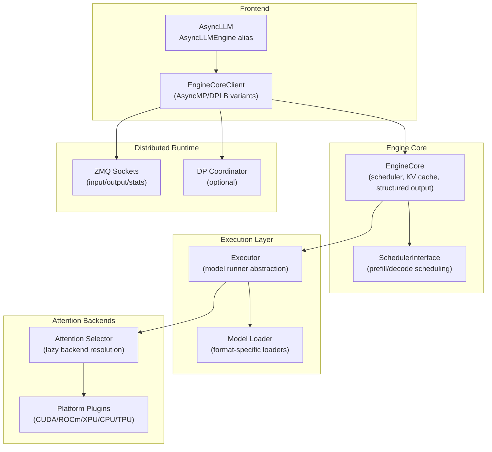
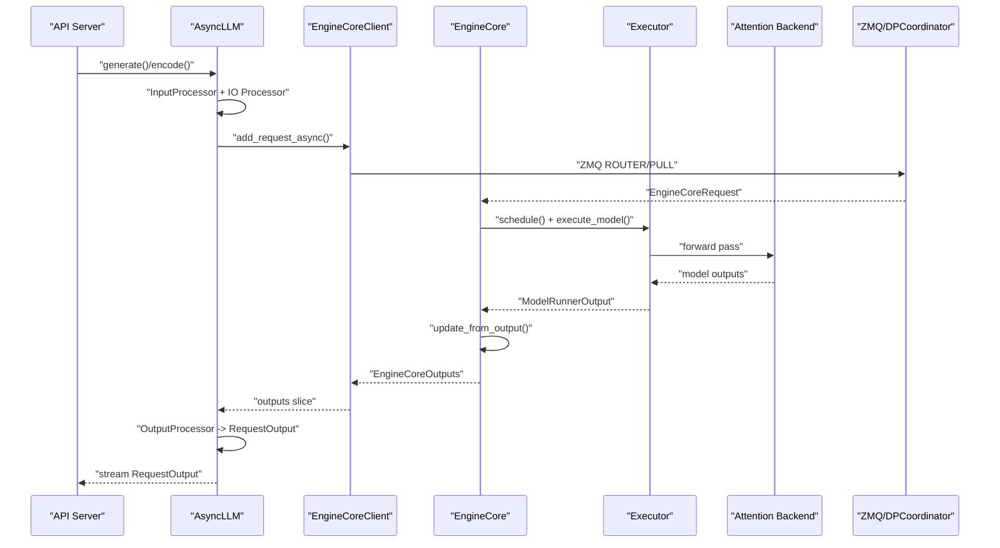
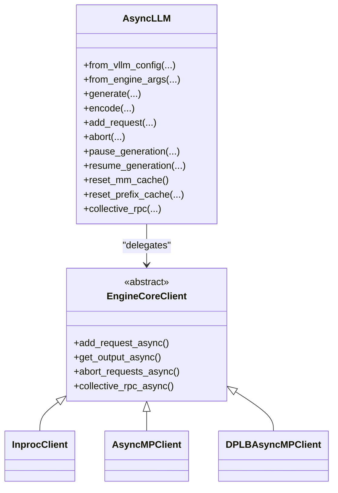
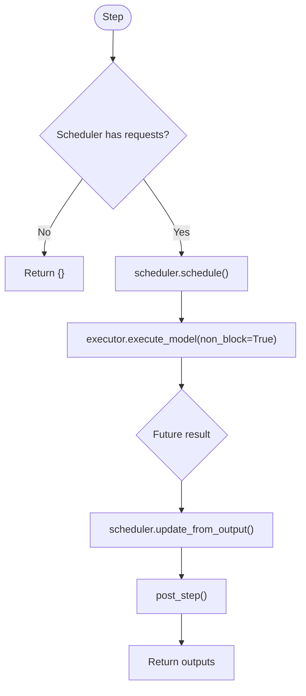
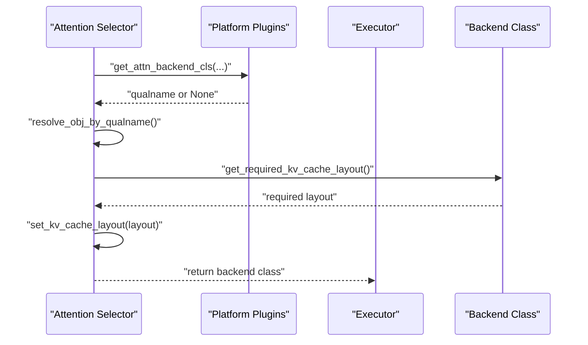
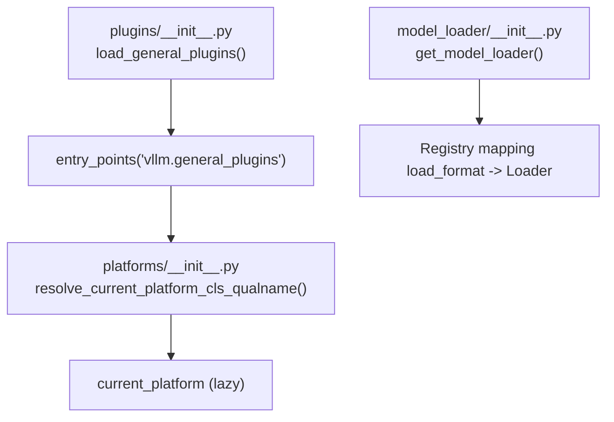
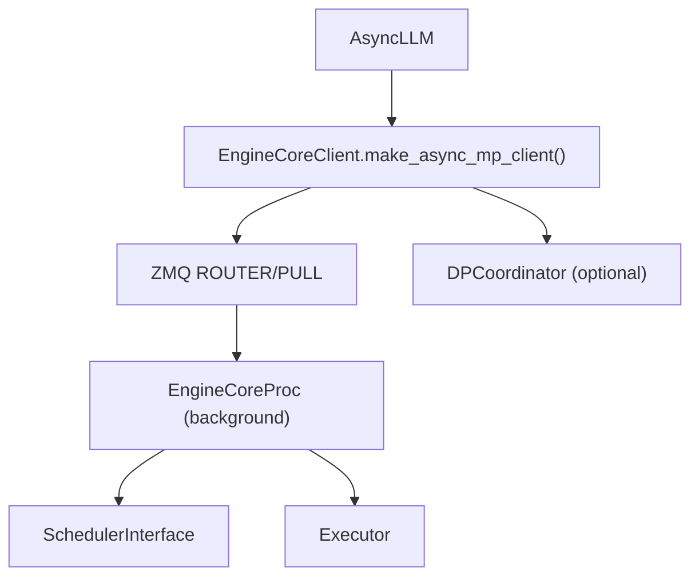
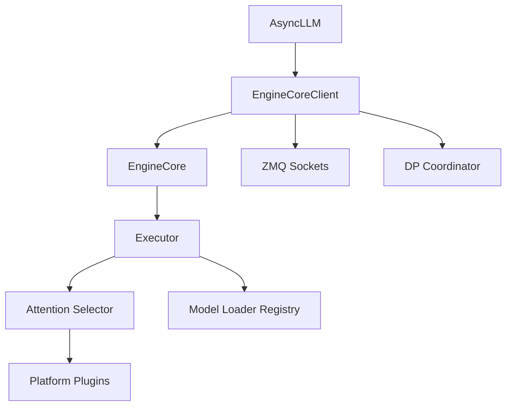

# Architectural Overview

<cite>
**Referenced Files in This Document**
- [async_llm.py](file://vllm/v1/engine/async_llm.py)
- [core.py](file://vllm/v1/engine/core.py)
- [core_client.py](file://vllm/v1/engine/core_client.py)
- [selector.py](file://vllm/attention/selector.py)
- [model_loader/__init__.py](file://vllm/model_executor/model_loader/__init__.py)
- [platforms/__init__.py](file://vllm/platforms/__init__.py)
- [plugins/__init__.py](file://vllm/plugins/__init__.py)
- [config/__init__.py](file://vllm/config/__init__.py)
- [distributed/__init__.py](file://vllm/distributed/__init__.py)
</cite>

## Table of Contents
1. [Introduction](#introduction)
2. [Project Structure](#project-structure)
3. [Core Components](#core-components)
4. [Architecture Overview](#architecture-overview)
5. [Detailed Component Analysis](#detailed-component-analysis)
6. [Dependency Analysis](#dependency-analysis)
7. [Performance Considerations](#performance-considerations)
8. [Troubleshooting Guide](#troubleshooting-guide)
9. [Conclusion](#conclusion)

## Introduction
This document presents the high-level architectural overview of vLLM’s inference engine, focusing on the layered design from the AsyncLLM front-end down to the model execution and attention backends. It explains the asynchronous processing model, plugin system, lazy-loading mechanisms, and modular design principles. It also covers how the architecture supports both single-node and distributed inference, describes system boundaries, data flows, and integration points, and outlines the hardware abstraction layer and platform-specific optimizations.

## Project Structure
At a high level, vLLM separates concerns across:
- Front-end orchestration and I/O: AsyncLLM and EngineCoreClient
- Engine core and scheduling: EngineCore and scheduler interface
- Model execution: Executor abstraction and model loaders
- Attention backends: Backend selection and platform-aware backends
- Distributed runtime: ZMQ-based inter-process communication and DP coordination
- Plugins and platform detection: Extensibility and hardware abstraction

**Diagram sources**
- [async_llm.py](file://vllm/v1/engine/async_llm.py#L1-L120)
- [core_client.py](file://vllm/v1/engine/core_client.py#L61-L122)
- [core.py](file://vllm/v1/engine/core.py#L78-L150)
- [selector.py](file://vllm/attention/selector.py#L46-L119)
- [platforms/__init__.py](file://vllm/platforms/__init__.py#L191-L278)
- [model_loader/__init__.py](file://vllm/model_executor/model_loader/__init__.py#L118-L151)
- [distributed/__init__.py](file://vllm/distributed/__init__.py#L1-L7)

**Section sources**
- [async_llm.py](file://vllm/v1/engine/async_llm.py#L1-L120)
- [core_client.py](file://vllm/v1/engine/core_client.py#L61-L122)
- [core.py](file://vllm/v1/engine/core.py#L78-L150)
- [selector.py](file://vllm/attention/selector.py#L46-L119)
- [platforms/__init__.py](file://vllm/platforms/__init__.py#L191-L278)
- [model_loader/__init__.py](file://vllm/model_executor/model_loader/__init__.py#L118-L151)
- [distributed/__init__.py](file://vllm/distributed/__init__.py#L1-L7)

## Core Components
- AsyncLLM: The public async front-end that orchestrates request ingestion, input preprocessing, output streaming, and lifecycle operations (pause/resume, LoRA management, caches reset). It delegates heavy lifting to EngineCore via EngineCoreClient and processes outputs asynchronously.
- EngineCoreClient: A client abstraction that encapsulates IPC and multiprocess orchestration. It provides async and sync variants, supports internal/external data-parallel load balancing, and manages ZMQ sockets and background threads/tasks.
- EngineCore: The core loop that schedules requests, executes model batches, updates the scheduler, and handles aborts and structured output. It initializes KV caches, sets up connectors, and coordinates with the Executor.
- Executor: An abstraction over model runners; EngineCore constructs and delegates execution to the configured executor class.
- Attention Selector: Selects the appropriate attention backend based on configuration and platform capabilities, with lazy import and optional KV cache layout adjustments.
- Platform Plugins: Detect and activate the correct platform (CUDA, ROCm, XPU, CPU, TPU) and expose platform-specific backends and distributed transports.
- Model Loader: Provides pluggable model loading strategies for various formats (HF, GGUF, sharded state, tensorizer, etc.), enabling flexible model resolution.
- Distributed Runtime: ZMQ-based IPC for multi-process and multi-node deployments, with optional DP coordinator for centralized load balancing.

**Section sources**
- [async_llm.py](file://vllm/v1/engine/async_llm.py#L120-L220)
- [core_client.py](file://vllm/v1/engine/core_client.py#L61-L122)
- [core.py](file://vllm/v1/engine/core.py#L150-L220)
- [selector.py](file://vllm/attention/selector.py#L46-L119)
- [platforms/__init__.py](file://vllm/platforms/__init__.py#L191-L278)
- [model_loader/__init__.py](file://vllm/model_executor/model_loader/__init__.py#L118-L151)

## Architecture Overview
The vLLM architecture is layered and modular:
- Frontend layer (AsyncLLM) exposes async APIs for generation and encoding, manages request queues, and streams outputs.
- Engine core layer (EngineCoreClient + EngineCore) encapsulates scheduling, KV cache management, and execution coordination.
- Execution layer (Executor + Model Loader) abstracts model runtime and weights loading.
- Attention layer (Attention Selector + Platform Plugins) selects and configures the optimal attention backend per platform and configuration.
- Distributed layer (ZMQ + DP Coordinator) enables multi-node and multi-rank deployments.

**Diagram sources**
- [async_llm.py](file://vllm/v1/engine/async_llm.py#L360-L472)
- [core_client.py](file://vllm/v1/engine/core_client.py#L430-L520)
- [core.py](file://vllm/v1/engine/core.py#L338-L365)
- [selector.py](file://vllm/attention/selector.py#L46-L119)

**Section sources**
- [async_llm.py](file://vllm/v1/engine/async_llm.py#L360-L472)
- [core_client.py](file://vllm/v1/engine/core_client.py#L430-L520)
- [core.py](file://vllm/v1/engine/core.py#L338-L365)
- [selector.py](file://vllm/attention/selector.py#L46-L119)

## Detailed Component Analysis

### AsyncLLM Engine
AsyncLLM is the primary async front-end. It:
- Lazily initializes tokenizer and IO processors.
- Creates EngineCoreClient (multiprocess + asyncio variant).
- Manages output handler loop that pulls EngineCoreOutputs, processes them, and feeds per-request queues.
- Exposes request APIs (generate, encode), pause/resume, LoRA management, caches reset, and profiling.

**Diagram sources**
- [async_llm.py](file://vllm/v1/engine/async_llm.py#L120-L220)
- [core_client.py](file://vllm/v1/engine/core_client.py#L61-L122)
- [core_client.py](file://vllm/v1/engine/core_client.py#L257-L343)
- [core_client.py](file://vllm/v1/engine/core_client.py#L621-L710)
- [core_client.py](file://vllm/v1/engine/core_client.py#L712-L800)

**Section sources**
- [async_llm.py](file://vllm/v1/engine/async_llm.py#L120-L220)
- [core_client.py](file://vllm/v1/engine/core_client.py#L61-L122)
- [core_client.py](file://vllm/v1/engine/core_client.py#L257-L343)
- [core_client.py](file://vllm/v1/engine/core_client.py#L621-L710)
- [core_client.py](file://vllm/v1/engine/core_client.py#L712-L800)

### EngineCore and Scheduling
EngineCore encapsulates:
- KV cache initialization and profiling.
- Scheduler creation and block sizing accounting for context parallelism.
- Request lifecycle: add, abort, structured output grammar initialization.
- Execution loop: schedule → execute_model → update_from_output → post-step.
- Optional batch queue for pipeline parallelism to overlap scheduling and execution.

**Diagram sources**
- [core.py](file://vllm/v1/engine/core.py#L338-L365)
- [core.py](file://vllm/v1/engine/core.py#L376-L473)

**Section sources**
- [core.py](file://vllm/v1/engine/core.py#L200-L270)
- [core.py](file://vllm/v1/engine/core.py#L338-L365)
- [core.py](file://vllm/v1/engine/core.py#L376-L473)

### Attention System and Hardware Abstraction
The attention system uses a selector that:
- Resolves the attention backend based on configuration and platform.
- Lazily imports the backend class.
- Optionally adjusts KV cache layout for the selected backend.

Platform detection resolves the current platform (CUDA, ROCm, XPU, CPU, TPU) and ensures only one platform plugin is active. This enables platform-specific backends and distributed transports.

**Diagram sources**
- [selector.py](file://vllm/attention/selector.py#L46-L119)
- [platforms/__init__.py](file://vllm/platforms/__init__.py#L191-L278)

**Section sources**
- [selector.py](file://vllm/attention/selector.py#L46-L119)
- [platforms/__init__.py](file://vllm/platforms/__init__.py#L191-L278)

### Plugin System and Lazy Loading
vLLM employs a plugin system to extend functionality:
- General plugins are loaded once per process.
- Platform plugins are resolved lazily on first access to current_platform.
- Model loader registry supports custom formats via registration.

**Diagram sources**
- [plugins/__init__.py](file://vllm/plugins/__init__.py#L68-L82)
- [platforms/__init__.py](file://vllm/platforms/__init__.py#L191-L278)
- [model_loader/__init__.py](file://vllm/model_executor/model_loader/__init__.py#L118-L151)

**Section sources**
- [plugins/__init__.py](file://vllm/plugins/__init__.py#L68-L82)
- [platforms/__init__.py](file://vllm/platforms/__init__.py#L191-L278)
- [model_loader/__init__.py](file://vllm/model_executor/model_loader/__init__.py#L118-L151)

### Distributed Computing Components
EngineCoreClient supports:
- Multiprocess + asyncio clients (AsyncMPClient, DPLBAsyncMPClient).
- ZMQ sockets for input/output and optional stats publishing.
- DP coordinator for centralized load balancing in multi-rank setups.
- Monitoring of engine processes and graceful shutdown.

**Diagram sources**
- [core_client.py](file://vllm/v1/engine/core_client.py#L61-L122)
- [core_client.py](file://vllm/v1/engine/core_client.py#L430-L520)
- [core.py](file://vllm/v1/engine/core.py#L586-L680)

**Section sources**
- [core_client.py](file://vllm/v1/engine/core_client.py#L61-L122)
- [core_client.py](file://vllm/v1/engine/core_client.py#L430-L520)
- [core.py](file://vllm/v1/engine/core.py#L586-L680)

## Dependency Analysis
Key architectural dependencies:
- AsyncLLM depends on EngineCoreClient for IPC and execution delegation.
- EngineCore depends on Executor for model execution and SchedulerInterface for batching.
- Attention Selector depends on Platform Plugins for backend resolution.
- Model Loader registry depends on load format configuration.
- Distributed runtime depends on ZMQ and optional DP Coordinator.

**Diagram sources**
- [async_llm.py](file://vllm/v1/engine/async_llm.py#L120-L220)
- [core_client.py](file://vllm/v1/engine/core_client.py#L61-L122)
- [core.py](file://vllm/v1/engine/core.py#L78-L150)
- [selector.py](file://vllm/attention/selector.py#L46-L119)
- [platforms/__init__.py](file://vllm/platforms/__init__.py#L191-L278)
- [model_loader/__init__.py](file://vllm/model_executor/model_loader/__init__.py#L118-L151)

**Section sources**
- [async_llm.py](file://vllm/v1/engine/async_llm.py#L120-L220)
- [core_client.py](file://vllm/v1/engine/core_client.py#L61-L122)
- [core.py](file://vllm/v1/engine/core.py#L78-L150)
- [selector.py](file://vllm/attention/selector.py#L46-L119)
- [platforms/__init__.py](file://vllm/platforms/__init__.py#L191-L278)
- [model_loader/__init__.py](file://vllm/model_executor/model_loader/__init__.py#L118-L151)

## Performance Considerations
- Asynchronous output processing: EngineCore outputs are chunked and processed in small slices to avoid blocking the event loop.
- Batch queue: Pipeline parallelism uses a batch queue to overlap scheduling and execution, reducing pipeline bubbles.
- Lazy backend selection: Attention backends are resolved only when needed, minimizing cold-start overhead.
- Platform-aware optimizations: Platform plugins detect hardware capabilities and activate optimized backends and transports.
- KV cache profiling: EngineCore profiles model memory to size KV caches appropriately, improving utilization and throughput.

[No sources needed since this section provides general guidance]

## Troubleshooting Guide
Common operational signals and controls:
- EngineDeadError: Raised when engine processes die unexpectedly or when the client detects a dead engine.
- Pause/Resume: AsyncLLM supports pausing generation for model updates and resuming safely.
- Reset caches: MM cache and prefix cache can be reset programmatically; prefix cache reset supports preserving running requests when desired.
- Collective RPC: Utilities exposed via collective RPC for coordinated operations across ranks.

Operational actions:
- Use pause_generation with wait_for_inflight_requests and clear_cache options to safely reload weights.
- Reset caches before/after weight updates to avoid stale state.
- Inspect DP coordinator and ZMQ connectivity for multi-rank deployments.

**Section sources**
- [core_client.py](file://vllm/v1/engine/core_client.py#L344-L429)
- [async_llm.py](file://vllm/v1/engine/async_llm.py#L555-L606)
- [async_llm.py](file://vllm/v1/engine/async_llm.py#L736-L762)
- [core.py](file://vllm/v1/engine/core.py#L511-L541)

## Conclusion
vLLM’s architecture is a layered, modular system emphasizing asynchronous processing, lazy loading, and platform abstraction. The AsyncLLM front-end integrates tightly with EngineCoreClient for IPC and execution delegation, while EngineCore coordinates scheduling, KV cache management, and structured output. The attention system and platform plugins enable platform-specific optimizations, and the distributed runtime supports scalable, multi-node deployments. Together, these patterns deliver a flexible, high-performance inference stack suitable for diverse hardware and deployment scenarios.