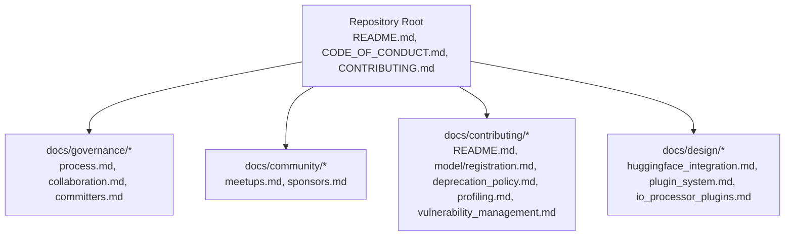
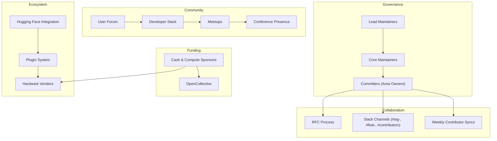
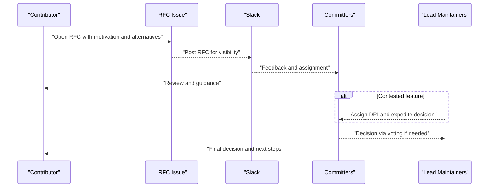
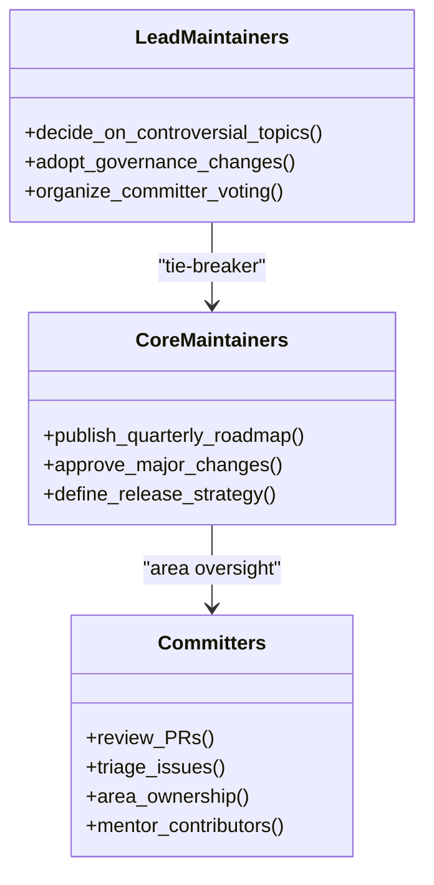
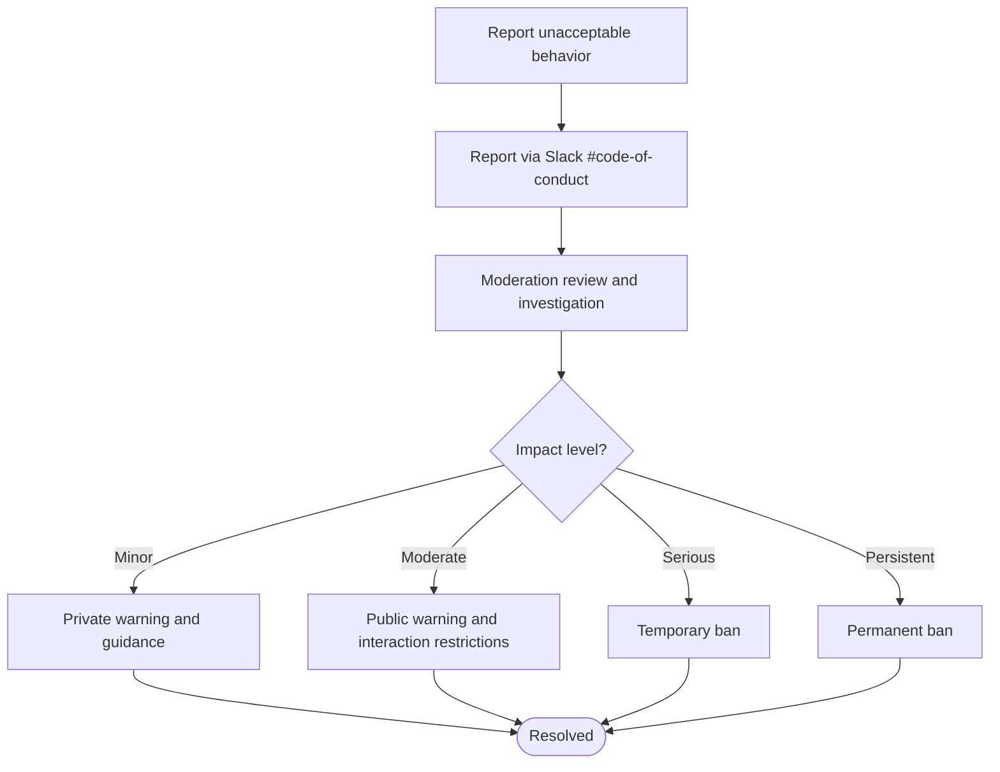
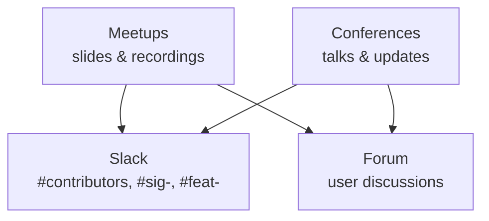
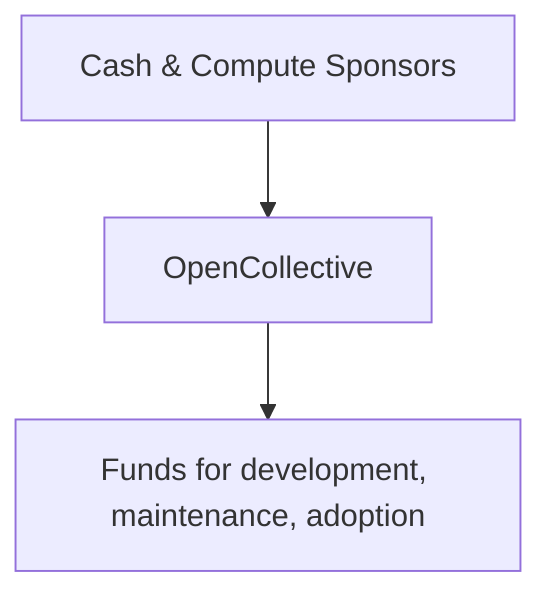
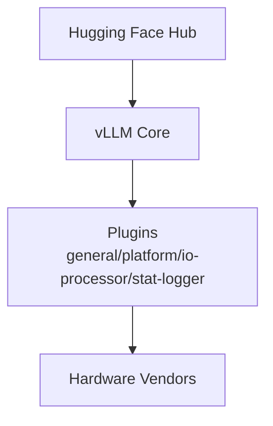
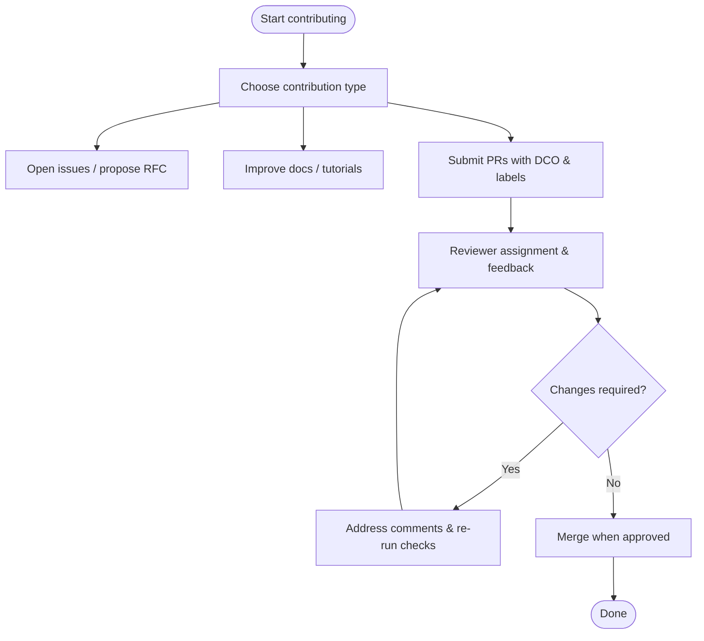
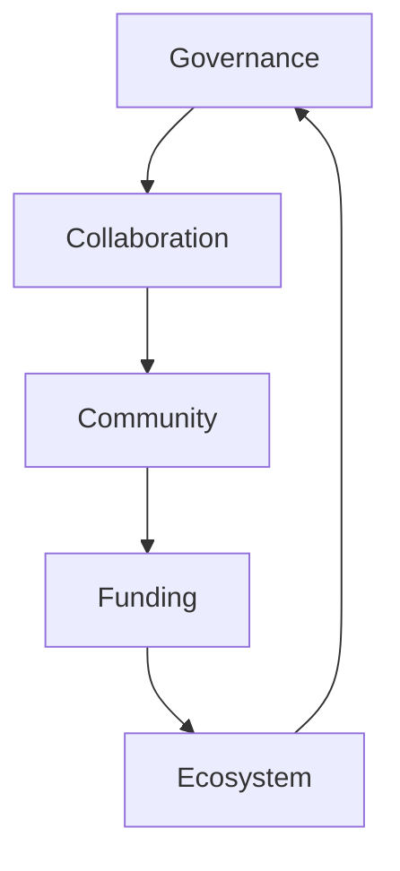

# Community and Ecosystem

<cite>
**Referenced Files in This Document**
- [README.md](file://README.md)
- [CODE_OF_CONDUCT.md](file://CODE_OF_CONDUCT.md)
- [CONTRIBUTING.md](file://CONTRIBUTING.md)
- [docs/governance/process.md](file://docs/governance/process.md)
- [docs/governance/collaboration.md](file://docs/governance/collaboration.md)
- [docs/governance/committers.md](file://docs/governance/committers.md)
- [docs/community/meetups.md](file://docs/community/meetups.md)
- [docs/community/sponsors.md](file://docs/community/sponsors.md)
- [docs/contributing/README.md](file://docs/contributing/README.md)
- [docs/contributing/model/registration.md](file://docs/contributing/model/registration.md)
- [docs/contributing/deprecation_policy.md](file://docs/contributing/deprecation_policy.md)
- [docs/contributing/profiling.md](file://docs/contributing/profiling.md)
- [docs/contributing/vulnerability_management.md](file://docs/contributing/vulnerability_management.md)
- [docs/design/huggingface_integration.md](file://docs/design/huggingface_integration.md)
- [docs/design/plugin_system.md](file://docs/design/plugin_system.md)
- [docs/design/io_processor_plugins.md](file://docs/design/io_processor_plugins.md)
</cite>

## Table of Contents
1. [Introduction](#introduction)
2. [Project Structure](#project-structure)
3. [Core Components](#core-components)
4. [Architecture Overview](#architecture-overview)
5. [Detailed Component Analysis](#detailed-component-analysis)
6. [Dependency Analysis](#dependency-analysis)
7. [Performance Considerations](#performance-considerations)
8. [Troubleshooting Guide](#troubleshooting-guide)
9. [Conclusion](#conclusion)
10. [Appendices](#appendices)

## Introduction
This document presents the community and ecosystem dimension of the vLLM project. It focuses on the collaborative development model, governance, contribution pathways, code of conduct, community engagement, sponsorships, funding, and integrations with the broader ecosystem. It also highlights the project’s relationship with the PyTorch Foundation, academic-industry collaborations, and the open-source licensing model that enables broad adoption and innovation.

## Project Structure
The vLLM community and ecosystem documentation is organized across:
- Top-level community-facing pages in the repository root (README, Code of Conduct, contributing link)
- Governance and collaboration policies in docs/governance
- Community engagement and sponsorship pages in docs/community
- Contribution workflows and developer guides in docs/contributing
- Ecosystem integration and plugin system design in docs/design

**Diagram sources**
- [README.md](file://README.md#L1-L191)
- [docs/governance/process.md](file://docs/governance/process.md#L1-L126)
- [docs/governance/collaboration.md](file://docs/governance/collaboration.md#L1-L44)
- [docs/governance/committers.md](file://docs/governance/committers.md#L1-L185)
- [docs/community/meetups.md](file://docs/community/meetups.md#L1-L47)
- [docs/community/sponsors.md](file://docs/community/sponsors.md#L1-L45)
- [docs/contributing/README.md](file://docs/contributing/README.md#L1-L269)
- [docs/contributing/model/registration.md](file://docs/contributing/model/registration.md#L1-L52)
- [docs/contributing/deprecation_policy.md](file://docs/contributing/deprecation_policy.md#L1-L88)
- [docs/contributing/profiling.md](file://docs/contributing/profiling.md#L1-L229)
- [docs/contributing/vulnerability_management.md](file://docs/contributing/vulnerability_management.md#L1-L62)
- [docs/design/huggingface_integration.md](file://docs/design/huggingface_integration.md#L1-L32)
- [docs/design/plugin_system.md](file://docs/design/plugin_system.md#L1-L157)
- [docs/design/io_processor_plugins.md](file://docs/design/io_processor_plugins.md#L1-L92)

**Section sources**
- [README.md](file://README.md#L1-L191)
- [docs/governance/process.md](file://docs/governance/process.md#L1-L126)
- [docs/community/meetups.md](file://docs/community/meetups.md#L1-L47)
- [docs/community/sponsors.md](file://docs/community/sponsors.md#L1-L45)
- [docs/contributing/README.md](file://docs/contributing/README.md#L1-L269)

## Core Components
- Community-driven development and collaboration: The project emphasizes informal, meritocratic norms, RFC-based feature discussions, and area ownership by committers.
- Governance and decision-making: Clear roles for Core Maintainers, Lead Maintainers, and Committers; transparent processes for roadmap, merging, and Slack/issue-based collaboration.
- Code of Conduct: Welcoming, inclusive environment with enforcement ladder and reporting channels.
- Community engagement: Meetups, Slack, forums, and conferences; ongoing events and speaker opportunities.
- Funding and sponsors: Cash sponsors and compute resource providers; OpenCollective as the official fundraising venue.
- Ecosystem integrations: Hugging Face integration, plugin system for models/platforms/io-processors, and hardware vendor collaboration.

**Section sources**
- [docs/governance/process.md](file://docs/governance/process.md#L1-L126)
- [docs/governance/collaboration.md](file://docs/governance/collaboration.md#L1-L44)
- [docs/governance/committers.md](file://docs/governance/committers.md#L1-L185)
- [CODE_OF_CONDUCT.md](file://CODE_OF_CONDUCT.md#L1-L128)
- [docs/community/meetups.md](file://docs/community/meetups.md#L1-L47)
- [docs/community/sponsors.md](file://docs/community/sponsors.md#L1-L45)
- [README.md](file://README.md#L120-L165)

## Architecture Overview
The community and ecosystem architecture centers on:
- Governance and maintainership: hierarchical maintainer roles with area ownership and voting for committers.
- Collaboration channels: RFCs, Slack sig/feat channels, contributor syncs, and public records.
- Community hubs: forums, Slack, meetups, and conference presence.
- Funding and sponsorship: sponsors and OpenCollective.
- Ecosystem integration: Hugging Face, plugin system, and hardware vendor collaboration.

**Diagram sources**
- [docs/governance/process.md](file://docs/governance/process.md#L1-L126)
- [docs/governance/collaboration.md](file://docs/governance/collaboration.md#L1-L44)
- [docs/governance/committers.md](file://docs/governance/committers.md#L1-L185)
- [docs/community/meetups.md](file://docs/community/meetups.md#L1-L47)
- [docs/community/sponsors.md](file://docs/community/sponsors.md#L1-L45)
- [docs/design/huggingface_integration.md](file://docs/design/huggingface_integration.md#L1-L32)
- [docs/design/plugin_system.md](file://docs/design/plugin_system.md#L1-L157)

## Detailed Component Analysis

### Community-Driven Development and Collaboration
- RFC-first major features and feature maintenance assignments.
- Collaborative channels: Slack sig/feat channels, contributor syncs, and public records in issues.
- Model provider and hardware vendor collaboration via private channels and joint repos when needed.
- Advisory board consultation for strategic direction.

**Diagram sources**
- [docs/governance/collaboration.md](file://docs/governance/collaboration.md#L1-L44)
- [docs/governance/process.md](file://docs/governance/process.md#L98-L126)

**Section sources**
- [docs/governance/collaboration.md](file://docs/governance/collaboration.md#L1-L44)
- [docs/governance/process.md](file://docs/governance/process.md#L98-L126)

### Governance Model and Contributor Recognition
- Core Maintainers: roadmap, major changes, release strategy.
- Lead Maintainers: tie-breaker decisions, committer voting, strategy.
- Committers: area ownership, PR reviews, documentation, mentorship.
- Nomination and voting process with transparency and merit criteria.

**Diagram sources**
- [docs/governance/process.md](file://docs/governance/process.md#L22-L97)
- [docs/governance/committers.md](file://docs/governance/committers.md#L1-L185)

**Section sources**
- [docs/governance/process.md](file://docs/governance/process.md#L22-L97)
- [docs/governance/committers.md](file://docs/governance/committers.md#L1-L185)

### Code of Conduct and Enforcement
- Welcoming, inclusive environment with clear standards and enforcement ladder.
- Reporting via Slack #code-of-conduct and enforcement by community leaders.
- Attribution to Contributor Covenant with Mozilla-inspired impact guidelines.

**Diagram sources**
- [CODE_OF_CONDUCT.md](file://CODE_OF_CONDUCT.md#L60-L116)

**Section sources**
- [CODE_OF_CONDUCT.md](file://CODE_OF_CONDUCT.md#L1-L128)

### Community Engagement and Events
- Regular global meetups with slides and recordings; speaker and sponsorship opportunities.
- Slack for coordination; forums for user discussions.
- Conference presence and talks.

**Diagram sources**
- [docs/community/meetups.md](file://docs/community/meetups.md#L1-L47)
- [README.md](file://README.md#L13-L20)

**Section sources**
- [docs/community/meetups.md](file://docs/community/meetups.md#L1-L47)
- [README.md](file://README.md#L13-L20)

### Sponsor Organizations and Funding
- Cash donors and compute resource sponsors across cloud, hardware, and research institutions.
- Official fundraising via OpenCollective for development, maintenance, and adoption.

**Diagram sources**
- [docs/community/sponsors.md](file://docs/community/sponsors.md#L1-L45)
- [README.md](file://README.md#L120-L165)

**Section sources**
- [docs/community/sponsors.md](file://docs/community/sponsors.md#L1-L45)
- [README.md](file://README.md#L120-L165)

### Ecosystem Integrations
- Hugging Face integration: model config/tokenizer/weights loading, remote code and revision controls.
- Plugin system: general, platform, IO processor, and stat logger plugins for extensibility.
- IO processor plugins: pre/post-processing for pooling models and multi-modal scenarios.

**Diagram sources**
- [docs/design/huggingface_integration.md](file://docs/design/huggingface_integration.md#L1-L32)
- [docs/design/plugin_system.md](file://docs/design/plugin_system.md#L1-L157)
- [docs/design/io_processor_plugins.md](file://docs/design/io_processor_plugins.md#L1-L92)

**Section sources**
- [docs/design/huggingface_integration.md](file://docs/design/huggingface_integration.md#L1-L32)
- [docs/design/plugin_system.md](file://docs/design/plugin_system.md#L1-L157)
- [docs/design/io_processor_plugins.md](file://docs/design/io_processor_plugins.md#L1-L92)

### Contribution Guidelines and Developer Workflows
- Contribution types: issues, PRs, documentation, awareness-raising.
- Development setup, linting, documentation builds, and testing.
- PR classification, DCO sign-off, code quality standards, and review expectations.
- Model registration workflow for built-in and out-of-tree models.
- Deprecation policy and timeline for feature lifecycle.
- Profiling workflows for performance analysis.
- Vulnerability management and reporting process.

**Diagram sources**
- [docs/contributing/README.md](file://docs/contributing/README.md#L1-L269)
- [docs/contributing/model/registration.md](file://docs/contributing/model/registration.md#L1-L52)
- [docs/contributing/deprecation_policy.md](file://docs/contributing/deprecation_policy.md#L1-L88)
- [docs/contributing/profiling.md](file://docs/contributing/profiling.md#L1-L229)
- [docs/contributing/vulnerability_management.md](file://docs/contributing/vulnerability_management.md#L1-L62)

**Section sources**
- [docs/contributing/README.md](file://docs/contributing/README.md#L1-L269)
- [docs/contributing/model/registration.md](file://docs/contributing/model/registration.md#L1-L52)
- [docs/contributing/deprecation_policy.md](file://docs/contributing/deprecation_policy.md#L1-L88)
- [docs/contributing/profiling.md](file://docs/contributing/profiling.md#L1-L229)
- [docs/contributing/vulnerability_management.md](file://docs/contributing/vulnerability_management.md#L1-L62)

### Relationship with the PyTorch Foundation and Academic-Industry Collaborations
- vLLM is hosted under the PyTorch Foundation, reflecting its foundational role in the PyTorch ecosystem.
- Academic-industry collaborations are evident through meetups, vendor participation, and research-aligned features.

**Section sources**
- [README.md](file://README.md#L17-L33)
- [docs/community/meetups.md](file://docs/community/meetups.md#L1-L47)

### Open-Source Licensing Model
- Contributions are governed by the repository’s license, enabling broad adoption and innovation within permissive terms.
- The project encourages community contributions, awareness raising, and sustainable growth through transparent governance and funding.

**Section sources**
- [docs/contributing/README.md](file://docs/contributing/README.md#L23-L26)

## Dependency Analysis
The community and ecosystem components depend on:
- Governance for decision-making and contributor recognition.
- Collaboration channels for feature design and review.
- Community hubs for support and knowledge sharing.
- Funding for compute and sustainability.
- Ecosystem integrations for model and hardware support.

**Diagram sources**
- [docs/governance/process.md](file://docs/governance/process.md#L98-L126)
- [docs/governance/collaboration.md](file://docs/governance/collaboration.md#L1-L44)
- [docs/community/meetups.md](file://docs/community/meetups.md#L1-L47)
- [docs/community/sponsors.md](file://docs/community/sponsors.md#L1-L45)
- [docs/design/huggingface_integration.md](file://docs/design/huggingface_integration.md#L1-L32)
- [docs/design/plugin_system.md](file://docs/design/plugin_system.md#L1-L157)

**Section sources**
- [docs/governance/process.md](file://docs/governance/process.md#L98-L126)
- [docs/governance/collaboration.md](file://docs/governance/collaboration.md#L1-L44)
- [docs/community/meetups.md](file://docs/community/meetups.md#L1-L47)
- [docs/community/sponsors.md](file://docs/community/sponsors.md#L1-L45)
- [docs/design/huggingface_integration.md](file://docs/design/huggingface_integration.md#L1-L32)
- [docs/design/plugin_system.md](file://docs/design/plugin_system.md#L1-L157)

## Performance Considerations
- Community-driven profiling and continuous profiling workflows aid performance tracking and regression detection.
- Contributors are advised to use profiling responsibly to avoid slowing inference for end users.

**Section sources**
- [docs/contributing/profiling.md](file://docs/contributing/profiling.md#L1-L229)

## Troubleshooting Guide
- Security vulnerabilities: Private reporting via GitHub Security Advisories; coordinated disclosure and advisory publication.
- Code of Conduct violations: Reporting via Slack #code-of-conduct; enforcement by community leaders.
- Contributor onboarding and PR review expectations: Follow contribution guidelines, PR classification, and review turnaround notes.

**Section sources**
- [docs/contributing/vulnerability_management.md](file://docs/contributing/vulnerability_management.md#L1-L62)
- [CODE_OF_CONDUCT.md](file://CODE_OF_CONDUCT.md#L60-L116)
- [docs/contributing/README.md](file://docs/contributing/README.md#L150-L269)

## Conclusion
vLLM’s community and ecosystem thrive on transparent governance, inclusive collaboration, and strong integrations. The project balances rapid innovation with sustainability through clear contributor recognition, robust funding mechanisms, and a welcoming culture. Its relationships with the PyTorch Foundation and industry collaborators continue to drive broad adoption and ecosystem expansion.

## Appendices
- Contact and collaboration avenues are documented in the repository root for technical questions, user discussions, security disclosures, and partnership inquiries.

**Section sources**
- [README.md](file://README.md#L178-L187)