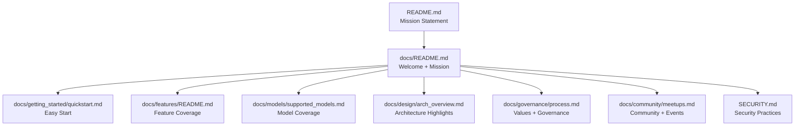
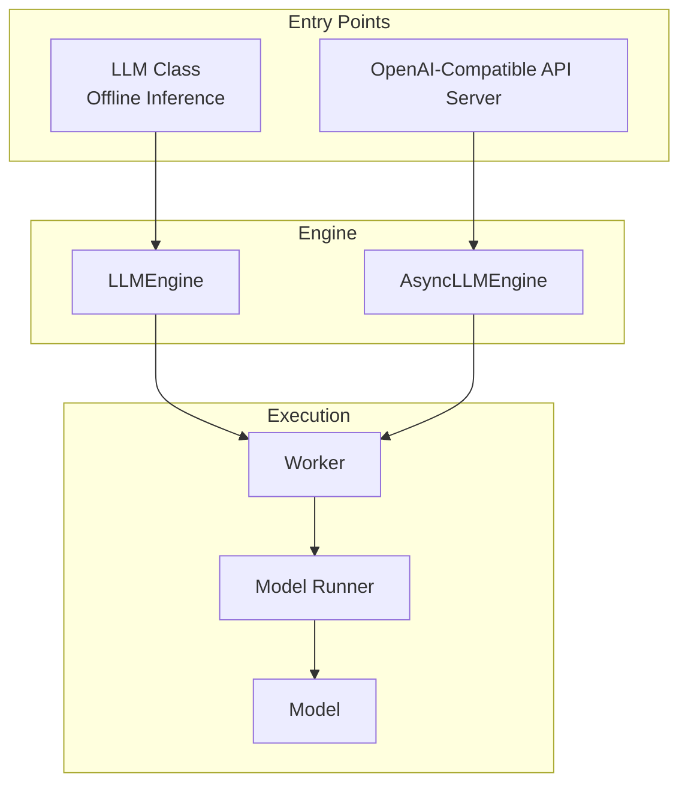
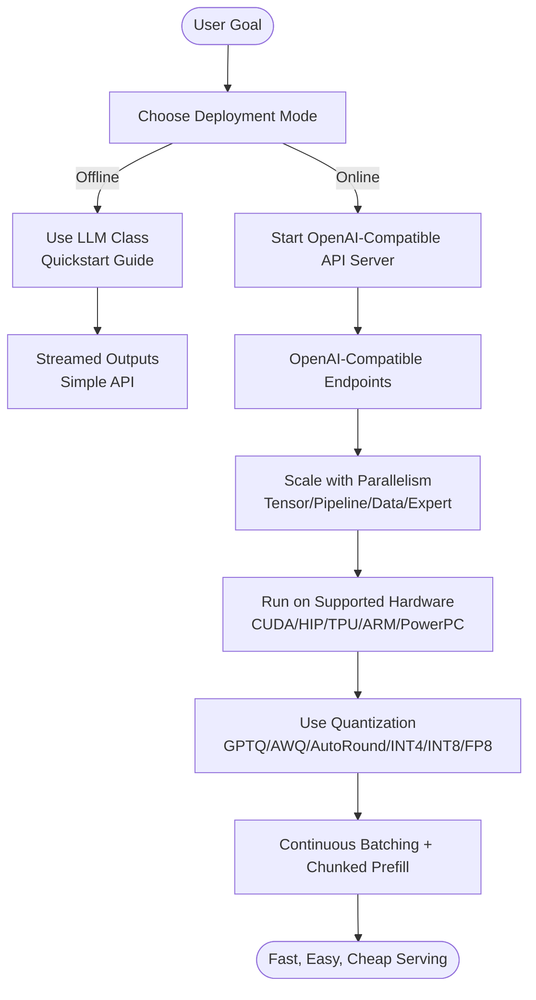
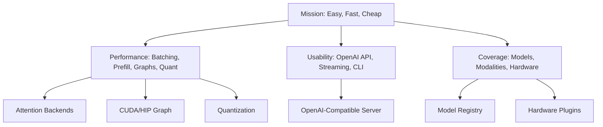

# Introduction and Mission

<cite>
**Referenced Files in This Document**
- [README.md](file://README.md)
- [docs/README.md](file://docs/README.md)
- [docs/governance/process.md](file://docs/governance/process.md)
- [docs/design/arch_overview.md](file://docs/design/arch_overview.md)
- [docs/features/README.md](file://docs/features/README.md)
- [docs/getting_started/quickstart.md](file://docs/getting_started/quickstart.md)
- [docs/models/supported_models.md](file://docs/models/supported_models.md)
- [docs/community/meetups.md](file://docs/community/meetups.md)
- [SECURITY.md](file://SECURITY.md)
</cite>

## Table of Contents
1. [Introduction](#introduction)
2. [Project Structure](#project-structure)
3. [Core Components](#core-components)
4. [Architecture Overview](#architecture-overview)
5. [Detailed Component Analysis](#detailed-component-analysis)
6. [Dependency Analysis](#dependency-analysis)
7. [Performance Considerations](#performance-considerations)
8. [Troubleshooting Guide](#troubleshooting-guide)
9. [Conclusion](#conclusion)

## Introduction
vLLM’s mission is to make “Easy, fast, and cheap LLM serving for everyone.” This mission is reflected throughout the project’s design, from its performance-centric architecture to its broad hardware and model coverage, and from its open governance to its community-first engagement. The project began in the Sky Computing Lab at UC Berkeley and has grown into a vibrant, community-driven initiative that welcomes contributions from academia, industry, and users worldwide.

At its core, vLLM solves the fundamental challenge of efficient, accessible, and scalable LLM inference and serving. It achieves this by combining high-performance execution techniques (such as continuous batching, chunked prefill, and CUDA/HIP graph acceleration), practical usability (OpenAI-compatible APIs, streaming outputs, and simple deployment), and broad compatibility (support for many model families, modalities, and hardware backends). The result is a system that lowers the barrier to deploying and operating LLM services while keeping costs and complexity low.

The mission also underpins the project’s commitment to open-source development, transparency, and accessibility. vLLM emphasizes ease of use, wide coverage, and extensibility, enabling both newcomers and experienced practitioners to adopt and customize the system for their needs. This is evident in the documentation, governance, and community programs that support collaboration, education, and sustainable growth.

**Section sources**
- [README.md](file://README.md#L9-L12)
- [docs/README.md](file://docs/README.md#L14-L17)
- [docs/governance/process.md](file://docs/governance/process.md#L5-L16)

## Project Structure
The repository organizes content to reflect vLLM’s mission and practical goals:
- Documentation emphasizes quickstart, compatibility matrices, and deployment options to keep usage simple and accessible.
- Governance documents articulate values and decision-making aligned with the mission.
- Design and architecture docs explain how features like continuous batching, chunked prefill, and multi-device execution translate into performance and ease of use.
- Community and meetups drive engagement and knowledge sharing globally.

**Diagram sources**
- [README.md](file://README.md#L9-L12)
- [docs/README.md](file://docs/README.md#L14-L17)
- [docs/getting_started/quickstart.md](file://docs/getting_started/quickstart.md#L1-L30)
- [docs/features/README.md](file://docs/features/README.md#L1-L20)
- [docs/models/supported_models.md](file://docs/models/supported_models.md#L1-L20)
- [docs/design/arch_overview.md](file://docs/design/arch_overview.md#L1-L20)
- [docs/governance/process.md](file://docs/governance/process.md#L5-L16)
- [docs/community/meetups.md](file://docs/community/meetups.md#L1-L15)
- [SECURITY.md](file://SECURITY.md#L1-L15)

**Section sources**
- [README.md](file://README.md#L9-L12)
- [docs/README.md](file://docs/README.md#L14-L17)
- [docs/getting_started/quickstart.md](file://docs/getting_started/quickstart.md#L1-L30)
- [docs/features/README.md](file://docs/features/README.md#L1-L20)
- [docs/models/supported_models.md](file://docs/models/supported_models.md#L1-L20)
- [docs/design/arch_overview.md](file://docs/design/arch_overview.md#L1-L20)
- [docs/governance/process.md](file://docs/governance/process.md#L5-L16)
- [docs/community/meetups.md](file://docs/community/meetups.md#L1-L15)
- [SECURITY.md](file://SECURITY.md#L1-L15)

## Core Components
- Mission and vision: “Easy, fast, and cheap LLM serving for everyone.”
- Origins: Sky Computing Lab at UC Berkeley; evolved into a community-driven project.
- Performance: continuous batching, chunked prefill, CUDA/HIP graph, attention backends, and quantization support.
- Usability: OpenAI-compatible API server, streaming outputs, and simple installation across platforms.
- Compatibility: broad model family coverage, multimodal support, and multi-device hardware support.
- Governance and values: top performance, ease of use, wide coverage, production readiness, and extensibility.

Practical examples of the mission in action:
- Easy: OpenAI-compatible server, simple CLI, and quickstart guide.
- Fast: Continuous batching, chunked prefill, CUDA/HIP graph, and attention backends.
- Cheap: Broad hardware coverage, quantization, and multi-device scaling.

**Section sources**
- [README.md](file://README.md#L9-L12)
- [docs/README.md](file://docs/README.md#L14-L17)
- [docs/design/arch_overview.md](file://docs/design/arch_overview.md#L50-L80)
- [docs/features/README.md](file://docs/features/README.md#L39-L56)
- [docs/getting_started/quickstart.md](file://docs/getting_started/quickstart.md#L170-L210)
- [docs/models/supported_models.md](file://docs/models/supported_models.md#L1-L20)

## Architecture Overview
The architecture centers on simple entrypoints and a high-performance engine:
- LLM class for offline inference.
- OpenAI-compatible API server for online serving.
- LLMEngine and AsyncLLMEngine for scheduling, model execution, and output processing.
- Worker and model runner abstractions for multi-device execution.
- Extensible class hierarchy and configuration-driven initialization.

**Diagram sources**
- [docs/design/arch_overview.md](file://docs/design/arch_overview.md#L14-L20)
- [docs/design/arch_overview.md](file://docs/design/arch_overview.md#L54-L80)
- [docs/design/arch_overview.md](file://docs/design/arch_overview.md#L118-L140)
- [docs/design/arch_overview.md](file://docs/design/arch_overview.md#L140-L170)

**Section sources**
- [docs/design/arch_overview.md](file://docs/design/arch_overview.md#L14-L20)
- [docs/design/arch_overview.md](file://docs/design/arch_overview.md#L54-L80)
- [docs/design/arch_overview.md](file://docs/design/arch_overview.md#L118-L140)
- [docs/design/arch_overview.md](file://docs/design/arch_overview.md#L140-L170)

## Detailed Component Analysis

### Mission-Driven Design Values
The project’s values directly reflect the mission:
- Top performance: focus on kernel optimization, benchmarks, and minimizing overhead.
- Ease of use: simple installation, clear documentation, fast startup, and helpful error messages.
- Wide coverage: support for frontier models, modalities, and accelerators; platform plugins for hardware.
- Production ready: designed for 24/7 operation with observability and monitoring.
- Extensibility: modular design enabling customization and easy forking.

These values guide feature development and prioritization, ensuring that vLLM remains accessible, fast, and broadly usable.

**Section sources**
- [docs/governance/process.md](file://docs/governance/process.md#L5-L16)

### Practical Features That Deliver the Mission
- Easy:
  - OpenAI-compatible API server for drop-in replacement of OpenAI endpoints.
  - Quickstart guide covering offline inference and server deployment.
  - Streaming outputs and simple CLI usage.
- Fast:
  - Continuous batching and chunked prefill for throughput and latency.
  - CUDA/HIP graph capture for reduced overhead.
  - Multiple attention backends selectable per platform.
  - Quantization support (GPTQ, AWQ, AutoRound, INT4/INT8, FP8).
- Cheap:
  - Multi-device and multi-host execution via tensor, pipeline, data, and expert parallelism.
  - Broad hardware coverage (NVIDIA GPUs, AMD CPUs/GPUs, Intel CPUs/GPUs, PowerPC, ARM, TPU).
  - Platform plugin system for diverse accelerators and ecosystems.

**Diagram sources**
- [docs/getting_started/quickstart.md](file://docs/getting_started/quickstart.md#L80-L120)
- [docs/getting_started/quickstart.md](file://docs/getting_started/quickstart.md#L170-L210)
- [docs/features/README.md](file://docs/features/README.md#L39-L56)
- [docs/design/arch_overview.md](file://docs/design/arch_overview.md#L118-L140)

**Section sources**
- [docs/getting_started/quickstart.md](file://docs/getting_started/quickstart.md#L80-L120)
- [docs/getting_started/quickstart.md](file://docs/getting_started/quickstart.md#L170-L210)
- [docs/features/README.md](file://docs/features/README.md#L39-L56)
- [docs/design/arch_overview.md](file://docs/design/arch_overview.md#L118-L140)

### Community and Accessibility
- Community-driven: governance emphasizes meritocracy, collaboration, and openness.
- Global reach: meetups around the world and active Slack for contributions and discussions.
- Accessibility: documentation, tutorials, and compatibility across platforms and hardware.

**Section sources**
- [docs/governance/process.md](file://docs/governance/process.md#L17-L20)
- [docs/community/meetups.md](file://docs/community/meetups.md#L1-L15)
- [README.md](file://README.md#L13-L15)

## Dependency Analysis
The mission influences dependencies and design choices:
- Performance dependencies: attention backends, CUDA/HIP graph, and quantization libraries.
- Compatibility dependencies: model registries, tokenizer integrations, and hardware plugins.
- Operational dependencies: security practices, monitoring, and deployment frameworks.

**Diagram sources**
- [docs/features/README.md](file://docs/features/README.md#L39-L56)
- [docs/getting_started/quickstart.md](file://docs/getting_started/quickstart.md#L170-L210)
- [docs/models/supported_models.md](file://docs/models/supported_models.md#L1-L20)
- [docs/design/arch_overview.md](file://docs/design/arch_overview.md#L118-L140)

**Section sources**
- [docs/features/README.md](file://docs/features/README.md#L39-L56)
- [docs/getting_started/quickstart.md](file://docs/getting_started/quickstart.md#L170-L210)
- [docs/models/supported_models.md](file://docs/models/supported_models.md#L1-L20)
- [docs/design/arch_overview.md](file://docs/design/arch_overview.md#L118-L140)

## Performance Considerations
- Continuous batching and chunked prefill improve throughput and reduce latency.
- CUDA/HIP graph capture reduces overhead for repeated execution.
- Attention backends are selectable per platform to maximize performance.
- Quantization options lower memory bandwidth and storage requirements.
- Parallelism strategies (tensor, pipeline, data, expert) scale across devices and hosts.

These choices directly support the mission’s “fast” and “cheap” pillars by optimizing resource utilization and lowering operational costs.

**Section sources**
- [docs/features/README.md](file://docs/features/README.md#L39-L56)
- [docs/design/arch_overview.md](file://docs/design/arch_overview.md#L50-L80)

## Troubleshooting Guide
- Security: follow the security policy for reporting vulnerabilities and understanding threat models.
- Community support: use the forum, Slack, and GitHub issues for technical questions and feature requests.
- Documentation: leverage the quickstart, architecture overview, and feature matrices for guidance.

**Section sources**
- [SECURITY.md](file://SECURITY.md#L1-L20)
- [README.md](file://README.md#L179-L186)
- [docs/getting_started/quickstart.md](file://docs/getting_started/quickstart.md#L1-L30)
- [docs/design/arch_overview.md](file://docs/design/arch_overview.md#L1-L20)

## Conclusion
vLLM’s mission to deliver “Easy, fast, and cheap LLM serving for everyone” is embedded in its architecture, governance, and community practices. The project balances performance and accessibility through continuous batching, quantization, and multi-device execution, while keeping deployment simple via OpenAI-compatible APIs and streamlined documentation. Its community-driven governance and global meetups reinforce inclusivity and collaboration, ensuring that vLLM remains a practical, scalable, and widely adoptable solution for LLM serving.