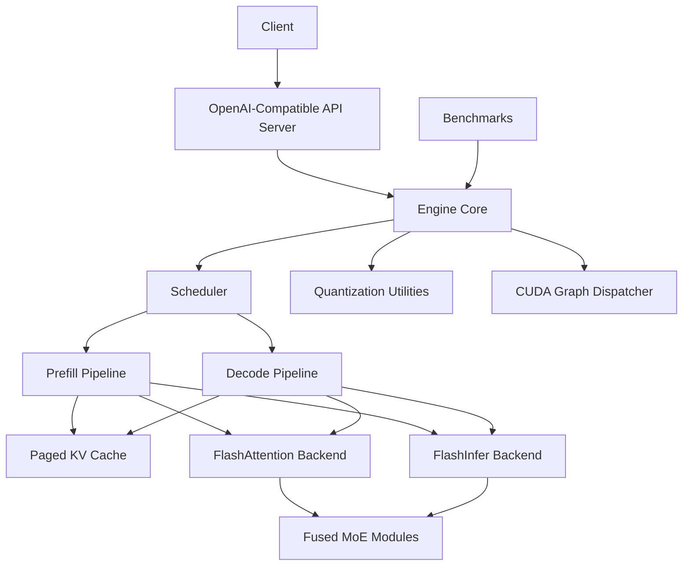
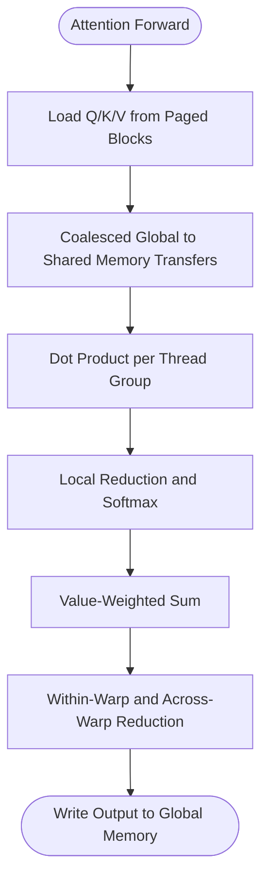
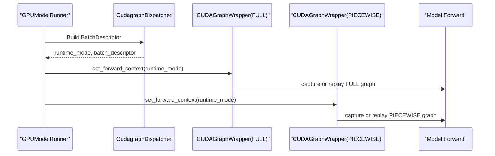
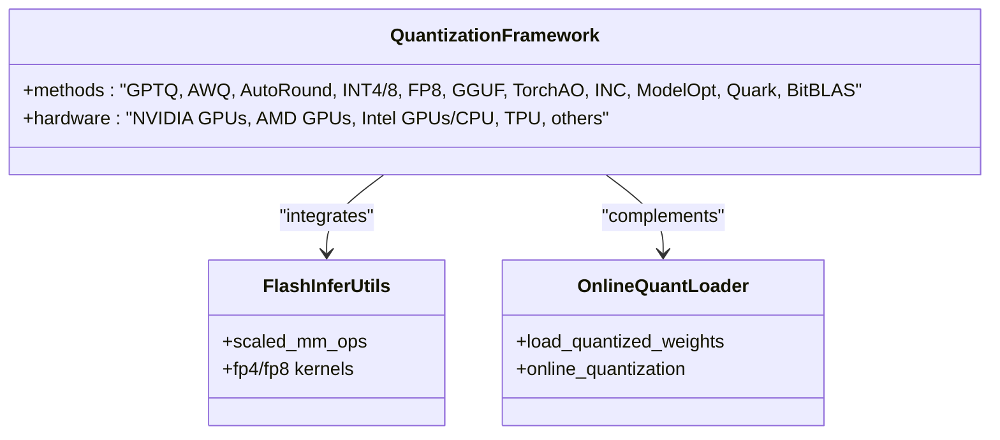
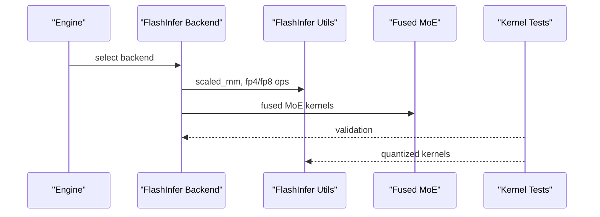
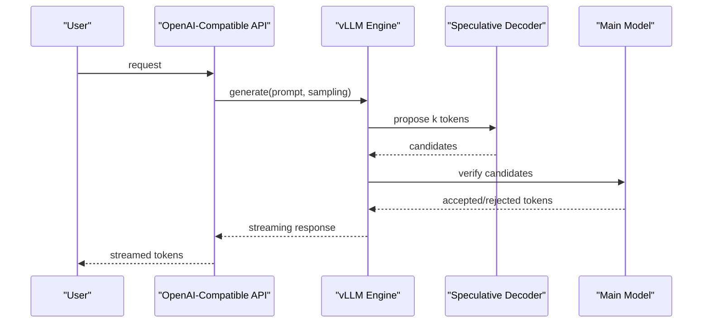
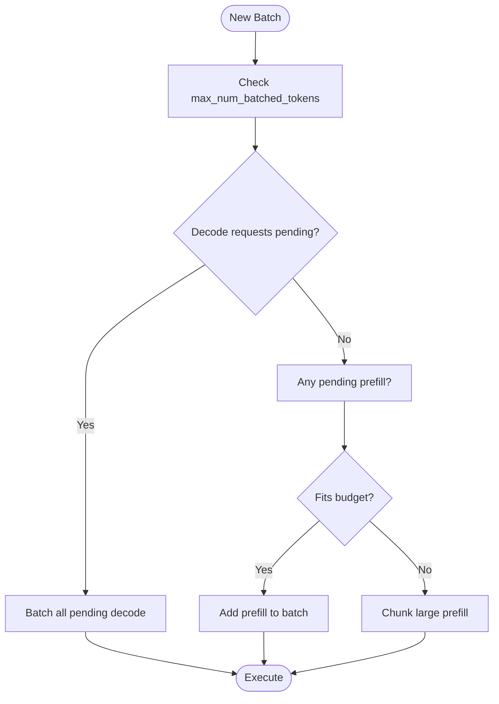
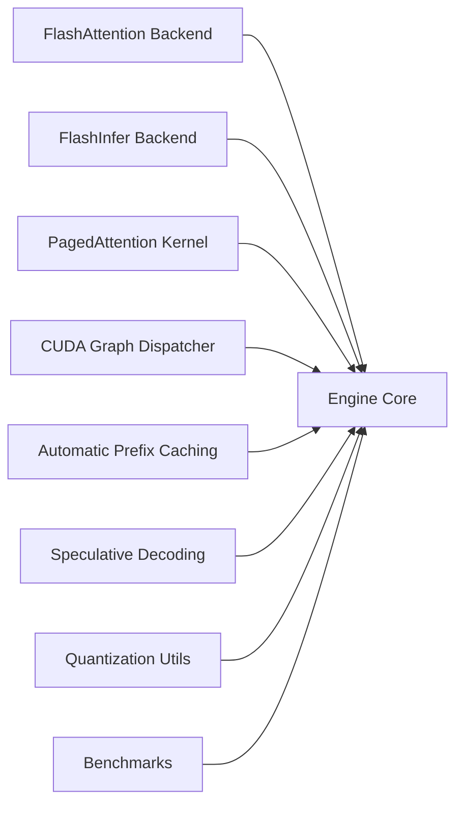

# Key Features and Capabilities

<cite>
**Referenced Files in This Document**
- [README.md](file://README.md)
- [features/README.md](file://docs/features/README.md)
- [paged_attention.md](file://docs/design/paged_attention.md)
- [spec_decode.md](file://docs/features/spec_decode.md)
- [cuda_graphs.md](file://docs/design/cuda_graphs.md)
- [automatic_prefix_caching.md](file://docs/features/automatic_prefix_caching.md)
- [optimization.md](file://docs/configuration/optimization.md)
- [quantization/README.md](file://docs/features/quantization/README.md)
- [benchmarks/README.md](file://benchmarks/README.md)
- [benchmarks/kernels/benchmark_paged_attention.py](file://benchmarks/kernels/benchmark_paged_attention.py)
- [csrc/attention/paged_attention_v2.cu](file://csrc/attention/paged_attention_v2.cu)
- [vllm/v1/attention/backends/flashinfer.py](file://vllm/v1/attention/backends/flashinfer.py)
- [vllm/utils/flashinfer.py](file://vllm/utils/flashinfer.py)
- [vllm/model_executor/layers/quantization/utils/flashinfer_utils.py](file://vllm/model_executor/layers/quantization/utils/flashinfer_utils.py)
- [vllm/model_executor/layers/fused_moe/flashinfer_cutlass_moe.py](file://vllm/model_executor/layers/fused_moe/flashinfer_cutlass_moe.py)
- [vllm/model_executor/layers/fused_moe/flashinfer_cutedsl_moe.py](file://vllm/model_executor/layers/fused_moe/flashinfer_cutedsl_moe.py)
- [vllm/model_executor/layers/fused_moe/flashinfer_trtllm_moe.py](file://vllm/model_executor/layers/fused_moe/flashinfer_trtllm_moe.py)
- [vllm/model_executor/layers/quantization/utils/flashinfer_fp4_moe.py](file://vllm/model_executor/layers/quantization/utils/flashinfer_fp4_moe.py)
- [vllm/model_executor/layers/quantization/utils/flashinfer_utils.py](file://vllm/model_executor/layers/quantization/utils/flashinfer_utils.py)
- [vllm/v1/attention/backends/flashinfer_mla.py](file://vllm/v1/attention/backends/flashinfer_mla.py)
- [vllm/model_executor/layers/fused_moe/flashinfer_cutlass_prepare_finalize.py](file://vllm/model_executor/layers/fused_moe/flashinfer_cutlass_prepare_finalize.py)
- [tools/flashinfer-build.sh](file://tools/flashinfer-build.sh)
- [vllm/model_executor/model_loader/online_quantization.py](file://vllm/model_executor/model_loader/online_quantization.py)
- [examples/offline_inference/lora_with_quantization_inference.py](file://examples/offline_inference/lora_with_quantization_inference.py)
- [examples/offline_inference/spec_decode.py](file://examples/offline_inference/spec_decode.py)
- [examples/offline_inference/automatic_prefix_caching.py](file://examples/offline_inference/automatic_prefix_caching.py)
- [tests/kernels/attention/test_flashinfer.py](file://tests/kernels/attention/test_flashinfer.py)
- [tests/kernels/moe/test_flashinfer.py](file://tests/kernels/moe/test_flashinfer.py)
- [tests/v1/e2e/test_spec_decode.py](file://tests/v1/e2e/test_spec_decode.py)
- [tests/v1/e2e/test_async_spec_decode.py](file://tests/v1/e2e/test_async_spec_decode.py)
- [tests/v1/e2e/test_lora_with_spec_decode.py](file://tests/v1/e2e/test_lora_with_spec_decode.py)
- [tests/kernels/quantization/test_flashinfer_scaled_mm.py](file://tests/kernels/quantization/test_flashinfer_scaled_mm.py)
- [tests/kernels/quantization/test_flashinfer_nvfp4_scaled_mm.py](file://tests/kernels/quantization/test_flashinfer_nvfp4_scaled_mm.py)
</cite>

## Table of Contents
1. [Introduction](#introduction)
2. [Project Structure](#project-structure)
3. [Core Components](#core-components)
4. [Architecture Overview](#architecture-overview)
5. [Detailed Component Analysis](#detailed-component-analysis)
6. [Dependency Analysis](#dependency-analysis)
7. [Performance Considerations](#performance-considerations)
8. [Troubleshooting Guide](#troubleshooting-guide)
9. [Conclusion](#conclusion)
10. [Appendices](#appendices)

## Introduction
This document highlights vLLM’s standout technical features and capabilities that drive state-of-the-art serving throughput, scalability, and usability. It focuses on:
- Serving throughput and continuous batching
- PagedAttention memory management
- CUDA/HIP graph optimizations
- Quantization support (GPTQ, AWQ, AutoRound, INT4/8, FP8)
- Optimized CUDA kernels and FlashAttention/FlashInfer integrations
- Speculative decoding and chunked prefill
- Flexibility: HuggingFace integration, decoding algorithms, parallelism, streaming, and OpenAI-compatible API server
- Performance benchmarks, use cases, and technical specifications

## Project Structure
At a high level, the repository organizes features and capabilities across:
- Core documentation for features and design decisions
- C++/CUDA source for optimized kernels and attention
- Python modules for attention backends, quantization utilities, and model execution
- Examples and tests demonstrating usage and validation
- Benchmarks for throughput, latency, and specialized scenarios

```mermaid
graph TB
subgraph "Docs"
A["features/README.md"]
B["design/paged_attention.md"]
C["features/spec_decode.md"]
D["design/cuda_graphs.md"]
E["features/automatic_prefix_caching.md"]
F["configuration/optimization.md"]
G["features/quantization/README.md"]
end
subgraph "Source"
H["csrc/attention/paged_attention_v2.cu"]
I["vllm/v1/attention/backends/flashinfer.py"]
J["vllm/utils/flashinfer.py"]
K["vllm/model_executor/layers/quantization/utils/flashinfer_utils.py"]
L["vllm/model_executor/layers/fused_moe/flashinfer_cutlass_moe.py"]
end
subgraph "Examples"
M["examples/offline_inference/spec_decode.py"]
N["examples/offline_inference/automatic_prefix_caching.py"]
O["examples/offline_inference/lora_with_quantization_inference.py"]
end
subgraph "Tests"
P["tests/kernels/attention/test_flashinfer.py"]
Q["tests/kernels/moe/test_flashinfer.py"]
R["tests/v1/e2e/test_spec_decode.py"]
S["tests/v1/e2e/test_async_spec_decode.py"]
T["tests/v1/e2e/test_lora_with_spec_decode.py"]
end
U["benchmarks/README.md"]
A --> B
A --> C
A --> D
A --> E
A --> F
A --> G
C --> M
E --> N
G --> O
B --> H
C --> I
C --> J
C --> K
C --> L
P --> I
Q --> L
R --> M
S --> M
T --> M
U --> H
```

**Diagram sources**
- [features/README.md](file://docs/features/README.md#L1-L82)
- [design/paged_attention.md](file://docs/design/paged_attention.md#L1-L513)
- [features/spec_decode.md](file://docs/features/spec_decode.md#L1-L333)
- [design/cuda_graphs.md](file://docs/design/cuda_graphs.md#L1-L237)
- [features/automatic_prefix_caching.md](file://docs/features/automatic_prefix_caching.md#L1-L26)
- [configuration/optimization.md](file://docs/configuration/optimization.md#L1-L289)
- [features/quantization/README.md](file://docs/features/quantization/README.md#L1-L71)
- [csrc/attention/paged_attention_v2.cu](file://csrc/attention/paged_attention_v2.cu)
- [vllm/v1/attention/backends/flashinfer.py](file://vllm/v1/attention/backends/flashinfer.py)
- [vllm/utils/flashinfer.py](file://vllm/utils/flashinfer.py)
- [vllm/model_executor/layers/quantization/utils/flashinfer_utils.py](file://vllm/model_executor/layers/quantization/utils/flashinfer_utils.py)
- [vllm/model_executor/layers/fused_moe/flashinfer_cutlass_moe.py](file://vllm/model_executor/layers/fused_moe/flashinfer_cutlass_moe.py)
- [examples/offline_inference/spec_decode.py](file://examples/offline_inference/spec_decode.py)
- [examples/offline_inference/automatic_prefix_caching.py](file://examples/offline_inference/automatic_prefix_caching.py)
- [examples/offline_inference/lora_with_quantization_inference.py](file://examples/offline_inference/lora_with_quantization_inference.py)
- [tests/kernels/attention/test_flashinfer.py](file://tests/kernels/attention/test_flashinfer.py)
- [tests/kernels/moe/test_flashinfer.py](file://tests/kernels/moe/test_flashinfer.py)
- [tests/v1/e2e/test_spec_decode.py](file://tests/v1/e2e/test_spec_decode.py)
- [tests/v1/e2e/test_async_spec_decode.py](file://tests/v1/e2e/test_async_spec_decode.py)
- [tests/v1/e2e/test_lora_with_spec_decode.py](file://tests/v1/e2e/test_lora_with_spec_decode.py)
- [benchmarks/README.md](file://benchmarks/README.md#L1-L21)

**Section sources**
- [README.md](file://README.md#L71-L91)
- [features/README.md](file://docs/features/README.md#L1-L82)

## Core Components
- State-of-the-art serving throughput and continuous batching: vLLM achieves high throughput by batching decode requests and interleaving prefill work, with chunked prefill enabling compute-bound and memory-bound operations to share batches.
- PagedAttention memory management: vLLM’s attention kernel and paged KV cache layout enable efficient, scalable memory usage across variable-length sequences.
- CUDA/HIP graph optimizations: Flexible CUDA Graph modes select between piecewise/full capture and uniform/non-uniform decode batching to minimize latency and maximize throughput.
- Quantization support: Broad coverage including GPTQ, AWQ, AutoRound, INT4/8, FP8, and specialized backends such as Marlin and GGUF.
- Optimized CUDA kernels and FlashAttention/FlashInfer integrations: Attention backends and fused kernels accelerate attention and MoE operations.
- Speculative decoding: Multiple proposal strategies (draft models, n-gram, suffix decoding, EAGLE) with lossless guarantees and compatibility checks.
- Chunked prefill: Default-enabled scheduling that prioritizes decode while opportunistically processing prefills to balance ITL and throughput.
- Flexibility: Seamless HuggingFace integration, multiple decoding algorithms, parallelism support (tensor, pipeline, data, expert), streaming outputs, and OpenAI-compatible API server.

**Section sources**
- [README.md](file://README.md#L71-L91)
- [configuration/optimization.md](file://docs/configuration/optimization.md#L30-L58)
- [design/paged_attention.md](file://docs/design/paged_attention.md#L1-L120)
- [design/cuda_graphs.md](file://docs/design/cuda_graphs.md#L37-L60)
- [features/quantization/README.md](file://docs/features/quantization/README.md#L1-L71)
- [features/spec_decode.md](file://docs/features/spec_decode.md#L1-L30)
- [features/automatic_prefix_caching.md](file://docs/features/automatic_prefix_caching.md#L1-L26)

## Architecture Overview
The system integrates attention backends, quantization utilities, and execution orchestration to deliver high throughput and low latency. FlashInfer and FlashAttention backends are central to attention performance, while PagedAttention enables memory-efficient KV caching. CUDA Graphs provide flexible capture strategies tailored to batch composition.

**Diagram sources**
- [vllm/v1/attention/backends/flashinfer.py](file://vllm/v1/attention/backends/flashinfer.py)
- [vllm/utils/flashinfer.py](file://vllm/utils/flashinfer.py)
- [vllm/model_executor/layers/fused_moe/flashinfer_cutlass_moe.py](file://vllm/model_executor/layers/fused_moe/flashinfer_cutlass_moe.py)
- [vllm/model_executor/layers/quantization/utils/flashinfer_utils.py](file://vllm/model_executor/layers/quantization/utils/flashinfer_utils.py)
- [design/cuda_graphs.md](file://docs/design/cuda_graphs.md#L99-L143)
- [benchmarks/README.md](file://benchmarks/README.md#L1-L21)

## Detailed Component Analysis

### PagedAttention Memory Management
PagedAttention separates KV storage into fixed-size blocks and uses a specialized attention kernel to efficiently access and compute attention with coalesced memory access patterns. This enables:
- Efficient memory layout for keys/values
- Reduced fragmentation and improved locality
- Scalable handling of variable-length sequences

**Diagram sources**
- [design/paged_attention.md](file://docs/design/paged_attention.md#L230-L420)
- [csrc/attention/paged_attention_v2.cu](file://csrc/attention/paged_attention_v2.cu)

**Section sources**
- [design/paged_attention.md](file://docs/design/paged_attention.md#L1-L120)
- [design/paged_attention.md](file://docs/design/paged_attention.md#L230-L420)

### CUDA/HIP Graph Optimizations
vLLM’s CUDA Graph dispatcher selects runtime modes based on batch composition and backend capabilities:
- Modes: NONE, PIECEWISE, FULL, FULL_DECODE_ONLY, FULL_AND_PIECEWISE
- Dispatch by BatchDescriptor (tokens, requests, uniform, LoRA presence)
- AttentionCGSupport enums define backend compatibility (ALWAYS, UNIFORM_BATCH, UNIFORM_SINGLE_TOKEN_DECODE, NEVER)

**Diagram sources**
- [design/cuda_graphs.md](file://docs/design/cuda_graphs.md#L80-L143)
- [design/cuda_graphs.md](file://docs/design/cuda_graphs.md#L150-L190)

**Section sources**
- [design/cuda_graphs.md](file://docs/design/cuda_graphs.md#L37-L60)
- [design/cuda_graphs.md](file://docs/design/cuda_graphs.md#L99-L143)
- [design/cuda_graphs.md](file://docs/design/cuda_graphs.md#L150-L190)

### Quantization Support
vLLM supports a broad set of quantization methods and hardware targets:
- Methods: GPTQ, AWQ, AutoRound, INT4/8, FP8, BitsAndBytes, GGUF, TorchAO, INC, NVIDIA Model Optimizer, AMD Quark, and BitBLAS variants
- Hardware compatibility varies by method; refer to the quantization compatibility matrix

**Diagram sources**
- [features/quantization/README.md](file://docs/features/quantization/README.md#L1-L71)
- [vllm/model_executor/layers/quantization/utils/flashinfer_utils.py](file://vllm/model_executor/layers/quantization/utils/flashinfer_utils.py)
- [vllm/model_executor/model_loader/online_quantization.py](file://vllm/model_executor/model_loader/online_quantization.py)

**Section sources**
- [features/quantization/README.md](file://docs/features/quantization/README.md#L1-L71)
- [vllm/model_executor/layers/quantization/utils/flashinfer_utils.py](file://vllm/model_executor/layers/quantization/utils/flashinfer_utils.py)
- [vllm/model_executor/model_loader/online_quantization.py](file://vllm/model_executor/model_loader/online_quantization.py)

### FlashAttention and FlashInfer Integrations
FlashInfer and FlashAttention backends integrate with vLLM’s attention system:
- FlashInfer backends for decode and MoE fused kernels
- Quantized scaled matrix multiplication and FP4/FP8 kernels
- Build scripts and tests validate correctness and performance

**Diagram sources**
- [vllm/v1/attention/backends/flashinfer.py](file://vllm/v1/attention/backends/flashinfer.py)
- [vllm/utils/flashinfer.py](file://vllm/utils/flashinfer.py)
- [vllm/model_executor/layers/fused_moe/flashinfer_cutlass_moe.py](file://vllm/model_executor/layers/fused_moe/flashinfer_cutlass_moe.py)
- [vllm/model_executor/layers/quantization/utils/flashinfer_fp4_moe.py](file://vllm/model_executor/layers/quantization/utils/flashinfer_fp4_moe.py)
- [tests/kernels/attention/test_flashinfer.py](file://tests/kernels/attention/test_flashinfer.py)
- [tests/kernels/moe/test_flashinfer.py](file://tests/kernels/moe/test_flashinfer.py)
- [tools/flashinfer-build.sh](file://tools/flashinfer-build.sh)

**Section sources**
- [vllm/v1/attention/backends/flashinfer.py](file://vllm/v1/attention/backends/flashinfer.py)
- [vllm/utils/flashinfer.py](file://vllm/utils/flashinfer.py)
- [vllm/model_executor/layers/fused_moe/flashinfer_cutlass_moe.py](file://vllm/model_executor/layers/fused_moe/flashinfer_cutlass_moe.py)
- [vllm/model_executor/layers/quantization/utils/flashinfer_fp4_moe.py](file://vllm/model_executor/layers/quantization/utils/flashinfer_fp4_moe.py)
- [tests/kernels/attention/test_flashinfer.py](file://tests/kernels/attention/test_flashinfer.py)
- [tests/kernels/moe/test_flashinfer.py](file://tests/kernels/moe/test_flashinfer.py)
- [tools/flashinfer-build.sh](file://tools/flashinfer-build.sh)

### Speculative Decoding
Speculative decoding accelerates decoding by proposing multiple tokens ahead of acceptance/rejection sampling:
- Methods: draft models, n-gram, suffix decoding, EAGLE
- Guarantees: theoretically and algorithmically lossless under hardware precision
- Compatibility: tested end-to-end and validated with tests

**Diagram sources**
- [features/spec_decode.md](file://docs/features/spec_decode.md#L1-L120)
- [examples/offline_inference/spec_decode.py](file://examples/offline_inference/spec_decode.py)
- [tests/v1/e2e/test_spec_decode.py](file://tests/v1/e2e/test_spec_decode.py)
- [tests/v1/e2e/test_async_spec_decode.py](file://tests/v1/e2e/test_async_spec_decode.py)
- [tests/v1/e2e/test_lora_with_spec_decode.py](file://tests/v1/e2e/test_lora_with_spec_decode.py)

**Section sources**
- [features/spec_decode.md](file://docs/features/spec_decode.md#L1-L120)
- [examples/offline_inference/spec_decode.py](file://examples/offline_inference/spec_decode.py)
- [tests/v1/e2e/test_spec_decode.py](file://tests/v1/e2e/test_spec_decode.py)
- [tests/v1/e2e/test_async_spec_decode.py](file://tests/v1/e2e/test_async_spec_decode.py)
- [tests/v1/e2e/test_lora_with_spec_decode.py](file://tests/v1/e2e/test_lora_with_spec_decode.py)

### Chunked Prefill and Continuous Batching
Chunked prefill improves throughput and latency by:
- Prioritizing decode requests
- Scheduling pending prefills when budget permits
- Automatically chunking large prefills to fit batch budgets

**Diagram sources**
- [configuration/optimization.md](file://docs/configuration/optimization.md#L30-L58)

**Section sources**
- [configuration/optimization.md](file://docs/configuration/optimization.md#L30-L58)

### Automatic Prefix Caching
Automatic Prefix Caching (APC) reuses cached KV states across requests sharing prefixes:
- Enables skipping recomputation of shared context
- Improves throughput and reduces latency for long documents and multi-turn conversations
- Limited to reducing prefill cost; does not reduce decode cost

**Section sources**
- [automatic_prefix_caching.md](file://docs/features/automatic_prefix_caching.md#L1-L26)
- [examples/offline_inference/automatic_prefix_caching.py](file://examples/offline_inference/automatic_prefix_caching.py)

### Flexibility: HuggingFace Integration, Decoding Algorithms, Parallelism, Streaming, OpenAI-Compatible API
- HuggingFace integration: seamless loading of popular architectures
- Decoding algorithms: parallel sampling, beam search, and more
- Parallelism: tensor, pipeline, data, and expert parallelism
- Streaming: streaming outputs for real-time generation
- OpenAI-compatible API server: drop-in replacement for OpenAI endpoints

**Section sources**
- [README.md](file://README.md#L82-L91)
- [features/README.md](file://docs/features/README.md#L1-L82)

## Dependency Analysis
The following diagram shows key dependencies among components:

**Diagram sources**
- [vllm/v1/attention/backends/flashinfer.py](file://vllm/v1/attention/backends/flashinfer.py)
- [vllm/v1/attention/backends/flashinfer_mla.py](file://vllm/v1/attention/backends/flashinfer_mla.py)
- [csrc/attention/paged_attention_v2.cu](file://csrc/attention/paged_attention_v2.cu)
- [design/cuda_graphs.md](file://docs/design/cuda_graphs.md#L99-L143)
- [features/automatic_prefix_caching.md](file://docs/features/automatic_prefix_caching.md#L1-L26)
- [features/spec_decode.md](file://docs/features/spec_decode.md#L1-L120)
- [vllm/model_executor/layers/quantization/utils/flashinfer_utils.py](file://vllm/model_executor/layers/quantization/utils/flashinfer_utils.py)
- [benchmarks/README.md](file://benchmarks/README.md#L1-L21)

**Section sources**
- [features/README.md](file://docs/features/README.md#L1-L82)

## Performance Considerations
- Throughput vs. latency tuning: Adjust max_num_batched_tokens to balance ITL and throughput; larger budgets favor TTFT and throughput, smaller budgets favor ITL.
- Memory pressure: Use tensor/pipeline/data/expert parallelism judiciously; monitor preemption warnings and adjust gpu_memory_utilization and max_num_seqs accordingly.
- Quantization trade-offs: Choose quantization method and hardware target per workload; FP8/W8A8 and INT4/8 enable deployment on constrained devices.
- Attention backend selection: Prefer backends with higher CUDA Graph support for uniform decode batches; FlashInfer and FlashAttention backends offer strong performance.
- Benchmarking: Use serving and throughput benchmarks to evaluate end-to-end performance and kernel-specific performance.

[No sources needed since this section provides general guidance]

## Troubleshooting Guide
Common issues and mitigations:
- Preemption and recomputation: Increase gpu_memory_utilization, reduce max_num_seqs or max_num_batched_tokens, or increase tensor_parallel_size/pipeline_parallel_size.
- CUDA Graph compatibility: Downgrade to PIECEWISE or FULL_DECODE_ONLY if backend does not support FULL for mixed batches.
- Speculative decoding compatibility: Avoid pipeline parallelism with speculative decoding until supported; validate with end-to-end tests.
- FlashInfer build and usage: Ensure proper build and environment setup using provided scripts and tests.

**Section sources**
- [configuration/optimization.md](file://docs/configuration/optimization.md#L8-L27)
- [design/cuda_graphs.md](file://docs/design/cuda_graphs.md#L150-L190)
- [features/spec_decode.md](file://docs/features/spec_decode.md#L1-L20)
- [tools/flashinfer-build.sh](file://tools/flashinfer-build.sh)

## Conclusion
vLLM delivers state-of-the-art serving throughput and low-latency inference through:
- Efficient memory management with PagedAttention
- Flexible CUDA Graph capture strategies
- Broad quantization support and optimized kernels
- Strong attention backends (FlashAttention/FlashInfer)
- Speculative decoding and chunked prefill
- Rich flexibility for production deployments

These capabilities, backed by documentation, examples, tests, and benchmarks, enable practical, high-performance LLM serving across diverse hardware and use cases.

[No sources needed since this section summarizes without analyzing specific files]

## Appendices
- Benchmarks overview: Serving, throughput, and specialized feature benchmarks are available for evaluating performance.
- Kernel benchmarks: PagedAttention and other kernels include benchmark scripts for performance measurement.
- Example workloads: Speculative decoding, automatic prefix caching, and quantized inference examples demonstrate practical usage.

**Section sources**
- [benchmarks/README.md](file://benchmarks/README.md#L1-L21)
- [benchmarks/kernels/benchmark_paged_attention.py](file://benchmarks/kernels/benchmark_paged_attention.py)
- [examples/offline_inference/spec_decode.py](file://examples/offline_inference/spec_decode.py)
- [examples/offline_inference/automatic_prefix_caching.py](file://examples/offline_inference/automatic_prefix_caching.py)
- [examples/offline_inference/lora_with_quantization_inference.py](file://examples/offline_inference/lora_with_quantization_inference.py)