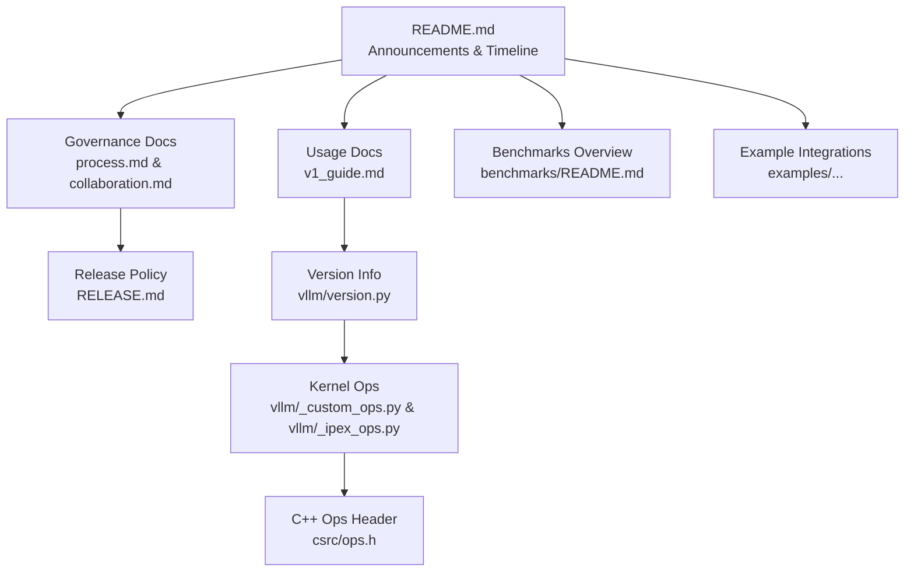
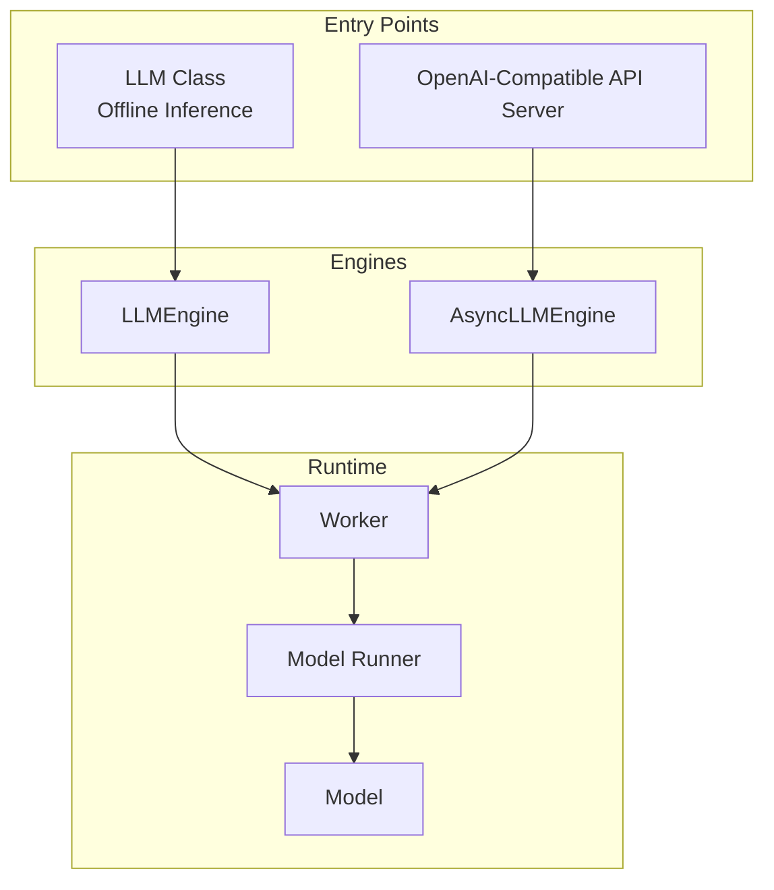
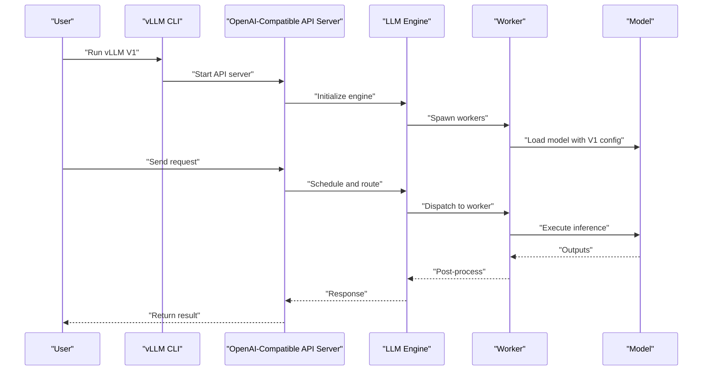
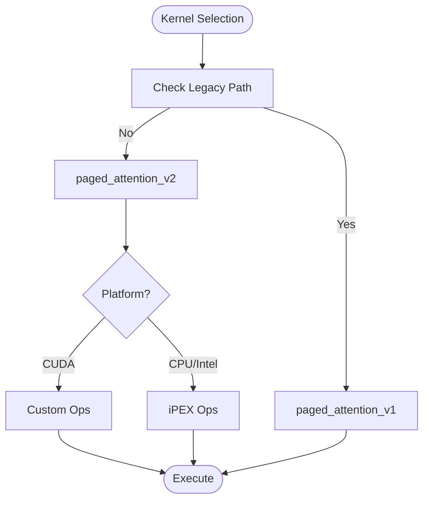
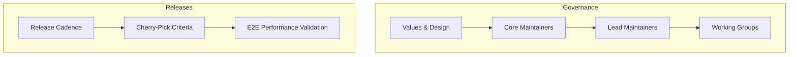

# Project History and Evolution

<cite>
**Referenced Files in This Document**
- [README.md](file://README.md)
- [RELEASE.md](file://RELEASE.md)
- [docs/governance/process.md](file://docs/governance/process.md)
- [docs/governance/collaboration.md](file://docs/governance/collaboration.md)
- [docs/design/arch_overview.md](file://docs/design/arch_overview.md)
- [docs/usage/v1_guide.md](file://docs/usage/v1_guide.md)
- [vllm/version.py](file://vllm/version.py)
- [vllm/_custom_ops.py](file://vllm/_custom_ops.py)
- [vllm/_ipex_ops.py](file://vllm/_ipex_ops.py)
- [csrc/ops.h](file://csrc/ops.h)
- [benchmarks/README.md](file://benchmarks/README.md)
- [examples/online_serving/gradio_openai_chatbot_webserver.py](file://examples/online_serving/gradio_openai_chatbot_webserver.py)
</cite>

## Table of Contents
1. [Introduction](#introduction)
2. [Project Structure](#project-structure)
3. [Core Components](#core-components)
4. [Architecture Overview](#architecture-overview)
5. [Detailed Component Analysis](#detailed-component-analysis)
6. [Dependency Analysis](#dependency-analysis)
7. [Performance Considerations](#performance-considerations)
8. [Troubleshooting Guide](#troubleshooting-guide)
9. [Conclusion](#conclusion)
10. [Appendices](#appendices)

## Introduction
This section chronicles the vLLM project’s history and evolution, highlighting its origins at the Sky Computing Lab at UC Berkeley, its transition to a hosted project under the PyTorch Foundation, and its journey to becoming a widely adopted, community-driven inference engine. It documents major releases, architectural milestones such as the V1 alpha with a 1.7x speedup, key industry partnerships, the shift from FastChat-vLLM integration to independent development, academic contributions, and the expansion of the community and user base across industries.

## Project Structure
The repository organizes historical highlights, governance, architecture, and usage guidance across distinct areas:
- Historical highlights and announcements are prominently featured in the project README.
- Governance and collaboration processes are documented in the governance section.
- Architectural overviews and design decisions are captured in the design documentation.
- Versioning and release cadence are defined in the release policy.
- Practical usage and migration guidance for V1 are provided in the usage documentation.
- Performance and kernel-level evolution are evident in source files and benchmarks.

**Diagram sources**
- [README.md](file://README.md#L22-L69)
- [docs/governance/process.md](file://docs/governance/process.md#L1-L126)
- [docs/governance/collaboration.md](file://docs/governance/collaboration.md#L1-L44)
- [docs/usage/v1_guide.md](file://docs/usage/v1_guide.md#L1-L15)
- [RELEASE.md](file://RELEASE.md#L1-L91)
- [vllm/version.py](file://vllm/version.py#L1-L40)
- [vllm/_custom_ops.py](file://vllm/_custom_ops.py#L73-L120)
- [vllm/_ipex_ops.py](file://vllm/_ipex_ops.py#L94-L134)
- [csrc/ops.h](file://csrc/ops.h#L1-L41)
- [benchmarks/README.md](file://benchmarks/README.md#L1-L200)
- [examples/online_serving/gradio_openai_chatbot_webserver.py](file://examples/online_serving/gradio_openai_chatbot_webserver.py#L1-L33)

**Section sources**
- [README.md](file://README.md#L22-L69)
- [docs/governance/process.md](file://docs/governance/process.md#L1-L126)
- [docs/governance/collaboration.md](file://docs/governance/collaboration.md#L1-L44)
- [docs/usage/v1_guide.md](file://docs/usage/v1_guide.md#L1-L15)
- [RELEASE.md](file://RELEASE.md#L1-L91)
- [vllm/version.py](file://vllm/version.py#L1-L40)
- [vllm/_custom_ops.py](file://vllm/_custom_ops.py#L73-L120)
- [vllm/_ipex_ops.py](file://vllm/_ipex_ops.py#L94-L134)
- [csrc/ops.h](file://csrc/ops.h#L1-L41)
- [benchmarks/README.md](file://benchmarks/README.md#L1-L200)
- [examples/online_serving/gradio_openai_chatbot_webserver.py](file://examples/online_serving/gradio_openai_chatbot_webserver.py#L1-L33)

## Core Components
- Origins and early milestones: vLLM was officially released and integrated into FastChat-vLLM to power LMSYS Vicuna and Chatbot Arena. The project later evolved into an independent, community-driven project with contributions from academia and industry.
- Hosted under the PyTorch Foundation: vLLM became a hosted project under the PyTorch Foundation, marking institutional backing and broader ecosystem integration.
- V1 alpha milestone: The alpha release of vLLM V1 introduced a major architectural upgrade with a stated 1.7x speedup, emphasizing clean code, optimized execution loops, zero-overhead prefix caching, and enhanced multimodal support.
- Industry partnerships: The project has collaborated with NVIDIA, Meta, and other technology companies, evidenced by meetups, announcements, and joint presentations.
- Academic contributions: The project is cited in academic literature and continues to publish updates and research insights.

**Section sources**
- [README.md](file://README.md#L22-L69)
- [docs/usage/v1_guide.md](file://docs/usage/v1_guide.md#L1-L15)

## Architecture Overview
The architecture documentation outlines the entrypoints, engines, workers, and class hierarchy that define vLLM’s runtime. It emphasizes:
- Extensibility through a centralized configuration object passed across components.
- Uniform model constructors enabling composability and sharding/quantization at initialization.
- Design choices that improve maintainability and scalability for evolving LLM inference needs.

**Diagram sources**
- [docs/design/arch_overview.md](file://docs/design/arch_overview.md#L1-L250)

**Section sources**
- [docs/design/arch_overview.md](file://docs/design/arch_overview.md#L1-L250)

## Detailed Component Analysis

### Transition from FastChat-vLLM to Independent vLLM
- Early integration: vLLM’s FastChat-vLLM integration powered LMSYS Vicuna and Chatbot Arena, establishing practical usage and adoption.
- Independent evolution: The project matured into an independent library with its own architecture, governance, and release cadence, while retaining compatibility and seamless integration with Hugging Face models.

**Section sources**
- [README.md](file://README.md#L59-L61)

### V1 Alpha Release and Architectural Changes
- V1 alpha announcement: The alpha release highlighted a major architectural upgrade with a 1.7x speedup, clean code, optimized execution loop, zero-overhead prefix caching, and enhanced multimodal support.
- Migration guidance: The V1 guide explains that V0 is fully deprecated and encourages users to migrate to V1, retaining stable components while re-architecting core systems (scheduler, KV cache manager, worker, sampler, API server) for cohesion and maintainability.

**Diagram sources**
- [docs/usage/v1_guide.md](file://docs/usage/v1_guide.md#L1-L15)
- [docs/design/arch_overview.md](file://docs/design/arch_overview.md#L1-L250)

**Section sources**
- [README.md](file://README.md#L32-L33)
- [docs/usage/v1_guide.md](file://docs/usage/v1_guide.md#L1-L15)
- [docs/design/arch_overview.md](file://docs/design/arch_overview.md#L1-L250)

### Kernel-Level Evolution and Performance Enhancements
- Attention kernels: The codebase includes both legacy and newer attention kernel variants, indicating iterative improvements in attention computation and caching.
- Platform-specific ops: Dedicated ops for different platforms (e.g., CPU and specialized libraries) demonstrate targeted performance tuning.
- C++ ops header: The presence of a dedicated ops header signals a layered approach to performance-critical operations.

**Diagram sources**
- [csrc/ops.h](file://csrc/ops.h#L1-L41)
- [vllm/_custom_ops.py](file://vllm/_custom_ops.py#L73-L120)
- [vllm/_ipex_ops.py](file://vllm/_ipex_ops.py#L94-L134)

**Section sources**
- [csrc/ops.h](file://csrc/ops.h#L1-L41)
- [vllm/_custom_ops.py](file://vllm/_custom_ops.py#L73-L120)
- [vllm/_ipex_ops.py](file://vllm/_ipex_ops.py#L94-L134)

### Governance, Releases, and Community Growth
- Governance philosophy: vLLM emphasizes top performance, ease of use, wide coverage, production readiness, and extensibility, with a meritocratic maintainer structure and working groups.
- Release cadence: The project follows a bi-weekly patch release schedule with optional post-releases, ensuring frequent updates and stability.
- Community engagement: The README lists sponsors, meetups, and channels for collaboration, reflecting a vibrant ecosystem.

**Diagram sources**
- [docs/governance/process.md](file://docs/governance/process.md#L1-L126)
- [RELEASE.md](file://RELEASE.md#L1-L91)

**Section sources**
- [docs/governance/process.md](file://docs/governance/process.md#L1-L126)
- [RELEASE.md](file://RELEASE.md#L1-L91)
- [README.md](file://README.md#L120-L160)

### Industry Partnerships and Collaborations
- Corporate and academic collaborations: The README highlights meetups and announcements with NVIDIA, Meta, IBM, Google Cloud, Snowflake, AWS, and others, underscoring industry engagement.
- Model provider collaboration: The collaboration policy describes how vLLM works with model providers and hardware vendors, including private channels and coordinated releases.

**Section sources**
- [README.md](file://README.md#L32-L69)
- [docs/governance/collaboration.md](file://docs/governance/collaboration.md#L1-L44)

### Academic Publications and Research Contributions
- Academic citation: The project is cited in academic literature, with a BibTeX entry provided in the README.
- Ongoing research: The README links to the project blog, showcasing research insights and updates.

**Section sources**
- [README.md](file://README.md#L165-L177)

### Adoption Across Industries and Community Expansion
- Meetups and events: The README documents numerous regional meetups and events, indicating broad adoption across industries and geographic regions.
- Example integrations: The examples directory demonstrates real-world integrations, such as a Gradio OpenAI-compatible web server, illustrating practical deployments.

**Section sources**
- [README.md](file://README.md#L22-L69)
- [examples/online_serving/gradio_openai_chatbot_webserver.py](file://examples/online_serving/gradio_openai_chatbot_webserver.py#L1-L33)

## Dependency Analysis
The project’s evolution reveals clear dependencies between governance, releases, architecture, and community:
- Governance defines decision-making and release strategy.
- Release cadence ensures continuous delivery and validation.
- Architectural decisions (e.g., V1 re-architecture) influence performance and usability.
- Community and partner engagement drive adoption and contributions.

**Diagram sources**
- [docs/governance/process.md](file://docs/governance/process.md#L1-L126)
- [RELEASE.md](file://RELEASE.md#L1-L91)
- [docs/design/arch_overview.md](file://docs/design/arch_overview.md#L1-L250)
- [README.md](file://README.md#L22-L69)

**Section sources**
- [docs/governance/process.md](file://docs/governance/process.md#L1-L126)
- [RELEASE.md](file://RELEASE.md#L1-L91)
- [docs/design/arch_overview.md](file://docs/design/arch_overview.md#L1-L250)
- [README.md](file://README.md#L22-L69)

## Performance Considerations
- Bi-weekly releases and E2E performance validation ensure minimal regressions and continuous improvement.
- Kernel-level evolution (legacy vs. newer attention implementations) reflects ongoing optimization.
- Benchmarks and dashboards provide visibility into performance across models and hardware.

**Section sources**
- [RELEASE.md](file://RELEASE.md#L56-L91)
- [benchmarks/README.md](file://benchmarks/README.md#L1-L200)

## Troubleshooting Guide
- Migration to V1: The V1 guide instructs users to migrate away from V0 and seek support if features are missing in V1.
- Community channels: The README lists forums, Slack, and GitHub Issues for technical questions and collaboration.

**Section sources**
- [docs/usage/v1_guide.md](file://docs/usage/v1_guide.md#L1-L15)
- [README.md](file://README.md#L178-L186)

## Conclusion
vLLM’s journey from its origins at UC Berkeley through its independence and institutional hosting under the PyTorch Foundation reflects a rapid evolution driven by strong governance, frequent releases, and architectural innovation. The V1 alpha milestone with a 1.7x speedup exemplifies the project’s commitment to performance and maintainability. Strategic industry partnerships, academic citations, and a thriving community underscore vLLM’s impact on the LLM inference landscape and its role in advancing efficient serving.

## Appendices
- Version identification: The version module provides version metadata and helpers for compatibility checks.
- Kernel evolution: The ops files show the progression from legacy to modern attention kernels, supporting performance gains and platform diversity.

**Section sources**
- [vllm/version.py](file://vllm/version.py#L1-L40)
- [csrc/ops.h](file://csrc/ops.h#L1-L41)
- [vllm/_custom_ops.py](file://vllm/_custom_ops.py#L73-L120)
- [vllm/_ipex_ops.py](file://vllm/_ipex_ops.py#L94-L134)