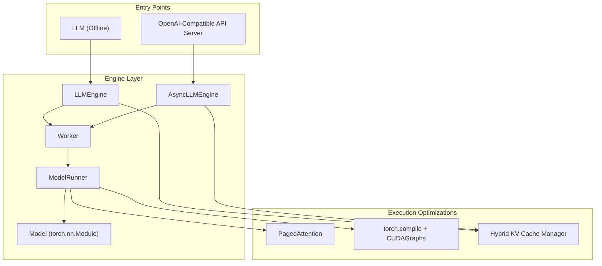
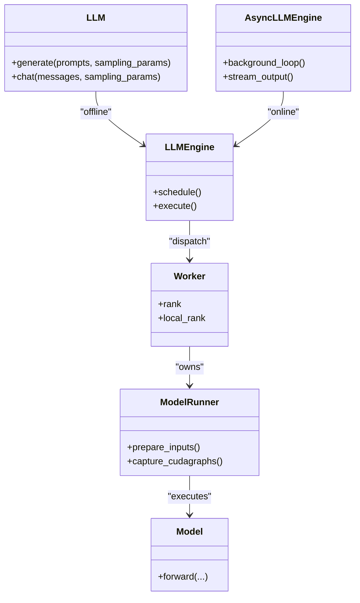
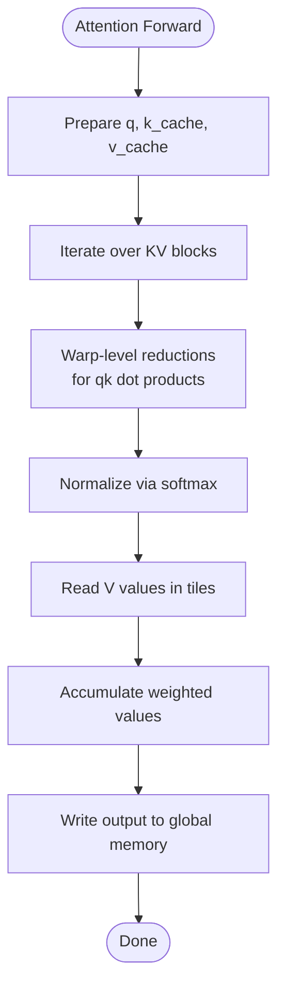
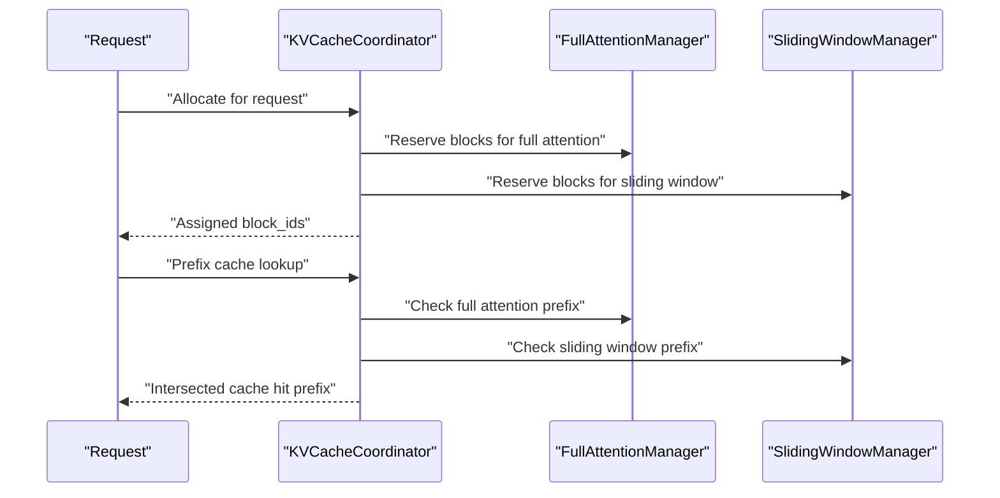
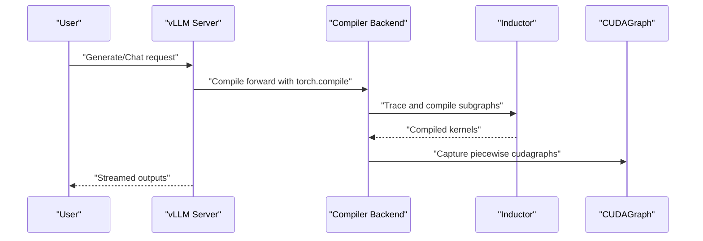
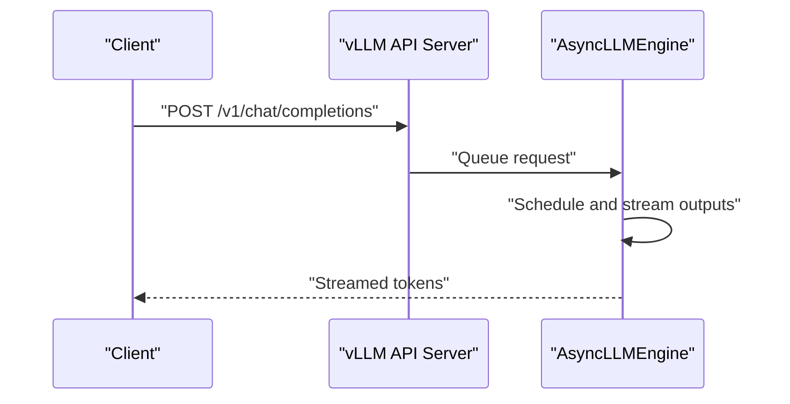
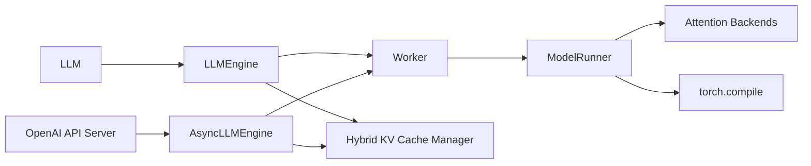

# Project Overview

<cite>
**Referenced Files in This Document**
- [README.md](file://README.md)
- [docs/design/arch_overview.md](file://docs/design/arch_overview.md)
- [docs/design/paged_attention.md](file://docs/design/paged_attention.md)
- [docs/design/hybrid_kv_cache_manager.md](file://docs/design/hybrid_kv_cache_manager.md)
- [docs/design/torch_compile.md](file://docs/design/torch_compile.md)
- [docs/design/optimization_levels.md](file://docs/design/optimization_levels.md)
- [docs/getting_started/quickstart.md](file://docs/getting_started/quickstart.md)
- [docs/models/supported_models.md](file://docs/models/supported_models.md)
- [docs/configuration/serve_args.md](file://docs/configuration/serve_args.md)
- [examples/offline_inference/batch_llm_inference.py](file://examples/offline_inference/batch_llm_inference.py)
- [examples/online_serving/openai_chat_completion_client.py](file://examples/online_serving/openai_chat_completion_client.py)
</cite>

## Table of Contents
1. [Introduction](#introduction)
2. [Project Structure](#project-structure)
3. [Core Components](#core-components)
4. [Architecture Overview](#architecture-overview)
5. [Detailed Component Analysis](#detailed-component-analysis)
6. [Dependency Analysis](#dependency-analysis)
7. [Performance Considerations](#performance-considerations)
8. [Troubleshooting Guide](#troubleshooting-guide)
9. [Conclusion](#conclusion)
10. [Appendices](#appendices)

## Introduction
vLLM is a fast, easy-to-use library for large language model (LLM) inference and serving. Its mission is to make high-throughput, low-cost LLM serving accessible to everyone. Originally developed in the Sky Computing Lab at UC Berkeley, vLLM has evolved into a community-driven project that collaborates with academia and industry. The project emphasizes:
- Easy, fast, and cheap LLM serving for everyone
- State-of-the-art serving throughput
- Efficient memory management with PagedAttention
- Continuous batching and fast model execution
- Seamless integration with the broader PyTorch ecosystem

Key differentiators:
- Serving throughput: Achieved through optimized execution loops, CUDA/HIP graph capture, and attention backends
- Memory efficiency: PagedAttention and hybrid KV cache management
- Flexible deployment: Offline inference and OpenAI-compatible online serving
- Broad hardware and model support: NVIDIA GPUs, AMD ROCm, Intel CPUs/GPUs, PowerPC, Arm, TPU, and diverse accelerators
- Extensibility: Plugin systems, LoRA, quantization, and multimodal inputs

**Section sources**
- [README.md](file://README.md#L65-L110)
- [docs/design/arch_overview.md](file://docs/design/arch_overview.md#L1-L40)

## Project Structure
At a high level, vLLM provides:
- Offline inference APIs via the LLM class
- Online serving via an OpenAI-compatible API server
- A configurable engine supporting distributed inference and parallelism
- A rich ecosystem of attention backends, quantization, and plugins

**Diagram sources**
- [docs/design/arch_overview.md](file://docs/design/arch_overview.md#L41-L120)
- [docs/design/paged_attention.md](file://docs/design/paged_attention.md#L1-L40)
- [docs/design/torch_compile.md](file://docs/design/torch_compile.md#L1-L40)
- [docs/design/hybrid_kv_cache_manager.md](file://docs/design/hybrid_kv_cache_manager.md#L1-L40)

**Section sources**
- [docs/design/arch_overview.md](file://docs/design/arch_overview.md#L1-L120)
- [docs/getting_started/quickstart.md](file://docs/getting_started/quickstart.md#L1-L60)

## Core Components
- LLM (Offline Inference): High-throughput batched generation for offline workloads
- AsyncLLMEngine (Online Serving): Asynchronous request processing and streaming outputs
- PagedAttention: Efficient attention KV cache management enabling long context and high throughput
- Hybrid KV Cache Manager: Supports hybrid attention types (e.g., sliding window + full attention) with unified page sizing and prefix caching
- torch.compile integration: Full-graph and piecewise compilation with CUDAGraph capture for peak performance
- OpenAI-Compatible API Server: Drop-in replacement for OpenAI endpoints

Practical examples:
- Offline batch inference with Ray Data for large-scale datasets
- Online serving with OpenAI-compatible endpoints and streaming

**Section sources**
- [docs/design/arch_overview.md](file://docs/design/arch_overview.md#L41-L120)
- [docs/design/paged_attention.md](file://docs/design/paged_attention.md#L1-L40)
- [docs/design/hybrid_kv_cache_manager.md](file://docs/design/hybrid_kv_cache_manager.md#L1-L60)
- [docs/design/torch_compile.md](file://docs/design/torch_compile.md#L1-L40)
- [examples/offline_inference/batch_llm_inference.py](file://examples/offline_inference/batch_llm_inference.py#L1-L40)
- [examples/online_serving/openai_chat_completion_client.py](file://examples/online_serving/openai_chat_completion_client.py#L1-L30)

## Architecture Overview
The vLLM architecture centers on:
- Entry points: LLM for offline inference and the OpenAI-compatible API server for online serving
- Engine: LLMEngine orchestrates input processing, scheduling, model execution, and output processing; AsyncLLMEngine wraps it for asynchronous streaming
- Worker and ModelRunner: Distributed execution across devices; model runner prepares inputs and captures CUDA/HIP graphs
- Model: torch.nn.Module instances integrated via Hugging Face Transformers or native vLLM implementations

**Diagram sources**
- [docs/design/arch_overview.md](file://docs/design/arch_overview.md#L41-L120)

**Section sources**
- [docs/design/arch_overview.md](file://docs/design/arch_overview.md#L41-L120)

## Detailed Component Analysis

### PagedAttention and Memory Efficiency
PagedAttention organizes attention KV caches into fixed-size blocks, enabling efficient memory usage and long-context serving. The attention kernel is designed for coalesced memory access and warp-level reductions, minimizing global memory bandwidth and improving throughput.

**Diagram sources**
- [docs/design/paged_attention.md](file://docs/design/paged_attention.md#L200-L360)

**Section sources**
- [docs/design/paged_attention.md](file://docs/design/paged_attention.md#L1-L120)
- [docs/design/paged_attention.md](file://docs/design/paged_attention.md#L200-L360)

### Hybrid KV Cache Manager
Hybrid models combine multiple attention types (e.g., sliding window + full attention). The manager allocates memory blocks uniformly across layer types, supports prefix caching intersections, and coordinates eviction policies across groups.

**Diagram sources**
- [docs/design/hybrid_kv_cache_manager.md](file://docs/design/hybrid_kv_cache_manager.md#L150-L210)

**Section sources**
- [docs/design/hybrid_kv_cache_manager.md](file://docs/design/hybrid_kv_cache_manager.md#L1-L120)
- [docs/design/hybrid_kv_cache_manager.md](file://docs/design/hybrid_kv_cache_manager.md#L150-L210)

### torch.compile Integration and CUDAGraphs
vLLM integrates torch.compile to capture computation graphs and optimize execution. Piecewise capture aligns with attention boundaries, while a compilation cache improves cold-start performance. Optimization levels trade startup time for performance.

**Diagram sources**
- [docs/design/torch_compile.md](file://docs/design/torch_compile.md#L120-L200)
- [docs/design/torch_compile.md](file://docs/design/torch_compile.md#L240-L262)

**Section sources**
- [docs/design/torch_compile.md](file://docs/design/torch_compile.md#L1-L60)
- [docs/design/torch_compile.md](file://docs/design/torch_compile.md#L120-L200)
- [docs/design/torch_compile.md](file://docs/design/torch_compile.md#L240-L262)
- [docs/design/optimization_levels.md](file://docs/design/optimization_levels.md#L1-L40)

### Practical Use Cases and Examples
- Offline batch inference with Ray Data for large-scale datasets and continuous batching
- Online serving via OpenAI-compatible endpoints with streaming and API key support

**Diagram sources**
- [examples/online_serving/openai_chat_completion_client.py](file://examples/online_serving/openai_chat_completion_client.py#L1-L40)
- [docs/configuration/serve_args.md](file://docs/configuration/serve_args.md#L1-L20)

**Section sources**
- [examples/offline_inference/batch_llm_inference.py](file://examples/offline_inference/batch_llm_inference.py#L1-L40)
- [examples/online_serving/openai_chat_completion_client.py](file://examples/online_serving/openai_chat_completion_client.py#L1-L40)
- [docs/configuration/serve_args.md](file://docs/configuration/serve_args.md#L1-L36)

## Dependency Analysis
- Entry points depend on engine abstractions; engines depend on workers and model runners
- Model runners depend on attention backends and compilation infrastructure
- Hybrid KV cache manager coordinates across attention types and memory pools
- Supported models span generative, pooling, and multimodal families, with Transformers backend compatibility

**Diagram sources**
- [docs/design/arch_overview.md](file://docs/design/arch_overview.md#L41-L120)
- [docs/design/torch_compile.md](file://docs/design/torch_compile.md#L1-L40)
- [docs/design/hybrid_kv_cache_manager.md](file://docs/design/hybrid_kv_cache_manager.md#L1-L40)

**Section sources**
- [docs/models/supported_models.md](file://docs/models/supported_models.md#L1-L60)

## Performance Considerations
- PagedAttention reduces memory pressure and improves KV cache locality
- Piecewise CUDAGraph capture balances flexibility and performance
- Optimization levels (-O0 to -O2) let users tune startup vs. throughput
- Attention backends can be selected per platform for peak performance
- Continuous batching and prefix caching increase throughput and reduce latency

[No sources needed since this section provides general guidance]

## Troubleshooting Guide
Common operational topics:
- Compilation cache and logging for debugging torch.compile artifacts
- Dynamic shapes configuration for guarded vs. unguarded specializations
- Server configuration via YAML and precedence rules
- Model loading and proxy settings for Hugging Face Hub

**Section sources**
- [docs/design/torch_compile.md](file://docs/design/torch_compile.md#L1-L40)
- [docs/design/torch_compile.md](file://docs/design/torch_compile.md#L60-L120)
- [docs/configuration/serve_args.md](file://docs/configuration/serve_args.md#L1-L36)
- [docs/models/supported_models.md](file://docs/models/supported_models.md#L170-L240)

## Conclusion
vLLM delivers a high-performance, community-driven inference stack that prioritizes ease of use, throughput, and cost-effectiveness. Its architecture integrates efficient memory management (PagedAttention), flexible execution (torch.compile + CUDAGraphs), and robust serving (OpenAI-compatible API) with broad hardware and model support. The project continues to evolve with strong open-source collaboration and industry engagement.

[No sources needed since this section summarizes without analyzing specific files]

## Appendices
- Supported models and multimodal capabilities are documented in the models guide
- Quickstart covers installation, offline inference, and online serving basics

**Section sources**
- [docs/models/supported_models.md](file://docs/models/supported_models.md#L1-L60)
- [docs/getting_started/quickstart.md](file://docs/getting_started/quickstart.md#L1-L60)