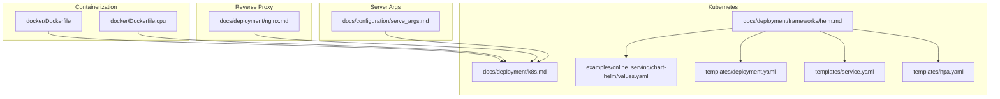
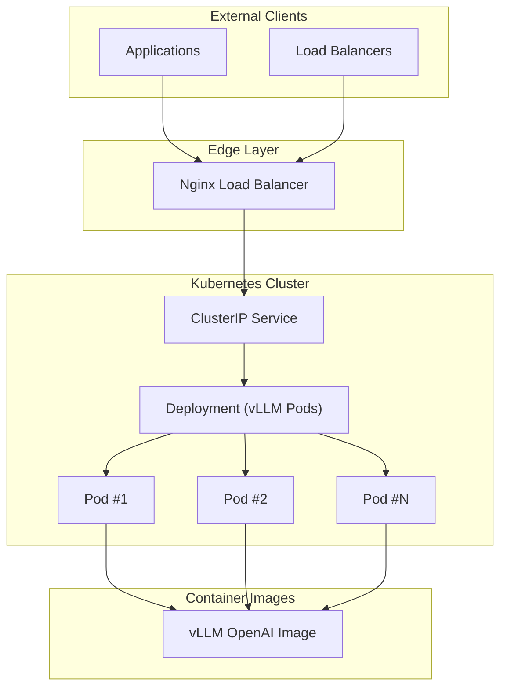
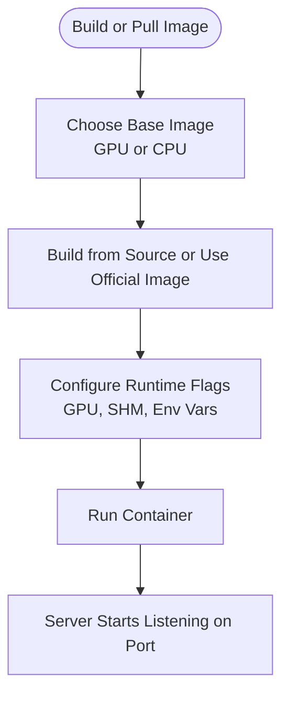
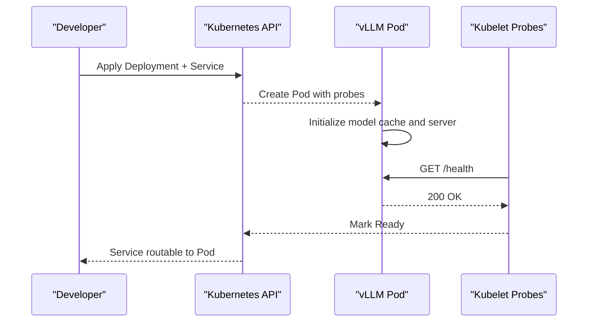
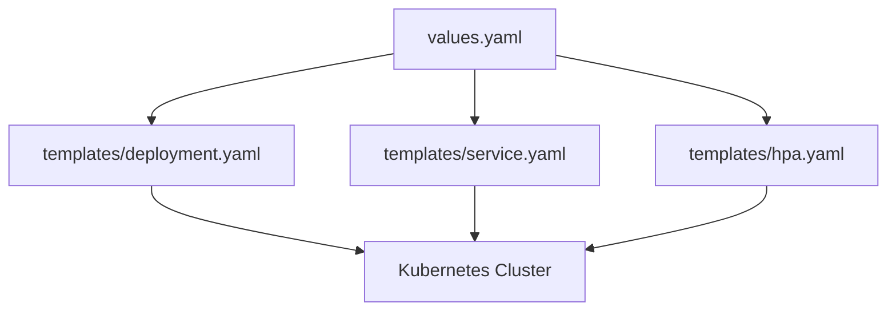
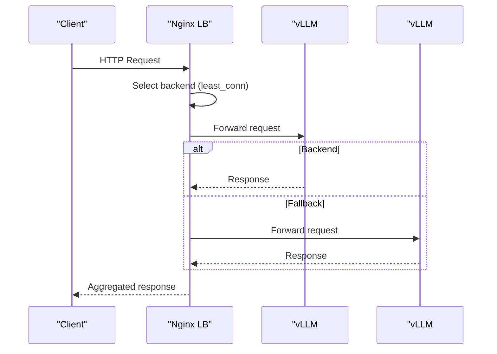
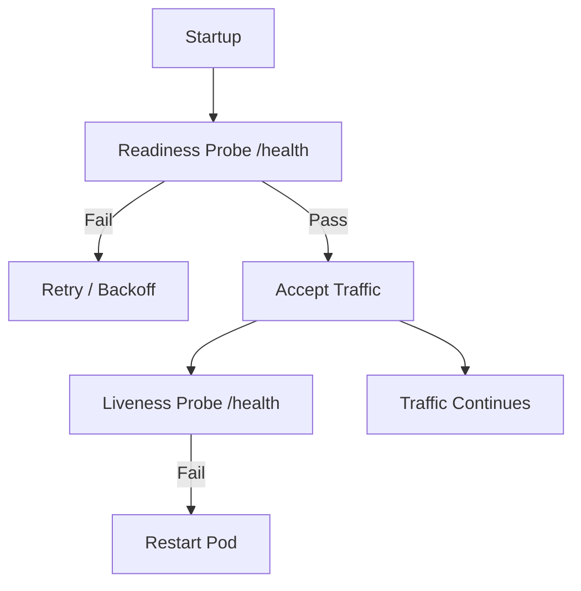
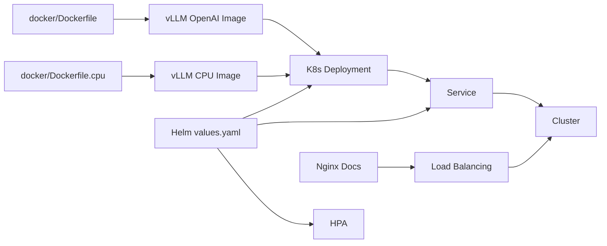

# API Server Deployment

<cite>
**Referenced Files in This Document**
- [docker/Dockerfile](file://docker/Dockerfile)
- [docker/Dockerfile.cpu](file://docker/Dockerfile.cpu)
- [docs/deployment/docker.md](file://docs/deployment/docker.md)
- [docs/deployment/k8s.md](file://docs/deployment/k8s.md)
- [docs/deployment/nginx.md](file://docs/deployment/nginx.md)
- [docs/deployment/frameworks/helm.md](file://docs/deployment/frameworks/helm.md)
- [examples/online_serving/chart-helm/values.yaml](file://examples/online_serving/chart-helm/values.yaml)
- [examples/online_serving/chart-helm/templates/deployment.yaml](file://examples/online_serving/chart-helm/templates/deployment.yaml)
- [examples/online_serving/chart-helm/templates/service.yaml](file://examples/online_serving/chart-helm/templates/service.yaml)
- [examples/online_serving/chart-helm/templates/hpa.yaml](file://examples/online_serving/chart-helm/templates/hpa.yaml)
- [docs/configuration/serve_args.md](file://docs/configuration/serve_args.md)
</cite>

## Table of Contents
1. [Introduction](#introduction)
2. [Project Structure](#project-structure)
3. [Core Components](#core-components)
4. [Architecture Overview](#architecture-overview)
5. [Detailed Component Analysis](#detailed-component-analysis)
6. [Dependency Analysis](#dependency-analysis)
7. [Performance Considerations](#performance-considerations)
8. [Troubleshooting Guide](#troubleshooting-guide)
9. [Conclusion](#conclusion)
10. [Appendices](#appendices)

## Introduction
This document provides comprehensive deployment guidance for the vLLM OpenAI-compatible API server across containerized environments, Kubernetes, and cloud platforms. It covers production-grade configuration options including resource allocation, scaling strategies, monitoring, load balancing, reverse proxy configuration with Nginx, and SSL/TLS termination. It also documents health checks, graceful shutdown procedures, and failover mechanisms, along with practical deployment patterns for development, staging, and production environments.

## Project Structure
The repository includes official deployment documentation and example Helm charts for Kubernetes, Dockerfiles for containerization, and guidance for Nginx-based load balancing. The following diagram maps the primary deployment assets used for production deployments.

**Diagram sources**
- [docker/Dockerfile](file://docker/Dockerfile#L608-L640)
- [docker/Dockerfile.cpu](file://docker/Dockerfile.cpu#L194-L204)
- [docs/deployment/k8s.md](file://docs/deployment/k8s.md#L1-L398)
- [docs/deployment/frameworks/helm.md](file://docs/deployment/frameworks/helm.md#L1-L140)
- [examples/online_serving/chart-helm/values.yaml](file://examples/online_serving/chart-helm/values.yaml#L1-L175)
- [examples/online_serving/chart-helm/templates/deployment.yaml](file://examples/online_serving/chart-helm/templates/deployment.yaml#L1-L131)
- [examples/online_serving/chart-helm/templates/service.yaml](file://examples/online_serving/chart-helm/templates/service.yaml#L1-L14)
- [examples/online_serving/chart-helm/templates/hpa.yaml](file://examples/online_serving/chart-helm/templates/hpa.yaml#L1-L31)
- [docs/deployment/nginx.md](file://docs/deployment/nginx.md#L1-L138)
- [docs/configuration/serve_args.md](file://docs/configuration/serve_args.md#L1-L36)

**Section sources**
- [docker/Dockerfile](file://docker/Dockerfile#L608-L640)
- [docker/Dockerfile.cpu](file://docker/Dockerfile.cpu#L194-L204)
- [docs/deployment/k8s.md](file://docs/deployment/k8s.md#L1-L398)
- [docs/deployment/frameworks/helm.md](file://docs/deployment/frameworks/helm.md#L1-L140)
- [examples/online_serving/chart-helm/values.yaml](file://examples/online_serving/chart-helm/values.yaml#L1-L175)
- [examples/online_serving/chart-helm/templates/deployment.yaml](file://examples/online_serving/chart-helm/templates/deployment.yaml#L1-L131)
- [examples/online_serving/chart-helm/templates/service.yaml](file://examples/online_serving/chart-helm/templates/service.yaml#L1-L14)
- [examples/online_serving/chart-helm/templates/hpa.yaml](file://examples/online_serving/chart-helm/templates/hpa.yaml#L1-L31)
- [docs/deployment/nginx.md](file://docs/deployment/nginx.md#L1-L138)
- [docs/configuration/serve_args.md](file://docs/configuration/serve_args.md#L1-L36)

## Core Components
- OpenAI-compatible API server entrypoint: The container images define the server command that launches the OpenAI-compatible API server.
- Kubernetes Deployment and Service: Manifest templates demonstrate how to deploy the server with probes, GPU scheduling, and optional autoscaling.
- Helm chart: Provides a reusable, configurable chart for deploying vLLM with model download init containers, PVC-backed storage, and HPA.
- Nginx reverse proxy: Guidance for load balancing multiple vLLM instances behind Nginx.
- Server arguments and configuration: Options for configuring the server via CLI or YAML configuration files.

**Section sources**
- [docker/Dockerfile](file://docker/Dockerfile#L608-L640)
- [examples/online_serving/chart-helm/templates/deployment.yaml](file://examples/online_serving/chart-helm/templates/deployment.yaml#L1-L131)
- [examples/online_serving/chart-helm/templates/service.yaml](file://examples/online_serving/chart-helm/templates/service.yaml#L1-L14)
- [examples/online_serving/chart-helm/templates/hpa.yaml](file://examples/online_serving/chart-helm/templates/hpa.yaml#L1-L31)
- [docs/deployment/nginx.md](file://docs/deployment/nginx.md#L1-L138)
- [docs/configuration/serve_args.md](file://docs/configuration/serve_args.md#L1-L36)

## Architecture Overview
The following architecture diagram shows production deployment patterns across containerization, Kubernetes, and reverse proxy layers.

**Diagram sources**
- [docs/deployment/nginx.md](file://docs/deployment/nginx.md#L1-L138)
- [examples/online_serving/chart-helm/templates/service.yaml](file://examples/online_serving/chart-helm/templates/service.yaml#L1-L14)
- [examples/online_serving/chart-helm/templates/deployment.yaml](file://examples/online_serving/chart-helm/templates/deployment.yaml#L1-L131)
- [docker/Dockerfile](file://docker/Dockerfile#L608-L640)

## Detailed Component Analysis

### Containerized Deployment with Docker
- Official image: The image defines the server entrypoint to launch the OpenAI-compatible API server.
- GPU and IPC considerations: Shared memory and GPU access are configured via container flags.
- Custom builds: The Dockerfile supports building from source, cross-compilation for ARM64, and optional extras.
- CPU-only image: Separate Dockerfile targets CPU-based deployments.

**Diagram sources**
- [docker/Dockerfile](file://docker/Dockerfile#L608-L640)
- [docker/Dockerfile.cpu](file://docker/Dockerfile.cpu#L194-L204)
- [docs/deployment/docker.md](file://docs/deployment/docker.md#L1-L153)

**Section sources**
- [docker/Dockerfile](file://docker/Dockerfile#L608-L640)
- [docker/Dockerfile.cpu](file://docker/Dockerfile.cpu#L194-L204)
- [docs/deployment/docker.md](file://docs/deployment/docker.md#L1-L153)

### Kubernetes Deployment
- CPU-only and GPU-enabled deployments: Demonstrates PVC, SHM, GPU scheduling, and probes.
- Health checks: Liveness and readiness probes use the server’s health endpoint.
- Service exposure: ClusterIP service exposes the API port.
- Troubleshooting: Startup/readiness probe thresholds and model download considerations.

**Diagram sources**
- [docs/deployment/k8s.md](file://docs/deployment/k8s.md#L1-L398)
- [examples/online_serving/chart-helm/values.yaml](file://examples/online_serving/chart-helm/values.yaml#L140-L171)

**Section sources**
- [docs/deployment/k8s.md](file://docs/deployment/k8s.md#L1-L398)
- [examples/online_serving/chart-helm/values.yaml](file://examples/online_serving/chart-helm/values.yaml#L1-L175)
- [examples/online_serving/chart-helm/templates/deployment.yaml](file://examples/online_serving/chart-helm/templates/deployment.yaml#L1-L131)
- [examples/online_serving/chart-helm/templates/service.yaml](file://examples/online_serving/chart-helm/templates/service.yaml#L1-L14)

### Helm Chart for Kubernetes
- Reusable chart: Values define image, replicas, resources, autoscaling, probes, and optional model download init containers.
- PVC-backed model storage: Supports S3-backed model download with init containers and a wait job.
- HPA: HorizontalPodAutoscaler configured via values.

**Diagram sources**
- [docs/deployment/frameworks/helm.md](file://docs/deployment/frameworks/helm.md#L1-L140)
- [examples/online_serving/chart-helm/values.yaml](file://examples/online_serving/chart-helm/values.yaml#L1-L175)
- [examples/online_serving/chart-helm/templates/deployment.yaml](file://examples/online_serving/chart-helm/templates/deployment.yaml#L1-L131)
- [examples/online_serving/chart-helm/templates/service.yaml](file://examples/online_serving/chart-helm/templates/service.yaml#L1-L14)
- [examples/online_serving/chart-helm/templates/hpa.yaml](file://examples/online_serving/chart-helm/templates/hpa.yaml#L1-L31)

**Section sources**
- [docs/deployment/frameworks/helm.md](file://docs/deployment/frameworks/helm.md#L1-L140)
- [examples/online_serving/chart-helm/values.yaml](file://examples/online_serving/chart-helm/values.yaml#L1-L175)
- [examples/online_serving/chart-helm/templates/deployment.yaml](file://examples/online_serving/chart-helm/templates/deployment.yaml#L1-L131)
- [examples/online_serving/chart-helm/templates/service.yaml](file://examples/online_serving/chart-helm/templates/service.yaml#L1-L14)
- [examples/online_serving/chart-helm/templates/hpa.yaml](file://examples/online_serving/chart-helm/templates/hpa.yaml#L1-L31)

### Reverse Proxy with Nginx
- Multi-instance load balancing: Nginx upstream balances traffic across multiple vLLM containers.
- Proxy headers: Standard headers forwarded for client IP and protocol.
- Container networking: Docker networks isolate and connect proxy and backend servers.

**Diagram sources**
- [docs/deployment/nginx.md](file://docs/deployment/nginx.md#L1-L138)

**Section sources**
- [docs/deployment/nginx.md](file://docs/deployment/nginx.md#L1-L138)

### Production Configuration Options
- Resource allocation: CPU and GPU requests/limits are defined in Kubernetes manifests and Helm values.
- Scaling strategies: HorizontalPodAutoscaler and replica count tuning.
- Monitoring: Probes and health endpoints integrated with Kubernetes.
- Model storage: PVC-backed cache or init containers for model download.
- Networking: ClusterIP service and optional external load balancers.

**Section sources**
- [examples/online_serving/chart-helm/values.yaml](file://examples/online_serving/chart-helm/values.yaml#L28-L44)
- [examples/online_serving/chart-helm/values.yaml](file://examples/online_serving/chart-helm/values.yaml#L49-L60)
- [examples/online_serving/chart-helm/templates/hpa.yaml](file://examples/online_serving/chart-helm/templates/hpa.yaml#L1-L31)
- [examples/online_serving/chart-helm/templates/deployment.yaml](file://examples/online_serving/chart-helm/templates/deployment.yaml#L110-L131)
- [docs/deployment/k8s.md](file://docs/deployment/k8s.md#L237-L249)

### Health Checks and Failover
- Health endpoint: The server exposes a health endpoint used by Kubernetes probes.
- Failover: Nginx upstream failover and fail timeouts ensure resilience.
- Graceful shutdown: The server handles signals for controlled termination.

**Diagram sources**
- [examples/online_serving/chart-helm/values.yaml](file://examples/online_serving/chart-helm/values.yaml#L142-L171)
- [docs/deployment/nginx.md](file://docs/deployment/nginx.md#L30-L51)

**Section sources**
- [examples/online_serving/chart-helm/values.yaml](file://examples/online_serving/chart-helm/values.yaml#L142-L171)
- [docs/deployment/nginx.md](file://docs/deployment/nginx.md#L30-L51)

### Load Balancing and Reverse Proxy Configuration
- Nginx upstream configuration: least_conn balancing across multiple vLLM instances.
- Proxy headers: Host, real IP, forwarded headers, and scheme.
- Docker networking: Isolated bridge network for proxy and backend containers.

**Section sources**
- [docs/deployment/nginx.md](file://docs/deployment/nginx.md#L28-L51)
- [docs/deployment/nginx.md](file://docs/deployment/nginx.md#L70-L125)

### SSL/TLS Termination
- Edge termination: Place a TLS-capable reverse proxy or ingress controller in front of the API server to terminate TLS and forward plaintext to the server.
- Certificate management: Use managed certificates or ACME automation via the ingress controller or external cert-manager.
- Security headers: Enforce secure headers and redirect HTTP to HTTPS at the edge.

[No sources needed since this section provides general guidance]

### Cloud Platform Deployments
- AWS: Use EKS with GPU-enabled node groups, IAM roles, and ALB/NLB for ingress.
- GCP: Use GKE with accelerator nodes, workload identity, and GCLB.
- Azure: Use AKS with NC/ND series VMs, managed identities, and Azure Load Balancer.
- Observability: Integrate with platform-native monitoring and logging.

[No sources needed since this section provides general guidance]

### Deployment Patterns Across Environments
- Development: Single-replica deployments with ephemeral storage and local caches.
- Staging: Moderate replicas with PVC-backed model cache and autoscaling disabled.
- Production: Multiple replicas, HPA, persistent model storage, strict probes, and blue/green or rolling updates.

[No sources needed since this section provides general guidance]

## Dependency Analysis
The following diagram highlights the relationships among the primary deployment assets.

**Diagram sources**
- [docker/Dockerfile](file://docker/Dockerfile#L608-L640)
- [docker/Dockerfile.cpu](file://docker/Dockerfile.cpu#L194-L204)
- [examples/online_serving/chart-helm/values.yaml](file://examples/online_serving/chart-helm/values.yaml#L1-L175)
- [examples/online_serving/chart-helm/templates/deployment.yaml](file://examples/online_serving/chart-helm/templates/deployment.yaml#L1-L131)
- [examples/online_serving/chart-helm/templates/service.yaml](file://examples/online_serving/chart-helm/templates/service.yaml#L1-L14)
- [examples/online_serving/chart-helm/templates/hpa.yaml](file://examples/online_serving/chart-helm/templates/hpa.yaml#L1-L31)
- [docs/deployment/nginx.md](file://docs/deployment/nginx.md#L1-L138)

**Section sources**
- [docker/Dockerfile](file://docker/Dockerfile#L608-L640)
- [docker/Dockerfile.cpu](file://docker/Dockerfile.cpu#L194-L204)
- [examples/online_serving/chart-helm/values.yaml](file://examples/online_serving/chart-helm/values.yaml#L1-L175)
- [examples/online_serving/chart-helm/templates/deployment.yaml](file://examples/online_serving/chart-helm/templates/deployment.yaml#L1-L131)
- [examples/online_serving/chart-helm/templates/service.yaml](file://examples/online_serving/chart-helm/templates/service.yaml#L1-L14)
- [examples/online_serving/chart-helm/templates/hpa.yaml](file://examples/online_serving/chart-helm/templates/hpa.yaml#L1-L31)
- [docs/deployment/nginx.md](file://docs/deployment/nginx.md#L1-L138)

## Performance Considerations
- GPU scheduling: Ensure node selectors and runtime class align with GPU vendors.
- Shared memory: Allocate sufficient SHM (/dev/shm) for tensor parallel inference.
- Probes: Tune initial delays and periods to match cold-start characteristics.
- Autoscaling: Set appropriate CPU/memory targets and min/max replicas for traffic patterns.
- Model caching: Persist model cache via PVC or init containers to reduce cold starts.

[No sources needed since this section provides general guidance]

## Troubleshooting Guide
- Startup/Readiness probe failures: Increase thresholds or adjust model download strategy.
- Health endpoint: Use the server’s health endpoint for probe configuration.
- Graceful shutdown: Ensure signals are propagated to the server process.

**Section sources**
- [docs/deployment/k8s.md](file://docs/deployment/k8s.md#L384-L398)
- [examples/online_serving/chart-helm/values.yaml](file://examples/online_serving/chart-helm/values.yaml#L142-L171)

## Conclusion
This guide consolidates production-ready deployment practices for the vLLM API server across Docker, Kubernetes, and cloud platforms. By leveraging the provided Dockerfiles, Helm chart, and Nginx configuration, teams can achieve scalable, observable, and resilient serving infrastructures tailored to development, staging, and production environments.

## Appendices
- Server arguments and configuration: Use CLI or YAML configuration files to tune server behavior.
- Example manifests and values: Refer to the Helm chart templates and Kubernetes documentation for concrete configurations.

**Section sources**
- [docs/configuration/serve_args.md](file://docs/configuration/serve_args.md#L1-L36)
- [examples/online_serving/chart-helm/values.yaml](file://examples/online_serving/chart-helm/values.yaml#L1-L175)
- [examples/online_serving/chart-helm/templates/deployment.yaml](file://examples/online_serving/chart-helm/templates/deployment.yaml#L1-L131)
- [examples/online_serving/chart-helm/templates/service.yaml](file://examples/online_serving/chart-helm/templates/service.yaml#L1-L14)
- [examples/online_serving/chart-helm/templates/hpa.yaml](file://examples/online_serving/chart-helm/templates/hpa.yaml#L1-L31)