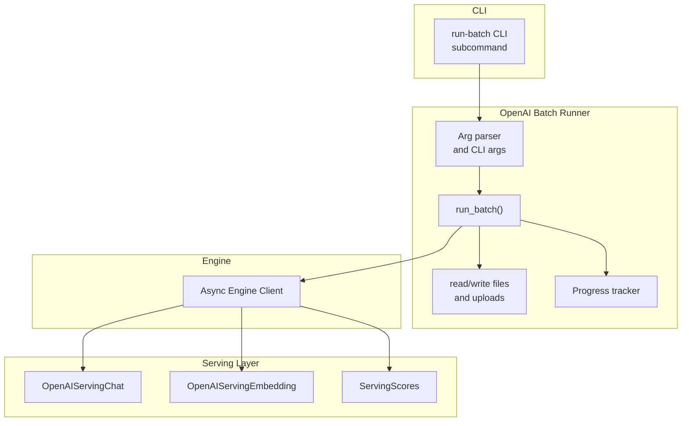
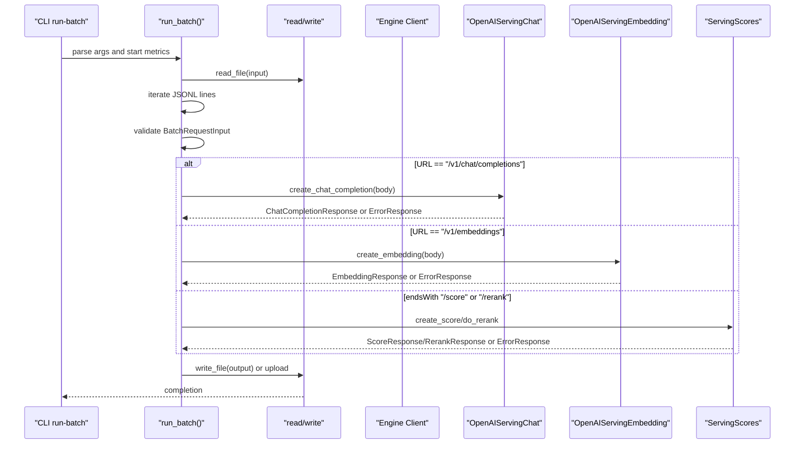
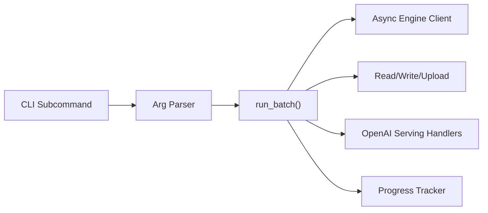
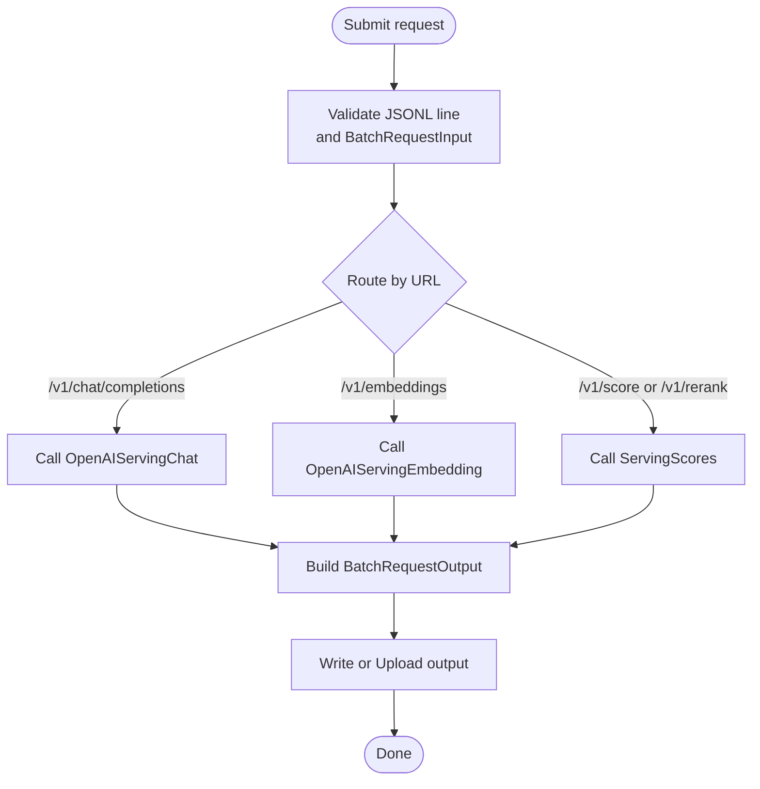

# Batch Processing

<cite>
**Referenced Files in This Document**
- [run-batch.md](file://docs/cli/run-batch.md)
- [run_batch.py](file://vllm/entrypoints/openai/run_batch.py)
- [run_batch.py](file://vllm/entrypoints/cli/run_batch.py)
- [openai_example_batch.jsonl](file://examples/offline_inference/openai_batch/openai_example_batch.jsonl)
- [README.md](file://examples/offline_inference/openai_batch/README.md)
- [batch_llm_inference.py](file://examples/offline_inference/batch_llm_inference.py)
</cite>

## Table of Contents
1. [Introduction](#introduction)
2. [Project Structure](#project-structure)
3. [Core Components](#core-components)
4. [Architecture Overview](#architecture-overview)
5. [Detailed Component Analysis](#detailed-component-analysis)
6. [Dependency Analysis](#dependency-analysis)
7. [Performance Considerations](#performance-considerations)
8. [Troubleshooting Guide](#troubleshooting-guide)
9. [Conclusion](#conclusion)
10. [Appendices](#appendices)

## Introduction
This document explains vLLM’s batch processing capabilities using the run-batch command and batch inference workflows. It covers input file formats, request routing and batching strategies, output handling, and operational guidance for large-scale offline inference. It also provides examples for text generation, embeddings, and evaluation tasks, along with error handling, retry mechanisms, progress tracking, and performance tuning tips.

## Project Structure
The batch processing feature is exposed via the CLI subcommand “run-batch” and implemented in the OpenAI-compatible batch runner. Supporting materials include example batch files and a Ray Data integration example for distributed, chunked batch inference.

**Diagram sources**
- [run_batch.py](file://vllm/entrypoints/openai/run_batch.py#L126-L201)
- [run_batch.py](file://vllm/entrypoints/openai/run_batch.py#L431-L601)
- [run_batch.py](file://vllm/entrypoints/cli/run_batch.py#L21-L64)

**Section sources**
- [run-batch.md](file://docs/cli/run-batch.md#L1-L10)
- [run_batch.py](file://vllm/entrypoints/openai/run_batch.py#L126-L201)
- [run_batch.py](file://vllm/entrypoints/cli/run_batch.py#L21-L64)

## Core Components
- CLI subcommand: The “run-batch” subcommand initializes argument parsing, sets up metrics, and delegates to the OpenAI batch runner.
- OpenAI batch runner: Reads a JSONL input file, validates each line as a batch request, routes to the appropriate OpenAI-compatible handler, collects results, and writes outputs locally or uploads via HTTP(S).
- Progress tracking: A lightweight progress bar tracks submitted and completed requests.
- Output format: Each line in the output JSONL corresponds to a BatchRequestOutput with status, request ID, and either a successful response body or an error object.

Key responsibilities:
- Input validation and routing by URL path
- Async submission of all requests concurrently
- Structured output emission per request
- Retry and upload logic for remote outputs

**Section sources**
- [run_batch.py](file://vllm/entrypoints/openai/run_batch.py#L126-L201)
- [run_batch.py](file://vllm/entrypoints/openai/run_batch.py#L216-L241)
- [run_batch.py](file://vllm/entrypoints/openai/run_batch.py#L243-L359)
- [run_batch.py](file://vllm/entrypoints/openai/run_batch.py#L361-L418)
- [run_batch.py](file://vllm/entrypoints/openai/run_batch.py#L431-L601)
- [run_batch.py](file://vllm/entrypoints/cli/run_batch.py#L21-L64)

## Architecture Overview
The run-batch pipeline reads a JSONL file, parses each line into a BatchRequestInput, determines the target endpoint (/v1/chat/completions, /v1/embeddings, /v1/score, /v1/rerank), invokes the corresponding OpenAI-compatible handler, and aggregates results into BatchRequestOutput lines.

**Diagram sources**
- [run_batch.py](file://vllm/entrypoints/openai/run_batch.py#L431-L601)
- [run_batch.py](file://vllm/entrypoints/openai/run_batch.py#L243-L359)

## Detailed Component Analysis

### Input File Formats
- Format: JSONL (one JSON object per line).
- Each line is validated as BatchRequestInput with fields:
  - custom_id: unique per-request ID used to correlate outputs to inputs
  - method: HTTP method (only POST supported)
  - url: target endpoint (supported: /v1/chat/completions, /v1/embeddings, /v1/score, /v1/rerank)
  - body: request payload matching the endpoint type
- Validation ensures the body conforms to the expected request model for the given URL.

Supported endpoints and payloads:
- Chat completions: body matches ChatCompletionRequest
- Embeddings: body matches EmbeddingRequest
- Score: body matches ScoreRequest
- Rerank: body matches RerankRequest

Example input file is provided in the repository.

**Section sources**
- [run_batch.py](file://vllm/entrypoints/openai/run_batch.py#L53-L125)
- [openai_example_batch.jsonl](file://examples/offline_inference/openai_batch/openai_example_batch.jsonl#L1-L3)
- [README.md](file://examples/offline_inference/openai_batch/README.md#L7-L17)

### Request Routing and Batching Strategies
- Concurrency: All requests from the input file are submitted concurrently via asyncio.gather. There is no explicit intra-run batching among requests; the engine handles internal scheduling and batching.
- Endpoint-specific routing: The runner selects the appropriate handler based on the URL path.
- Supported tasks discovery: The runner queries supported tasks from the engine (generate, embed, classify) to conditionally instantiate handlers.

Operational implications:
- Large input files scale by submitting all lines concurrently; throughput depends on engine capacity and model configuration.
- For continuous batching and GPU utilization, consider enabling chunked prefill and tuning max_num_batched_tokens and max_model_len.

**Section sources**
- [run_batch.py](file://vllm/entrypoints/openai/run_batch.py#L431-L601)

### Output Handling Mechanisms
- Output format: JSONL where each line is a BatchRequestOutput containing:
  - id: unique runner-generated ID
  - custom_id: copied from input
  - response: includes status_code, request_id, and body (when successful)
  - error: populated with error details when applicable
- Writing modes:
  - Local file: opened and written line-by-line
  - Remote upload: optionally buffered in-memory or written to a temp file and uploaded via HTTP PUT
- Retry and timeout:
  - Uploads use retries with exponential-like delay and increased timeout for large outputs.

Progress tracking:
- A progress bar counts submitted and completed requests; it is disabled in non-zero ranks when distributed.

**Section sources**
- [run_batch.py](file://vllm/entrypoints/openai/run_batch.py#L91-L125)
- [run_batch.py](file://vllm/entrypoints/openai/run_batch.py#L243-L359)
- [run_batch.py](file://vllm/entrypoints/openai/run_batch.py#L216-L241)

### CLI and Configuration
- CLI entrypoints:
  - Python module invocation: python -m vllm.entrypoints.openai.run_batch
  - Command alias: vllm run-batch
- Key arguments:
  - -i/--input-file: local path or HTTP(S) URL
  - -o/--output-file: local path or HTTP(S) URL
  - --output-tmp-dir: optional temp directory for uploads
  - --response-role: role name returned when adding a generation prompt
  - AsyncEngineArgs: engine configuration (e.g., model, tensor parallelism, max tokens)
  - Metrics: --enable-metrics, --url, --port
  - Usage details: --enable-prompt-tokens-details, --enable-force-include-usage
- Argument parsing and CLI wiring are handled by the CLI subcommand and the runner.

**Section sources**
- [run_batch.py](file://vllm/entrypoints/openai/run_batch.py#L126-L201)
- [run_batch.py](file://vllm/entrypoints/cli/run_batch.py#L21-L64)
- [run-batch.md](file://docs/cli/run-batch.md#L1-L10)

### Examples and Workflows

#### Text Generation (Chat Completions)
- Prepare a JSONL with multiple /v1/chat/completions entries.
- Run with vllm run-batch pointing to the input and output files.
- Results include choices, finish reasons, and usage.

**Section sources**
- [README.md](file://examples/offline_inference/openai_batch/README.md#L26-L75)
- [openai_example_batch.jsonl](file://examples/offline_inference/openai_batch/openai_example_batch.jsonl#L1-L3)

#### Embeddings
- Add /v1/embeddings entries to the JSONL.
- Run the same command; outputs include embedding vectors and usage.

**Section sources**
- [README.md](file://examples/offline_inference/openai_batch/README.md#L216-L246)

#### Evaluation Tasks (Score/Rerank)
- Add /v1/score or /v1/rerank entries to the JSONL.
- Run the same command; outputs include scores or reranked results.

**Section sources**
- [README.md](file://examples/offline_inference/openai_batch/README.md#L247-L277)

#### Large-Scale Inference with Ray Data
- Use Ray Data’s vLLM integration to stream and shard large datasets, configure batch sizes, and scale replicas.
- Enables continuous batching, chunked prefill, and cloud storage I/O.

**Section sources**
- [batch_llm_inference.py](file://examples/offline_inference/batch_llm_inference.py#L1-L94)

## Dependency Analysis
The run-batch command depends on:
- CLI subcommand wiring
- Async engine client for request execution
- OpenAI-compatible serving classes for routing
- Async I/O for reading/writing and uploading
- Progress tracking and metrics

**Diagram sources**
- [run_batch.py](file://vllm/entrypoints/openai/run_batch.py#L431-L601)
- [run_batch.py](file://vllm/entrypoints/cli/run_batch.py#L21-L64)

**Section sources**
- [run_batch.py](file://vllm/entrypoints/openai/run_batch.py#L431-L601)
- [run_batch.py](file://vllm/entrypoints/cli/run_batch.py#L21-L64)

## Performance Considerations
- Continuous batching and chunked prefill:
  - Enable chunked prefill and tune max_num_batched_tokens and max_model_len to keep the engine saturated and improve throughput.
- Model and engine sizing:
  - Adjust tensor parallelism and other AsyncEngineArgs to match workload characteristics.
- I/O and uploads:
  - For large outputs, use --output-tmp-dir to write to disk before uploading to remote URLs.
- Memory usage:
  - Tune max_model_len and max_num_batched_tokens to fit GPU memory constraints; monitor usage via metrics if enabled.
- Distributed environments:
  - Progress tracking is rank-aware; the progress bar is suppressed on non-root ranks to avoid noisy logs.

[No sources needed since this section provides general guidance]

## Troubleshooting Guide
Common issues and remedies:
- Unsupported URL or missing model capability:
  - The runner checks supported tasks and returns an error response if the requested endpoint is not available for the model.
- Stream mode errors:
  - Requests must not be sent in stream mode; otherwise, an error response is produced.
- Upload failures:
  - Uploads retry up to a fixed number of attempts with delays and extended timeouts; verify network connectivity and remote URL permissions.
- Input validation errors:
  - Ensure each line is valid JSON and matches the expected request model for the given URL.

**Section sources**
- [run_batch.py](file://vllm/entrypoints/openai/run_batch.py#L517-L596)
- [run_batch.py](file://vllm/entrypoints/openai/run_batch.py#L382-L418)
- [run_batch.py](file://vllm/entrypoints/openai/run_batch.py#L267-L318)

## Conclusion
vLLM’s run-batch provides a robust, OpenAI-compatible batch processing workflow for offline inference. It supports multiple endpoints, asynchronous execution, structured outputs, and flexible I/O (local and HTTP(S)). By combining the run-batch runner with engine configuration and Ray Data streaming, users can scale large workloads efficiently while tracking progress and handling errors gracefully.

[No sources needed since this section summarizes without analyzing specific files]

## Appendices

### Appendix A: End-to-End Flow for a Single Request

**Diagram sources**
- [run_batch.py](file://vllm/entrypoints/openai/run_batch.py#L517-L596)
- [run_batch.py](file://vllm/entrypoints/openai/run_batch.py#L361-L418)
- [run_batch.py](file://vllm/entrypoints/openai/run_batch.py#L243-L359)