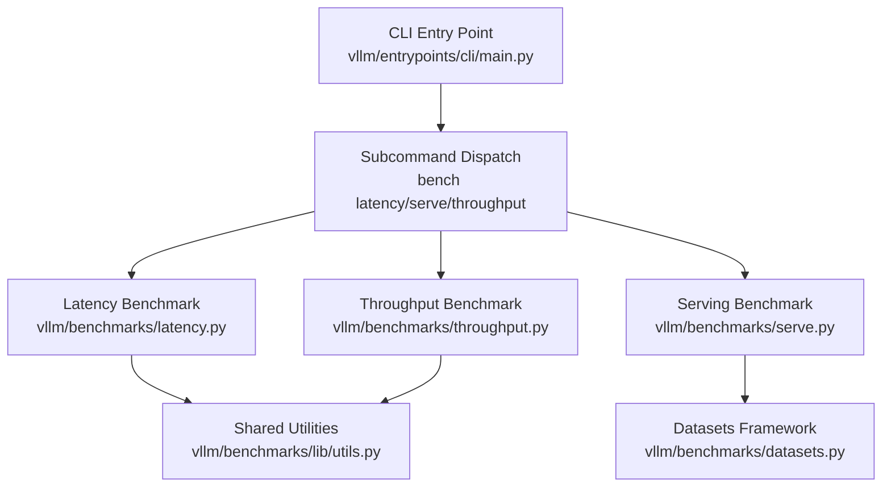
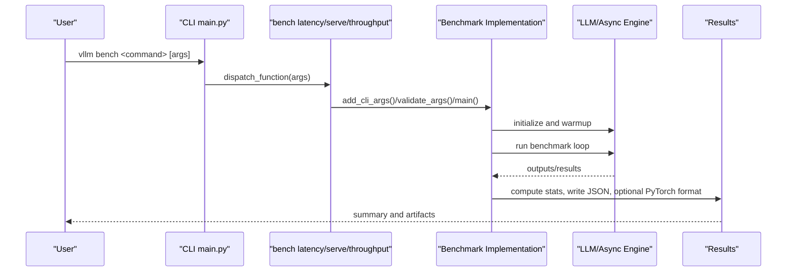
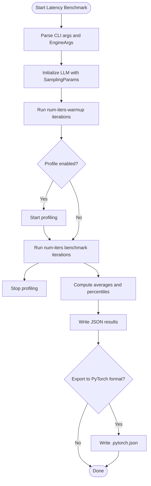
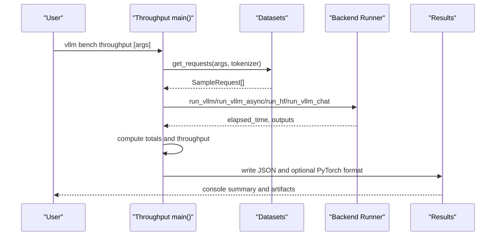
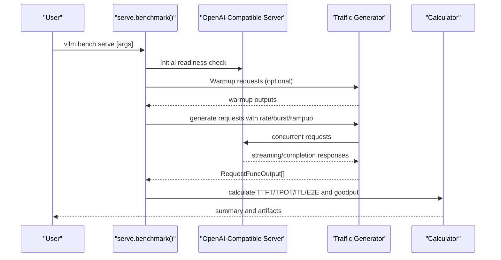
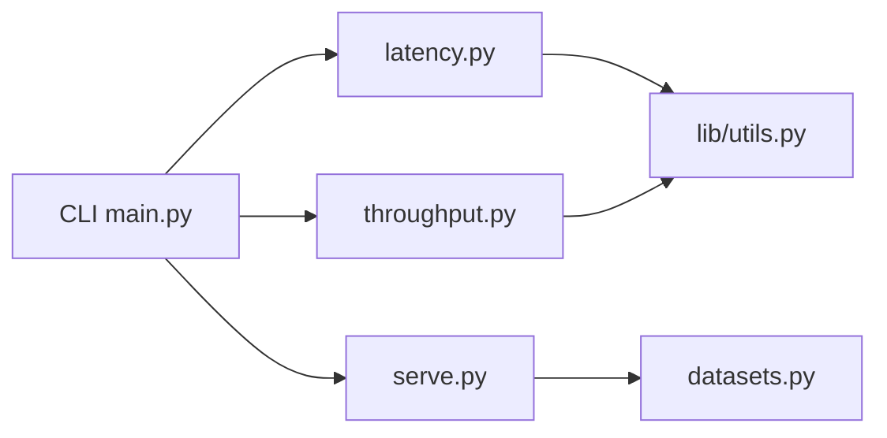

# Benchmark Commands

<cite>
**Referenced Files in This Document**
- [benchmarks/README.md](file://benchmarks/README.md)
- [benchmarks/benchmark_latency.py](file://benchmarks/benchmark_latency.py)
- [benchmarks/benchmark_throughput.py](file://benchmarks/benchmark_throughput.py)
- [benchmarks/benchmark_serving.py](file://benchmarks/benchmark_serving.py)
- [vllm/benchmarks/latency.py](file://vllm/benchmarks/latency.py)
- [vllm/benchmarks/throughput.py](file://vllm/benchmarks/throughput.py)
- [vllm/benchmarks/serve.py](file://vllm/benchmarks/serve.py)
- [vllm/benchmarks/datasets.py](file://vllm/benchmarks/datasets.py)
- [vllm/benchmarks/lib/utils.py](file://vllm/benchmarks/lib/utils.py)
- [vllm/entrypoints/cli/main.py](file://vllm/entrypoints/cli/main.py)
- [docs/cli/bench/latency.md](file://docs/cli/bench/latency.md)
- [docs/cli/bench/serve.md](file://docs/cli/bench/serve.md)
- [docs/cli/bench/throughput.md](file://docs/cli/bench/throughput.md)
</cite>

## Table of Contents
1. [Introduction](#introduction)
2. [Project Structure](#project-structure)
3. [Core Components](#core-components)
4. [Architecture Overview](#architecture-overview)
5. [Detailed Component Analysis](#detailed-component-analysis)
6. [Dependency Analysis](#dependency-analysis)
7. [Performance Considerations](#performance-considerations)
8. [Troubleshooting Guide](#troubleshooting-guide)
9. [Conclusion](#conclusion)
10. [Appendices](#appendices)

## Introduction
This document describes vLLM’s benchmarking command suite for measuring latency, throughput, and serving performance. It explains how to run each benchmark, what arguments are required, what outputs are produced, and how to interpret results. It also covers warm-up procedures, statistical reporting, comparison strategies across model configurations and hardware, integration with performance monitoring systems, and best practices for designing robust benchmark experiments.

## Project Structure
The benchmark commands are exposed via the vLLM CLI under the “bench” subcommands. The legacy scripts in the benchmarks/ directory are deprecated wrappers that redirect users to the CLI. The actual implementations reside in vllm/benchmarks/*.py, with shared dataset utilities and output formatting helpers.

**Diagram sources**
- [vllm/entrypoints/cli/main.py](file://vllm/entrypoints/cli/main.py#L16-L80)
- [vllm/benchmarks/latency.py](file://vllm/benchmarks/latency.py#L1-L173)
- [vllm/benchmarks/serve.py](file://vllm/benchmarks/serve.py#L1-L120)
- [vllm/benchmarks/throughput.py](file://vllm/benchmarks/throughput.py#L1-L120)
- [vllm/benchmarks/lib/utils.py](file://vllm/benchmarks/lib/utils.py#L1-L126)
- [vllm/benchmarks/datasets.py](file://vllm/benchmarks/datasets.py#L1-L200)

**Section sources**
- [benchmarks/README.md](file://benchmarks/README.md#L1-L21)
- [vllm/entrypoints/cli/main.py](file://vllm/entrypoints/cli/main.py#L16-L80)

## Core Components
- Latency benchmark: Measures single-batch end-to-end latency with configurable batch size, input/output lengths, and iteration counts. Includes warm-up and percentile reporting.
- Throughput benchmark: Measures offline batch throughput across multiple backends (vLLM, HuggingFace, MII) and datasets, with options for async engine, LoRA, and detokenization control.
- Serving benchmark: Measures online serving throughput and latency metrics (TTFT, TPOT, ITL, E2E) with traffic shaping, ramp-up, burstiness, and concurrency controls.

Each benchmark integrates with shared utilities for standardized output and optional PyTorch benchmark database export.

**Section sources**
- [vllm/benchmarks/latency.py](file://vllm/benchmarks/latency.py#L1-L173)
- [vllm/benchmarks/throughput.py](file://vllm/benchmarks/throughput.py#L1-L200)
- [vllm/benchmarks/serve.py](file://vllm/benchmarks/serve.py#L1-L120)
- [vllm/benchmarks/lib/utils.py](file://vllm/benchmarks/lib/utils.py#L1-L126)

## Architecture Overview
The CLI entrypoint initializes subcommands and routes to the appropriate benchmark module. The latency and throughput benchmarks construct an LLM engine or client, prepare synthetic or real-world requests, and compute statistics. The serving benchmark runs against a live OpenAI-compatible server, generating controlled traffic and computing detailed latency distributions.

**Diagram sources**
- [vllm/entrypoints/cli/main.py](file://vllm/entrypoints/cli/main.py#L16-L80)
- [vllm/benchmarks/latency.py](file://vllm/benchmarks/latency.py#L80-L173)
- [vllm/benchmarks/throughput.py](file://vllm/benchmarks/throughput.py#L700-L800)
- [vllm/benchmarks/serve.py](file://vllm/benchmarks/serve.py#L515-L800)

## Detailed Component Analysis

### Latency Benchmark
Purpose:
- Measure single-batch latency characteristics under controlled conditions.

Key arguments (selected):
- input-len, output-len, batch-size
- n, use-beam-search
- num-iters-warmup, num-iters
- profile, output-json
- disable-detokenize
- EngineArgs (via CLI) for model/engine configuration

Processing logic:
- Warm-up iterations are executed before measurements.
- Optional profiling is supported.
- Percentiles are computed over measured latencies.
- Results include average latency and percentile breakdown.
- Optional JSON output and PyTorch benchmark format export.

Output formats:
- Console summary (averages and percentiles)
- JSON file with raw latencies and percentiles
- Optional .pytorch.json for external benchmark databases

**Diagram sources**
- [vllm/benchmarks/latency.py](file://vllm/benchmarks/latency.py#L34-L173)

**Section sources**
- [vllm/benchmarks/latency.py](file://vllm/benchmarks/latency.py#L1-L173)
- [docs/cli/bench/latency.md](file://docs/cli/bench/latency.md#L1-L10)
- [benchmarks/benchmark_latency.py](file://benchmarks/benchmark_latency.py#L1-L18)

### Throughput Benchmark
Purpose:
- Measure offline batch throughput across multiple backends and datasets.

Key arguments (selected):
- backend: vllm, hf, mii, vllm-chat
- dataset-name, dataset-path, input-len, output-len, num-prompts
- hf-max-batch-size, async-engine, disable-frontend-multiprocessing, disable-detokenize
- lora-path, prefix-len, random-range-ratio
- hf-subset, hf-split
- profile
- prefix repetition dataset options

Processing logic:
- Validates backend and dataset compatibility.
- Samples requests from chosen dataset(s).
- Executes generation via LLM.generate or async engine, or HF/MII backends.
- Computes throughput metrics and token counts.
- Supports LoRA and multimodal scenarios with appropriate warnings.

Output formats:
- Console summary (requests/s, total tokens/s, output tokens/s)
- JSON file with elapsed time, counts, and throughput metrics
- Optional .pytorch.json for external benchmark databases

**Diagram sources**
- [vllm/benchmarks/throughput.py](file://vllm/benchmarks/throughput.py#L334-L800)

**Section sources**
- [vllm/benchmarks/throughput.py](file://vllm/benchmarks/throughput.py#L1-L800)
- [vllm/benchmarks/datasets.py](file://vllm/benchmarks/datasets.py#L1-L200)
- [docs/cli/bench/throughput.md](file://docs/cli/bench/throughput.md#L1-L10)
- [benchmarks/benchmark_throughput.py](file://benchmarks/benchmark_throughput.py#L1-L18)

### Serving Benchmark
Purpose:
- Measure online serving performance with realistic traffic patterns.

Key arguments (selected):
- backend, label, model, dataset-name, input-len, output-len, request-rate
- num-prompts, burstiness, ramp-up options, max-concurrency
- num-warmups, profile, ignore-eos, goodput thresholds
- LoRA modules, extra headers/body, ready-check timeout

Processing logic:
- Validates endpoint readiness via initial test request.
- Applies optional warmup phase.
- Generates requests with Poisson or gamma-distributed inter-arrival times, optionally with ramp-up.
- Enforces concurrency limits if configured.
- Computes detailed latency metrics (TTFT, TPOT, ITL, E2EL) and goodput rates.
- Produces peak output tokens per second and concurrent requests.

Output formats:
- Console summary with counts and throughput metrics
- JSON results and optional PyTorch format export

**Diagram sources**
- [vllm/benchmarks/serve.py](file://vllm/benchmarks/serve.py#L515-L800)

**Section sources**
- [vllm/benchmarks/serve.py](file://vllm/benchmarks/serve.py#L1-L800)
- [docs/cli/bench/serve.md](file://docs/cli/bench/serve.md#L1-L10)
- [benchmarks/benchmark_serving.py](file://benchmarks/benchmark_serving.py#L1-L18)

## Dependency Analysis
- CLI routing depends on the entrypoint to register and dispatch subcommands.
- Latency and throughput benchmarks depend on EngineArgs and SamplingParams to configure the engine/runtime.
- Serving benchmark depends on dataset sampling utilities and HTTP request functions compatible with OpenAI-style APIs.
- Shared utilities provide JSON serialization and optional PyTorch benchmark export.

**Diagram sources**
- [vllm/entrypoints/cli/main.py](file://vllm/entrypoints/cli/main.py#L16-L80)
- [vllm/benchmarks/latency.py](file://vllm/benchmarks/latency.py#L1-L173)
- [vllm/benchmarks/throughput.py](file://vllm/benchmarks/throughput.py#L1-L200)
- [vllm/benchmarks/serve.py](file://vllm/benchmarks/serve.py#L1-L120)
- [vllm/benchmarks/lib/utils.py](file://vllm/benchmarks/lib/utils.py#L1-L126)
- [vllm/benchmarks/datasets.py](file://vllm/benchmarks/datasets.py#L1-L200)

**Section sources**
- [vllm/entrypoints/cli/main.py](file://vllm/entrypoints/cli/main.py#L16-L80)
- [vllm/benchmarks/latency.py](file://vllm/benchmarks/latency.py#L1-L173)
- [vllm/benchmarks/throughput.py](file://vllm/benchmarks/throughput.py#L1-L200)
- [vllm/benchmarks/serve.py](file://vllm/benchmarks/serve.py#L1-L120)
- [vllm/benchmarks/lib/utils.py](file://vllm/benchmarks/lib/utils.py#L1-L126)
- [vllm/benchmarks/datasets.py](file://vllm/benchmarks/datasets.py#L1-L200)

## Performance Considerations
- Warm-up: All benchmarks support warm-up iterations to stabilize GPU/CPU caches and driver states. Use num-iters-warmup for latency and serving, and ensure sufficient iterations for convergence.
- Statistical significance: Increase num-iters for latency and num-prompts for throughput to reduce variance. Consider multiple runs and report means with confidence-like percentiles.
- Detokenization cost: Disable detokenization when measuring pure generation latency; enable when measuring end-to-end latency.
- Prefix caching: Disabled by default in latency benchmark to avoid skewed numbers; ensure consistent across experiments.
- Concurrency and burstiness: Serving benchmark allows ramp-up and burstiness to emulate realistic workloads; tune max-concurrency and request-rate accordingly.
- Backend and tokenizer: For HF backend, ensure tokenizer_mode and hf-max-batch-size are set appropriately; for MII backend, dtype and n constraints apply.

[No sources needed since this section provides general guidance]

## Troubleshooting Guide
Common issues and resolutions:
- Endpoint readiness failures: The serving benchmark performs an initial readiness check; verify server URL, model availability, and network connectivity.
- All requests failed: If all requests fail, the benchmark warns and suggests misconfiguration; review backend, model, dataset, and endpoint settings.
- LoRA and backend compatibility: LoRA is only supported for vLLM backend; ensure lora-path is provided when enable_lora is true.
- Quantization constraints: Quantization applies only to vLLM backend; avoid passing quantization for HF/MII backends.
- Data parallel limitations: Offline throughput with data parallel requires external launcher mode and synchronous engine; otherwise use serving benchmark.

**Section sources**
- [vllm/benchmarks/serve.py](file://vllm/benchmarks/serve.py#L566-L613)
- [vllm/benchmarks/throughput.py](file://vllm/benchmarks/throughput.py#L424-L546)

## Conclusion
vLLM’s benchmark commands provide a comprehensive toolkit for measuring latency, throughput, and online serving performance. By leveraging standardized CLI arguments, dataset frameworks, and output formats, users can compare configurations, hardware setups, and optimization strategies consistently. Apply proper warm-ups, increase iteration counts for statistical significance, and use serving benchmark features to emulate realistic traffic for actionable insights.

[No sources needed since this section summarizes without analyzing specific files]

## Appendices

### Legacy Wrapper Scripts
Legacy scripts in benchmarks/ are deprecated and redirect to the CLI. Prefer using vllm bench latency/serve/throughput directly.

**Section sources**
- [benchmarks/benchmark_latency.py](file://benchmarks/benchmark_latency.py#L1-L18)
- [benchmarks/benchmark_throughput.py](file://benchmarks/benchmark_throughput.py#L1-L18)
- [benchmarks/benchmark_serving.py](file://benchmarks/benchmark_serving.py#L1-L18)

### CLI References
- Latency CLI reference: [docs/cli/bench/latency.md](file://docs/cli/bench/latency.md#L1-L10)
- Serving CLI reference: [docs/cli/bench/serve.md](file://docs/cli/bench/serve.md#L1-L10)
- Throughput CLI reference: [docs/cli/bench/throughput.md](file://docs/cli/bench/throughput.md#L1-L10)

### Output Formatting Utilities
- PyTorch benchmark export helper and JSON encoder for infinite values are provided in shared utilities.

**Section sources**
- [vllm/benchmarks/lib/utils.py](file://vllm/benchmarks/lib/utils.py#L1-L126)