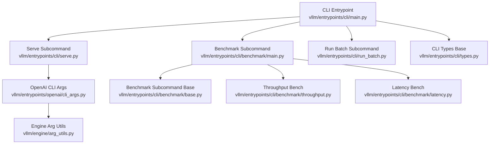
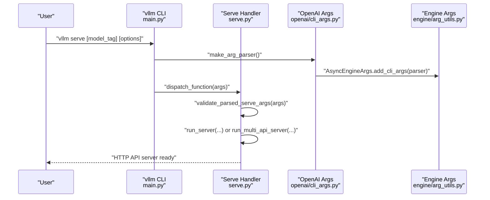
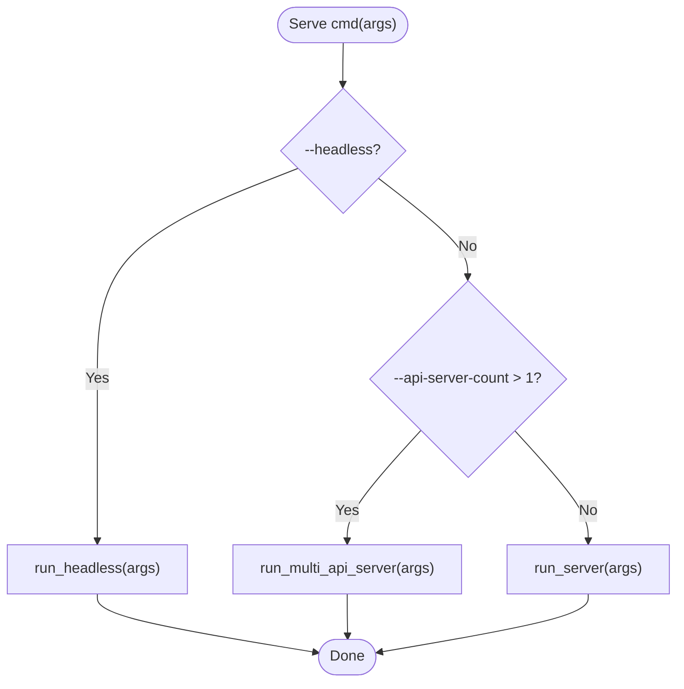
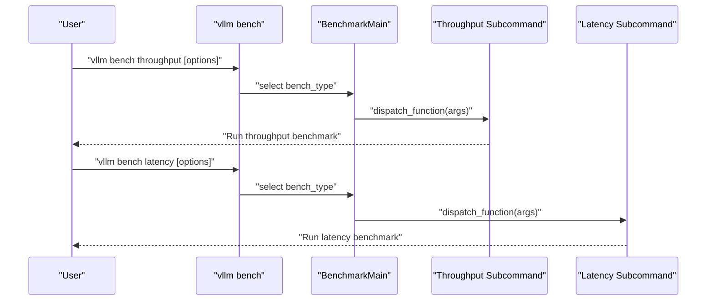
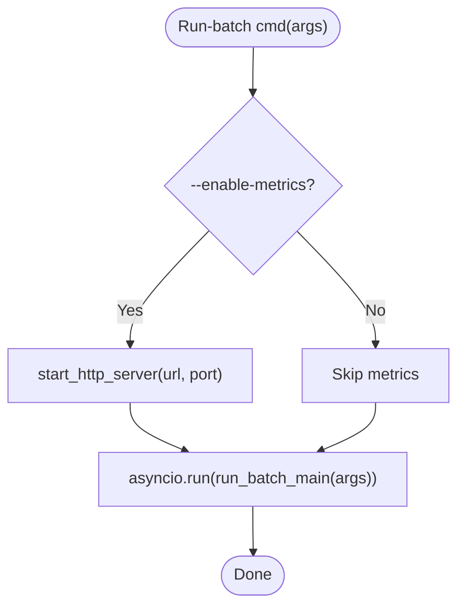
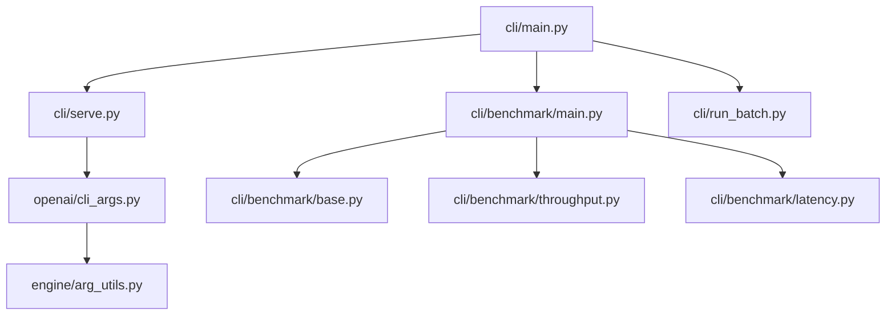

# CLI Interface

<cite>
**Referenced Files in This Document**
- [cli/main.py](file://vllm/entrypoints/cli/main.py)
- [cli/types.py](file://vllm/entrypoints/cli/types.py)
- [cli/serve.py](file://vllm/entrypoints/cli/serve.py)
- [cli/benchmark/main.py](file://vllm/entrypoints/cli/benchmark/main.py)
- [cli/benchmark/base.py](file://vllm/entrypoints/cli/benchmark/base.py)
- [cli/benchmark/throughput.py](file://vllm/entrypoints/cli/benchmark/throughput.py)
- [cli/benchmark/latency.py](file://vllm/entrypoints/cli/benchmark/latency.py)
- [cli/run_batch.py](file://vllm/entrypoints/cli/run_batch.py)
- [openai/cli_args.py](file://vllm/entrypoints/openai/cli_args.py)
- [engine/arg_utils.py](file://vllm/engine/arg_utils.py)
- [utils/argparse_utils.py](file://vllm/utils/argparse_utils.py)
</cite>

## Table of Contents
1. [Introduction](#introduction)
2. [Project Structure](#project-structure)
3. [Core Components](#core-components)
4. [Architecture Overview](#architecture-overview)
5. [Detailed Component Analysis](#detailed-component-analysis)
6. [Dependency Analysis](#dependency-analysis)
7. [Performance Considerations](#performance-considerations)
8. [Troubleshooting Guide](#troubleshooting-guide)
9. [Conclusion](#conclusion)
10. [Appendices](#appendices)

## Introduction
This document describes the vLLM command-line interface (CLI), focusing on the main vllm command and its subcommands: serve, bench, run-batch, and related utilities. It explains available flags and options, their effects on server behavior, configuration file usage, environment variable precedence, and practical usage patterns for starting the API server, running performance benchmarks, and executing batch inference jobs. It also covers integration with system services, containers, and automation scripts, and provides troubleshooting guidance and performance tuning recommendations.

## Project Structure
The CLI entrypoint is defined in a central module that dynamically registers subcommands. Each subcommand module encapsulates its own argument parsing and execution logic. The OpenAI-compatible server arguments are defined in a dedicated module that integrates with the engine’s argument utilities.

**Diagram sources**
- [cli/main.py](file://vllm/entrypoints/cli/main.py#L16-L79)
- [cli/serve.py](file://vllm/entrypoints/cli/serve.py#L42-L75)
- [cli/benchmark/main.py](file://vllm/entrypoints/cli/benchmark/main.py#L17-L56)
- [cli/run_batch.py](file://vllm/entrypoints/cli/run_batch.py#L21-L69)
- [openai/cli_args.py](file://vllm/entrypoints/openai/cli_args.py#L244-L281)
- [engine/arg_utils.py](file://vllm/engine/arg_utils.py#L1-L200)
- [cli/types.py](file://vllm/entrypoints/cli/types.py#L13-L30)
- [cli/benchmark/base.py](file://vllm/entrypoints/cli/benchmark/base.py#L8-L26)
- [cli/benchmark/throughput.py](file://vllm/entrypoints/cli/benchmark/throughput.py#L9-L22)
- [cli/benchmark/latency.py](file://vllm/entrypoints/cli/benchmark/latency.py#L9-L22)

**Section sources**
- [cli/main.py](file://vllm/entrypoints/cli/main.py#L16-L79)
- [cli/types.py](file://vllm/entrypoints/cli/types.py#L13-L30)

## Core Components
- Main CLI dispatcher: Initializes environment, sets up subparsers, and dispatches to subcommand handlers.
- Serve subcommand: Starts the OpenAI-compatible API server in single-process or multi-process/headless modes.
- Bench subcommand: Aggregates sub-benchmarks (e.g., throughput, latency) and routes to their implementations.
- Run-batch subcommand: Executes batch inference jobs using the OpenAI-compatible API and optionally exposes Prometheus metrics.
- Argument parsing: Centralized OpenAI server arguments and engine arguments are combined into a unified parser.

Key behaviors:
- Version display via -v/--version.
- Help grouping via --help=<ConfigGroup> for OpenAI server arguments.
- Config file support via --config for serve subcommand.
- Headless mode for distributed deployments.
- Metrics exposure for batch runs.

**Section sources**
- [cli/main.py](file://vllm/entrypoints/cli/main.py#L16-L79)
- [cli/serve.py](file://vllm/entrypoints/cli/serve.py#L42-L75)
- [cli/benchmark/main.py](file://vllm/entrypoints/cli/benchmark/main.py#L17-L56)
- [cli/run_batch.py](file://vllm/entrypoints/cli/run_batch.py#L21-L69)
- [openai/cli_args.py](file://vllm/entrypoints/openai/cli_args.py#L244-L281)

## Architecture Overview
The CLI orchestrates three primary workflows: serving, benchmarking, and batch processing. The serve command constructs engine configurations and launches either a single API server process or multiple processes with headless engines. The bench command delegates to specialized benchmark subcommands. The run-batch command starts a batch job and can expose Prometheus metrics.

**Diagram sources**
- [cli/main.py](file://vllm/entrypoints/cli/main.py#L51-L76)
- [cli/serve.py](file://vllm/entrypoints/cli/serve.py#L42-L75)
- [openai/cli_args.py](file://vllm/entrypoints/openai/cli_args.py#L244-L281)
- [engine/arg_utils.py](file://vllm/engine/arg_utils.py#L1-L200)

## Detailed Component Analysis

### Main vllm Command
- Purpose: Central entrypoint that initializes environment, sets up subparsers, and dispatches to subcommands.
- Notable features:
  - Version reporting via -v/--version.
  - Lazy loading of subcommand modules to avoid eager import issues.
  - Bench command platform handling to prevent device inference errors.
  - Epilog formatting for subcommand help.

Practical usage:
- Invoke help to list subcommands and global options.
- Use --version to verify installed version.

**Section sources**
- [cli/main.py](file://vllm/entrypoints/cli/main.py#L16-L79)

### Serve Subcommand
- Purpose: Launch an OpenAI-compatible API server with configurable frontend and engine parameters.
- Key flags and options (selection):
  - Positional model_tag: Optional model identifier; can be overridden by engine config.
  - --headless: Run without a frontend process; useful for distributed deployments.
  - --api-server-count (-asc): Number of API server processes to run.
  - --config: Path to a YAML configuration file containing CLI options.
  - Frontend options (selected):
    - host, port, uds (Unix domain socket), uvicorn_log_level, disable_uvicorn_access_log
    - allowed_origins, allowed_methods, allowed_headers (JSON lists)
    - api_key (list), ssl_* options, root_path
    - middleware (repeatable), return_tokens_as_token_ids
    - disable_frontend_multiprocessing, enable_request_id_headers
    - enable_auto_tool_choice, tool_call_parser, tool_parser_plugin, tool_server
    - log_config_file, max_log_len, disable_fastapi_docs
    - enable_prompt_tokens_details, enable_server_load_tracking
    - enable_force_include_usage, enable_tokenizer_info_endpoint
    - enable_log_outputs (requires --enable-log-requests)
    - h11_max_incomplete_event_size, h11_max_header_count
    - log_error_stack
    - tokens_only (for disaggregated setups)
  - Engine options (via AsyncEngineArgs):
    - Model and quantization parameters, parallelism settings, scheduling, cache, and more.
- Behavior:
  - Validates chat template and tool choice requirements.
  - Supports single-process, multi-process, and headless modes.
  - Enforces constraints for multi-API-server deployments (e.g., runtime LoRA updating).
- Practical examples:
  - Start a server bound to a specific host/port with CORS allowed.
  - Run headless for multi-node data parallel deployments.
  - Use --config to externalize server and engine settings.

Notes on precedence:
- Positional model_tag overrides engine config when present.
- CLI flags override values from --config.

**Section sources**
- [cli/serve.py](file://vllm/entrypoints/cli/serve.py#L42-L75)
- [cli/serve.py](file://vllm/entrypoints/cli/serve.py#L81-L160)
- [cli/serve.py](file://vllm/entrypoints/cli/serve.py#L162-L234)
- [cli/serve.py](file://vllm/entrypoints/cli/serve.py#L236-L250)
- [openai/cli_args.py](file://vllm/entrypoints/openai/cli_args.py#L244-L281)
- [openai/cli_args.py](file://vllm/entrypoints/openai/cli_args.py#L283-L297)

#### Serve Execution Flow

**Diagram sources**
- [cli/serve.py](file://vllm/entrypoints/cli/serve.py#L48-L61)
- [cli/serve.py](file://vllm/entrypoints/cli/serve.py#L81-L160)
- [cli/serve.py](file://vllm/entrypoints/cli/serve.py#L162-L234)

### Bench Subcommand
- Purpose: Container for benchmark subcommands (e.g., throughput, latency).
- Behavior:
  - Creates a subparser for bench_type and dispatches to the selected benchmark.
  - Uses a base class for benchmark subcommands to enforce consistent CLI behavior.

Available bench subcommands:
- throughput: Benchmarks offline inference throughput.
- latency: Benchmarks latency for a single batch of requests.

Practical examples:
- Run throughput benchmark with dataset and concurrency settings.
- Run latency benchmark with fixed batch size and request distribution.

**Section sources**
- [cli/benchmark/main.py](file://vllm/entrypoints/cli/benchmark/main.py#L17-L56)
- [cli/benchmark/base.py](file://vllm/entrypoints/cli/benchmark/base.py#L8-L26)
- [cli/benchmark/throughput.py](file://vllm/entrypoints/cli/benchmark/throughput.py#L9-L22)
- [cli/benchmark/latency.py](file://vllm/entrypoints/cli/benchmark/latency.py#L9-L22)

#### Bench Dispatch Flow

**Diagram sources**
- [cli/benchmark/main.py](file://vllm/entrypoints/cli/benchmark/main.py#L30-L52)
- [cli/benchmark/throughput.py](file://vllm/entrypoints/cli/benchmark/throughput.py#L9-L22)
- [cli/benchmark/latency.py](file://vllm/entrypoints/cli/benchmark/latency.py#L9-L22)

### Run-batch Subcommand
- Purpose: Execute batch inference jobs using the OpenAI-compatible API and write results to a file.
- Key flags and options (selected):
  - -i/--input-file: Input JSONL file path (local or HTTP).
  - -o/--output-file: Output JSONL file path (local or HTTP).
  - --model: Model identifier.
  - --max-lines: Maximum number of lines to process.
  - --url/--port: Metrics server URL and port (when enabling metrics).
  - --enable-metrics: Expose Prometheus metrics at /metrics.
  - Other OpenAI-compatible API options inherited from the run-batch implementation.
- Behavior:
  - Optionally starts a Prometheus metrics server.
  - Runs the batch processing loop asynchronously.
  - Logs version and parsed arguments.

Practical examples:
- Run batch inference on a local dataset and write results to a local file.
- Enable metrics and scrape /metrics endpoint during batch runs.

**Section sources**
- [cli/run_batch.py](file://vllm/entrypoints/cli/run_batch.py#L21-L69)

#### Run-batch Execution Flow

**Diagram sources**
- [cli/run_batch.py](file://vllm/entrypoints/cli/run_batch.py#L26-L47)

### Argument Parsing and Configuration
- FlexibleArgumentParser: Provides extended parsing capabilities and config file support.
- Config file semantics:
  - YAML file is read and flattened into a list of arguments.
  - Boolean flags are emitted as bare flags.
  - Lists are emitted as flag plus values.
  - Other values are emitted as flag and value.
- Serve subcommand:
  - Accepts --config to read options from a YAML file.
  - Combines FrontendArgs and AsyncEngineArgs into a single parser.
- Help grouping:
  - Use --help=<ConfigGroup> to filter options by category (e.g., ModelConfig, Frontend).
  - Use --help=all to show all flags at once.

Environment variables:
- Many engine and server behaviors are controlled via environment variables. Consult the engine and server configuration documentation for the full set of supported variables.

Precedence:
- CLI flags override values from --config.
- Positional model_tag overrides engine config when present.

**Section sources**
- [utils/argparse_utils.py](file://vllm/utils/argparse_utils.py#L230-L260)
- [utils/argparse_utils.py](file://vllm/utils/argparse_utils.py#L465-L492)
- [openai/cli_args.py](file://vllm/entrypoints/openai/cli_args.py#L244-L281)
- [engine/arg_utils.py](file://vllm/engine/arg_utils.py#L1-L200)

## Dependency Analysis
The CLI depends on several modules for argument parsing, server configuration, and engine setup. The serve subcommand integrates with the OpenAI-compatible server and engine argument utilities. The bench subcommand aggregates specialized benchmark implementations. The run-batch subcommand integrates with the OpenAI batch runner and optional metrics server.

**Diagram sources**
- [cli/main.py](file://vllm/entrypoints/cli/main.py#L16-L79)
- [cli/serve.py](file://vllm/entrypoints/cli/serve.py#L42-L75)
- [cli/benchmark/main.py](file://vllm/entrypoints/cli/benchmark/main.py#L17-L56)
- [cli/run_batch.py](file://vllm/entrypoints/cli/run_batch.py#L21-L69)
- [openai/cli_args.py](file://vllm/entrypoints/openai/cli_args.py#L244-L281)
- [engine/arg_utils.py](file://vllm/engine/arg_utils.py#L1-L200)
- [cli/benchmark/base.py](file://vllm/entrypoints/cli/benchmark/base.py#L8-L26)
- [cli/benchmark/throughput.py](file://vllm/entrypoints/cli/benchmark/throughput.py#L9-L22)
- [cli/benchmark/latency.py](file://vllm/entrypoints/cli/benchmark/latency.py#L9-L22)

**Section sources**
- [cli/main.py](file://vllm/entrypoints/cli/main.py#L16-L79)
- [openai/cli_args.py](file://vllm/entrypoints/openai/cli_args.py#L244-L281)
- [engine/arg_utils.py](file://vllm/engine/arg_utils.py#L1-L200)

## Performance Considerations
- Throughput vs. latency trade-offs:
  - Increase concurrency and batch sizes to improve throughput; expect higher latency per request.
  - Reduce concurrency and batch sizes to reduce latency; throughput may decrease.
- Engine configuration:
  - Adjust scheduler policy, block size, and KV cache settings for memory and throughput characteristics.
  - Consider quantization and model dtype settings to balance accuracy and speed.
- Frontend tuning:
  - Tune uvicorn log level and access log settings to minimize overhead.
  - Disable unnecessary middleware and endpoints to reduce processing overhead.
- Metrics and monitoring:
  - Enable Prometheus metrics for run-batch to observe performance trends.
  - Use server-side metrics to track request rates, queue lengths, and utilization.

[No sources needed since this section provides general guidance]

## Troubleshooting Guide
Common issues and resolutions:
- Device/platform inference errors during benchmarks:
  - The CLI switches to CPU platform automatically for bench commands when platform is unspecified.
- Validation failures for serve arguments:
  - Ensure chat template is valid; errors are raised early.
  - Enabling auto tool choice requires specifying a tool call parser.
  - Enabling log outputs requires enabling log requests.
- Multi-API-server constraints:
  - Runtime LoRA updating cannot be used with multiple API servers.
- Headless mode constraints:
  - api_server_count cannot be set in headless mode.
  - data_parallel_hybrid_lb is not applicable in headless mode.
  - data_parallel_size_local must be greater than zero in headless mode.
- Metrics exposure:
  - Prometheus metrics are only started when --enable-metrics is set for run-batch.

**Section sources**
- [cli/main.py](file://vllm/entrypoints/cli/main.py#L35-L50)
- [openai/cli_args.py](file://vllm/entrypoints/openai/cli_args.py#L283-L297)
- [cli/serve.py](file://vllm/entrypoints/cli/serve.py#L81-L100)
- [cli/serve.py](file://vllm/entrypoints/cli/serve.py#L179-L183)
- [cli/run_batch.py](file://vllm/entrypoints/cli/run_batch.py#L35-L45)

## Conclusion
The vLLM CLI provides a cohesive interface for serving, benchmarking, and batch processing. The serve subcommand offers extensive configuration for the OpenAI-compatible API server, while bench and run-batch subcommands streamline performance evaluation and offline workloads. Configuration files and environment variables integrate with the argument system to support flexible deployments. Proper understanding of argument precedence, validation rules, and operational modes enables reliable and performant deployments across diverse environments.

[No sources needed since this section summarizes without analyzing specific files]

## Appendices

### Practical Usage Patterns
- Starting the API server:
  - Basic: vllm serve --host 0.0.0.0 --port 8000 --model <model>
  - Headless: vllm serve --headless --api-server-count 1 --model <model>
  - Multi-process: vllm serve --api-server-count 4 --model <model>
  - With config: vllm serve --config serve.yaml
- Running performance benchmarks:
  - vllm bench throughput --dataset <path> --concurrency <n>
  - vllm bench latency --batch-size 1 --request-count 100
- Executing batch inference:
  - vllm run-batch -i input.jsonl -o output.jsonl --model <model>
  - vllm run-batch -i input.jsonl -o output.jsonl --model <model> --enable-metrics --url 0.0.0.0 --port 8080

[No sources needed since this section provides general guidance]