# CLI Overview

<cite>
**Referenced Files in This Document**
- [main.py](file://vllm/entrypoints/cli/main.py)
- [scripts.py](file://vllm/scripts.py)
- [types.py](file://vllm/entrypoints/cli/types.py)
- [serve.py](file://vllm/entrypoints/cli/serve.py)
- [run_batch.py](file://vllm/entrypoints/cli/run_batch.py)
- [benchmark/main.py](file://vllm/entrypoints/cli/benchmark/main.py)
- [cli/__init__.py](file://vllm/entrypoints/cli/__init__.py)
- [utils.py](file://vllm/entrypoints/utils.py)
- [version.py](file://vllm/version.py)
- [arch_overview.md](file://docs/design/arch_overview.md)
</cite>

## Table of Contents
1. [Introduction](#introduction)
2. [Project Structure](#project-structure)
3. [Core Components](#core-components)
4. [Architecture Overview](#architecture-overview)
5. [Detailed Component Analysis](#detailed-component-analysis)
6. [Dependency Analysis](#dependency-analysis)
7. [Performance Considerations](#performance-considerations)
8. [Troubleshooting Guide](#troubleshooting-guide)
9. [Conclusion](#conclusion)

## Introduction
This document explains the command-line interface (CLI) architecture of vLLM. It covers the CLI entry point, command routing, lazy loading strategy, subcommand registration, argument parsing, version display, environment setup, platform detection, and how commands are discovered and executed. It also describes the relationship between the main CLI entry point and individual command modules, and provides practical usage patterns.

## Project Structure
The CLI is organized around a central entry point that dynamically discovers and registers subcommands. Subcommands are implemented as individual modules under the CLI package and register themselves via a common interface. Supporting utilities provide environment setup and help formatting.

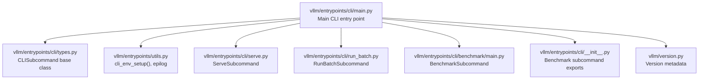

**Diagram sources**
- [main.py](file://vllm/entrypoints/cli/main.py#L1-L80)
- [types.py](file://vllm/entrypoints/cli/types.py#L1-L30)
- [utils.py](file://vllm/entrypoints/utils.py#L158-L177)
- [serve.py](file://vllm/entrypoints/cli/serve.py#L42-L75)
- [run_batch.py](file://vllm/entrypoints/cli/run_batch.py#L21-L65)
- [benchmark/main.py](file://vllm/entrypoints/cli/benchmark/main.py#L17-L56)
- [cli/__init__.py](file://vllm/entrypoints/cli/__init__.py#L1-L16)
- [version.py](file://vllm/version.py#L1-L40)

**Section sources**
- [main.py](file://vllm/entrypoints/cli/main.py#L1-L80)
- [utils.py](file://vllm/entrypoints/utils.py#L38-L44)

## Core Components
- Main CLI entry point: Initializes environment, sets up argument parsing, registers subcommands, and dispatches to the selected command.
- Subcommand base class: Defines the contract for all CLI subcommands.
- Subcommand modules: Implement specific commands (serve, run-batch, bench, collect-env, run-batch).
- Utilities: Provide environment setup and help formatting.
- Version provider: Supplies version information for the CLI.

Key responsibilities:
- Lazy loading: Import submodules only when needed to avoid eager import issues.
- Subcommand registration: Each module exposes a factory that returns instantiated subcommands.
- Argument parsing: Uses a flexible parser and supports per-subcommand help formatting.
- Dispatch: Routes to the selected subcommand’s handler.

**Section sources**
- [main.py](file://vllm/entrypoints/cli/main.py#L16-L80)
- [types.py](file://vllm/entrypoints/cli/types.py#L13-L30)
- [utils.py](file://vllm/entrypoints/utils.py#L158-L177)
- [version.py](file://vllm/version.py#L1-L40)

## Architecture Overview
The CLI architecture follows a modular, extensible design:
- Central entry point loads subcommands lazily.
- Each subcommand module defines a class derived from the base subcommand interface.
- Subcommands register themselves by returning instances from a module-level factory.
- The main entry point builds a unified parser, registers subcommands, validates arguments, and executes the chosen command.

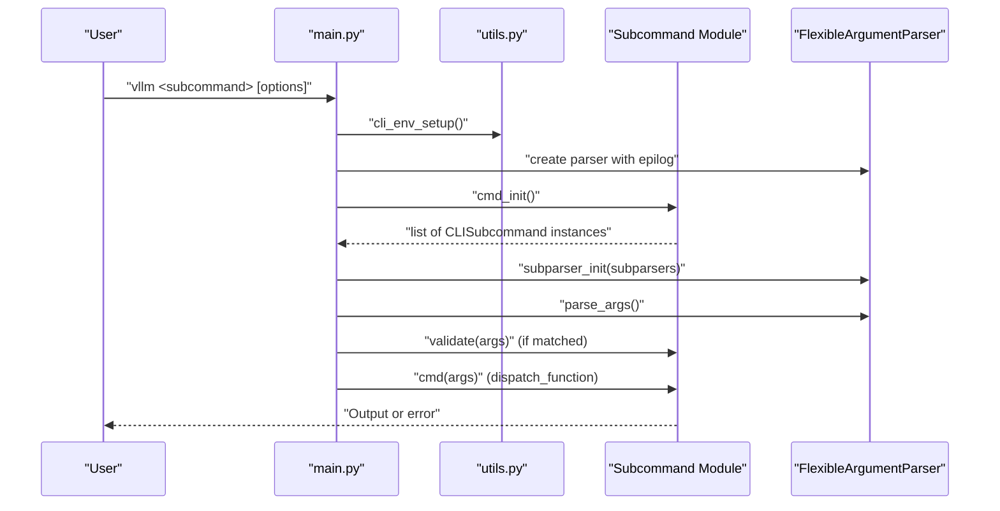

**Diagram sources**
- [main.py](file://vllm/entrypoints/cli/main.py#L51-L76)
- [utils.py](file://vllm/entrypoints/utils.py#L38-L44)
- [types.py](file://vllm/entrypoints/cli/types.py#L13-L30)

## Detailed Component Analysis

### Main CLI Entry Point
- Lazy imports: Loads benchmark, collect_env, openai, run_batch, and serve modules only when initializing the CLI.
- Environment setup: Calls a utility to configure multiprocessing and related environment variables.
- Platform detection for benchmarks: Switches to a CPU platform when the first argument is bench and the current platform is unspecified to avoid device inference errors.
- Argument parsing: Creates a flexible parser, adds a version flag, and builds subparsers.
- Subcommand registration: Iterates over registered modules, initializes subcommands, and binds each to a subparser with a dispatch function.
- Validation and dispatch: Validates the matched subcommand and invokes its handler.

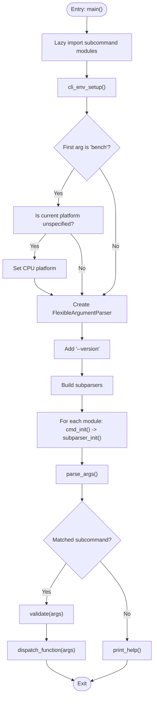

**Diagram sources**
- [main.py](file://vllm/entrypoints/cli/main.py#L16-L76)
- [utils.py](file://vllm/entrypoints/utils.py#L158-L177)

**Section sources**
- [main.py](file://vllm/entrypoints/cli/main.py#L16-L80)

### Subcommand Base Class
Defines the contract that all CLI subcommands must implement:
- name: Unique identifier for the subcommand.
- cmd(args): Executes the subcommand.
- validate(args): Optional validation hook.
- subparser_init(subparsers): Adds the subcommand’s parser to the parent subparsers.

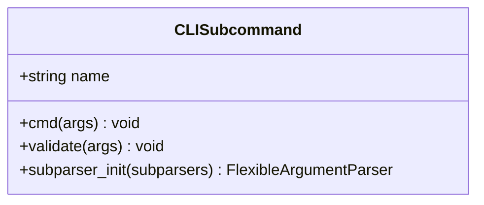

**Diagram sources**
- [types.py](file://vllm/entrypoints/cli/types.py#L13-L30)

**Section sources**
- [types.py](file://vllm/entrypoints/cli/types.py#L13-L30)

### Serve Subcommand
- Purpose: Launch an OpenAI-compatible API server locally.
- Registration: Returns a single instance from its module-level factory.
- Execution: Supports headless mode, multi-server orchestration, and integrates with engine configuration and process managers.
- Validation: Delegates to a dedicated validator for serve-specific arguments.

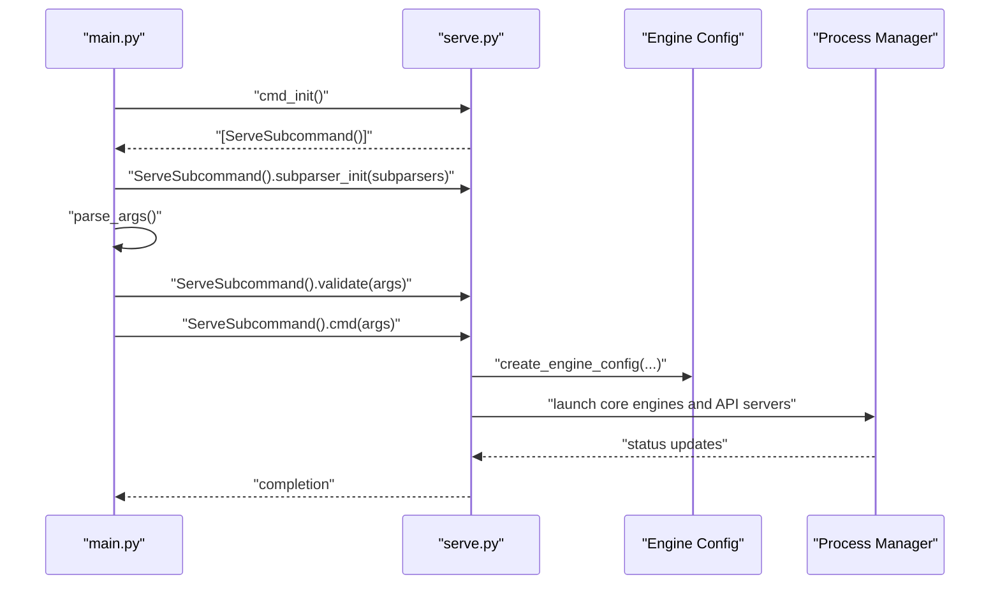

**Diagram sources**
- [serve.py](file://vllm/entrypoints/cli/serve.py#L42-L75)
- [serve.py](file://vllm/entrypoints/cli/serve.py#L81-L160)
- [serve.py](file://vllm/entrypoints/cli/serve.py#L162-L250)

**Section sources**
- [serve.py](file://vllm/entrypoints/cli/serve.py#L42-L75)
- [serve.py](file://vllm/entrypoints/cli/serve.py#L81-L160)
- [serve.py](file://vllm/entrypoints/cli/serve.py#L162-L250)

### Run-Batch Subcommand
- Purpose: Execute batch prompts using the OpenAI-compatible API and write results to a file.
- Registration: Returns a single instance from its module-level factory.
- Execution: Optionally starts a Prometheus metrics server and delegates to the batch runner.

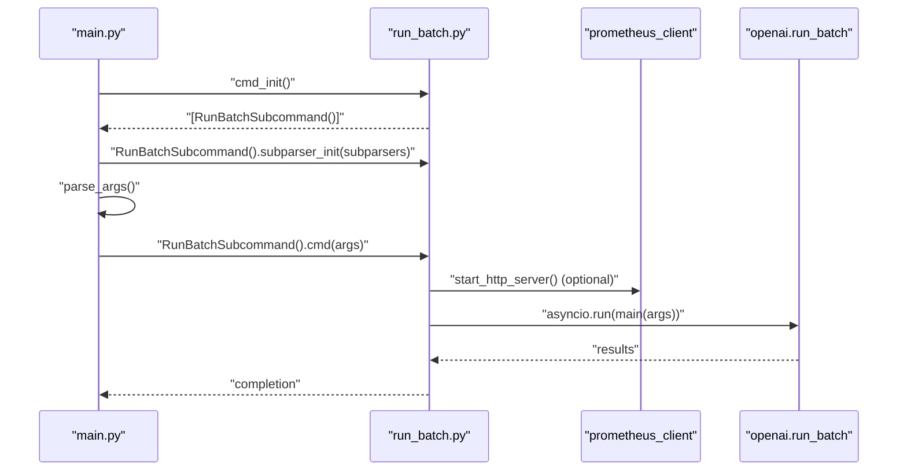

**Diagram sources**
- [run_batch.py](file://vllm/entrypoints/cli/run_batch.py#L21-L65)

**Section sources**
- [run_batch.py](file://vllm/entrypoints/cli/run_batch.py#L21-L65)

### Benchmark Subcommand
- Purpose: Provides subcommands for latency, throughput, startup, and sweep benchmarks.
- Registration: Exposes a single instance that creates subparsers for each benchmark type.
- Execution: Each benchmark type registers a dispatch function and adds its own CLI arguments.

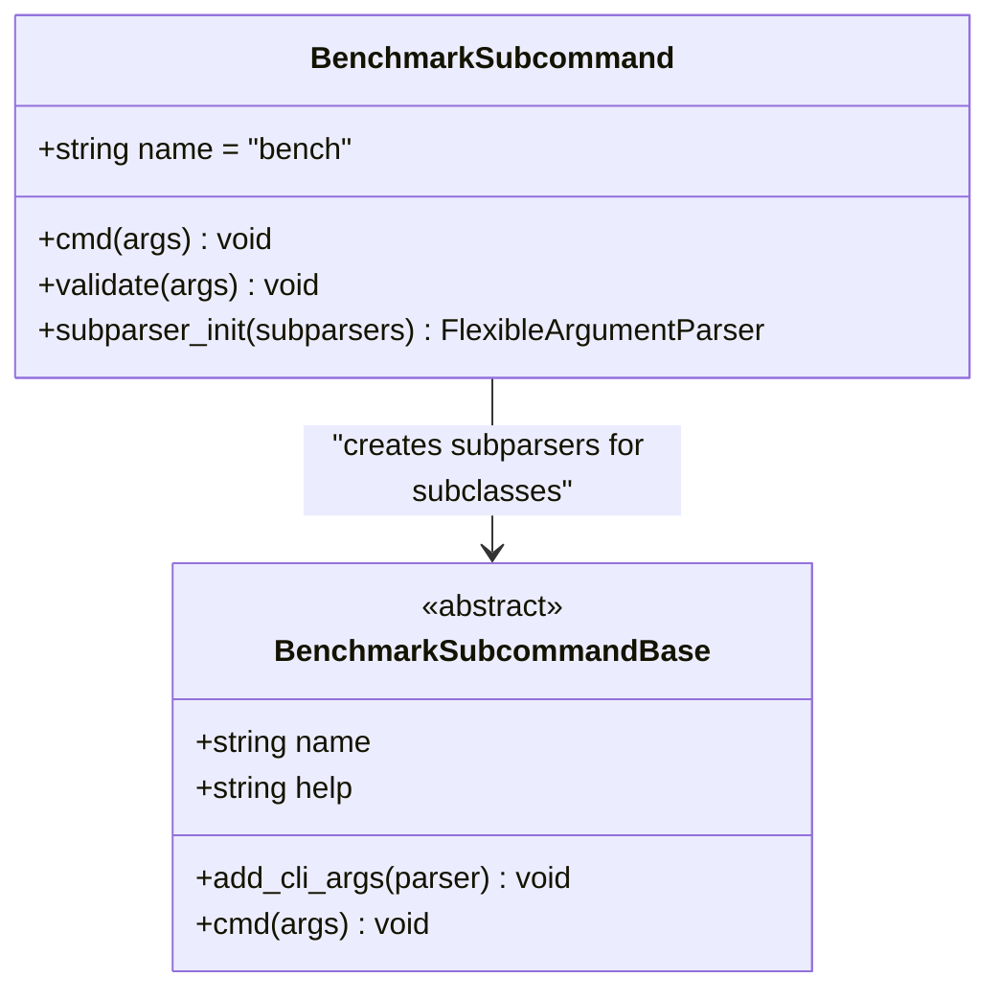

**Diagram sources**
- [benchmark/main.py](file://vllm/entrypoints/cli/benchmark/main.py#L17-L56)
- [cli/__init__.py](file://vllm/entrypoints/cli/__init__.py#L1-L16)

**Section sources**
- [benchmark/main.py](file://vllm/entrypoints/cli/benchmark/main.py#L17-L56)
- [cli/__init__.py](file://vllm/entrypoints/cli/__init__.py#L1-L16)

### Argument Parsing and Help Formatting
- FlexibleArgumentParser: Used to create parsers and supports advanced help and configuration features.
- Epilog formatting: A shared epilog formatter is applied to subcommand parsers to guide users to sectioned help.
- Version flag: The CLI exposes a version flag that prints the installed package version.

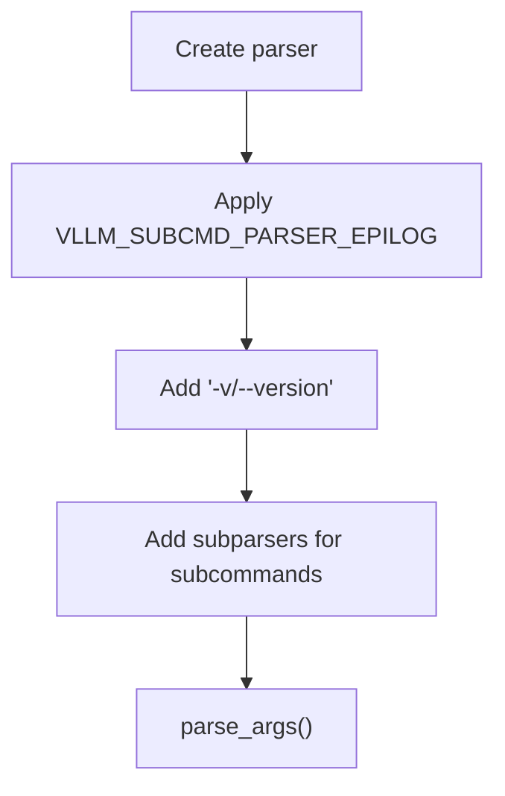

**Diagram sources**
- [main.py](file://vllm/entrypoints/cli/main.py#L51-L60)
- [utils.py](file://vllm/entrypoints/utils.py#L38-L44)

**Section sources**
- [main.py](file://vllm/entrypoints/cli/main.py#L51-L60)
- [utils.py](file://vllm/entrypoints/utils.py#L38-L44)

### Environment Setup and Platform Detection
- Environment setup: Ensures a safe multiprocessing start method is configured for CLI usage.
- Platform detection for benchmarks: Switches to CPU platform when the first argument is bench and the current platform is unspecified.

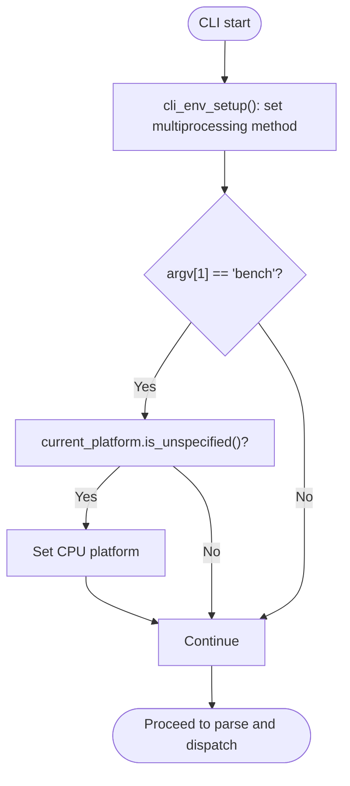

**Diagram sources**
- [utils.py](file://vllm/entrypoints/utils.py#L158-L177)
- [main.py](file://vllm/entrypoints/cli/main.py#L33-L50)

**Section sources**
- [utils.py](file://vllm/entrypoints/utils.py#L158-L177)
- [main.py](file://vllm/entrypoints/cli/main.py#L33-L50)

### Relationship Between Main Entry Point and Command Modules
- The main entry point maintains a list of command modules and calls each module’s initialization function to obtain subcommand instances.
- Each module defines a factory that returns a list of subcommand instances.
- The main entry point binds each subcommand to a subparser and sets a dispatch function to be invoked later.

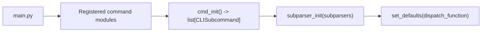

**Diagram sources**
- [main.py](file://vllm/entrypoints/cli/main.py#L25-L31)
- [main.py](file://vllm/entrypoints/cli/main.py#L63-L68)

**Section sources**
- [main.py](file://vllm/entrypoints/cli/main.py#L25-L31)
- [main.py](file://vllm/entrypoints/cli/main.py#L63-L68)

## Dependency Analysis
- Coupling: The main entry point depends on the subcommand modules only during initialization. After registration, it interacts solely through the subcommand interface.
- Cohesion: Each subcommand module encapsulates its own argument parsing and execution logic.
- External dependencies: The CLI relies on the flexible argument parser, environment utilities, and platform selection logic.

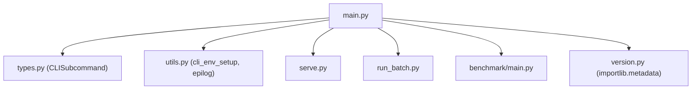

**Diagram sources**
- [main.py](file://vllm/entrypoints/cli/main.py#L16-L80)
- [version.py](file://vllm/version.py#L1-L40)

**Section sources**
- [main.py](file://vllm/entrypoints/cli/main.py#L16-L80)
- [version.py](file://vllm/version.py#L1-L40)

## Performance Considerations
- Lazy loading avoids importing heavy modules until needed, reducing startup time for the CLI.
- Using a dedicated multiprocessing start method prevents issues with CUDA and other accelerators in subprocess contexts.
- Benchmark command switches to CPU when platform is unspecified to prevent inference errors that could otherwise degrade performance or cause failures.

## Troubleshooting Guide
- Version flag: Use the version flag to confirm the installed package version.
- Help system: Use the documented help patterns to explore subcommand options by section or flag.
- Environment issues: If encountering multiprocessing or accelerator-related problems, ensure the environment setup is applied and consider platform detection behavior for benchmarks.

**Section sources**
- [main.py](file://vllm/entrypoints/cli/main.py#L55-L60)
- [utils.py](file://vllm/entrypoints/utils.py#L158-L177)
- [arch_overview.md](file://docs/design/arch_overview.md#L54-L71)

## Conclusion
The vLLM CLI employs a clean, extensible architecture centered on a main entry point that lazily loads and registers subcommands. A shared base class ensures consistent behavior across subcommands, while utilities handle environment setup and help formatting. The design enables straightforward addition of new subcommands and robust execution of core workflows such as serving, batch processing, and benchmarking.