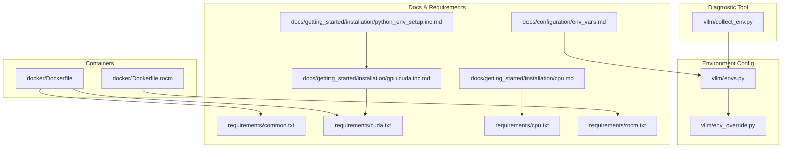
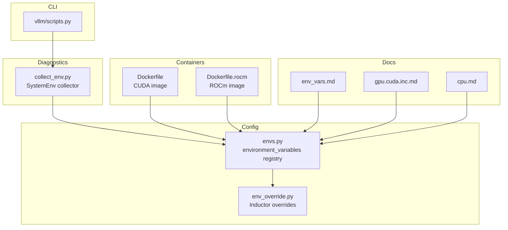
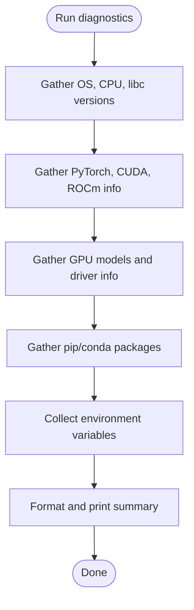
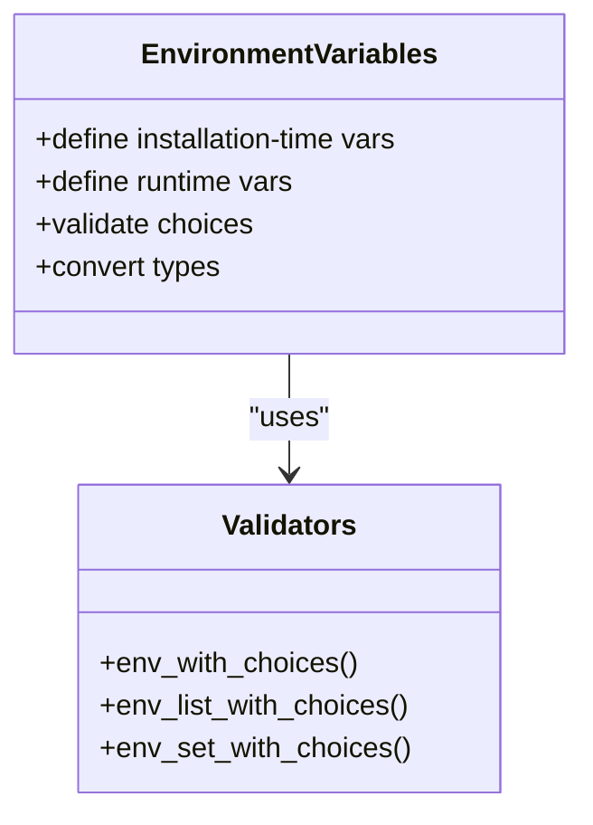
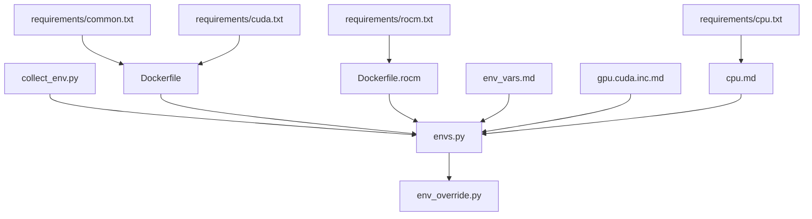

# Environment Setup

<cite>
**Referenced Files in This Document**
- [collect_env.py](file://vllm/collect_env.py)
- [envs.py](file://vllm/envs.py)
- [env_override.py](file://vllm/env_override.py)
- [Dockerfile](file://docker/Dockerfile)
- [Dockerfile.rocm](file://docker/Dockerfile.rocm)
- [env_vars.md](file://docs/configuration/env_vars.md)
- [gpu.cuda.inc.md](file://docs/getting_started/installation/gpu.cuda.inc.md)
- [cpu.md](file://docs/getting_started/installation/cpu.md)
- [python_env_setup.inc.md](file://docs/getting_started/installation/python_env_setup.inc.md)
- [common.txt](file://requirements/common.txt)
- [cuda.txt](file://requirements/cuda.txt)
- [cpu.txt](file://requirements/cpu.txt)
- [rocm.txt](file://requirements/rocm.txt)
- [scripts.py](file://vllm/scripts.py)
</cite>

## Table of Contents
1. [Introduction](#introduction)
2. [Project Structure](#project-structure)
3. [Core Components](#core-components)
4. [Architecture Overview](#architecture-overview)
5. [Detailed Component Analysis](#detailed-component-analysis)
6. [Dependency Analysis](#dependency-analysis)
7. [Performance Considerations](#performance-considerations)
8. [Troubleshooting Guide](#troubleshooting-guide)
9. [Conclusion](#conclusion)
10. [Appendices](#appendices)

## Introduction
This document explains how to set up and validate the environment for vLLM, focusing on:
- Collecting system and runtime environment information via the environment diagnostic tool
- Understanding and configuring environment variables used by vLLM
- Platform-specific setup for NVIDIA CUDA, AMD ROCm, and CPU backends
- Container and cloud integration patterns
- Troubleshooting environment-related issues and validating system compatibility

## Project Structure
Key areas relevant to environment setup and diagnostics:
- Diagnostic tool: vllm/collect_env.py
- Environment variable registry and validators: vllm/envs.py
- Automatic environment overrides for PyTorch Inductor: vllm/env_override.py
- Container images for CUDA and ROCm: docker/Dockerfile, docker/Dockerfile.rocm
- Documentation for environment variables and installation: docs/configuration/env_vars.md, docs/getting_started/installation/*.md
- Dependency requirements: requirements/*.txt
- CLI entrypoint for diagnostics: vllm/scripts.py

**Diagram sources**
- [collect_env.py](file://vllm/collect_env.py#L1-L120)
- [envs.py](file://vllm/envs.py#L448-L800)
- [env_override.py](file://vllm/env_override.py#L1-L120)
- [Dockerfile](file://docker/Dockerfile#L1-L120)
- [Dockerfile.rocm](file://docker/Dockerfile.rocm#L1-L60)
- [env_vars.md](file://docs/configuration/env_vars.md#L1-L13)
- [gpu.cuda.inc.md](file://docs/getting_started/installation/gpu.cuda.inc.md#L1-L120)
- [cpu.md](file://docs/getting_started/installation/cpu.md#L1-L80)
- [python_env_setup.inc.md](file://docs/getting_started/installation/python_env_setup.inc.md#L1-L7)
- [common.txt](file://requirements/common.txt#L1-L55)
- [cuda.txt](file://requirements/cuda.txt#L1-L14)
- [cpu.txt](file://requirements/cpu.txt#L1-L23)
- [rocm.txt](file://requirements/rocm.txt#L1-L19)

**Section sources**
- [collect_env.py](file://vllm/collect_env.py#L1-L120)
- [envs.py](file://vllm/envs.py#L448-L800)
- [env_override.py](file://vllm/env_override.py#L1-L120)
- [Dockerfile](file://docker/Dockerfile#L1-L120)
- [Dockerfile.rocm](file://docker/Dockerfile.rocm#L1-L60)
- [env_vars.md](file://docs/configuration/env_vars.md#L1-L13)
- [gpu.cuda.inc.md](file://docs/getting_started/installation/gpu.cuda.inc.md#L1-L120)
- [cpu.md](file://docs/getting_started/installation/cpu.md#L1-L80)
- [python_env_setup.inc.md](file://docs/getting_started/installation/python_env_setup.inc.md#L1-L7)
- [common.txt](file://requirements/common.txt#L1-L55)
- [cuda.txt](file://requirements/cuda.txt#L1-L14)
- [cpu.txt](file://requirements/cpu.txt#L1-L23)
- [rocm.txt](file://requirements/rocm.txt#L1-L19)

## Core Components
- Environment diagnostic tool: Gathers OS, Python, CUDA/ROCm, GPU topology, library versions, and environment variables.
- Environment variable registry: Centralized definitions and validators for vLLM runtime and build-time environment variables.
- Automatic environment overrides: Applies safe defaults for PyTorch Inductor to avoid known issues.
- Container images: Provide preconfigured environments for CUDA and ROCm deployments.
- Installation documentation: Guides for selecting wheels/backends, building from source, and troubleshooting.

**Section sources**
- [collect_env.py](file://vllm/collect_env.py#L595-L740)
- [envs.py](file://vllm/envs.py#L448-L800)
- [env_override.py](file://vllm/env_override.py#L1-L120)
- [Dockerfile](file://docker/Dockerfile#L120-L220)
- [Dockerfile.rocm](file://docker/Dockerfile.rocm#L1-L60)
- [gpu.cuda.inc.md](file://docs/getting_started/installation/gpu.cuda.inc.md#L1-L120)
- [cpu.md](file://docs/getting_started/installation/cpu.md#L1-L80)

## Architecture Overview
The environment setup architecture integrates diagnostics, environment configuration, and platform-specific containers.

**Diagram sources**
- [scripts.py](file://vllm/scripts.py#L1-L18)
- [collect_env.py](file://vllm/collect_env.py#L595-L740)
- [envs.py](file://vllm/envs.py#L448-L800)
- [env_override.py](file://vllm/env_override.py#L1-L120)
- [Dockerfile](file://docker/Dockerfile#L120-L220)
- [Dockerfile.rocm](file://docker/Dockerfile.rocm#L1-L60)
- [env_vars.md](file://docs/configuration/env_vars.md#L1-L13)
- [gpu.cuda.inc.md](file://docs/getting_started/installation/gpu.cuda.inc.md#L1-L120)
- [cpu.md](file://docs/getting_started/installation/cpu.md#L1-L80)

## Detailed Component Analysis

### Environment Diagnostic Tool (collect_env.py)
Purpose:
- Aggregate system, runtime, and configuration details for diagnostics and support.
- Output includes OS, Python, CUDA/ROCm, GPU topology, library versions, and environment variables.

Key behaviors:
- Detects platform and executes platform-appropriate commands to gather information.
- Uses environment variables registry to filter and include relevant entries.
- Formats output for readability and troubleshooting.

**Diagram sources**
- [collect_env.py](file://vllm/collect_env.py#L595-L740)

**Section sources**
- [collect_env.py](file://vllm/collect_env.py#L1-L120)
- [collect_env.py](file://vllm/collect_env.py#L595-L740)
- [collect_env.py](file://vllm/collect_env.py#L740-L858)

### Environment Variable Registry (envs.py)
Purpose:
- Define and validate environment variables used by vLLM at runtime and build time.
- Provide centralized getters and validators for correctness and consistency.

Highlights:
- Installation-time variables (e.g., target device, CUDA version, build flags).
- Runtime variables (e.g., host IP, port, cache roots, logging, attention backend).
- Validation helpers for enumerated choices and comma-separated lists.

**Diagram sources**
- [envs.py](file://vllm/envs.py#L448-L800)

**Section sources**
- [envs.py](file://vllm/envs.py#L448-L800)
- [env_vars.md](file://docs/configuration/env_vars.md#L1-L13)

### Automatic Environment Overrides (env_override.py)
Purpose:
- Apply safe defaults for PyTorch Inductor to avoid known issues in specific versions.
- Monkeypatch scheduler and code generation to stabilize compilation behavior.

Key points:
- Sets environment flags to reduce compile threads.
- Patches Inductor internals conditionally based on PyTorch version.

**Section sources**
- [env_override.py](file://vllm/env_override.py#L1-L120)
- [env_override.py](file://vllm/env_override.py#L366-L379)

### Container Environments (Docker)
Purpose:
- Provide reproducible environments for CUDA and ROCm deployments.
- Configure build and runtime dependencies, environment variables, and preinstalled wheels.

Highlights:
- CUDA image:
  - Installs PyTorch and CUDA dependencies.
  - Preinstalls FlashInfer and related kernels.
  - Sets build-time environment variables (e.g., MAX_JOBS, NVCC_THREADS).
- ROCm image:
  - Installs ROCm-specific dependencies and wheels.
  - Sets ROCm-related environment variables.

**Section sources**
- [Dockerfile](file://docker/Dockerfile#L120-L220)
- [Dockerfile](file://docker/Dockerfile#L456-L540)
- [Dockerfile.rocm](file://docker/Dockerfile.rocm#L1-L60)
- [Dockerfile.rocm](file://docker/Dockerfile.rocm#L120-L148)

### Installation and Platform-Specific Setup
- NVIDIA CUDA:
  - Guidance on selecting wheels/backends and building from source.
  - Troubleshooting steps for toolkit installation and environment variables.
- CPU:
  - Environment variable tuning for CPU backends (thread binding, KV cache).
  - Docker and container runtime considerations for NUMA and seccomp.

**Section sources**
- [gpu.cuda.inc.md](file://docs/getting_started/installation/gpu.cuda.inc.md#L1-L120)
- [gpu.cuda.inc.md](file://docs/getting_started/installation/gpu.cuda.inc.md#L190-L238)
- [cpu.md](file://docs/getting_started/installation/cpu.md#L139-L198)
- [cpu.md](file://docs/getting_started/installation/cpu.md#L267-L298)
- [python_env_setup.inc.md](file://docs/getting_started/installation/python_env_setup.inc.md#L1-L7)

## Dependency Analysis
Relationships among environment setup components:

**Diagram sources**
- [collect_env.py](file://vllm/collect_env.py#L595-L740)
- [envs.py](file://vllm/envs.py#L448-L800)
- [env_override.py](file://vllm/env_override.py#L1-L120)
- [Dockerfile](file://docker/Dockerfile#L120-L220)
- [Dockerfile.rocm](file://docker/Dockerfile.rocm#L1-L60)
- [env_vars.md](file://docs/configuration/env_vars.md#L1-L13)
- [gpu.cuda.inc.md](file://docs/getting_started/installation/gpu.cuda.inc.md#L1-L120)
- [cpu.md](file://docs/getting_started/installation/cpu.md#L1-L80)
- [common.txt](file://requirements/common.txt#L1-L55)
- [cuda.txt](file://requirements/cuda.txt#L1-L14)
- [cpu.txt](file://requirements/cpu.txt#L1-L23)
- [rocm.txt](file://requirements/rocm.txt#L1-L19)

**Section sources**
- [collect_env.py](file://vllm/collect_env.py#L595-L740)
- [envs.py](file://vllm/envs.py#L448-L800)
- [env_override.py](file://vllm/env_override.py#L1-L120)
- [Dockerfile](file://docker/Dockerfile#L120-L220)
- [Dockerfile.rocm](file://docker/Dockerfile.rocm#L1-L60)
- [env_vars.md](file://docs/configuration/env_vars.md#L1-L13)
- [gpu.cuda.inc.md](file://docs/getting_started/installation/gpu.cuda.inc.md#L1-L120)
- [cpu.md](file://docs/getting_started/installation/cpu.md#L1-L80)
- [common.txt](file://requirements/common.txt#L1-L55)
- [cuda.txt](file://requirements/cuda.txt#L1-L14)
- [cpu.txt](file://requirements/cpu.txt#L1-L23)
- [rocm.txt](file://requirements/rocm.txt#L1-L19)

## Performance Considerations
- Build-time parallelism:
  - Control compilation jobs via MAX_JOBS and NVCC_THREADS to balance speed and resource usage.
- Inductor stability:
  - Automatic overrides reduce compile threads and patch scheduler/codegen to avoid known issues.
- Containerized builds:
  - Preinstalled CUDA development tools and tuned environment variables in Docker images reduce build overhead.

**Section sources**
- [Dockerfile](file://docker/Dockerfile#L170-L190)
- [Dockerfile](file://docker/Dockerfile#L424-L450)
- [env_override.py](file://vllm/env_override.py#L1-L120)

## Troubleshooting Guide
Common environment-related issues and resolutions:

- Diagnose environment:
  - Use the diagnostic tool to collect system and runtime information for support.
- Port/host configuration:
  - VLLM_PORT and VLLM_HOST_IP are for internal usage; ensure API server host/port are configured separately.
- Kubernetes service naming:
  - Avoid naming services “vllm” to prevent conflicts with injected environment variables.
- CUDA toolkit verification:
  - Confirm nvcc availability and version; set CUDA_HOME and ensure nvcc is in PATH.
- Conda vs system NCCL:
  - Conda-static linking of NCCL can cause issues; prefer system-managed installations.
- Docker NUMA and seccomp:
  - Enable SYS_NICE and unconfined seccomp for NUMA optimizations; adjust capabilities and profiles accordingly.
- ROCm visibility:
  - Ensure ROCm environment variables and runtime libraries are correctly configured in the container.

**Section sources**
- [collect_env.py](file://vllm/collect_env.py#L595-L740)
- [env_vars.md](file://docs/configuration/env_vars.md#L1-L13)
- [gpu.cuda.inc.md](file://docs/getting_started/installation/gpu.cuda.inc.md#L1-L20)
- [gpu.cuda.inc.md](file://docs/getting_started/installation/gpu.cuda.inc.md#L213-L226)
- [cpu.md](file://docs/getting_started/installation/cpu.md#L267-L298)
- [Dockerfile.rocm](file://docker/Dockerfile.rocm#L1-L60)

## Conclusion
vLLM’s environment setup relies on a diagnostic tool, a centralized environment variable registry, platform-specific containers, and comprehensive installation documentation. Use the diagnostic tool to capture environment details, configure environment variables according to the registry, and follow platform-specific guidance for CUDA, ROCm, and CPU backends. Containers streamline reproducibility and performance tuning, while troubleshooting guidelines help resolve common environment issues.

## Appendices

### A. Running the Diagnostic Tool
- Invoke the diagnostic tool to collect environment information for reporting issues or validating setups.

**Section sources**
- [collect_env.py](file://vllm/collect_env.py#L595-L740)

### B. Environment Variables Reference
- Installation-time and runtime variables are defined centrally and validated for correctness.

**Section sources**
- [envs.py](file://vllm/envs.py#L448-L800)
- [env_vars.md](file://docs/configuration/env_vars.md#L1-L13)

### C. Platform Setup Examples
- NVIDIA CUDA:
  - Select appropriate backend and wheel variant; build from source if needed.
- CPU:
  - Tune thread binding and KV cache; consider Docker and NUMA constraints.

**Section sources**
- [gpu.cuda.inc.md](file://docs/getting_started/installation/gpu.cuda.inc.md#L1-L120)
- [cpu.md](file://docs/getting_started/installation/cpu.md#L139-L198)

### D. Container Integration Notes
- CUDA image:
  - Preinstalled CUDA development tools and tuned environment variables.
- ROCm image:
  - ROCm-specific dependencies and environment variables.

**Section sources**
- [Dockerfile](file://docker/Dockerfile#L424-L450)
- [Dockerfile.rocm](file://docker/Dockerfile.rocm#L1-L60)