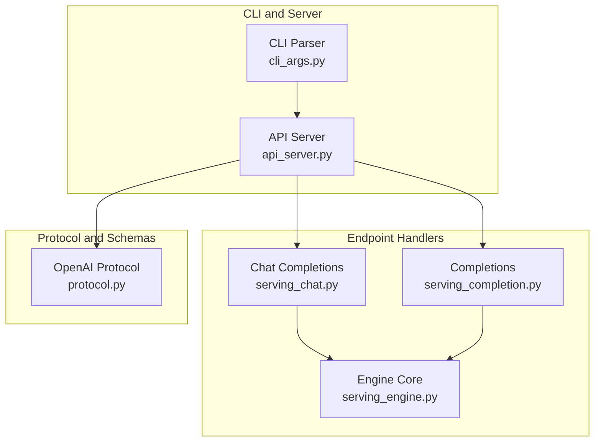
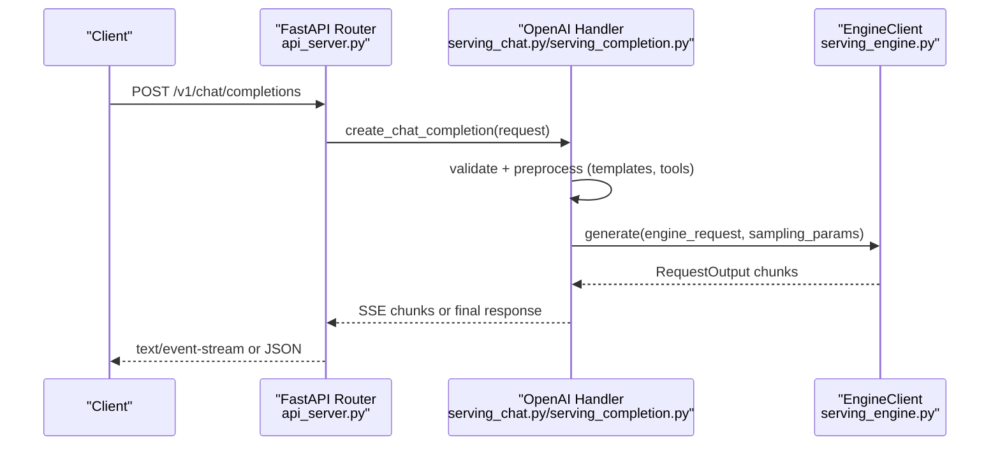
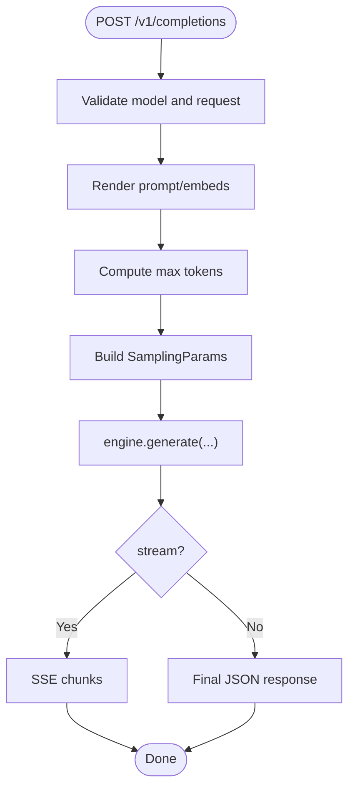
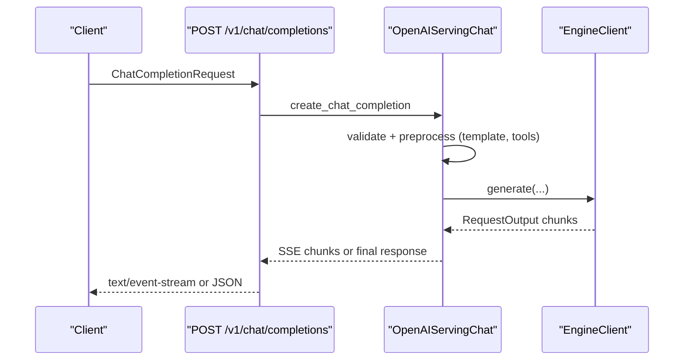
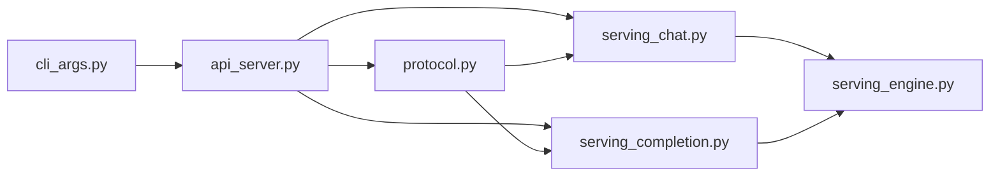

# OpenAI Compatibility

<cite>
**Referenced Files in This Document**
- [openai_compatible_server.md](file://docs/serving/openai_compatible_server.md)
- [serve.md](file://docs/cli/serve.md)
- [api_server.py](file://vllm/entrypoints/openai/api_server.py)
- [cli_args.py](file://vllm/entrypoints/openai/cli_args.py)
- [protocol.py](file://vllm/entrypoints/openai/protocol.py)
- [serving_chat.py](file://vllm/entrypoints/openai/serving_chat.py)
- [serving_completion.py](file://vllm/entrypoints/openai/serving_completion.py)
- [serving_engine.py](file://vllm/entrypoints/openai/serving_engine.py)
- [openai_chat_completion_client.py](file://examples/online_serving/openai_chat_completion_client.py)
- [openai_completion_client.py](file://examples/online_serving/openai_completion_client.py)
- [openai_embedding_client.py](file://examples/pooling/embed/openai_embedding_client.py)
- [openai_pooling_client.py](file://examples/pooling/pooling/openai_pooling_client.py)
- [openai_classification_client.py](file://examples/pooling/classify/openai_classification_client.py)
- [openai_transcription_client.py](file://examples/online_serving/openai_transcription_client.py)
- [openai_translation_client.py](file://examples/online_serving/openai_translation_client.py)
</cite>

## Table of Contents
1. [Introduction](#introduction)
2. [Project Structure](#project-structure)
3. [Core Components](#core-components)
4. [Architecture Overview](#architecture-overview)
5. [Detailed Component Analysis](#detailed-component-analysis)
6. [Dependency Analysis](#dependency-analysis)
7. [Performance Considerations](#performance-considerations)
8. [Troubleshooting Guide](#troubleshooting-guide)
9. [Conclusion](#conclusion)
10. [Appendices](#appendices)

## Introduction
This document explains how vLLM exposes an OpenAI-compatible HTTP server and CLI for local and production deployments. It covers:
- Command-line options for configuring the server, including authentication, CORS, SSL/TLS, request IDs, and advanced features
- Endpoint mapping and response formatting for Completions, Chat Completions, Embeddings, Transcriptions, Translations, and auxiliary endpoints
- How vLLM implements OpenAI API semantics, including streaming, logprobs, usage, and structured outputs
- Migration guidance from existing OpenAI applications, client compatibility notes, and behavior differences
- Authentication, rate limiting, and request validation mechanisms
- Troubleshooting and performance optimization tips for production

## Project Structure
The OpenAI-compatible server is implemented as a FastAPI application with modular handlers for each endpoint family. CLI arguments are parsed and validated to configure the server runtime.

**Diagram sources**
- [cli_args.py](file://vllm/entrypoints/openai/cli_args.py#L1-L303)
- [api_server.py](file://vllm/entrypoints/openai/api_server.py#L1-L200)
- [serving_chat.py](file://vllm/entrypoints/openai/serving_chat.py#L1-L120)
- [serving_completion.py](file://vllm/entrypoints/openai/serving_completion.py#L1-L120)
- [serving_engine.py](file://vllm/entrypoints/openai/serving_engine.py#L1-L120)
- [protocol.py](file://vllm/entrypoints/openai/protocol.py#L1-L120)

**Section sources**
- [openai_compatible_server.md](file://docs/serving/openai_compatible_server.md#L1-L120)
- [serve.md](file://docs/cli/serve.md#L1-L10)

## Core Components
- CLI argument parser and validator: defines server-wide flags such as host/port, CORS, API key, SSL, request ID headers, LoRA modules, tool parsing, and logging controls.
- API server: registers routes for OpenAI-compatible endpoints and auxiliary endpoints; applies authentication and request ID middleware; streams SSE for streaming responses.
- Protocol definitions: Pydantic models for request/response schemas, including OpenAI-compatible fields and vLLM-specific extras.
- Endpoint handlers: specialized logic for chat completions, completions, embeddings, transcriptions, translations, and pooling/classification/score endpoints.
- Engine integration: shared engine client for tokenization, generation, and encoding; batching and streaming orchestration.

Key responsibilities:
- FrontendArgs (CLI): host, port, CORS, API key, SSL, request ID headers, tool parsing, LoRA modules, logging, and performance knobs.
- API routes: /v1/chat/completions, /v1/completions, /v1/responses, /v1/audio/transcriptions, /v1/audio/translations, plus auxiliary endpoints.
- Protocol: request/response models, validation, and conversion to internal sampling/pooling parameters.
- Handlers: preprocessing prompts, applying chat templates, validating inputs, scheduling generation, and building streaming/non-streaming responses.

**Section sources**
- [cli_args.py](file://vllm/entrypoints/openai/cli_args.py#L70-L200)
- [api_server.py](file://vllm/entrypoints/openai/api_server.py#L280-L420)
- [protocol.py](file://vllm/entrypoints/openai/protocol.py#L520-L720)
- [serving_chat.py](file://vllm/entrypoints/openai/serving_chat.py#L210-L320)
- [serving_completion.py](file://vllm/entrypoints/openai/serving_completion.py#L80-L160)
- [serving_engine.py](file://vllm/entrypoints/openai/serving_engine.py#L600-L760)

## Architecture Overview
The server initializes an engine client, constructs endpoint handlers, and mounts routes. Requests are validated, transformed into engine inputs, and streamed back as OpenAI-compatible responses.

**Diagram sources**
- [api_server.py](file://vllm/entrypoints/openai/api_server.py#L470-L560)
- [serving_chat.py](file://vllm/entrypoints/openai/serving_chat.py#L210-L320)
- [serving_completion.py](file://vllm/entrypoints/openai/serving_completion.py#L80-L160)
- [serving_engine.py](file://vllm/entrypoints/openai/serving_engine.py#L600-L760)

## Detailed Component Analysis

### CLI and Server Configuration
- Host, port, Unix domain socket, uvicorn log level, access logs
- CORS: allowed origins/methods/headers
- API key authentication: bearer token validation
- SSL/TLS: key/cert/ca certs, refresh, client cert requirement
- Root path for reverse proxies
- Middleware injection
- Request ID headers: opt-in header emission
- Tool parsing: auto tool choice, parser selection, tool server integration
- LoRA modules: name=path or JSON format
- Logging: config file, max log length, docs endpoints, prompt token details, server load tracking, tokenizer info, outputs logging
- HTTP/1.1 limits: max incomplete event size and header count
- Tokens-only mode for disaggregated setups

Validation highlights:
- Chat template validity check
- Auto tool choice requires a tool parser
- Outputs logging requires request logging enabled

**Section sources**
- [cli_args.py](file://vllm/entrypoints/openai/cli_args.py#L70-L200)
- [cli_args.py](file://vllm/entrypoints/openai/cli_args.py#L283-L303)

### Authentication and Request ID Middleware
- Authentication middleware enforces Bearer token for /v1 paths (skips OPTIONS and non-/v1).
- Request ID middleware sets X-Request-Id header on responses if not provided.

Operational notes:
- API key hashing uses constant-time comparison.
- Request ID is emitted per response when enabled.

**Section sources**
- [api_server.py](file://vllm/entrypoints/openai/api_server.py#L654-L731)

### Endpoint Routing and Response Formatting
- Models listing: GET /v1/models
- Completions: POST /v1/completions (supports streaming)
- Chat Completions: POST /v1/chat/completions (supports streaming)
- Responses: POST /v1/responses and retrieval/cancel endpoints
- Transcriptions: POST /v1/audio/transcriptions (multipart/form-data)
- Translations: POST /v1/audio/translations (multipart/form-data)
- Auxiliary endpoints: load metrics, version, tokenizer info, classification, pooling, scoring

Response formatting:
- Non-streaming: JSON with choices and usage
- Streaming: Server-Sent Events with event types and data payloads
- Usage: prompt/completion/total tokens; optional prompt token details

**Section sources**
- [api_server.py](file://vllm/entrypoints/openai/api_server.py#L280-L420)
- [api_server.py](file://vllm/entrypoints/openai/api_server.py#L560-L640)

### Completions API
- Purpose: legacy text completions with prompt or prompt embeds
- Notable limitations: suffix not supported; echo with prompt embeds not supported; prompt_logprobs with prompt embeds not supported
- Features: beam search, logprobs, token IDs, usage, streaming, continuous usage stats

**Diagram sources**
- [serving_completion.py](file://vllm/entrypoints/openai/serving_completion.py#L80-L160)
- [serving_completion.py](file://vllm/entrypoints/openai/serving_completion.py#L260-L326)

**Section sources**
- [serving_completion.py](file://vllm/entrypoints/openai/serving_completion.py#L80-L160)
- [serving_completion.py](file://vllm/entrypoints/openai/serving_completion.py#L327-L518)
- [serving_completion.py](file://vllm/entrypoints/openai/serving_completion.py#L519-L731)

### Chat Completions API
- Purpose: modern chat-style prompting with messages and optional tools
- Features: streaming, logprobs, usage, echo, continue final message, structured outputs, logits processors, tool parsing, reasoning parsing
- Behavior: validates chat template availability; supports Harmony variants; auto tool choice requires parser

**Diagram sources**
- [serving_chat.py](file://vllm/entrypoints/openai/serving_chat.py#L210-L320)
- [serving_chat.py](file://vllm/entrypoints/openai/serving_chat.py#L578-L760)

**Section sources**
- [serving_chat.py](file://vllm/entrypoints/openai/serving_chat.py#L210-L320)
- [serving_chat.py](file://vllm/entrypoints/openai/serving_chat.py#L578-L760)

### Embeddings API
- Purpose: compute embeddings for text or chat-like inputs
- Supports pooling parameters and extra fields; can accept messages (chat-like) as input
- Multimodal embeddings supported via custom chat templates and request schema

**Section sources**
- [openai_compatible_server.md](file://docs/serving/openai_compatible_server.md#L259-L391)
- [openai_embedding_client.py](file://examples/pooling/embed/openai_embedding_client.py#L1-L200)

### Transcriptions and Translations API
- Purpose: ASR transcription and translation using audio models
- Supports multipart/form-data uploads; configurable audio size limit via environment variable
- Streaming and non-streaming responses; verbose JSON includes segments and timing

**Section sources**
- [openai_compatible_server.md](file://docs/serving/openai_compatible_server.md#L392-L531)
- [openai_transcription_client.py](file://examples/online_serving/openai_transcription_client.py#L1-L200)
- [openai_translation_client.py](file://examples/online_serving/openai_translation_client.py#L1-L200)

### Auxiliary Endpoints
- Load metrics: GET /load
- Version: GET /version
- Tokenizer info: optional endpoint for tokenizer metadata
- Classification, Pooling, Scoring: auxiliary endpoints for NLP tasks

**Section sources**
- [api_server.py](file://vllm/entrypoints/openai/api_server.py#L280-L320)
- [openai_pooling_client.py](file://examples/pooling/pooling/openai_pooling_client.py#L1-L200)
- [openai_classification_client.py](file://examples/pooling/classify/openai_classification_client.py#L1-L200)

### Protocol and Request Validation
- Pydantic models define OpenAI-compatible schemas and vLLM-specific extras
- Validation includes extra fields logging, structured outputs, tool parsing, and request-level constraints
- Sampling parameter conversion from requests to internal engine parameters

**Section sources**
- [protocol.py](file://vllm/entrypoints/openai/protocol.py#L520-L720)
- [protocol.py](file://vllm/entrypoints/openai/protocol.py#L1-L120)
- [serving_engine.py](file://vllm/entrypoints/openai/serving_engine.py#L635-L648)

## Dependency Analysis
- API server depends on:
  - CLI argument parser for configuration
  - Protocol models for request/response schemas
  - Endpoint handlers for business logic
  - Engine client for tokenization and generation
- Handlers depend on:
  - Protocol models for parameter conversion
  - Engine client for scheduling and streaming
  - Tool/Reasoning parsers when enabled
- Protocol models depend on:
  - SamplingParams and PoolingParams for conversion
  - Pydantic for validation

**Diagram sources**
- [cli_args.py](file://vllm/entrypoints/openai/cli_args.py#L244-L303)
- [api_server.py](file://vllm/entrypoints/openai/api_server.py#L1-L120)
- [protocol.py](file://vllm/entrypoints/openai/protocol.py#L1-L120)
- [serving_chat.py](file://vllm/entrypoints/openai/serving_chat.py#L1-L120)
- [serving_completion.py](file://vllm/entrypoints/openai/serving_completion.py#L1-L120)
- [serving_engine.py](file://vllm/entrypoints/openai/serving_engine.py#L1-L120)

**Section sources**
- [api_server.py](file://vllm/entrypoints/openai/api_server.py#L1-L120)
- [serving_engine.py](file://vllm/entrypoints/openai/serving_engine.py#L1-L120)

## Performance Considerations
- Use streaming for low-latency responses; enable continuous usage stats when needed
- Tune max tokens and truncation to fit model context length
- Prefer server-side prompt caching and prefix caching for repeated prompts
- Adjust LoRA modules and logits processors judiciously; they add overhead
- Enable request ID headers and tokenizer info endpoint for observability
- Use HTTPS/TLS and restrict CORS to trusted origins
- Monitor server load metrics endpoint for capacity planning

[No sources needed since this section provides general guidance]

## Troubleshooting Guide
Common issues and resolutions:
- Unauthorized errors: ensure Authorization header matches configured API key; OPTIONS and non-/v1 paths bypass auth
- Chat template errors: provide a valid chat template or trust request chat template; warmup helps avoid first-request latency spikes
- Unsupported features: suffix not supported in Completions; echo with prompt embeds not supported; prompt_logprobs with prompt embeds not supported
- Audio upload size exceeded: adjust VLLM_MAX_AUDIO_CLIP_FILESIZE_MB environment variable
- Tool parsing failures: enable auto tool choice and specify a valid tool parser; ensure tokenizer compatibility
- Generation errors: check engine logs and request IDs; inspect usage and prompt token details

**Section sources**
- [api_server.py](file://vllm/entrypoints/openai/api_server.py#L654-L731)
- [serving_chat.py](file://vllm/entrypoints/openai/serving_chat.py#L165-L210)
- [serving_completion.py](file://vllm/entrypoints/openai/serving_completion.py#L108-L118)
- [openai_compatible_server.md](file://docs/serving/openai_compatible_server.md#L392-L410)

## Conclusion
vLLM’s OpenAI-compatible server provides a robust, standards-aligned interface for text generation, embeddings, and audio tasks. With flexible CLI configuration, strong validation, and streaming support, it integrates seamlessly with existing OpenAI clients while exposing advanced capabilities such as structured outputs, tool parsing, and logits processors. Production deployments benefit from authentication, TLS, CORS controls, and observability features.

[No sources needed since this section summarizes without analyzing specific files]

## Appendices

### Migration Examples and Client Compatibility
- Chat Completions migration: replace base URL and API key; verify tool_choice and parallel_tool_calls behavior
- Completions migration: adjust for echo semantics and absence of suffix
- Embeddings migration: use messages interchangeably with inputs for chat-like models
- Audio tasks: switch to multipart/form-data and respect response formats

Example clients:
- Chat Completions: [openai_chat_completion_client.py](file://examples/online_serving/openai_chat_completion_client.py#L1-L200)
- Completions: [openai_completion_client.py](file://examples/online_serving/openai_completion_client.py#L1-L200)
- Embeddings: [openai_embedding_client.py](file://examples/pooling/embed/openai_embedding_client.py#L1-L200)
- Transcriptions: [openai_transcription_client.py](file://examples/online_serving/openai_transcription_client.py#L1-L200)
- Translations: [openai_translation_client.py](file://examples/online_serving/openai_translation_client.py#L1-L200)

**Section sources**
- [openai_compatible_server.md](file://docs/serving/openai_compatible_server.md#L1-L120)

### Command-Line Options Reference
- Host/port/uds, CORS, API key, SSL/TLS, middleware, request ID headers, tool parsing, LoRA modules, logging, HTTP/1.1 limits, tokens-only mode

**Section sources**
- [cli_args.py](file://vllm/entrypoints/openai/cli_args.py#L70-L200)
- [cli_args.py](file://vllm/entrypoints/openai/cli_args.py#L244-L303)