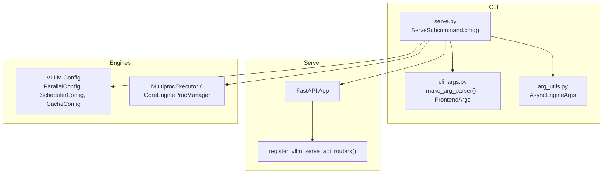
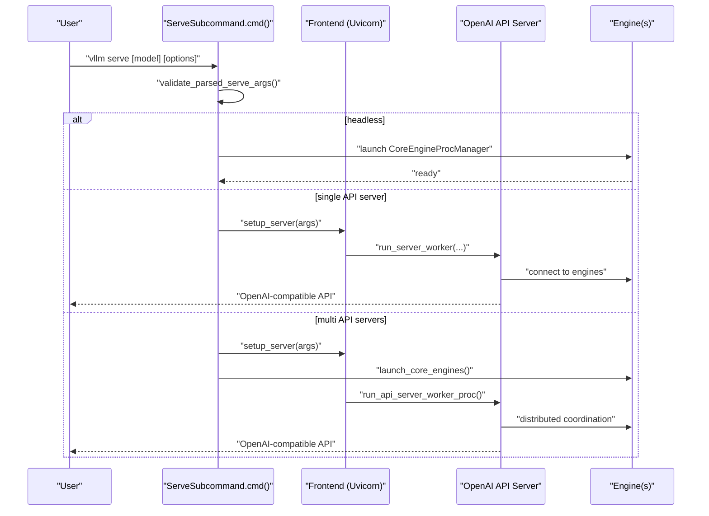
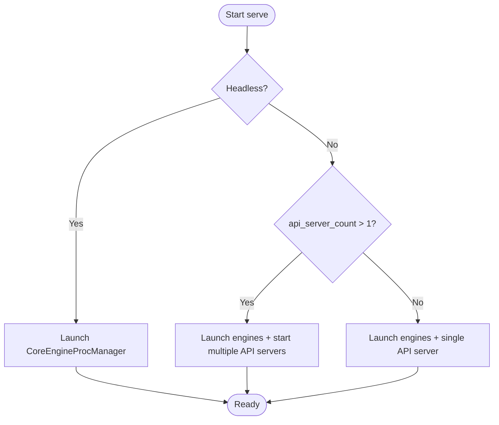
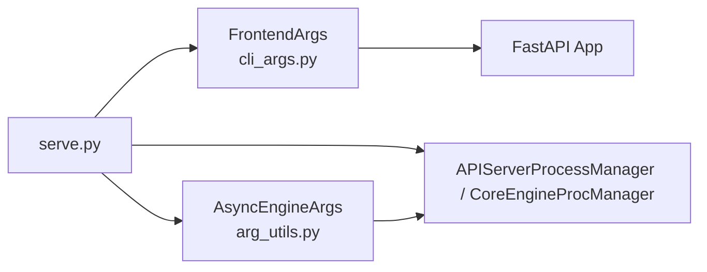

# Serve Command

<cite>
**Referenced Files in This Document**
- [serve.py](file://vllm/entrypoints/cli/serve.py)
- [cli_args.py](file://vllm/entrypoints/openai/cli_args.py)
- [arg_utils.py](file://vllm/engine/arg_utils.py)
- [serve.md](file://docs/cli/serve.md)
- [serve_args.md](file://docs/configuration/serve_args.md)
- [docker.md](file://docs/deployment/docker.md)
- [k8s.md](file://docs/deployment/k8s.md)
</cite>

## Table of Contents
1. [Introduction](#introduction)
2. [Project Structure](#project-structure)
3. [Core Components](#core-components)
4. [Architecture Overview](#architecture-overview)
5. [Detailed Component Analysis](#detailed-component-analysis)
6. [Dependency Analysis](#dependency-analysis)
7. [Performance Considerations](#performance-considerations)
8. [Troubleshooting Guide](#troubleshooting-guide)
9. [Conclusion](#conclusion)
10. [Appendices](#appendices)

## Introduction
This document provides comprehensive documentation for the vLLM serve command that launches an OpenAI-compatible API server. It covers all command-line arguments, host/port configuration, concurrency controls, resource allocation, GPU memory management, distributed deployment flags, and platform-specific optimizations. Practical examples are included for single-node, multi-node, containerized, and cloud environments. Integration guidance is provided for systemd, Docker, and Kubernetes, along with troubleshooting, performance tuning, and monitoring recommendations.

## Project Structure
The serve command is implemented as a CLI subcommand that composes frontend and engine configuration, then starts the OpenAI-compatible API server and associated model engines. The primary entrypoint wires together:
- CLI parsing and validation
- Frontend server options (host, port, CORS, TLS, middleware, logging)
- Engine configuration (model, parallelism, scheduling, memory, quantization)
- Multi-process orchestration for API servers and engines

**Diagram sources**
- [serve.py](file://vllm/entrypoints/cli/serve.py#L42-L110)
- [cli_args.py](file://vllm/entrypoints/openai/cli_args.py#L244-L303)
- [arg_utils.py](file://vllm/engine/arg_utils.py#L1-L200)

**Section sources**
- [serve.py](file://vllm/entrypoints/cli/serve.py#L42-L110)
- [cli_args.py](file://vllm/entrypoints/openai/cli_args.py#L244-L303)
- [arg_utils.py](file://vllm/engine/arg_utils.py#L1-L200)

## Core Components
- ServeSubcommand: Implements the CLI subcommand, orchestrates single or multi-API-server modes, and delegates to the OpenAI API server runner.
- FrontendArgs: Defines OpenAI-compatible server options such as host, port, Unix domain socket, CORS, API key, TLS, middleware, request ID headers, tool choice, and logging controls.
- AsyncEngineArgs: Provides engine configuration options including model selection, parallelism (tensor/pipeline/expert/data), scheduling, KV cache, quantization, and memory-related settings.
- Argument parsing and validation: Centralized in the CLI module and validated against engine and frontend constraints.

Key argument categories exposed by the serve command:
- Model specification and resolution
- Host and port configuration (including Unix domain sockets)
- Concurrency and API server count
- Resource allocation and memory management
- Distributed deployment flags
- Platform-specific optimizations
- Logging, security, and observability

**Section sources**
- [serve.py](file://vllm/entrypoints/cli/serve.py#L42-L110)
- [cli_args.py](file://vllm/entrypoints/openai/cli_args.py#L71-L242)
- [arg_utils.py](file://vllm/engine/arg_utils.py#L1-L200)

## Architecture Overview
The serve command supports three operational modes:
- Headless mode: Runs engines without the API server, suitable for multi-node data parallel deployments.
- Single API server: Runs one API server process backed by one or more engines.
- Multi-API-server mode: Spawns multiple API server processes coordinated with engines.

**Diagram sources**
- [serve.py](file://vllm/entrypoints/cli/serve.py#L42-L110)
- [serve.py](file://vllm/entrypoints/cli/serve.py#L162-L234)

## Detailed Component Analysis

### Command-Line Arguments: Frontend (OpenAI-Compatible Server)
The frontend options define how the API server listens, authenticates, and serves requests. These include:
- Host and port binding, Unix domain socket support
- CORS configuration (origins, methods, headers)
- API key enforcement
- TLS configuration (key/cert/ca and refresh)
- Request ID headers, auto tool choice, tool parser selection
- Middleware injection
- Logging and request/response logging controls
- Security and developer-mode toggles

These are defined in the FrontendArgs class and registered via the CLI argument parser.

**Section sources**
- [cli_args.py](file://vllm/entrypoints/openai/cli_args.py#L71-L242)

### Command-Line Arguments: Engine Configuration
Engine configuration options include:
- Model specification and tokenizer settings
- Parallelism configuration (tensor, pipeline, expert, data)
- Scheduler policy and batching parameters
- KV cache sizing, block size, offloading, and dtype
- Quantization and LoRA modules
- Device/runtime settings and platform-specific optimizations
- Structured outputs and speculative decoding options

These are provided by AsyncEngineArgs and integrated into the CLI parser.

**Section sources**
- [arg_utils.py](file://vllm/engine/arg_utils.py#L1-L200)

### Multi-Process Orchestration
The serve command supports running multiple API server processes and coordinating them with engines:
- API server count control
- Prometheus metrics setup for multi-process environments
- Handshake and statistics publishing addresses for distributed setups
- Graceful shutdown handling

**Diagram sources**
- [serve.py](file://vllm/entrypoints/cli/serve.py#L81-L161)
- [serve.py](file://vllm/entrypoints/cli/serve.py#L162-L234)

**Section sources**
- [serve.py](file://vllm/entrypoints/cli/serve.py#L81-L161)
- [serve.py](file://vllm/entrypoints/cli/serve.py#L162-L234)

### GPU Memory Management Settings
GPU memory management is controlled via engine configuration:
- KV cache sizing and block size
- KV cache dtype selection
- Offloading backends and sizes
- Max total memory fraction for model weights
- Chunked prefill and batch token limits
- Quantization settings affecting memory footprint

These options are part of the engine configuration and influence memory allocation and utilization during inference.

**Section sources**
- [arg_utils.py](file://vllm/engine/arg_utils.py#L1-L200)

### Distributed Deployment Flags
Distributed deployment is supported through:
- Headless mode for multi-node data parallel
- Data parallel rank and master address/port
- External and hybrid data parallel load balancing
- Multiprocess Prometheus metrics
- Coordinator-based stats publishing

These flags enable multi-node and multi-process deployments with coordinated engine/API server processes.

**Section sources**
- [serve.py](file://vllm/entrypoints/cli/serve.py#L81-L161)
- [serve.py](file://vllm/entrypoints/cli/serve.py#L162-L234)

### Platform-Specific Optimizations
Platform-specific considerations include:
- CPU architectures and optimized kernels
- ROCm/AMD GPU support
- CUDA architecture targeting and build flags
- Shared memory (IPC) requirements for tensor parallel inference
- Optional dependencies and custom builds

These are reflected in engine configuration and deployment documentation.

**Section sources**
- [arg_utils.py](file://vllm/engine/arg_utils.py#L1-L200)
- [docker.md](file://docs/deployment/docker.md#L1-L153)
- [k8s.md](file://docs/deployment/k8s.md#L1-L398)

### Practical Examples

#### Single-Node Deployment
- Basic usage with default host/port
- Binding to a specific host and port
- Enabling TLS and API key protection
- Enabling tool choice and tool parser

**Section sources**
- [serve.md](file://docs/cli/serve.md#L1-L10)
- [cli_args.py](file://vllm/entrypoints/openai/cli_args.py#L71-L242)

#### Multi-Node Deployment
- Headless mode for engine-only nodes
- Master address and port configuration
- External or hybrid data parallel load balancing

**Section sources**
- [serve.py](file://vllm/entrypoints/cli/serve.py#L81-L161)

#### Containerized Setup (Docker)
- Using the official image with GPU access
- Mounting Hugging Face cache and passing credentials
- Exposing port and enabling shared memory
- Building custom images with optional dependencies

**Section sources**
- [docker.md](file://docs/deployment/docker.md#L1-L153)

#### Cloud Platform Configuration (Kubernetes)
- CPU-only and GPU-enabled deployments
- Persistent volumes for model cache
- Shared memory via emptyDir
- Probes and liveness/readiness configuration
- Example manifests for NVIDIA and AMD GPUs

**Section sources**
- [k8s.md](file://docs/deployment/k8s.md#L1-L398)

### Integration with Systemd, Docker, and Kubernetes
- Systemd: Use ExecStart to run the serve command with desired arguments and environment variables.
- Docker: Use the official image, pass model and engine arguments, and configure GPU devices and shared memory.
- Kubernetes: Define Deployment and Service resources, set probes, and manage secrets for gated models.

**Section sources**
- [docker.md](file://docs/deployment/docker.md#L1-L153)
- [k8s.md](file://docs/deployment/k8s.md#L1-L398)

## Dependency Analysis
The serve command composes frontend and engine configurations and orchestrates processes. The CLI depends on:
- FrontendArgs for server options
- AsyncEngineArgs for engine configuration
- Process managers for multi-API-server and headless modes

**Diagram sources**
- [serve.py](file://vllm/entrypoints/cli/serve.py#L42-L110)
- [cli_args.py](file://vllm/entrypoints/openai/cli_args.py#L244-L303)
- [arg_utils.py](file://vllm/engine/arg_utils.py#L1-L200)

**Section sources**
- [serve.py](file://vllm/entrypoints/cli/serve.py#L42-L110)
- [cli_args.py](file://vllm/entrypoints/openai/cli_args.py#L244-L303)
- [arg_utils.py](file://vllm/engine/arg_utils.py#L1-L200)

## Performance Considerations
- Tune max_num_batched_tokens and enable chunked prefill for throughput
- Adjust KV cache block size and dtype to balance memory vs. speed
- Use appropriate parallelism (tensor/pipeline/expert/data) for model and hardware
- Enable structured outputs and speculative decoding when beneficial
- Monitor Prometheus metrics and adjust concurrency based on observed saturation

[No sources needed since this section provides general guidance]

## Troubleshooting Guide
Common issues and resolutions:
- Startup or readiness probe failures in Kubernetes leading to container restarts
- Insufficient shared memory for tensor parallel inference
- Model download delays and gated model access via secrets
- Incorrect API server count in headless mode
- Validation errors for tool choice and logging flags

**Section sources**
- [k8s.md](file://docs/deployment/k8s.md#L384-L398)
- [docker.md](file://docs/deployment/docker.md#L1-L153)
- [cli_args.py](file://vllm/entrypoints/openai/cli_args.py#L283-L297)
- [serve.py](file://vllm/entrypoints/cli/serve.py#L81-L110)

## Conclusion
The vLLM serve command provides a flexible, configurable OpenAI-compatible API server with strong support for single-node and distributed deployments. By combining frontend and engine configuration, it enables efficient serving across diverse environments including Docker and Kubernetes. Proper tuning of engine and frontend options, along with robust monitoring and observability, ensures reliable and high-performance model serving.

[No sources needed since this section summarizes without analyzing specific files]

## Appendices

### Appendix A: CLI Reference Overview
- The CLI reference is generated from the serve command’s argument groups and documented in the CLI docs.
- Configuration can be loaded from a YAML file, with command-line overrides taking precedence.

**Section sources**
- [serve.md](file://docs/cli/serve.md#L1-L10)
- [serve_args.md](file://docs/configuration/serve_args.md#L1-L36)