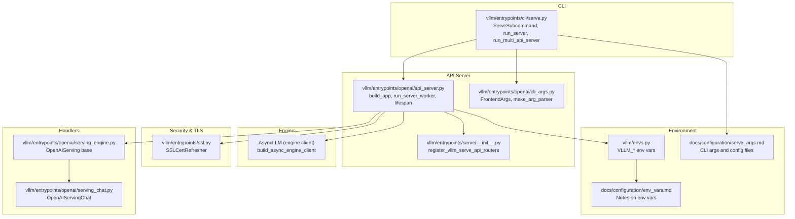
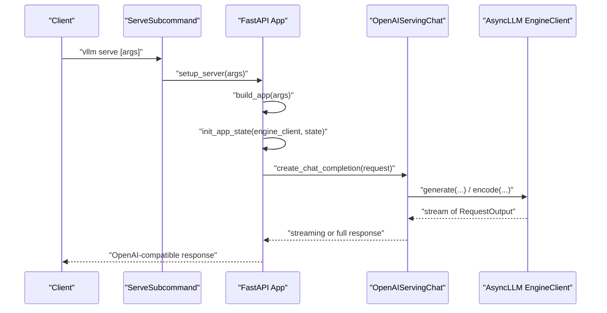
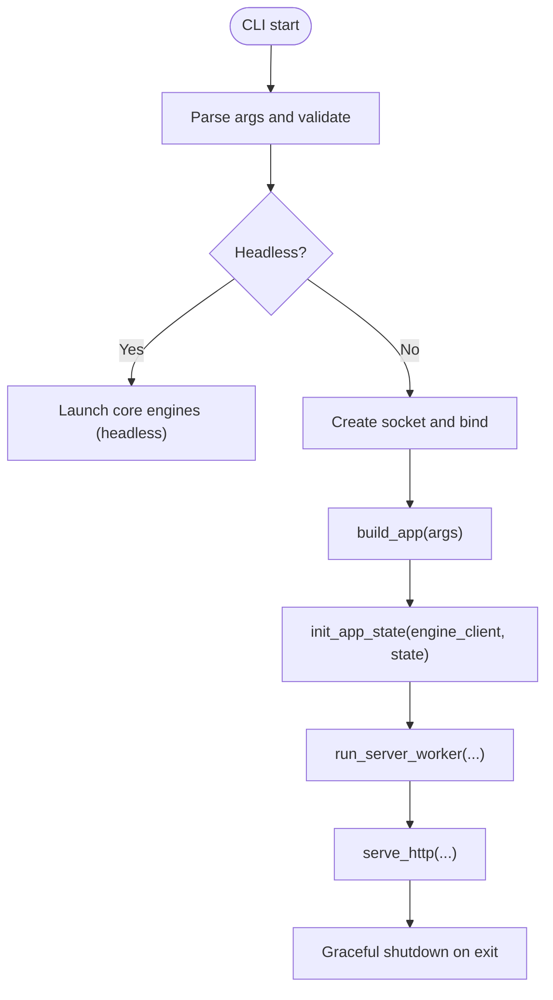
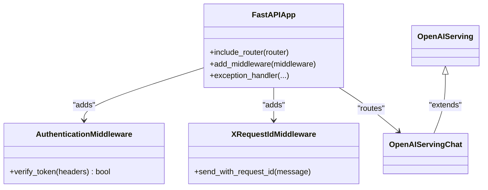
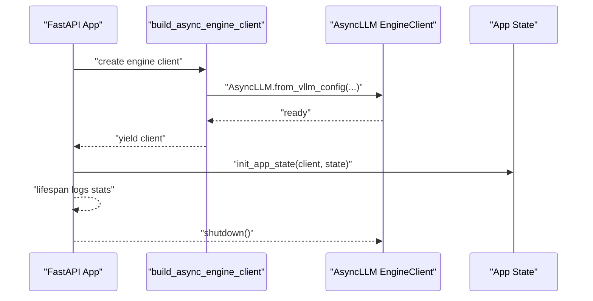
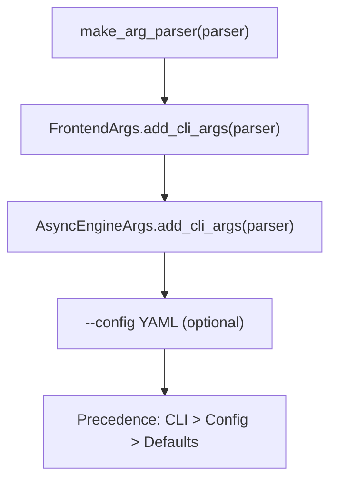
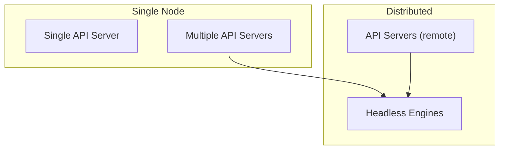
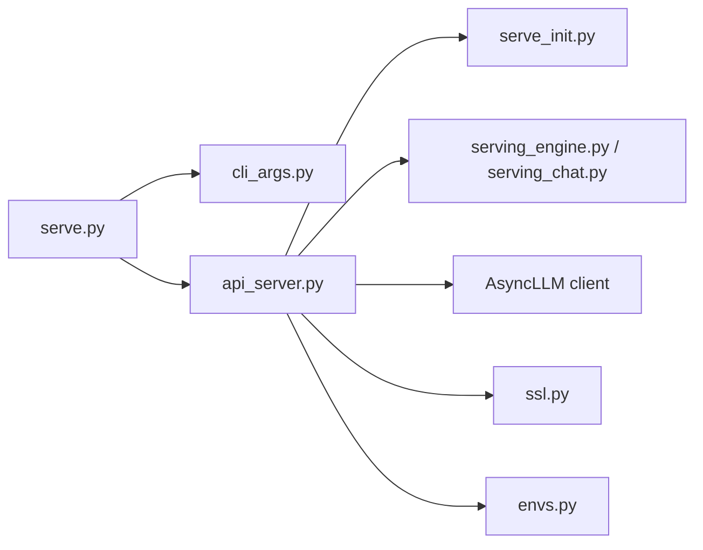

# API Server Setup and Configuration

<cite>
**Referenced Files in This Document**
- [api_server.py](file://vllm/entrypoints/openai/api_server.py)
- [cli_args.py](file://vllm/entrypoints/openai/cli_args.py)
- [serve.py](file://vllm/entrypoints/cli/serve.py)
- [serve_init.py](file://vllm/entrypoints/serve/__init__.py)
- [serving_engine.py](file://vllm/entrypoints/openai/serving_engine.py)
- [serving_chat.py](file://vllm/entrypoints/openai/serving_chat.py)
- [ssl.py](file://vllm/entrypoints/ssl.py)
- [envs.py](file://vllm/envs.py)
- [env_vars.md](file://docs/configuration/env_vars.md)
- [serve_args.md](file://docs/configuration/serve_args.md)
</cite>

## Table of Contents
1. [Introduction](#introduction)
2. [Project Structure](#project-structure)
3. [Core Components](#core-components)
4. [Architecture Overview](#architecture-overview)
5. [Detailed Component Analysis](#detailed-component-analysis)
6. [Dependency Analysis](#dependency-analysis)
7. [Performance Considerations](#performance-considerations)
8. [Troubleshooting Guide](#troubleshooting-guide)
9. [Conclusion](#conclusion)
10. [Appendices](#appendices)

## Introduction
This document explains how to set up and configure the vLLM OpenAI-compatible API server. It covers server initialization, command-line and configuration options, FastAPI application structure, middleware (authentication, CORS, request ID), engine client lifecycle, startup and shutdown, environment variables, SSL/TLS, performance tuning, and deployment scenarios from single-node to distributed setups. It also documents health checks, graceful shutdown, and resource management strategies.

## Project Structure
The OpenAI-compatible API server is implemented as a FastAPI application with modular routers and handlers. The CLI orchestrates server startup, handles multi-process and distributed deployments, and wires the application state with the asynchronous engine client.

**Diagram sources**
- [serve.py](file://vllm/entrypoints/cli/serve.py#L1-L250)
- [api_server.py](file://vllm/entrypoints/openai/api_server.py#L868-L979)
- [cli_args.py](file://vllm/entrypoints/openai/cli_args.py#L1-L303)
- [serve_init.py](file://vllm/entrypoints/serve/__init__.py#L1-L90)
- [serving_engine.py](file://vllm/entrypoints/openai/serving_engine.py#L1-L200)
- [serving_chat.py](file://vllm/entrypoints/openai/serving_chat.py#L1-L120)
- [ssl.py](file://vllm/entrypoints/ssl.py#L1-L79)
- [envs.py](file://vllm/envs.py#L448-L800)
- [env_vars.md](file://docs/configuration/env_vars.md#L1-L13)
- [serve_args.md](file://docs/configuration/serve_args.md#L1-L36)

**Section sources**
- [serve.py](file://vllm/entrypoints/cli/serve.py#L1-L250)
- [api_server.py](file://vllm/entrypoints/openai/api_server.py#L868-L979)
- [cli_args.py](file://vllm/entrypoints/openai/cli_args.py#L1-L303)
- [serve_init.py](file://vllm/entrypoints/serve/__init__.py#L1-L90)
- [envs.py](file://vllm/envs.py#L448-L800)
- [env_vars.md](file://docs/configuration/env_vars.md#L1-L13)
- [serve_args.md](file://docs/configuration/serve_args.md#L1-L36)

## Core Components
- CLI entrypoint and orchestration:
  - The CLI subcommand parses arguments, validates them, and starts either a single API server or multiple API servers with distributed engines.
  - It manages headless mode, multi-API server processes, and Prometheus multiprocess metrics.
- FastAPI application:
  - Builds the app, registers routers, applies middleware (CORS, authentication, request ID, scaling), and initializes application state with engine clients and handler instances.
- Engine client lifecycle:
  - Asynchronous engine client is created, initialized, and shut down within a context manager. Supports in-process and multiprocess modes.
- Handlers:
  - Base handler class and specialized handlers (chat, completions, embeddings, transcriptions, etc.) implement request processing, tokenization, sampling, and streaming.
- Security and TLS:
  - Optional SSL refresh monitors certificate and CA file changes and reloads contexts automatically.
- Environment variables and configuration:
  - Extensive environment variables control logging, timeouts, attention backends, multiprocess behavior, and more.
  - CLI supports YAML configuration files with precedence rules.

**Section sources**
- [serve.py](file://vllm/entrypoints/cli/serve.py#L1-L250)
- [api_server.py](file://vllm/entrypoints/openai/api_server.py#L868-L979)
- [serving_engine.py](file://vllm/entrypoints/openai/serving_engine.py#L1-L200)
- [serving_chat.py](file://vllm/entrypoints/openai/serving_chat.py#L1-L120)
- [ssl.py](file://vllm/entrypoints/ssl.py#L1-L79)
- [envs.py](file://vllm/envs.py#L448-L800)
- [env_vars.md](file://docs/configuration/env_vars.md#L1-L13)
- [serve_args.md](file://docs/configuration/serve_args.md#L1-L36)

## Architecture Overview
The server follows a layered architecture:
- CLI layer: argument parsing, validation, and process orchestration.
- Application layer: FastAPI app with routers and middleware.
- Handler layer: OpenAI-compatible endpoints backed by engine clients.
- Engine layer: AsyncLLM engine client (in-process or multiprocess).
- Security layer: SSL refresh, authentication, CORS, and request ID middleware.

**Diagram sources**
- [serve.py](file://vllm/entrypoints/cli/serve.py#L1-L250)
- [api_server.py](file://vllm/entrypoints/openai/api_server.py#L868-L979)
- [serving_chat.py](file://vllm/entrypoints/openai/serving_chat.py#L200-L450)

## Detailed Component Analysis

### Server Initialization and Startup
- CLI entrypoint:
  - Parses arguments, validates, and runs either a single API server or multiple API servers.
  - Supports headless mode for distributed deployments and sets up multiprocess Prometheus when needed.
- Application bootstrap:
  - Creates sockets (TCP or Unix), binds, and sets ulimit to prevent request drops.
  - Builds the FastAPI app, registers routers, and initializes application state.
- Application state initialization:
  - Creates engine client, determines supported tasks, resolves chat template, configures tool servers, and instantiates handlers for models, chat, completions, embeddings, tokenization, transcriptions, translations, and tokens-only endpoints.
- SSL/TLS:
  - Accepts SSL key/cert/ca and optional refresh; integrates with uvicorn and optional file watchers.

**Diagram sources**
- [serve.py](file://vllm/entrypoints/cli/serve.py#L81-L250)
- [api_server.py](file://vllm/entrypoints/openai/api_server.py#L1240-L1381)

**Section sources**
- [serve.py](file://vllm/entrypoints/cli/serve.py#L1-L250)
- [api_server.py](file://vllm/entrypoints/openai/api_server.py#L1240-L1381)

### FastAPI Application Structure and Middleware
- App construction:
  - FastAPI instance with optional OpenAPI/Swagger/Redoc based on flags.
  - Registers vLLM-specific routers (serve, lora, elastic EP, profile, sleep, RPC, cache, tokenize, disagg, RLHF, metrics, health, server info).
  - Includes OpenAI router and pooling routers.
- Middleware stack:
  - CORS configured via allowed origins/methods/headers.
  - Optional authentication middleware enforcing Bearer tokens.
  - Optional request ID middleware adding X-Request-Id to responses.
  - Scaling middleware integrated.
  - Optional response logging middleware for debugging.
  - Additional user-defined middleware via import paths.
- Exception handling:
  - Converts HTTPException and validation errors to standardized ErrorResponse.

**Diagram sources**
- [api_server.py](file://vllm/entrypoints/openai/api_server.py#L868-L979)
- [serve_init.py](file://vllm/entrypoints/serve/__init__.py#L1-L90)
- [serving_engine.py](file://vllm/entrypoints/openai/serving_engine.py#L1-L200)

**Section sources**
- [api_server.py](file://vllm/entrypoints/openai/api_server.py#L868-L979)
- [serve_init.py](file://vllm/entrypoints/serve/__init__.py#L1-L90)

### Engine Client Lifecycle Management
- Creation:
  - Builds AsyncLLM engine client from CLI arguments and engine configuration.
  - Supports multiprocess mode with configurable client count and index.
- Initialization:
  - Resets multimodal caches, initializes handlers, and prepares supported tasks.
- Shutdown:
  - Ensures client shutdown and cleanup on exit; lifespan manager logs stats periodically if enabled.

**Diagram sources**
- [api_server.py](file://vllm/entrypoints/openai/api_server.py#L144-L231)
- [api_server.py](file://vllm/entrypoints/openai/api_server.py#L981-L1180)

**Section sources**
- [api_server.py](file://vllm/entrypoints/openai/api_server.py#L144-L231)
- [api_server.py](file://vllm/entrypoints/openai/api_server.py#L981-L1180)

### Command-Line Arguments and Configuration
- Frontend arguments (selected):
  - Host/port, Unix domain socket, uvicorn log level, CORS settings, API key, SSL files and refresh, root path, middleware list, request ID headers, tool choice and parser, tool server, logging config, prompt tokens details, server load tracking, tokens-only mode, and more.
- Engine arguments:
  - Loaded via AsyncEngineArgs; combined with frontend args in the CLI parser.
- Configuration file:
  - YAML config file supported; CLI arguments take precedence over config file values.

**Diagram sources**
- [cli_args.py](file://vllm/entrypoints/openai/cli_args.py#L1-L303)
- [serve_args.md](file://docs/configuration/serve_args.md#L1-L36)

**Section sources**
- [cli_args.py](file://vllm/entrypoints/openai/cli_args.py#L1-L303)
- [serve_args.md](file://docs/configuration/serve_args.md#L1-L36)

### Environment Variables
- Logging and debugging:
  - Logging configuration path, level, stream, prefix, color, and debug response logging toggle.
- Server behavior:
  - Keep-alive timeout, stats logging interval, development mode toggles, and multiprocess worker method.
- Attention and kernels:
  - Backend selection, FlashInfer sampler, and related tuning flags.
- Distributed and IPC:
  - Host IP, port, RPC base path, and related distributed settings.
- Media and timeouts:
  - Image/video/audio fetch timeouts, media loader backend, connector, and thread counts.
- Security:
  - API key and SSL-related variables.

Consult the environment variables reference for the authoritative list and semantics.

**Section sources**
- [envs.py](file://vllm/envs.py#L448-L800)
- [env_vars.md](file://docs/configuration/env_vars.md#L1-L13)

### SSL/TLS Setup and Refresh
- SSL configuration:
  - Key/cert/ca paths and certificate requirements are passed to uvicorn.
- Automatic refresh:
  - Optional file watchers monitor certificate and CA file changes and reload SSL contexts without restart.
- CAUTION:
  - Enabling response logging in the API server can expose sensitive data and should be avoided in production.

**Section sources**
- [api_server.py](file://vllm/entrypoints/openai/api_server.py#L1302-L1366)
- [ssl.py](file://vllm/entrypoints/ssl.py#L1-L79)

### Health Checks and Metrics
- Health endpoint:
  - vLLM serve routers include a health endpoint; consult the serve router registration for exact path.
- Server load metrics:
  - Optional endpoint returns server load metrics; can be enabled via frontend argument.
- Instrumentation:
  - Additional instrumentation routers (metrics, server info) are registered conditionally.

**Section sources**
- [serve_init.py](file://vllm/entrypoints/serve/__init__.py#L1-L90)
- [api_server.py](file://vllm/entrypoints/openai/api_server.py#L281-L300)

### Graceful Shutdown and Signal Handling
- Signal handling:
  - SIGTERM/SIGINT handlers interrupt during initialization; normal shutdown awaits server task completion.
- Socket cleanup:
  - Server closes the listening socket upon exit.
- Engine shutdown:
  - Engine client is explicitly shut down in the application lifecycle context.

**Section sources**
- [api_server.py](file://vllm/entrypoints/openai/api_server.py#L1240-L1381)
- [serve.py](file://vllm/entrypoints/cli/serve.py#L1-L250)

### Deployment Scenarios
- Single-node, single API server:
  - Run the CLI with model tag and desired frontend arguments; server listens on TCP or Unix socket.
- Single-node, multiple API servers:
  - Use the CLI to launch multiple API server processes; Prometheus multiprocess metrics are enabled when multiple servers are used.
- Headless mode:
  - Launch engines without API servers; useful for distributed deployments where API servers run separately.
- Distributed deployments:
  - Use headless mode and multi-node process groups; engines coordinate via RPC and handshakes.

**Diagram sources**
- [serve.py](file://vllm/entrypoints/cli/serve.py#L81-L250)

**Section sources**
- [serve.py](file://vllm/entrypoints/cli/serve.py#L1-L250)

## Dependency Analysis
- CLI depends on:
  - Argument parsers (frontend and engine), server setup, and process managers.
- API server depends on:
  - Routers (vLLM serve, pooling), engine client, and handler classes.
- Handlers depend on:
  - Engine client, tokenizer, and model configuration.
- Security and TLS:
  - SSL refresh relies on file watching and SSL context reload.

**Diagram sources**
- [serve.py](file://vllm/entrypoints/cli/serve.py#L1-L250)
- [cli_args.py](file://vllm/entrypoints/openai/cli_args.py#L1-L303)
- [api_server.py](file://vllm/entrypoints/openai/api_server.py#L868-L979)
- [serve_init.py](file://vllm/entrypoints/serve/__init__.py#L1-L90)
- [serving_engine.py](file://vllm/entrypoints/openai/serving_engine.py#L1-L200)
- [serving_chat.py](file://vllm/entrypoints/openai/serving_chat.py#L1-L120)
- [ssl.py](file://vllm/entrypoints/ssl.py#L1-L79)
- [envs.py](file://vllm/envs.py#L448-L800)

**Section sources**
- [serve.py](file://vllm/entrypoints/cli/serve.py#L1-L250)
- [api_server.py](file://vllm/entrypoints/openai/api_server.py#L868-L979)

## Performance Considerations
- Multiprocessing and worker method:
  - Configure worker multiprocess method and consider forkserver preload for heavy modules.
- Attention backends and FlashInfer:
  - Tune attention backend and FlashInfer sampler flags for performance.
- Logging and stats:
  - Adjust logging intervals and disable stats logging in production if unnecessary.
- Timeouts:
  - Tune HTTP keep-alive and engine iteration timeouts for workload characteristics.
- Tokenizer and microbatching:
  - Handlers leverage async tokenizer pools and microbatching to reduce overhead.

[No sources needed since this section provides general guidance]

## Troubleshooting Guide
- Authentication failures:
  - Ensure API key matches the expected hash and is provided via CLI or environment variable.
- SSL/TLS issues:
  - Verify key/cert paths and permissions; enable refresh to reload on file changes.
- Excessive requests leading to drops:
  - Increase ulimit before startup; ensure socket reuse options are set.
- Validation errors:
  - The server converts validation errors to standardized ErrorResponse; check request payload and model capabilities.
- Logging sensitive data:
  - Avoid enabling response logging in production.

**Section sources**
- [api_server.py](file://vllm/entrypoints/openai/api_server.py#L654-L731)
- [api_server.py](file://vllm/entrypoints/openai/api_server.py#L939-L963)
- [ssl.py](file://vllm/entrypoints/ssl.py#L1-L79)

## Conclusion
The vLLM OpenAI-compatible API server is a modular, production-ready FastAPI application. It supports single-node and distributed deployments, robust middleware (CORS, auth, request ID), flexible configuration via CLI and YAML, and secure TLS with automatic refresh. Proper environment variable configuration and careful tuning of performance-related flags enable efficient serving across varied workloads.

[No sources needed since this section summarizes without analyzing specific files]

## Appendices

### Appendix A: Key Endpoints and Handlers
- Models: lists served models and LoRA modules.
- Chat Completions: OpenAI-compatible chat endpoint with streaming and non-streaming modes.
- Completions: legacy completions endpoint.
- Embeddings, Pooling, Classification, Scores: pooling and classification endpoints.
- Tokenization: tokenization endpoint.
- Audio Transcriptions and Translations: speech-to-text endpoints.
- Tokens-only: tokens-in/out endpoint for disaggregated setups.
- Internal: load metrics, version, health, and server info.

**Section sources**
- [api_server.py](file://vllm/entrypoints/openai/api_server.py#L281-L639)
- [serve_init.py](file://vllm/entrypoints/serve/__init__.py#L1-L90)