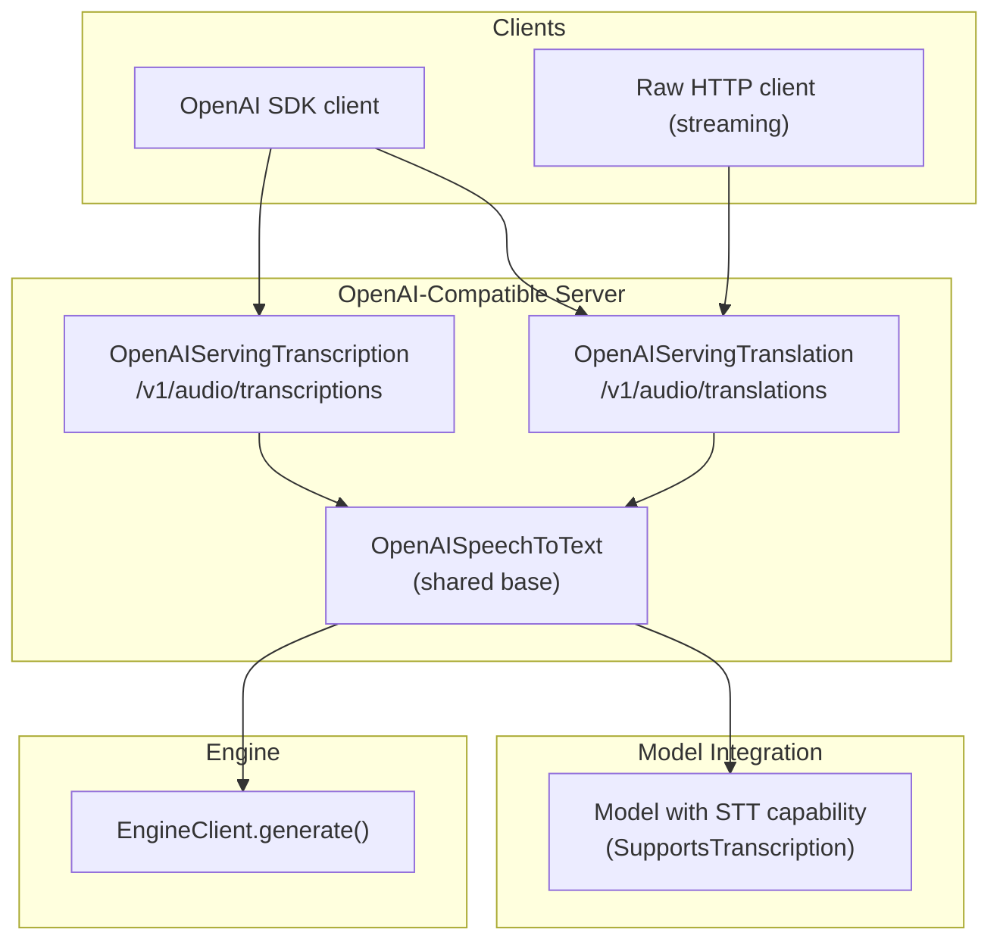
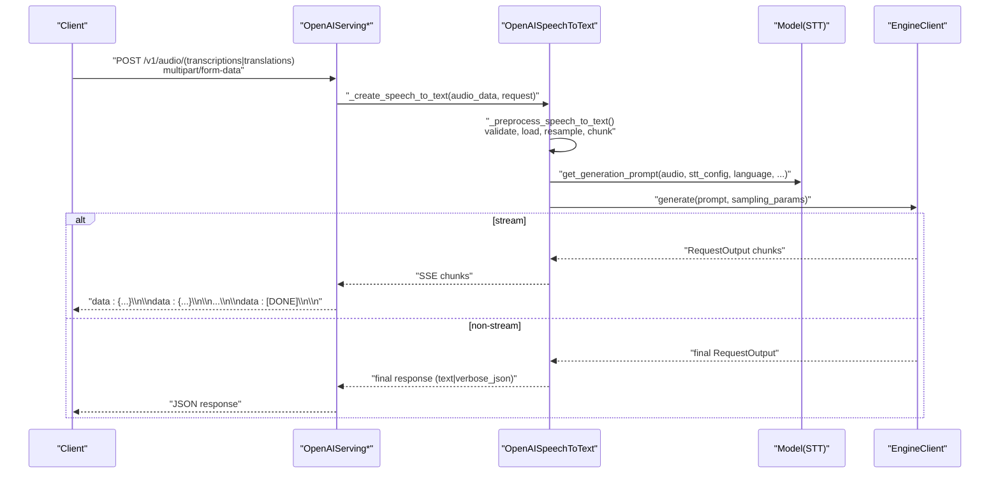
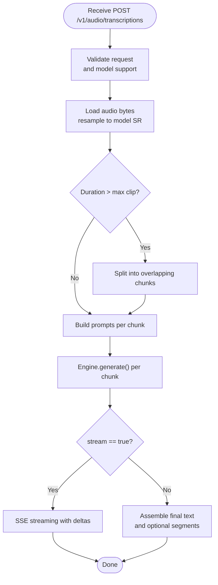
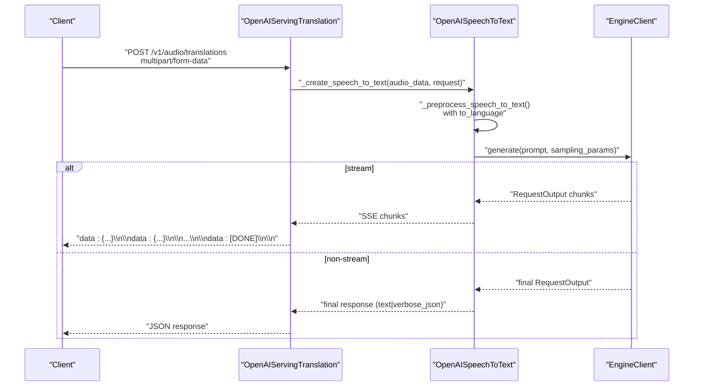
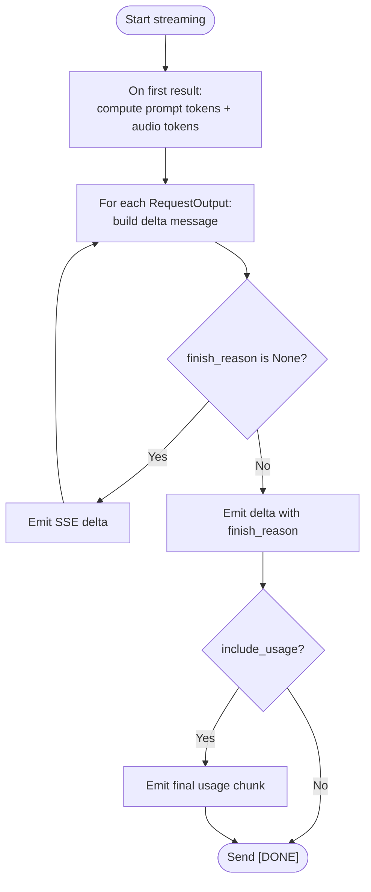
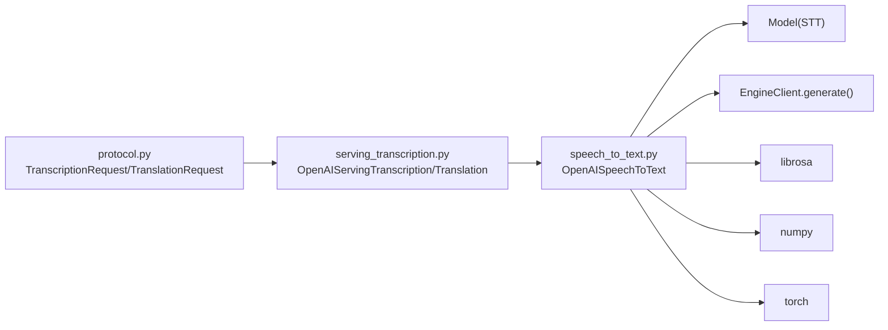

# Audio Processing Endpoints

<cite>
**Referenced Files in This Document**
- [serving_transcription.py](file://vllm/entrypoints/openai/serving_transcription.py)
- [speech_to_text.py](file://vllm/entrypoints/openai/speech_to_text.py)
- [protocol.py](file://vllm/entrypoints/openai/protocol.py)
- [openai_transcription_client.py](file://examples/online_serving/openai_transcription_client.py)
- [openai_translation_client.py](file://examples/online_serving/openai_translation_client.py)
- [audio.py](file://vllm/assets/audio.py)
- [audio_media_io.py](file://vllm/multimodal/audio.py)
- [test_transcription_validation.py](file://tests/entrypoints/openai/test_transcription_validation.py)
- [test_translation_validation.py](file://tests/entrypoints/openai/test_translation_validation.py)
</cite>

## Table of Contents
1. [Introduction](#introduction)
2. [Project Structure](#project-structure)
3. [Core Components](#core-components)
4. [Architecture Overview](#architecture-overview)
5. [Detailed Component Analysis](#detailed-component-analysis)
6. [Dependency Analysis](#dependency-analysis)
7. [Performance Considerations](#performance-considerations)
8. [Troubleshooting Guide](#troubleshooting-guide)
9. [Conclusion](#conclusion)
10. [Appendices](#appendices)

## Introduction
This document describes the audio processing endpoints for transcription and translation in the vLLM OpenAI-compatible server. It covers multipart form data requirements, supported audio formats, file upload procedures, request schemas, streaming behavior, error handling, performance characteristics, and client implementation examples. It also explains the relationship between transcription and translation models, supported languages, and quality settings.

## Project Structure
The audio processing functionality is implemented in the OpenAI-compatible entrypoints and integrates with model-specific speech-to-text capabilities. Key areas:
- Endpoint handlers for transcription and translation
- Shared speech-to-text base class implementing preprocessing, streaming, and response assembly
- Protocol definitions for request/response schemas
- Example clients demonstrating synchronous and streaming usage
- Audio asset utilities and media IO helpers

**Diagram sources**
- [serving_transcription.py](file://vllm/entrypoints/openai/serving_transcription.py#L31-L169)
- [speech_to_text.py](file://vllm/entrypoints/openai/speech_to_text.py#L67-L120)
- [protocol.py](file://vllm/entrypoints/openai/protocol.py#L1958-L2247)

**Section sources**
- [serving_transcription.py](file://vllm/entrypoints/openai/serving_transcription.py#L31-L169)
- [speech_to_text.py](file://vllm/entrypoints/openai/speech_to_text.py#L67-L120)
- [protocol.py](file://vllm/entrypoints/openai/protocol.py#L1958-L2247)

## Core Components
- OpenAIServingTranscription: Handles POST /v1/audio/transcriptions, delegates to shared speech-to-text logic, and supports both JSON and verbose JSON responses, plus SSE streaming.
- OpenAIServingTranslation: Handles POST /v1/audio/translations, mirrors transcription behavior, and supports streaming via raw HTTP.
- OpenAISpeechToText: Shared base class performing audio preprocessing, chunking, prompt construction, sampling parameter conversion, streaming, and response assembly.
- Protocol schemas: TranscriptionRequest, TranslationRequest, and related response types define the request/response contract.
- Example clients: Demonstrate OpenAI SDK usage and raw HTTP streaming for translations.

Key responsibilities:
- Audio ingestion and validation (file size limits, format decoding)
- Resampling to model sample rate
- Segment-based chunking for long audio
- Tokenization and verbose segment extraction for Whisper-style timestamp tokens
- Streaming via Server-Sent Events (SSE) with optional continuous usage stats
- Error propagation and graceful handling of invalid inputs

**Section sources**
- [serving_transcription.py](file://vllm/entrypoints/openai/serving_transcription.py#L31-L169)
- [speech_to_text.py](file://vllm/entrypoints/openai/speech_to_text.py#L240-L528)
- [protocol.py](file://vllm/entrypoints/openai/protocol.py#L1958-L2247)
- [openai_transcription_client.py](file://examples/online_serving/openai_transcription_client.py#L1-L98)
- [openai_translation_client.py](file://examples/online_serving/openai_translation_client.py#L1-L76)

## Architecture Overview
The request lifecycle for both endpoints follows a consistent flow:
1. Client sends multipart/form-data with the audio file and parameters.
2. Server validates model support and request parameters.
3. Audio is decoded and optionally resampled to the model’s required sample rate.
4. Audio is split into overlapping chunks if duration exceeds configured thresholds.
5. For each chunk, a generation prompt is constructed by the model class.
6. Engine generates tokens asynchronously; streaming yields SSE chunks.
7. Non-streaming responses assemble final text and optional verbose segments.

**Diagram sources**
- [serving_transcription.py](file://vllm/entrypoints/openai/serving_transcription.py#L54-L169)
- [speech_to_text.py](file://vllm/entrypoints/openai/speech_to_text.py#L361-L643)
- [protocol.py](file://vllm/entrypoints/openai/protocol.py#L1958-L2247)

## Detailed Component Analysis

### Transcription Endpoint: /v1/audio/transcriptions
- Purpose: Convert audio into text in the specified language.
- Supported response formats: text, json, verbose_json.
- Streaming: Supported via SSE; verbose_json streaming is not supported.
- Request schema: TranscriptionRequest includes file, model, language, response_format, prompt, temperature, max_completion_tokens, stream, and stream options.

Processing highlights:
- Validates response_format and model capability.
- Loads audio bytes via librosa, resamples to model sample rate.
- Optionally splits audio into overlapping chunks for long clips.
- Constructs prompts per chunk using model-specific generation prompt builder.
- Streams deltas with optional continuous usage stats; final usage sent when requested.

**Diagram sources**
- [serving_transcription.py](file://vllm/entrypoints/openai/serving_transcription.py#L54-L100)
- [speech_to_text.py](file://vllm/entrypoints/openai/speech_to_text.py#L247-L301)
- [speech_to_text.py](file://vllm/entrypoints/openai/speech_to_text.py#L454-L528)

**Section sources**
- [serving_transcription.py](file://vllm/entrypoints/openai/serving_transcription.py#L54-L100)
- [speech_to_text.py](file://vllm/entrypoints/openai/speech_to_text.py#L247-L301)
- [speech_to_text.py](file://vllm/entrypoints/openai/speech_to_text.py#L454-L528)

### Translation Endpoint: /v1/audio/translations
- Purpose: Translate audio into a target language.
- Supported response formats: text, json, verbose_json.
- Streaming: Supported via raw HTTP streaming; OpenAI SDK translation client does not expose streaming.
- Request schema: TranslationRequest includes file, model, language, to_language, response_format, prompt, temperature, max_completion_tokens, stream, and stream options.

Processing highlights:
- Mirrors transcription flow with task_type set to translate.
- Uses to_language for translation prompts.
- Streaming behavior identical to transcription, excluding verbose_json streaming.

**Diagram sources**
- [serving_transcription.py](file://vllm/entrypoints/openai/serving_transcription.py#L124-L169)
- [speech_to_text.py](file://vllm/entrypoints/openai/speech_to_text.py#L361-L643)

**Section sources**
- [serving_transcription.py](file://vllm/entrypoints/openai/serving_transcription.py#L124-L169)
- [speech_to_text.py](file://vllm/entrypoints/openai/speech_to_text.py#L361-L643)

### Request Schemas and Validation
- TranscriptionRequest: Defines fields such as file, model, language, response_format, prompt, temperature, max_completion_tokens, stream, and stream options.
- TranslationRequest: Adds to_language and mirrors transcription fields.
- Validation logic ensures response_format is one of text/json/verbose_json, and verbose_json requires model support for segment timestamps.

Examples of validations and constraints:
- Maximum audio file size enforced by configuration.
- Verbose JSON requires timestamp-capable models; otherwise returns error.
- Streaming with verbose_json is not supported.
- Non-streaming verbose JSON aggregates segments and text.

**Section sources**
- [protocol.py](file://vllm/entrypoints/openai/protocol.py#L1958-L2060)
- [protocol.py](file://vllm/entrypoints/openai/protocol.py#L2247-L2310)
- [speech_to_text.py](file://vllm/entrypoints/openai/speech_to_text.py#L381-L400)
- [speech_to_text.py](file://vllm/entrypoints/openai/speech_to_text.py#L387-L398)

### Streaming Audio Processing
- Streaming uses Server-Sent Events with data: lines followed by [DONE].
- Optional continuous usage stats can be included per chunk; final usage sent after completion.
- First token prompt token count includes estimated audio tokens when available.

**Diagram sources**
- [speech_to_text.py](file://vllm/entrypoints/openai/speech_to_text.py#L529-L643)

**Section sources**
- [speech_to_text.py](file://vllm/entrypoints/openai/speech_to_text.py#L529-L643)

### Audio Formats and File Upload Procedures
- Audio loading: librosa.load is used to decode bytes into waveform and sample rate.
- Supported formats depend on librosa backend; WAV, MP3, FLAC, and others are commonly supported.
- Resampling: Audio is resampled to the model’s required sample rate during preprocessing.
- File size limit: Enforced via configuration to protect server resources.
- Overlap chunking: Long audio is split into overlapping segments to improve continuity; split points selected by silence/low-energy regions.

Practical notes:
- Clients should send multipart/form-data with field name file containing the audio bytes.
- For streaming translation, clients can use raw HTTP with SSE; the OpenAI SDK translation client does not expose streaming.

**Section sources**
- [speech_to_text.py](file://vllm/entrypoints/openai/speech_to_text.py#L253-L275)
- [speech_to_text.py](file://vllm/entrypoints/openai/speech_to_text.py#L644-L691)
- [audio_media_io.py](file://vllm/multimodal/audio.py#L101-L113)
- [audio_media_io.py](file://vllm/multimodal/audio.py#L54-L88)

### Language Detection, Timestamp Options, and Word-Level Timing
- Language selection: Requests specify language; models validate and apply language tokens/prompts accordingly.
- Timestamps: When verbose_json is requested and the model supports segment timestamps, tokens are parsed into segments with start/end times derived from timestamp tokens.
- Word-level timing: Implemented for models that emit timestamp tokens (similar to Whisper). Segments are constructed from timestamp token sequences.

Notes:
- Language detection is not implemented in the referenced tests; language must be provided.
- Verbose JSON requires timestamp-capable models.

**Section sources**
- [speech_to_text.py](file://vllm/entrypoints/openai/speech_to_text.py#L303-L360)
- [test_translation_validation.py](file://tests/entrypoints/openai/test_translation_validation.py#L85-L100)

### Relationship Between Transcription and Translation Models
- Both endpoints rely on models implementing the STT interface.
- Translation adds to_language to the prompt construction and generation flow.
- Tests demonstrate translation with multiple models and LoRA adapters.

**Section sources**
- [serving_transcription.py](file://vllm/entrypoints/openai/serving_transcription.py#L101-L169)
- [speech_to_text.py](file://vllm/entrypoints/openai/speech_to_text.py#L247-L301)
- [test_translation_validation.py](file://tests/entrypoints/openai/test_translation_validation.py#L51-L83)

### Quality Settings and Sampling Parameters
- Temperature controls randomness; lower values increase determinism.
- max_completion_tokens constrains output length; capped by model max_model_len.
- Additional parameters (e.g., seed, repetition_penalty) can be passed via extra_body in OpenAI SDK usage.

**Section sources**
- [openai_transcription_client.py](file://examples/online_serving/openai_transcription_client.py#L28-L46)
- [openai_translation_client.py](file://examples/online_serving/openai_translation_client.py#L12-L26)
- [speech_to_text.py](file://vllm/entrypoints/openai/speech_to_text.py#L423-L432)

### Client Implementation Examples
- OpenAI SDK clients for transcription and translation with synchronous and streaming modes.
- Raw HTTP client for translation streaming using SSE.

Example references:
- Synchronous and streaming transcription via OpenAI SDK
- Synchronous translation via OpenAI SDK
- Streaming translation via raw HTTP with SSE

**Section sources**
- [openai_transcription_client.py](file://examples/online_serving/openai_transcription_client.py#L28-L98)
- [openai_translation_client.py](file://examples/online_serving/openai_translation_client.py#L12-L76)

## Dependency Analysis
The following diagram shows the primary dependencies among components involved in audio processing.

**Diagram sources**
- [protocol.py](file://vllm/entrypoints/openai/protocol.py#L1958-L2310)
- [serving_transcription.py](file://vllm/entrypoints/openai/serving_transcription.py#L31-L169)
- [speech_to_text.py](file://vllm/entrypoints/openai/speech_to_text.py#L67-L120)

**Section sources**
- [protocol.py](file://vllm/entrypoints/openai/protocol.py#L1958-L2310)
- [serving_transcription.py](file://vllm/entrypoints/openai/serving_transcription.py#L31-L169)
- [speech_to_text.py](file://vllm/entrypoints/openai/speech_to_text.py#L67-L120)

## Performance Considerations
- Warm-up routines: Audio preprocessing and input processor are warmed up to reduce first-request latency.
- Chunking: Long audio is split into overlapping segments to manage memory and improve continuity; split points chosen by low-energy detection.
- Resampling: Resampling to model sample rate occurs during preprocessing for efficiency.
- Streaming: Continuous usage stats can be enabled to monitor progress; final usage is sent upon completion.
- File size limits: Enforced to prevent oversized uploads.

Recommendations:
- Pre-warm the server in production deployments.
- Use streaming for long-running jobs to provide early feedback.
- Tune max_completion_tokens to balance quality and latency.
- Prefer appropriate models with native sample rates to minimize resampling overhead.

**Section sources**
- [speech_to_text.py](file://vllm/entrypoints/openai/speech_to_text.py#L120-L239)
- [speech_to_text.py](file://vllm/entrypoints/openai/speech_to_text.py#L644-L691)

## Troubleshooting Guide
Common issues and resolutions:
- Invalid response_format: Ensure response_format is text, json, or verbose_json. Verbose JSON requires timestamp-capable models.
- Verbose JSON streaming: Not supported; switch to non-streaming verbose_json.
- Non-STT model: Using a text-only model will fail with a clear error indicating lack of translation support.
- Large audio: Exceeding max clip duration triggers chunking; ensure overlap and chunk sizes align with model capabilities.
- Streaming errors: Inspect SSE lines; ensure client handles [DONE] termination and optional final usage chunk.

Validation references:
- Transcription validation tests for basic usage and LoRA
- Translation validation tests for streaming, long audio, and max tokens

**Section sources**
- [speech_to_text.py](file://vllm/entrypoints/openai/speech_to_text.py#L381-L400)
- [speech_to_text.py](file://vllm/entrypoints/openai/speech_to_text.py#L387-L398)
- [test_transcription_validation.py](file://tests/entrypoints/openai/test_transcription_validation.py#L21-L44)
- [test_translation_validation.py](file://tests/entrypoints/openai/test_translation_validation.py#L37-L49)

## Conclusion
The vLLM OpenAI-compatible server provides robust transcription and translation endpoints with strong streaming support, configurable quality parameters, and careful handling of long audio via chunking and overlap. By leveraging the shared speech-to-text base class, the system maintains consistent behavior across models while supporting diverse audio formats and streaming patterns.

## Appendices

### API Endpoints Summary
- POST /v1/audio/transcriptions
  - Form fields: file (audio), model, language, response_format, prompt, temperature, max_completion_tokens, stream, stream options
  - Response: text, json, or verbose_json; supports SSE streaming
- POST /v1/audio/translations
  - Form fields: file (audio), model, language, to_language, response_format, prompt, temperature, max_completion_tokens, stream, stream options
  - Response: text, json, or verbose_json; supports SSE streaming

**Section sources**
- [serving_transcription.py](file://vllm/entrypoints/openai/serving_transcription.py#L54-L169)
- [protocol.py](file://vllm/entrypoints/openai/protocol.py#L1958-L2310)

### Supported Languages and Models
- Language selection is explicit in requests; language detection is not implemented in the referenced tests.
- Models tested include openai/whisper variants and others; LoRA adapters are supported for STT tasks.

**Section sources**
- [test_translation_validation.py](file://tests/entrypoints/openai/test_translation_validation.py#L85-L100)
- [test_translation_validation.py](file://tests/entrypoints/openai/test_translation_validation.py#L51-L83)