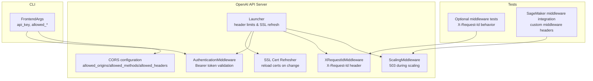
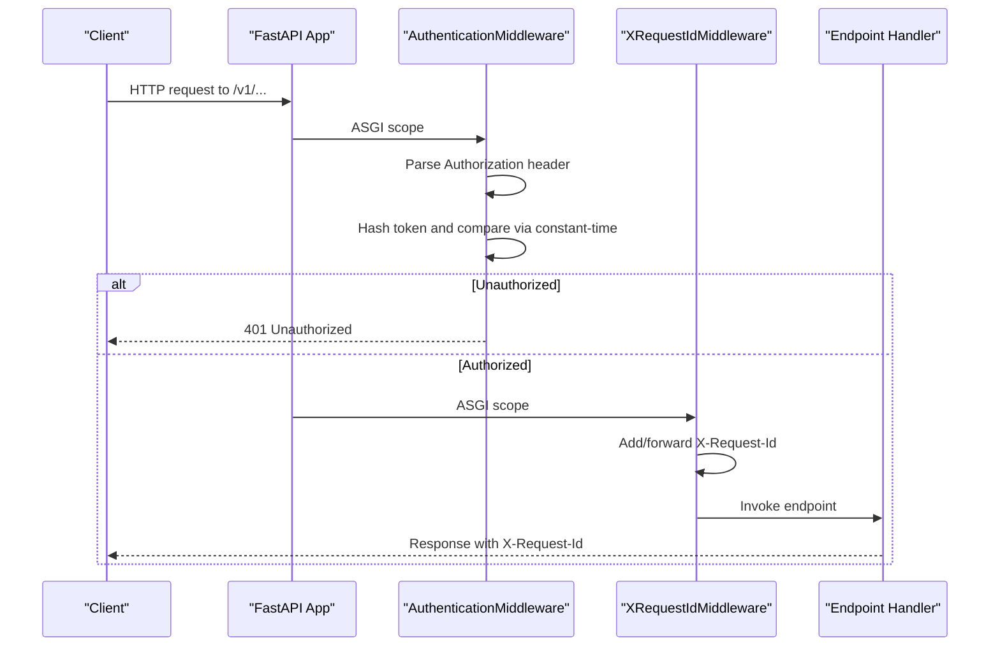
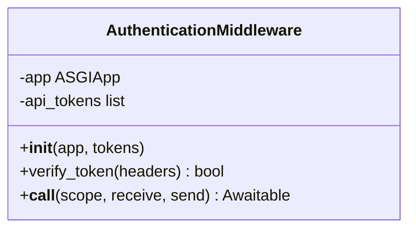
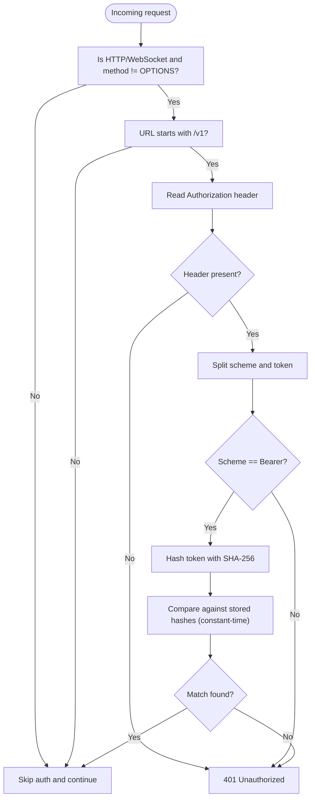
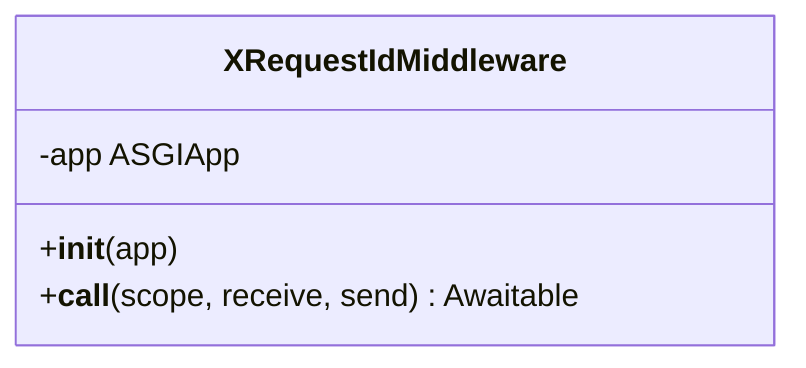
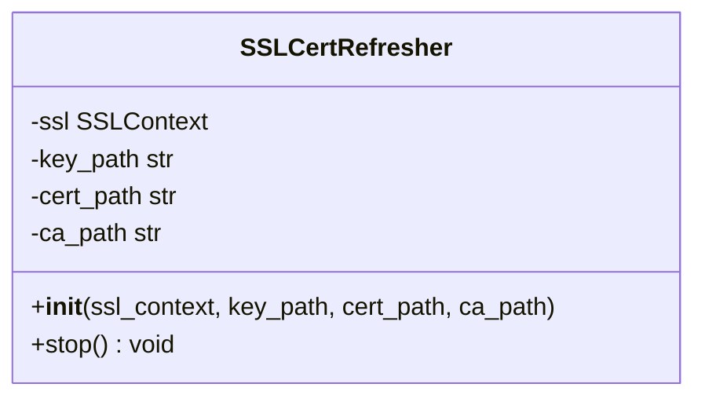
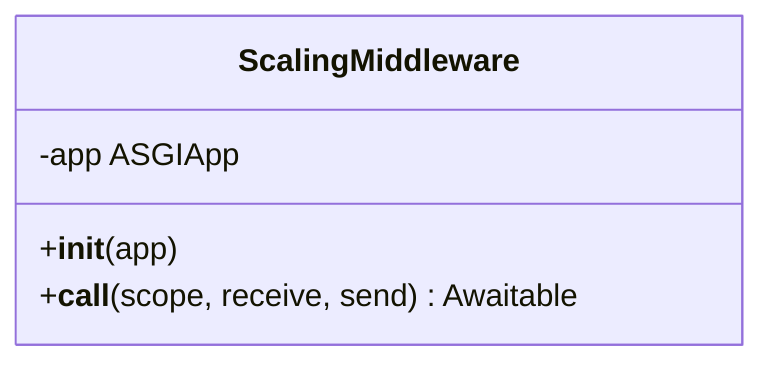
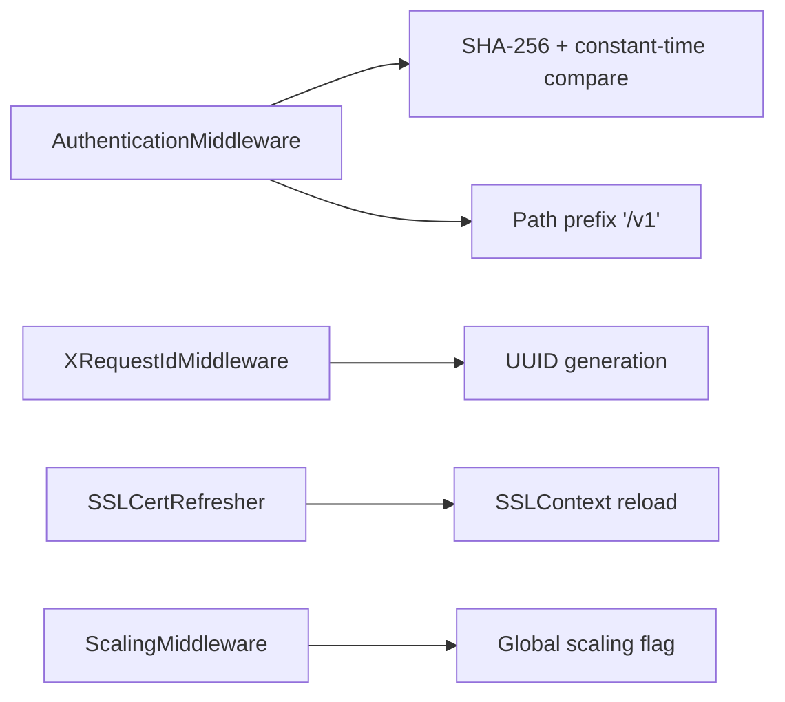

# Authentication and Security

<cite>
**Referenced Files in This Document**
- [api_server.py](file://vllm/entrypoints/openai/api_server.py)
- [cli_args.py](file://vllm/entrypoints/openai/cli_args.py)
- [launcher.py](file://vllm/entrypoints/launcher.py)
- [ssl.py](file://vllm/entrypoints/ssl.py)
- [middleware.py](file://vllm/entrypoints/serve/elastic_ep/middleware.py)
- [test_optional_middleware.py](file://tests/entrypoints/openai/test_optional_middleware.py)
- [test_sagemaker_middleware_integration.py](file://tests/entrypoints/sagemaker/test_sagemaker_middleware_integration.py)
- [security.md](file://docs/usage/security.md)
</cite>

## Table of Contents
1. [Introduction](#introduction)
2. [Project Structure](#project-structure)
3. [Core Components](#core-components)
4. [Architecture Overview](#architecture-overview)
5. [Detailed Component Analysis](#detailed-component-analysis)
6. [Dependency Analysis](#dependency-analysis)
7. [Performance Considerations](#performance-considerations)
8. [Troubleshooting Guide](#troubleshooting-guide)
9. [Conclusion](#conclusion)
10. [Appendices](#appendices)

## Introduction
This document explains the API authentication and security features in the OpenAI-compatible server. It covers Bearer token authentication, token hashing and constant-time comparison, CORS configuration, request ID tracking with X-Request-Id, SSL/TLS refresh, and operational middleware behavior. It also outlines rate limiting strategies, IP whitelisting, request validation, and best practices for production deployments.

## Project Structure
Security-related functionality spans the OpenAI API server, CLI argument parsing, and server launcher. The primary areas are:
- Authentication middleware and request ID middleware
- CORS configuration via CLI arguments
- SSL certificate refresh capability
- Elastic EP scaling middleware
- Tests validating middleware behavior and request ID propagation

**Diagram sources**
- [api_server.py](file://vllm/entrypoints/openai/api_server.py#L654-L731)
- [cli_args.py](file://vllm/entrypoints/openai/cli_args.py#L96-L100)
- [launcher.py](file://vllm/entrypoints/launcher.py#L43-L82)
- [ssl.py](file://vllm/entrypoints/ssl.py#L15-L79)
- [middleware.py](file://vllm/entrypoints/serve/elastic_ep/middleware.py#L22-L50)
- [test_optional_middleware.py](file://tests/entrypoints/openai/test_optional_middleware.py#L95-L118)
- [test_sagemaker_middleware_integration.py](file://tests/entrypoints/sagemaker/test_sagemaker_middleware_integration.py#L150-L175)

**Section sources**
- [api_server.py](file://vllm/entrypoints/openai/api_server.py#L654-L731)
- [cli_args.py](file://vllm/entrypoints/openai/cli_args.py#L96-L100)
- [launcher.py](file://vllm/entrypoints/launcher.py#L43-L82)
- [ssl.py](file://vllm/entrypoints/ssl.py#L15-L79)
- [middleware.py](file://vllm/entrypoints/serve/elastic_ep/middleware.py#L22-L50)
- [test_optional_middleware.py](file://tests/entrypoints/openai/test_optional_middleware.py#L95-L118)
- [test_sagemaker_middleware_integration.py](file://tests/entrypoints/sagemaker/test_sagemaker_middleware_integration.py#L150-L175)

## Core Components
- AuthenticationMiddleware: Enforces Bearer token authentication for /v1 endpoints, skipping OPTIONS and non-/v1 paths. Tokens are hashed and compared using constant-time comparison.
- XRequestIdMiddleware: Adds X-Request-Id to responses, generating a UUID if not provided.
- CORS configuration: Controlled via CLI arguments for allowed origins, methods, and headers.
- SSL/TLS refresh: Optional runtime reloading of certificates and CA roots.
- ScalingMiddleware: Returns 503 when the model is scaling.

**Section sources**
- [api_server.py](file://vllm/entrypoints/openai/api_server.py#L654-L731)
- [cli_args.py](file://vllm/entrypoints/openai/cli_args.py#L90-L100)
- [ssl.py](file://vllm/entrypoints/ssl.py#L15-L79)
- [middleware.py](file://vllm/entrypoints/serve/elastic_ep/middleware.py#L22-L50)

## Architecture Overview
The server composes ASGI middleware around the FastAPI app. Authentication and request ID middleware are applied globally, while CORS and SSL settings are configured at startup. Elastic EP scaling middleware guards requests during model scaling.

**Diagram sources**
- [api_server.py](file://vllm/entrypoints/openai/api_server.py#L654-L731)

**Section sources**
- [api_server.py](file://vllm/entrypoints/openai/api_server.py#L654-L731)

## Detailed Component Analysis

### AuthenticationMiddleware
- Purpose: Enforce Bearer token authentication for /v1 endpoints, skipping OPTIONS and non-/v1 paths.
- Token handling:
  - Tokens are hashed with SHA-256 during initialization.
  - Incoming bearer token is hashed and compared using constant-time comparison to avoid timing attacks.
- Behavior:
  - On missing/invalid/unsupported scheme: reject with 401 Unauthorized.
  - On success: pass to downstream handlers.

**Diagram sources**
- [api_server.py](file://vllm/entrypoints/openai/api_server.py#L654-L700)

**Section sources**
- [api_server.py](file://vllm/entrypoints/openai/api_server.py#L654-L700)

### Token Validation Flow

**Diagram sources**
- [api_server.py](file://vllm/entrypoints/openai/api_server.py#L670-L699)

**Section sources**
- [api_server.py](file://vllm/entrypoints/openai/api_server.py#L670-L699)

### XRequestIdMiddleware
- Purpose: Ensure X-Request-Id is present on responses. Generates a new UUID if not provided; otherwise forwards the provided value.
- Implementation: Wraps the send function to attach the header to outgoing HTTP responses.

**Diagram sources**
- [api_server.py](file://vllm/entrypoints/openai/api_server.py#L702-L731)

**Section sources**
- [api_server.py](file://vllm/entrypoints/openai/api_server.py#L702-L731)
- [test_optional_middleware.py](file://tests/entrypoints/openai/test_optional_middleware.py#L95-L118)

### CORS Configuration
- Controlled via CLI arguments:
  - allowed_origins: list of allowed origins
  - allowed_methods: list of allowed HTTP methods
  - allowed_headers: list of allowed headers
- These are passed to the CORS middleware configuration at startup.

**Section sources**
- [cli_args.py](file://vllm/entrypoints/openai/cli_args.py#L90-L100)

### SSL/TLS Refresh
- Optional runtime reload of SSL certificate chain and CA locations when files change.
- Triggered by file watchers; updates the SSL context without restart.

**Diagram sources**
- [ssl.py](file://vllm/entrypoints/ssl.py#L15-L79)

**Section sources**
- [ssl.py](file://vllm/entrypoints/ssl.py#L15-L79)
- [launcher.py](file://vllm/entrypoints/launcher.py#L73-L82)

### ScalingMiddleware (Elastic EP)
- Prevents request processing when the model is scaling, returning 503 Service Unavailable.
- Useful for graceful handling of dynamic scaling events.

**Diagram sources**
- [middleware.py](file://vllm/entrypoints/serve/elastic_ep/middleware.py#L22-L50)

**Section sources**
- [middleware.py](file://vllm/entrypoints/serve/elastic_ep/middleware.py#L22-L50)
- [test_sagemaker_middleware_integration.py](file://tests/entrypoints/sagemaker/test_sagemaker_middleware_integration.py#L150-L175)

## Dependency Analysis
- AuthenticationMiddleware depends on:
  - Authorization header parsing
  - SHA-256 hashing and constant-time comparison
  - URL path detection (/v1)
- XRequestIdMiddleware depends on:
  - Request headers inspection
  - UUID generation
- SSLCertRefresher depends on:
  - SSLContext and file watching utilities
- ScalingMiddleware depends on:
  - Global scaling state flag

**Diagram sources**
- [api_server.py](file://vllm/entrypoints/openai/api_server.py#L654-L731)
- [ssl.py](file://vllm/entrypoints/ssl.py#L15-L79)
- [middleware.py](file://vllm/entrypoints/serve/elastic_ep/middleware.py#L22-L50)

**Section sources**
- [api_server.py](file://vllm/entrypoints/openai/api_server.py#L654-L731)
- [ssl.py](file://vllm/entrypoints/ssl.py#L15-L79)
- [middleware.py](file://vllm/entrypoints/serve/elastic_ep/middleware.py#L22-L50)

## Performance Considerations
- Constant-time comparison: Using constant-time comparison avoids timing side channels and maintains consistent response times regardless of token correctness.
- Header limits: The server sets safe defaults for header count and incomplete event size to mitigate header-based abuse.
- SSL refresh: Certificate reloads occur asynchronously without service interruption.

**Section sources**
- [api_server.py](file://vllm/entrypoints/openai/api_server.py#L670-L699)
- [launcher.py](file://vllm/entrypoints/launcher.py#L43-L82)
- [ssl.py](file://vllm/entrypoints/ssl.py#L15-L79)

## Troubleshooting Guide
- 401 Unauthorized:
  - Ensure Authorization header uses Bearer scheme and matches one of the configured tokens.
  - Confirm the request targets /v1 endpoints; non-/v1 paths and OPTIONS are exempt from auth.
- Missing X-Request-Id:
  - Enable request ID headers via CLI and verify the header appears on responses.
- Scaling downtime:
  - During scaling events, expect 503 responses until scaling completes.
- SSL errors:
  - Verify certificate paths and permissions; enable refresh to reload on file changes.

**Section sources**
- [api_server.py](file://vllm/entrypoints/openai/api_server.py#L654-L731)
- [test_optional_middleware.py](file://tests/entrypoints/openai/test_optional_middleware.py#L95-L118)
- [middleware.py](file://vllm/entrypoints/serve/elastic_ep/middleware.py#L22-L50)
- [ssl.py](file://vllm/entrypoints/ssl.py#L15-L79)

## Conclusion
The OpenAI-compatible server implements robust authentication using Bearer tokens with secure hashing and constant-time comparison, adds request ID tracking for observability, supports configurable CORS, and provides SSL certificate refresh. Additional middleware enables scaling protection and extensibility for throttling and custom processing.

## Appendices

### Security Best Practices
- Network isolation and firewall rules
- Least privilege access
- Restrict media URL domains and redirects
- Prefer HTTPS with certificate refresh

**Section sources**
- [security.md](file://docs/usage/security.md#L44-L70)