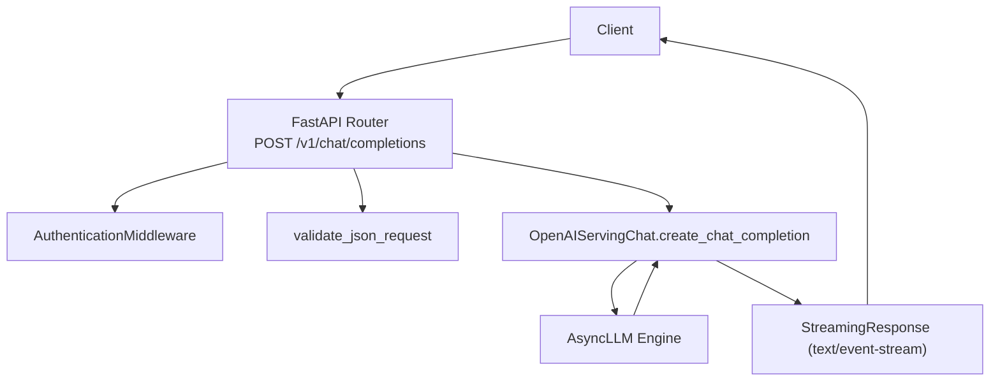
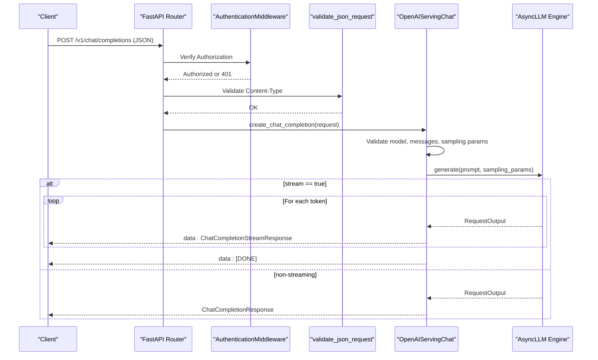
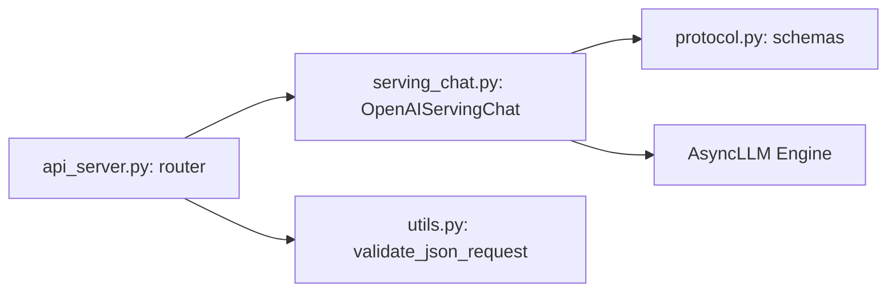

# Chat Completions Endpoint

<cite>
**Referenced Files in This Document**
- [api_server.py](file://vllm/entrypoints/openai/api_server.py)
- [serving_chat.py](file://vllm/entrypoints/openai/serving_chat.py)
- [protocol.py](file://vllm/entrypoints/openai/protocol.py)
- [utils.py](file://vllm/entrypoints/openai/utils.py)
- [openai_chat_completion_client.py](file://examples/online_serving/openai_chat_completion_client.py)
- [test_chat_completion.py](file://tests/v1/entrypoints/openai/test_chat_completion.py)
- [test_chat_completions.py](file://tests/tool_use/test_chat_completions.py)
- [test_chat_completion_request_validations.py](file://tests/tool_use/test_chat_completion_request_validations.py)
</cite>

## Table of Contents
1. [Introduction](#introduction)
2. [Project Structure](#project-structure)
3. [Core Components](#core-components)
4. [Architecture Overview](#architecture-overview)
5. [Detailed Component Analysis](#detailed-component-analysis)
6. [Dependency Analysis](#dependency-analysis)
7. [Performance Considerations](#performance-considerations)
8. [Troubleshooting Guide](#troubleshooting-guide)
9. [Conclusion](#conclusion)
10. [Appendices](#appendices)

## Introduction
This document provides comprehensive documentation for the /v1/chat/completions endpoint in the vLLM OpenAI-compatible server. It covers the request and response schemas, message roles, tool/function calling, streaming with Server-Sent Events (SSE), error handling, authentication, rate limiting signals, and practical examples. It also includes performance tips and troubleshooting guidance.

## Project Structure
The /v1/chat/completions endpoint is implemented in the OpenAI-compatible entrypoints:
- API router registers the route and wires request validation and authentication middleware.
- Handler processes requests, validates inputs, converts to engine prompts, schedules generation, and streams responses.
- Protocol models define the request/response schemas and validation rules.
- Utilities provide request validation and tool-call filtering helpers.

**Diagram sources**
- [api_server.py](file://vllm/entrypoints/openai/api_server.py#L476-L515)
- [serving_chat.py](file://vllm/entrypoints/openai/serving_chat.py#L214-L437)

**Section sources**
- [api_server.py](file://vllm/entrypoints/openai/api_server.py#L476-L515)
- [serving_chat.py](file://vllm/entrypoints/openai/serving_chat.py#L214-L437)

## Core Components
- API Router and Endpoint
  - Registers POST /v1/chat/completions, applies JSON validation, authentication, and load-aware routing.
  - Converts generator to SSE for streaming or returns JSON for non-streaming.
- Handler
  - Validates model, preprocesses chat messages, constructs engine prompts, sets sampling parameters, and orchestrates generation.
  - Supports streaming and non-streaming responses, tool/function calling, and reasoning extraction.
- Protocol Models
  - Define ChatCompletionRequest, ChatMessage, ToolCall, DeltaMessage, and response schemas.
  - Enforce validation rules for parameters like tool_choice, logprobs, stream_options, and structured outputs.
- Utilities
  - JSON content-type validation and tool-call filtering for parallel_tool_calls.

**Section sources**
- [api_server.py](file://vllm/entrypoints/openai/api_server.py#L476-L515)
- [serving_chat.py](file://vllm/entrypoints/openai/serving_chat.py#L214-L437)
- [protocol.py](file://vllm/entrypoints/openai/protocol.py#L525-L848)
- [utils.py](file://vllm/entrypoints/openai/utils.py#L1-L50)

## Architecture Overview
The endpoint follows a request-response flow with optional streaming. The handler delegates to the engine for token generation and streams chunks back to clients using SSE.

**Diagram sources**
- [api_server.py](file://vllm/entrypoints/openai/api_server.py#L476-L515)
- [serving_chat.py](file://vllm/entrypoints/openai/serving_chat.py#L214-L437)
- [serving_chat.py](file://vllm/entrypoints/openai/serving_chat.py#L578-L1363)

## Detailed Component Analysis

### Request Schema: ChatCompletionRequest
Key parameters and behavior:
- messages: Array of chat messages with role and content. Roles include system, user, assistant. Additional fields like refusal, audio, and tool_calls may appear in responses.
- model: Optional model identifier.
- temperature, top_p, top_k, min_p: Sampling controls.
- frequency_penalty, presence_penalty: Token penalty adjustments.
- max_tokens, max_completion_tokens: Limits output length.
- n: Number of choices (parallel generations).
- logprobs, top_logprobs: Enable token-level log probabilities.
- stream, stream_options: Enable streaming and include_usage/continuous_usage.
- seed, stop, stop_token_ids: Determinism and stopping criteria.
- tools, tool_choice: Function/tool calling configuration.
- parallel_tool_calls: Limit to one tool call when disabled.
- echo, add_generation_prompt, continue_final_message, add_special_tokens: Template and prompt formatting controls.
- documents, chat_template, chat_template_kwargs: RAG and template customization.
- response_format, structured_outputs: Structured output constraints.
- user, priority, request_id, logits_processors, return_tokens_as_token_ids, return_token_ids, cache_salt, kv_transfer_params, vllm_xargs: Extended controls.

Validation highlights:
- tool_choice requires tools to be provided; invalid combinations are rejected.
- stream_options require stream=true.
- logprobs/top_logprobs constraints enforced.
- structured_outputs constraints validated (single type, exclusive with tools).

**Section sources**
- [protocol.py](file://vllm/entrypoints/openai/protocol.py#L525-L848)
- [protocol.py](file://vllm/entrypoints/openai/protocol.py#L849-L1009)
- [protocol.py](file://vllm/entrypoints/openai/protocol.py#L1417-L1521)

### Response Schema: ChatCompletionResponse and Streaming
Non-streaming response:
- id, object, created, model, system_fingerprint, service_tier.
- choices: Array of ChatCompletionResponseChoice with message, finish_reason, stop_reason, token_ids, logprobs.
- usage: UsageInfo with prompt_tokens, completion_tokens, total_tokens and prompt_tokens_details.

Streaming response (SSE):
- Each event is a ChatCompletionStreamResponse with object "chat.completion.chunk".
- First chunk includes role delta for the assistant.
- Subsequent chunks include content deltas and optionally tool_calls deltas.
- Final chunk includes finish_reason and optional usage depending on stream_options.

Client-side SSE handling:
- Event stream format: "event: <type>\ndata: <JSON>\n\n".
- Decoder extracts "data" lines, parses JSON, and handles "[DONE]" sentinel.
- Example client demonstrates connecting to the endpoint and iterating over streamed chunks.

**Section sources**
- [protocol.py](file://vllm/entrypoints/openai/protocol.py#L1491-L1521)
- [protocol.py](file://vllm/entrypoints/openai/protocol.py#L1522-L1556)
- [api_server.py](file://vllm/entrypoints/openai/api_server.py#L314-L361)
- [api_server.py](file://vllm/entrypoints/openai/api_server.py#L761-L800)
- [openai_chat_completion_client.py](file://examples/online_serving/openai_chat_completion_client.py#L1-L65)

### Message Format and Roles
- Role definitions:
  - system: Provides task instructions or context.
  - user: Provides prompts or queries.
  - assistant: Model-generated responses; may include tool_calls.
- Additional fields in responses:
  - refusal, audio, annotations, tool_calls, reasoning.

**Section sources**
- [protocol.py](file://vllm/entrypoints/openai/protocol.py#L1453-L1472)
- [protocol.py](file://vllm/entrypoints/openai/protocol.py#L1417-L1467)

### Function Calling and Tool Use
Supported modes:
- none: No tool use.
- auto: Allow model to decide whether to call tools.
- required: Force tool use; handler enforces tool calls presence.
- named tool: Specify a single tool by name.

Behavior:
- When tools are provided and tool_choice unspecified, defaults to "auto".
- Tool calls are parsed from content or streaming deltas depending on mode and parser availability.
- parallel_tool_calls=false filters to first tool call only.
- Reasoning extraction can be combined with tool parsing.

**Section sources**
- [protocol.py](file://vllm/entrypoints/openai/protocol.py#L911-L999)
- [serving_chat.py](file://vllm/entrypoints/openai/serving_chat.py#L578-L1363)
- [utils.py](file://vllm/entrypoints/openai/utils.py#L22-L41)

### Streaming with Server-Sent Events (SSE)
Implementation details:
- Generator yields "data: ..." lines followed by blank lines.
- Final sentinel "data: [DONE]" ends the stream.
- SSE decoder in server reconstructs events from chunks and handles malformed JSON gracefully.
- Usage reporting:
  - include_usage sends a final usage chunk.
  - continuous_usage_stats sends usage with each token chunk.

**Section sources**
- [api_server.py](file://vllm/entrypoints/openai/api_server.py#L314-L361)
- [api_server.py](file://vllm/entrypoints/openai/api_server.py#L761-L800)
- [serving_chat.py](file://vllm/entrypoints/openai/serving_chat.py#L1281-L1335)

### Authentication and Rate Limiting
- Authentication:
  - Bearer token required for /v1 routes; verified via SHA-256 hash comparison.
  - Skips verification for OPTIONS or non-/v1 paths.
- Rate limiting:
  - Load-aware call decorator integrates with server load metrics exposed at GET /v1/load.
  - Clients can request metrics header via a dedicated header label.

**Section sources**
- [api_server.py](file://vllm/entrypoints/openai/api_server.py#L654-L700)
- [api_server.py](file://vllm/entrypoints/openai/api_server.py#L281-L298)
- [api_server.py](file://vllm/entrypoints/openai/api_server.py#L486-L515)

### Error Handling
- Validation errors:
  - JSON content-type mismatch raises RequestValidationError.
  - Parameter validation failures return ErrorResponse with appropriate HTTP status.
- Generation errors:
  - Conversion to streaming error response or JSON error body.
- Disconnects:
  - Client cancellation detected and mapped to error response.

**Section sources**
- [api_server.py](file://vllm/entrypoints/openai/api_server.py#L486-L515)
- [api_server.py](file://vllm/entrypoints/openai/api_server.py#L314-L361)
- [serving_chat.py](file://vllm/entrypoints/openai/serving_chat.py#L1354-L1363)

### Examples

#### Simple Conversation
- Use the example client to call /v1/chat/completions with a sequence of system, assistant, and user messages.
- Toggle stream flag to receive SSE chunks.

**Section sources**
- [openai_chat_completion_client.py](file://examples/online_serving/openai_chat_completion_client.py#L1-L65)

#### Function Calling
- Provide tools and set tool_choice to "auto" or a named tool.
- For "required", ensure tools are provided; handler enforces tool calls presence.
- Observe tool_calls deltas in streaming responses.

**Section sources**
- [protocol.py](file://vllm/entrypoints/openai/protocol.py#L911-L999)
- [serving_chat.py](file://vllm/entrypoints/openai/serving_chat.py#L578-L1363)

#### Structured Outputs
- Use response_format or structured_outputs to constrain output format.
- Only one constraint type is allowed; cannot be combined with tools.

**Section sources**
- [protocol.py](file://vllm/entrypoints/openai/protocol.py#L800-L848)
- [protocol.py](file://vllm/entrypoints/openai/protocol.py#L888-L909)

#### Tool Use Scenarios
- Tests demonstrate valid and invalid configurations for tool_choice and tools.
- Validation tests cover error conditions and defaults.

**Section sources**
- [test_chat_completions.py](file://tests/tool_use/test_chat_completions.py)
- [test_chat_completion_request_validations.py](file://tests/tool_use/test_chat_completion_request_validations.py)

## Dependency Analysis
The endpoint depends on:
- Router and middleware for transport and auth.
- Handler for request processing and generation orchestration.
- Protocol models for schema enforcement.
- Engine for token generation.

**Diagram sources**
- [api_server.py](file://vllm/entrypoints/openai/api_server.py#L476-L515)
- [serving_chat.py](file://vllm/entrypoints/openai/serving_chat.py#L214-L437)
- [protocol.py](file://vllm/entrypoints/openai/protocol.py#L525-L848)
- [utils.py](file://vllm/entrypoints/openai/utils.py#L43-L50)

**Section sources**
- [api_server.py](file://vllm/entrypoints/openai/api_server.py#L476-L515)
- [serving_chat.py](file://vllm/entrypoints/openai/serving_chat.py#L214-L437)
- [protocol.py](file://vllm/entrypoints/openai/protocol.py#L525-L848)
- [utils.py](file://vllm/entrypoints/openai/utils.py#L43-L50)

## Performance Considerations
- Use streaming for low-latency token delivery; enable stream_options.include_usage judiciously to avoid extra overhead.
- Prefer concise messages and templates to reduce prompt length and improve throughput.
- Tune temperature, top_p, and max_tokens to balance quality and speed.
- Avoid excessive logprobs and top_logprobs unless required.
- Use cache_salt for deterministic caching in multi-user environments when appropriate.
- Monitor server load via GET /v1/load for capacity planning.

## Troubleshooting Guide
Common issues and resolutions:
- 401 Unauthorized:
  - Ensure Authorization header with correct Bearer token.
- Unsupported Media Type:
  - Confirm Content-Type is application/json.
- Validation errors:
  - Review tool_choice/tools consistency, stream_options usage, and logprobs constraints.
- Empty or delayed streaming:
  - Verify client SSE decoder handles malformed chunks and waits for data lines.
- Tool call parsing:
  - For "required", ensure tools are provided; otherwise handler may treat as "none".
- Disconnections:
  - Client cancellations are surfaced as errors; reconnect if needed.

**Section sources**
- [api_server.py](file://vllm/entrypoints/openai/api_server.py#L654-L700)
- [api_server.py](file://vllm/entrypoints/openai/api_server.py#L314-L361)
- [protocol.py](file://vllm/entrypoints/openai/protocol.py#L849-L909)
- [serving_chat.py](file://vllm/entrypoints/openai/serving_chat.py#L1354-L1363)

## Conclusion
The /v1/chat/completions endpoint provides an OpenAI-compatible interface for chat completions with robust streaming, tool/function calling, structured outputs, and comprehensive validation. Proper configuration of parameters, adherence to SSE semantics, and attention to authentication and rate-limiting signals ensure reliable and performant deployments.

## Appendices

### API Definition Summary
- Method: POST
- Path: /v1/chat/completions
- Content-Type: application/json
- Authentication: Bearer token required for /v1 routes
- Streaming: Enabled via stream=true; SSE event format described above

**Section sources**
- [api_server.py](file://vllm/entrypoints/openai/api_server.py#L476-L515)
- [api_server.py](file://vllm/entrypoints/openai/api_server.py#L654-L700)
- [api_server.py](file://vllm/entrypoints/openai/api_server.py#L314-L361)