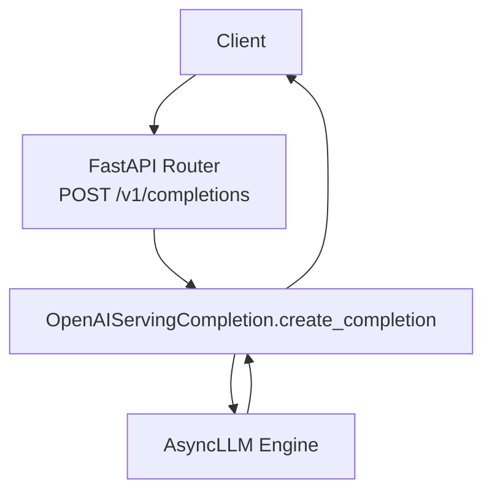
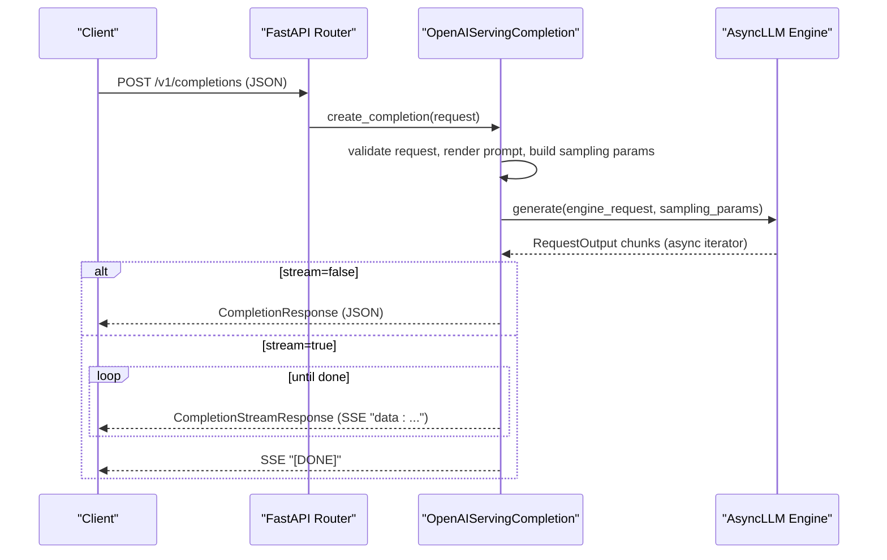
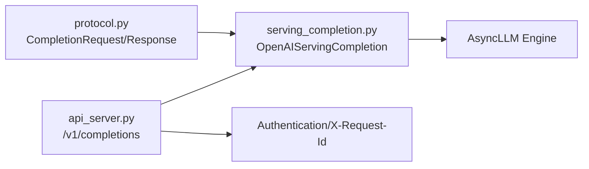

# Completions Endpoint

<cite>
**Referenced Files in This Document**
- [api_server.py](file://vllm/entrypoints/openai/api_server.py)
- [serving_completion.py](file://vllm/entrypoints/openai/serving_completion.py)
- [protocol.py](file://vllm/entrypoints/openai/protocol.py)
- [test_completion.py](file://tests/v1/entrypoints/openai/test_completion.py)
- [test_completion_error.py](file://tests/entrypoints/openai/test_completion_error.py)
</cite>

## Table of Contents
1. [Introduction](#introduction)
2. [Project Structure](#project-structure)
3. [Core Components](#core-components)
4. [Architecture Overview](#architecture-overview)
5. [Detailed Component Analysis](#detailed-component-analysis)
6. [Dependency Analysis](#dependency-analysis)
7. [Performance Considerations](#performance-considerations)
8. [Troubleshooting Guide](#troubleshooting-guide)
9. [Conclusion](#conclusion)
10. [Appendices](#appendices)

## Introduction
This document provides comprehensive documentation for the /v1/completions endpoint in the vLLM OpenAI-compatible server. It covers request and response schemas, parameters (such as prompt, temperature, max_tokens, and stop sequences), text generation format, streaming behavior, error handling, and authentication. It also explains how completions differ from chat completions, when to use each endpoint, and offers migration guidance and production best practices.

## Project Structure
The /v1/completions endpoint is implemented in the OpenAI-compatible server module. The key files involved are:
- API router and endpoint handlers: [api_server.py](file://vllm/entrypoints/openai/api_server.py)
- Request validation and response construction: [protocol.py](file://vllm/entrypoints/openai/protocol.py)
- Business logic for completions: [serving_completion.py](file://vllm/entrypoints/openai/serving_completion.py)
- Behavioral tests validating streaming, usage reporting, and structured outputs: [test_completion.py](file://tests/v1/entrypoints/openai/test_completion.py)
- Error handling tests for streaming and non-streaming modes: [test_completion_error.py](file://tests/entrypoints/openai/test_completion_error.py)

**Diagram sources**
- [api_server.py](file://vllm/entrypoints/openai/api_server.py#L517-L561)
- [serving_completion.py](file://vllm/entrypoints/openai/serving_completion.py#L83-L112)

**Section sources**
- [api_server.py](file://vllm/entrypoints/openai/api_server.py#L517-L561)
- [serving_completion.py](file://vllm/entrypoints/openai/serving_completion.py#L83-L112)

## Core Components
- Endpoint definition and routing: The POST /v1/completions route is registered and delegates to the OpenAI Completions handler.
- Request schema: CompletionRequest defines all supported parameters and validation rules.
- Response schema: CompletionResponse and CompletionStreamResponse define the shape of non-streaming and streaming responses respectively.
- Handler logic: OpenAIServingCompletion orchestrates rendering prompts, sampling parameters, engine scheduling, and assembling final or streamed responses.
- Authentication: A middleware enforces Bearer token authentication for /v1 paths.

Key responsibilities:
- Parameter validation and normalization
- Prompt rendering and tokenization
- Sampling parameter conversion to engine-native parameters
- Streaming vs non-streaming response assembly
- Usage accounting and optional continuous usage stats
- Error propagation to clients

**Section sources**
- [api_server.py](file://vllm/entrypoints/openai/api_server.py#L517-L561)
- [protocol.py](file://vllm/entrypoints/openai/protocol.py#L1010-L1274)
- [serving_completion.py](file://vllm/entrypoints/openai/serving_completion.py#L83-L112)

## Architecture Overview
The /v1/completions endpoint follows a layered architecture:
- Transport and routing: FastAPI router handles HTTP requests and invokes the handler.
- Handler: OpenAIServingCompletion validates inputs, converts sampling parameters, renders prompts, and interacts with the engine.
- Engine: AsyncLLM executes generation and streams RequestOutput items.
- Response builder: Converts engine outputs into CompletionResponse or CompletionStreamResponse.

**Diagram sources**
- [api_server.py](file://vllm/entrypoints/openai/api_server.py#L517-L561)
- [serving_completion.py](file://vllm/entrypoints/openai/serving_completion.py#L261-L325)
- [protocol.py](file://vllm/entrypoints/openai/protocol.py#L1373-L1415)

## Detailed Component Analysis

### Request Schema: CompletionRequest
Supported parameters include:
- model: Optional model identifier
- prompt: Supports string, list of strings, token IDs, or embedding inputs
- max_tokens: Maximum tokens to generate
- temperature, top_p, top_k, min_p, frequency_penalty, presence_penalty
- n: Number of parallel generations
- logprobs: Top-logprobs to return per token
- echo: Whether to prepend the prompt to the output
- stop, stop_token_ids
- stream, stream_options
- use_beam_search, ignore_eos, length_penalty, include_stop_str_in_output, min_tokens
- truncate_prompt_tokens, allowed_token_ids, prompt_logprobs
- prompt_embeds, add_special_tokens
- response_format, structured_outputs
- priority, request_id, logits_processors, return_tokens_as_token_ids, return_token_ids
- cache_salt, kv_transfer_params, vllm_xargs

Validation highlights:
- Either prompt or prompt_embeds must be provided and non-empty
- prompt_logprobs must be non-negative or -1; not allowed when stream=True
- stream_options require stream=True
- suffix is not supported
- Echo is incompatible with prompt_embeds

**Section sources**
- [protocol.py](file://vllm/entrypoints/openai/protocol.py#L1010-L1143)
- [protocol.py](file://vllm/entrypoints/openai/protocol.py#L1276-L1346)

### Response Schema: CompletionResponse and CompletionStreamResponse
Non-streaming:
- id, object="text_completion", created, model
- choices: array of CompletionResponseChoice with index, text, finish_reason, stop_reason, optional token_ids and prompt_token_ids
- usage: UsageInfo with prompt_tokens, completion_tokens, total_tokens, optional prompt_tokens_details

Streaming:
- id, object="text_completion", created, model
- choices: array of CompletionResponseStreamChoice with index, text, finish_reason, stop_reason, optional prompt_token_ids and token_ids
- usage: Optional UsageInfo appended after the final token (depending on stream_options)

Logprobs:
- When requested, CompletionLogProbs includes text_offset, token_logprobs, tokens, top_logprobs arrays aligned to the generated text.

**Section sources**
- [protocol.py](file://vllm/entrypoints/openai/protocol.py#L1355-L1415)

### Text Generation Format and Echo Behavior
- When echo is false: output is the generated text only.
- When echo is true: the response text starts with the prompt followed by the generated continuation.
- When max_tokens=0 and echo=true: only the prompt is returned.
- Token IDs can be returned alongside text when return_token_ids is enabled.

**Section sources**
- [serving_completion.py](file://vllm/entrypoints/openai/serving_completion.py#L519-L632)
- [protocol.py](file://vllm/entrypoints/openai/protocol.py#L1207-L1213)

### Streaming Responses
Behavior:
- stream=true yields SSE "data: ..." lines for each token delta.
- finish_reason appears only on the final chunk.
- stream_options controls whether usage is included and whether continuous usage stats are sent:
  - include_usage: True/False
  - continuous_usage_stats: True/False
- When stream=false, a single JSON response is returned; if the client requested streaming but the server cannot stream (e.g., beam search), a fake stream with a single event plus [DONE] is returned.

**Section sources**
- [serving_completion.py](file://vllm/entrypoints/openai/serving_completion.py#L327-L518)
- [test_completion.py](file://tests/v1/entrypoints/openai/test_completion.py#L362-L507)

### Authentication
- A middleware enforces Bearer token authentication for /v1 paths.
- Authentication is skipped for OPTIONS and non-/v1 paths.
- Unauthorized requests receive a 401 response.

**Section sources**
- [api_server.py](file://vllm/entrypoints/openai/api_server.py#L654-L700)

### Error Handling
- Validation errors return 400 Bad Request with ErrorResponse.
- Internal errors during generation return 500 InternalServerError.
- In streaming mode, errors are emitted as SSE error events before [DONE].
- Tests demonstrate error propagation for both streaming and non-streaming cases.

**Section sources**
- [api_server.py](file://vllm/entrypoints/openai/api_server.py#L517-L561)
- [serving_completion.py](file://vllm/entrypoints/openai/serving_completion.py#L327-L518)
- [test_completion_error.py](file://tests/entrypoints/openai/test_completion_error.py#L84-L136)
- [test_completion_error.py](file://tests/entrypoints/openai/test_completion_error.py#L138-L218)

### Relationship Between Completions and Chat Completions
- Completions operate on raw text prompts and return raw text completions.
- Chat completions operate on structured message arrays and return model-generated messages.
- Completions support echo and prompt embedding inputs; chat completions use templates and roles.
- Choose Completions for simple text generation and raw prompt inputs; choose Chat Completions for conversational or tool-use scenarios.

**Section sources**
- [protocol.py](file://vllm/entrypoints/openai/protocol.py#L1010-L1143)
- [protocol.py](file://vllm/entrypoints/openai/protocol.py#L525-L723)

### Migration Strategies
- Replace raw prompt-based flows with Completions where applicable.
- For conversational or tool-use scenarios, migrate to Chat Completions using message arrays.
- Preserve equivalent sampling parameters (temperature, top_p, etc.) and adjust echo behavior to match desired output format.
- Validate prompt_logprobs and stream_options usage differences between endpoints.

**Section sources**
- [protocol.py](file://vllm/entrypoints/openai/protocol.py#L1010-L1143)
- [protocol.py](file://vllm/entrypoints/openai/protocol.py#L525-L723)

### Examples of Completion Scenarios
- Simple text generation: Provide a string prompt and max_tokens; optionally set temperature and stream.
- Instruction following: Provide a prompt with explicit instructions; optionally set stop sequences.
- Parallel sampling: Use n>1 with beam search for diverse outputs.
- Structured outputs: Use response_format or structured_outputs to constrain generation.
- Streaming with usage: Enable stream_options to include usage statistics.

Refer to tests for concrete usage patterns:
- Single completion and logprobs: [test_completion.py](file://tests/v1/entrypoints/openai/test_completion.py#L52-L120)
- Streaming and finish reasons: [test_completion.py](file://tests/v1/entrypoints/openai/test_completion.py#L221-L252)
- Parallel sampling (streaming and non-streaming): [test_completion.py](file://tests/v1/entrypoints/openai/test_completion.py#L259-L360)
- Stream options and usage reporting: [test_completion.py](file://tests/v1/entrypoints/openai/test_completion.py#L362-L507)
- Echo with logprobs: [test_completion.py](file://tests/v1/entrypoints/openai/test_completion.py#L567-L607)
- Structured outputs (JSON schema, regex, grammar): [test_completion.py](file://tests/v1/entrypoints/openai/test_completion.py#L608-L688)

**Section sources**
- [test_completion.py](file://tests/v1/entrypoints/openai/test_completion.py#L52-L120)
- [test_completion.py](file://tests/v1/entrypoints/openai/test_completion.py#L221-L360)
- [test_completion.py](file://tests/v1/entrypoints/openai/test_completion.py#L362-L507)
- [test_completion.py](file://tests/v1/entrypoints/openai/test_completion.py#L567-L688)

## Dependency Analysis
The endpoint depends on:
- Protocol models for request/response shapes and validation
- Serving completion handler for orchestration
- Engine client for generation
- Middleware for authentication and request ID correlation

**Diagram sources**
- [api_server.py](file://vllm/entrypoints/openai/api_server.py#L517-L561)
- [serving_completion.py](file://vllm/entrypoints/openai/serving_completion.py#L83-L112)
- [protocol.py](file://vllm/entrypoints/openai/protocol.py#L1010-L1143)

**Section sources**
- [api_server.py](file://vllm/entrypoints/openai/api_server.py#L517-L561)
- [serving_completion.py](file://vllm/entrypoints/openai/serving_completion.py#L83-L112)
- [protocol.py](file://vllm/entrypoints/openai/protocol.py#L1010-L1143)

## Performance Considerations
- Use streaming for low-latency delivery of tokens.
- Prefer echo only when necessary, as it increases output size.
- Limit logprobs and prompt_logprobs to required values to reduce payload size.
- Tune temperature and top_p for desired diversity vs determinism.
- Use cache_salt for secure prefix caching in multi-tenant environments.
- Monitor usage reporting via stream_options for operational insights.

[No sources needed since this section provides general guidance]

## Troubleshooting Guide
Common issues and resolutions:
- 400 Bad Request: Validate prompt presence, stream_options usage, and logprobs constraints.
- 401 Unauthorized: Ensure Authorization header with a valid Bearer token is provided for /v1 paths.
- 500 InternalServerError: Inspect server logs; errors during generation are propagated as SSE error events in streaming mode.
- Unexpected empty chunks: In chunked prefill, empty deltas may be skipped; ensure clients handle partial chunks correctly.
- Usage reporting: Confirm stream_options settings; usage is appended after final token when configured.

**Section sources**
- [api_server.py](file://vllm/entrypoints/openai/api_server.py#L654-L700)
- [serving_completion.py](file://vllm/entrypoints/openai/serving_completion.py#L327-L518)
- [test_completion_error.py](file://tests/entrypoints/openai/test_completion_error.py#L84-L136)
- [test_completion_error.py](file://tests/entrypoints/openai/test_completion_error.py#L138-L218)

## Conclusion
The /v1/completions endpoint provides a straightforward, OpenAI-compatible interface for raw text generation. It supports flexible sampling, echo behavior, embeddings, structured outputs, and robust streaming with usage reporting. Choose Completions for simple text prompts and raw inputs; prefer Chat Completions for conversational or tool-use scenarios. Follow the provided best practices for production deployments and leverage the included tests as references for correct usage.

[No sources needed since this section summarizes without analyzing specific files]

## Appendices

### API Definition Summary
- Endpoint: POST /v1/completions
- Request body fields: See CompletionRequest in [protocol.py](file://vllm/entrypoints/openai/protocol.py#L1010-L1143)
- Response body fields: See CompletionResponse and CompletionStreamResponse in [protocol.py](file://vllm/entrypoints/openai/protocol.py#L1355-L1415)
- Streaming format: Server-Sent Events with "data: ..." lines ending in "[DONE]"
- Authentication: Bearer token required for /v1 paths

**Section sources**
- [api_server.py](file://vllm/entrypoints/openai/api_server.py#L517-L561)
- [protocol.py](file://vllm/entrypoints/openai/protocol.py#L1010-L1143)
- [protocol.py](file://vllm/entrypoints/openai/protocol.py#L1355-L1415)