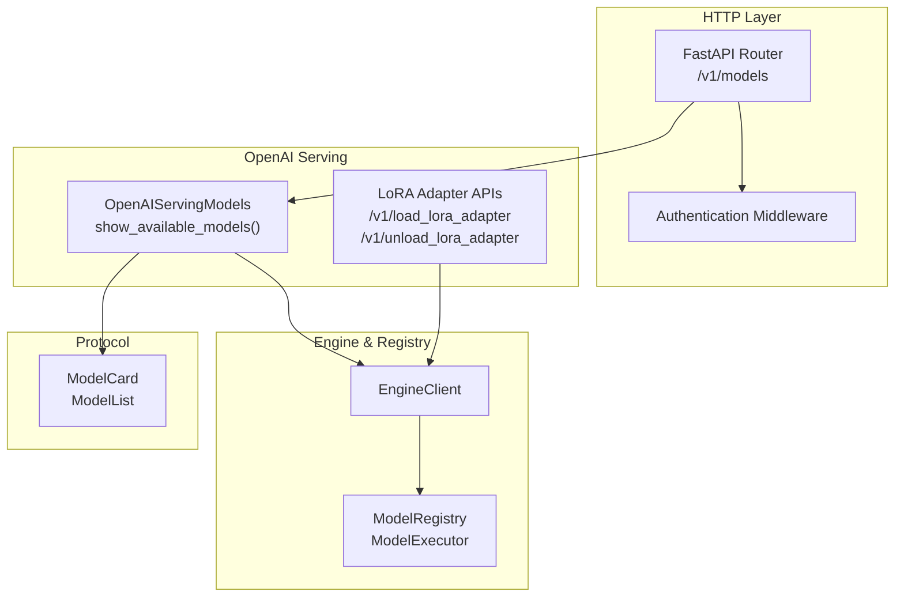
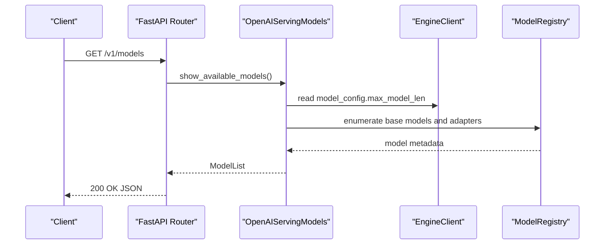
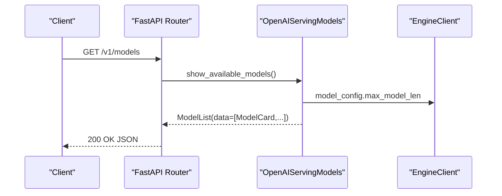
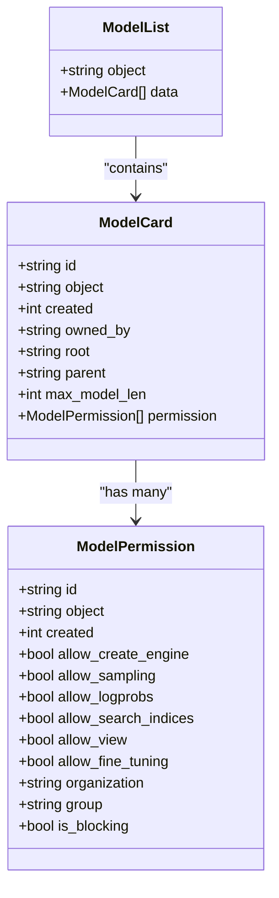
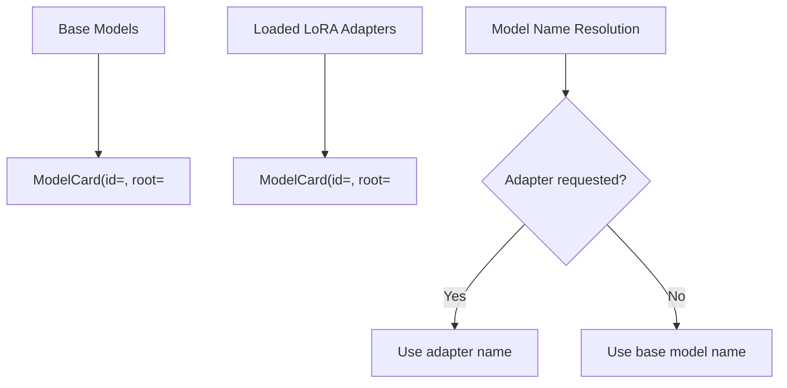
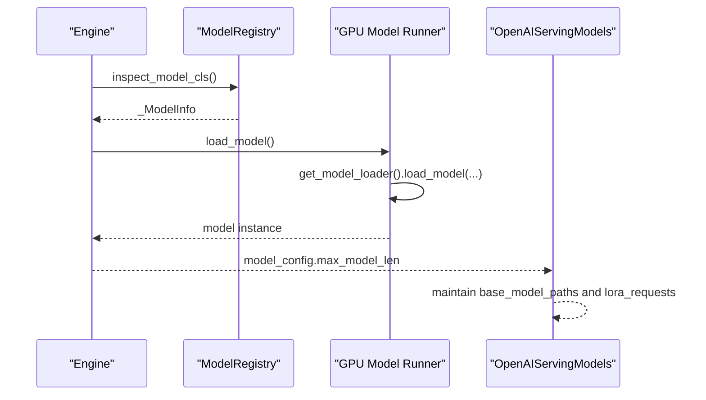
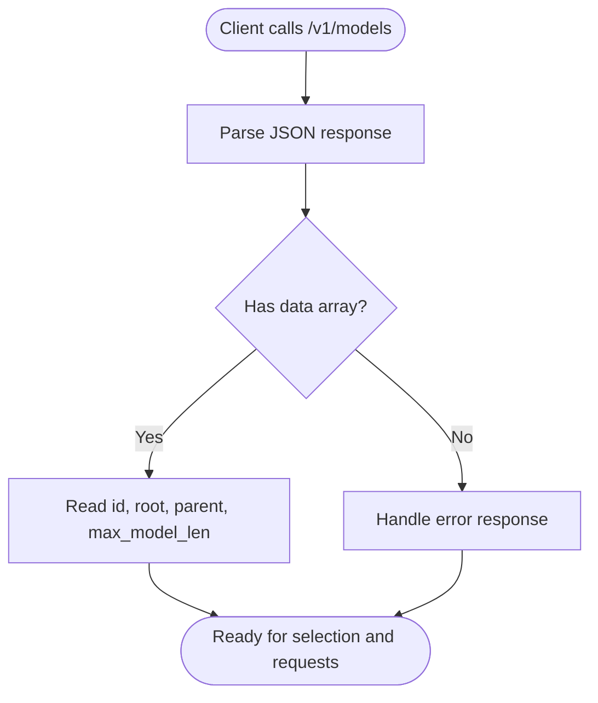
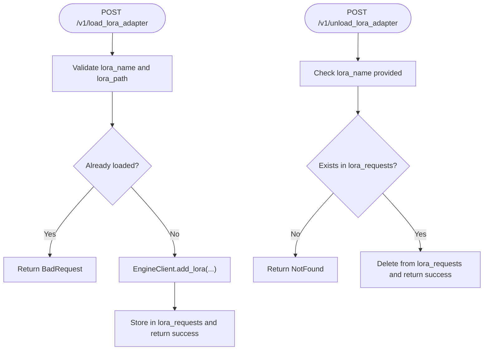
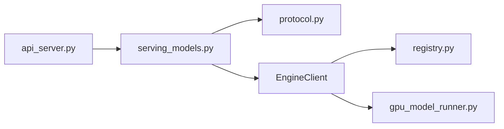

# Models Management

<cite>
**Referenced Files in This Document**
- [api_server.py](file://vllm/entrypoints/openai/api_server.py)
- [serving_models.py](file://vllm/entrypoints/openai/serving_models.py)
- [protocol.py](file://vllm/entrypoints/openai/protocol.py)
- [test_serving_models.py](file://tests/entrypoints/openai/test_serving_models.py)
- [test_models.py](file://tests/entrypoints/openai/test_models.py)
- [arg_utils.py](file://vllm/engine/arg_utils.py)
- [model.py](file://vllm/config/model.py)
- [gpu_model_runner.py](file://vllm/v1/worker/gpu_model_runner.py)
- [registry.py](file://vllm/model_executor/models/registry.py)
- [security.md](file://docs/usage/security.md)
- [quickstart.md](file://docs/getting_started/quickstart.md)
</cite>

## Table of Contents
1. [Introduction](#introduction)
2. [Project Structure](#project-structure)
3. [Core Components](#core-components)
4. [Architecture Overview](#architecture-overview)
5. [Detailed Component Analysis](#detailed-component-analysis)
6. [Dependency Analysis](#dependency-analysis)
7. [Performance Considerations](#performance-considerations)
8. [Troubleshooting Guide](#troubleshooting-guide)
9. [Conclusion](#conclusion)
10. [Appendices](#appendices)

## Introduction
This document explains how models are managed and exposed by the vLLM OpenAI-compatible server, focusing on the /v1/models endpoint. It covers:
- The model listing response format and metadata fields
- Model identification schemes and relationships (base vs adapters)
- How models are registered, loaded, and managed by the server
- Model availability detection and introspection
- Dynamic LoRA adapter loading/unloading
- Model-specific parameters surfaced via the API
- Practical examples and troubleshooting guidance

## Project Structure
The models management functionality spans several modules:
- HTTP routing and authentication live in the OpenAI API server
- Model listing and adapter management are implemented in the OpenAI serving layer
- Protocol models define the JSON schema for model cards and lists
- Engine configuration and model loading are handled by the engine and model registry
- Tests validate behavior and expected responses

**Diagram sources**
- [api_server.py](file://vllm/entrypoints/openai/api_server.py#L299-L306)
- [serving_models.py](file://vllm/entrypoints/openai/serving_models.py#L107-L131)
- [protocol.py](file://vllm/entrypoints/openai/protocol.py#L149-L163)
- [registry.py](file://vllm/model_executor/models/registry.py#L576-L624)

**Section sources**
- [api_server.py](file://vllm/entrypoints/openai/api_server.py#L299-L306)
- [serving_models.py](file://vllm/entrypoints/openai/serving_models.py#L107-L131)
- [protocol.py](file://vllm/entrypoints/openai/protocol.py#L149-L163)

## Core Components
- OpenAI-compatible server router registers GET /v1/models and delegates to the OpenAI serving layer.
- OpenAIServingModels builds the model list from base models and loaded LoRA adapters, and surfaces model metadata such as max_model_len and root path.
- Protocol models define ModelCard and ModelList shapes for the response payload.
- EngineClient provides access to model configuration and runtime state (e.g., max_model_len).
- Model registry and model loader manage model discovery and instantiation during startup.

Key responsibilities:
- Listing: Build a list combining base models and active adapters
- Metadata: Expose id, root, parent, max_model_len, permissions
- Dynamic adapters: Load/unload adapters at runtime
- Authentication: Enforce API key for /v1/* endpoints

**Section sources**
- [api_server.py](file://vllm/entrypoints/openai/api_server.py#L299-L306)
- [serving_models.py](file://vllm/entrypoints/openai/serving_models.py#L107-L131)
- [protocol.py](file://vllm/entrypoints/openai/protocol.py#L149-L163)
- [model.py](file://vllm/config/model.py#L167-L175)

## Architecture Overview
The /v1/models endpoint flow:

**Diagram sources**
- [api_server.py](file://vllm/entrypoints/openai/api_server.py#L299-L306)
- [serving_models.py](file://vllm/entrypoints/openai/serving_models.py#L107-L131)
- [model.py](file://vllm/config/model.py#L167-L175)
- [registry.py](file://vllm/model_executor/models/registry.py#L576-L624)

## Detailed Component Analysis

### Endpoint: GET /v1/models
- Route registration: The server registers GET /v1/models and delegates to the OpenAI serving layer.
- Handler behavior: The handler constructs a ModelList from base models and currently loaded adapters, and includes model metadata such as max_model_len and root.
- Response format: The response is a JSON object with object="list" and a data array of ModelCard entries.

**Diagram sources**
- [api_server.py](file://vllm/entrypoints/openai/api_server.py#L299-L306)
- [serving_models.py](file://vllm/entrypoints/openai/serving_models.py#L107-L131)

**Section sources**
- [api_server.py](file://vllm/entrypoints/openai/api_server.py#L299-L306)
- [serving_models.py](file://vllm/entrypoints/openai/serving_models.py#L107-L131)

### Model Listing Response Format
- Object: "list"
- Data: Array of ModelCard
  - id: String identifier for the model/adaptor
  - object: "model"
  - created: Unix timestamp
  - owned_by: "vllm"
  - root: Base model path or adapter path
  - parent: Base model name for adapters
  - max_model_len: Integer context length limit
  - permission: Array of ModelPermission entries

**Diagram sources**
- [protocol.py](file://vllm/entrypoints/openai/protocol.py#L149-L163)

**Section sources**
- [protocol.py](file://vllm/entrypoints/openai/protocol.py#L149-L163)

### Model Identification Schemes and Relationships
- Base models: Represented by BaseModelPath entries; each contributes a ModelCard with root pointing to the base model path.
- Adapters (LoRA): Represented by loaded LoRA adapters; each contributes a ModelCard with id equal to the adapter name, root pointing to the adapter path, and parent set to the base model name.
- Model name resolution: The serving layer can choose between base model names and adapter names for downstream requests.

**Diagram sources**
- [serving_models.py](file://vllm/entrypoints/openai/serving_models.py#L92-L106)
- [serving_models.py](file://vllm/entrypoints/openai/serving_models.py#L110-L131)

**Section sources**
- [serving_models.py](file://vllm/entrypoints/openai/serving_models.py#L92-L106)
- [serving_models.py](file://vllm/entrypoints/openai/serving_models.py#L110-L131)

### Model Registration, Loading, and Management
- Registration: The model registry associates architectures with model classes and metadata. During startup, the engine inspects model classes and prepares model info.
- Loading: The worker loads the model using the selected model loader and applies LoRA adapters if configured. The serving layer exposes runtime adapter management.
- Management: The serving layer maintains a registry of loaded adapters and supports dynamic loading/unloading.

**Diagram sources**
- [registry.py](file://vllm/model_executor/models/registry.py#L576-L624)
- [gpu_model_runner.py](file://vllm/v1/worker/gpu_model_runner.py#L3630-L3659)
- [serving_models.py](file://vllm/entrypoints/openai/serving_models.py#L107-L131)

**Section sources**
- [registry.py](file://vllm/model_executor/models/registry.py#L576-L624)
- [gpu_model_runner.py](file://vllm/v1/worker/gpu_model_runner.py#L3630-L3659)
- [serving_models.py](file://vllm/entrypoints/openai/serving_models.py#L107-L131)

### Model Availability Detection and Introspection
- Availability: The server exposes /v1/models to enumerate available models and adapters. Tests demonstrate clients calling this endpoint and parsing the data array.
- Introspection: The max_model_len is surfaced from the engine’s model configuration, enabling clients to understand token limits before sending requests.

**Diagram sources**
- [test_models.py](file://tests/entrypoints/openai/test_models.py#L48-L57)
- [serving_models.py](file://vllm/entrypoints/openai/serving_models.py#L110-L118)

**Section sources**
- [test_models.py](file://tests/entrypoints/openai/test_models.py#L48-L57)
- [serving_models.py](file://vllm/entrypoints/openai/serving_models.py#L110-L118)

### Dynamic Model Loading/Unloading (Adapters)
- Load adapter: The serving layer validates inputs, resolves adapter uniqueness, and delegates to the engine to add the adapter. On success, it stores the adapter request and returns a success message.
- Unload adapter: Validates existence and removes the adapter from the internal registry.
- Concurrency: Operations are guarded by per-adapter locks to ensure atomicity.

**Diagram sources**
- [serving_models.py](file://vllm/entrypoints/openai/serving_models.py#L133-L188)
- [serving_models.py](file://vllm/entrypoints/openai/serving_models.py#L189-L231)

**Section sources**
- [serving_models.py](file://vllm/entrypoints/openai/serving_models.py#L133-L188)
- [serving_models.py](file://vllm/entrypoints/openai/serving_models.py#L189-L231)
- [test_serving_models.py](file://tests/entrypoints/openai/test_serving_models.py#L56-L95)

### Model Capabilities Reporting
- Token limits: max_model_len is included in ModelCard and sourced from the engine’s model configuration.
- Root and parent: root indicates the model/adaptor path; parent indicates the base model for adapters.
- Permissions: Each card includes a permission array with standard flags.

Practical implications:
- Clients can filter models by max_model_len to select appropriate models for their context sizes.
- Clients can distinguish base models from adapters via parent/root fields.

**Section sources**
- [serving_models.py](file://vllm/entrypoints/openai/serving_models.py#L110-L131)
- [protocol.py](file://vllm/entrypoints/openai/protocol.py#L149-L163)
- [model.py](file://vllm/config/model.py#L167-L175)

### Model-Specific Parameters
- max_model_len: Surfaces the model’s context window limit.
- dtype, quantization, attention backend, and other engine arguments are configured via CLI and influence model behavior and resource usage.

These parameters are not returned by /v1/models but are relevant for selecting and configuring models.

**Section sources**
- [arg_utils.py](file://vllm/engine/arg_utils.py#L616-L723)
- [model.py](file://vllm/config/model.py#L127-L135)

### Examples
- Basic listing: The quickstart guide demonstrates calling /v1/models with curl.
- Client-side listing: Tests show using an OpenAI client to list models and assert id/root/adapter properties.

**Section sources**
- [quickstart.md](file://docs/getting_started/quickstart.md#L191-L199)
- [test_models.py](file://tests/entrypoints/openai/test_models.py#L48-L57)

## Dependency Analysis
- Router depends on the OpenAI serving layer to produce the model list.
- OpenAIServingModels depends on EngineClient for model configuration and on the model registry for model metadata.
- Protocol models define the canonical JSON schema for responses.
- Engine configuration and model loading are handled by engine and worker components.

**Diagram sources**
- [api_server.py](file://vllm/entrypoints/openai/api_server.py#L299-L306)
- [serving_models.py](file://vllm/entrypoints/openai/serving_models.py#L107-L131)
- [protocol.py](file://vllm/entrypoints/openai/protocol.py#L149-L163)
- [registry.py](file://vllm/model_executor/models/registry.py#L576-L624)
- [gpu_model_runner.py](file://vllm/v1/worker/gpu_model_runner.py#L3630-L3659)

**Section sources**
- [api_server.py](file://vllm/entrypoints/openai/api_server.py#L299-L306)
- [serving_models.py](file://vllm/entrypoints/openai/serving_models.py#L107-L131)
- [protocol.py](file://vllm/entrypoints/openai/protocol.py#L149-L163)
- [registry.py](file://vllm/model_executor/models/registry.py#L576-L624)
- [gpu_model_runner.py](file://vllm/v1/worker/gpu_model_runner.py#L3630-L3659)

## Performance Considerations
- Use max_model_len to select models appropriate for your workload to avoid repeated retries due to context overflow.
- Prefer adapters for rapid experimentation without reloading base models.
- Configure dtype and quantization appropriately to balance accuracy and throughput.

[No sources needed since this section provides general guidance]

## Troubleshooting Guide
Common issues and resolutions:
- Unauthorized access to /v1/models: Ensure API key authentication is configured; the server enforces API key for /v1 endpoints.
- Missing or empty model list: Verify the server is started with valid model arguments and that the model registry can resolve the architecture.
- Adapter load failures: Check that adapter paths are valid and not duplicates; the server returns explicit error types for invalid inputs and duplicates.
- Adapter not found: Confirm the adapter name exists and that the resolver can locate it.

**Section sources**
- [security.md](file://docs/usage/security.md#L111-L151)
- [serving_models.py](file://vllm/entrypoints/openai/serving_models.py#L133-L188)
- [test_serving_models.py](file://tests/entrypoints/openai/test_serving_models.py#L66-L95)

## Conclusion
The /v1/models endpoint provides a standardized way to discover base models and adapters, along with essential metadata like max_model_len. Together with dynamic adapter management, it enables flexible model selection and runtime adaptation. Proper configuration of engine arguments and adherence to authentication policies ensure secure and efficient operation.

[No sources needed since this section summarizes without analyzing specific files]

## Appendices

### Appendix A: Authentication and Security Notes
- API key enforcement applies to /v1 endpoints, including /v1/models.
- Additional endpoints may not require authentication; review the security documentation for the full list.

**Section sources**
- [security.md](file://docs/usage/security.md#L111-L151)