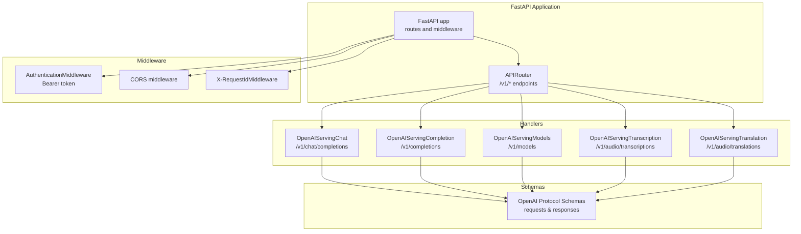
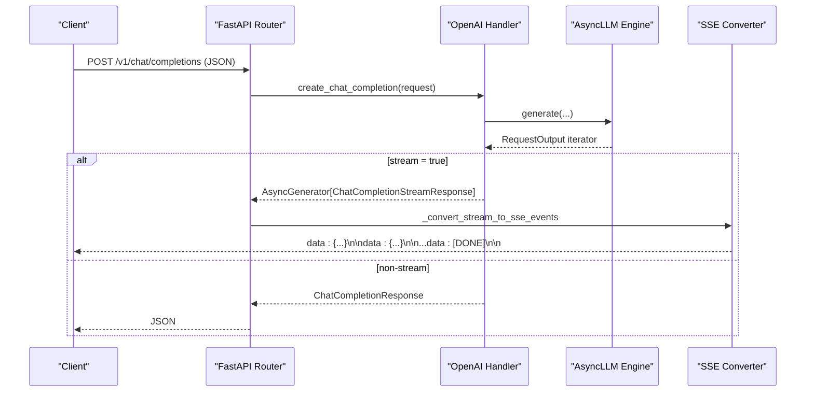
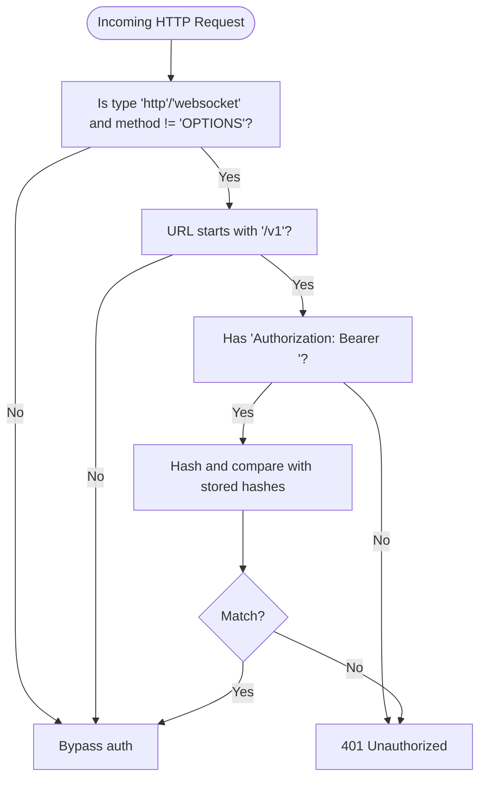
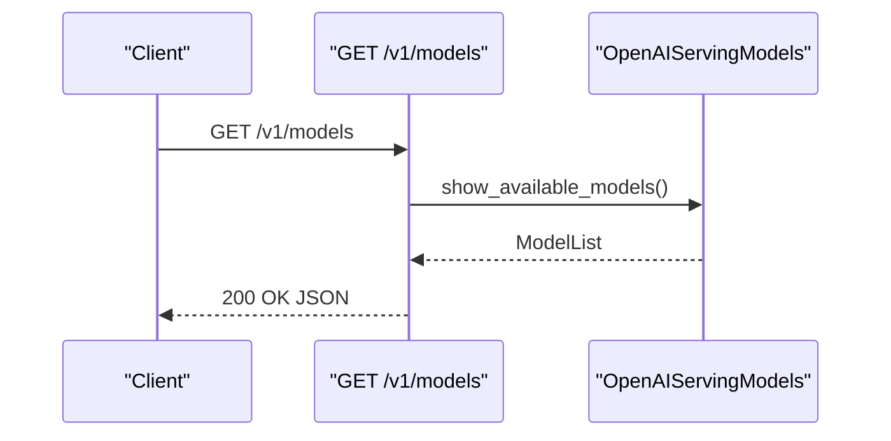
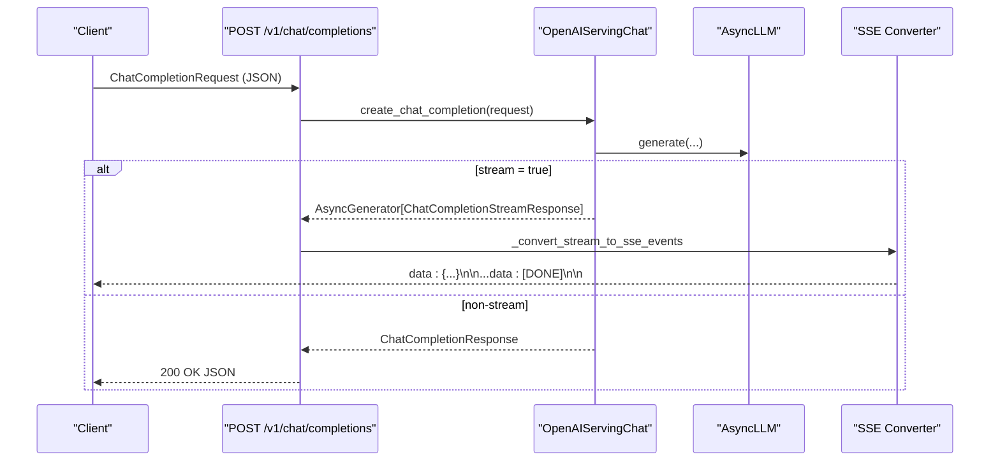
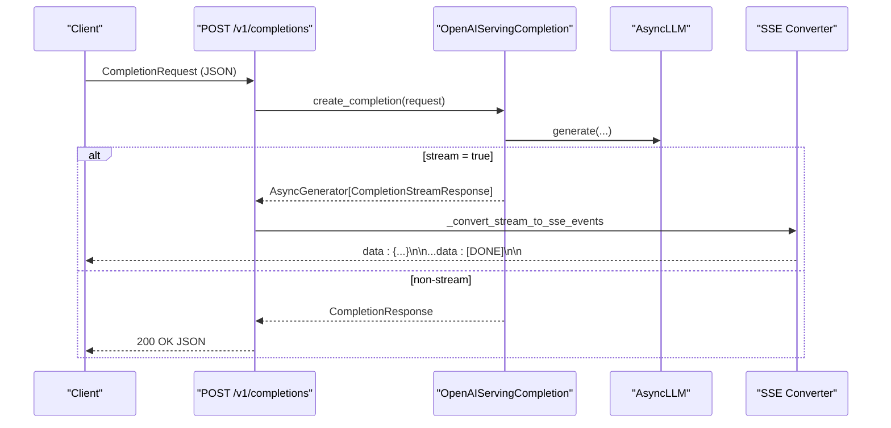
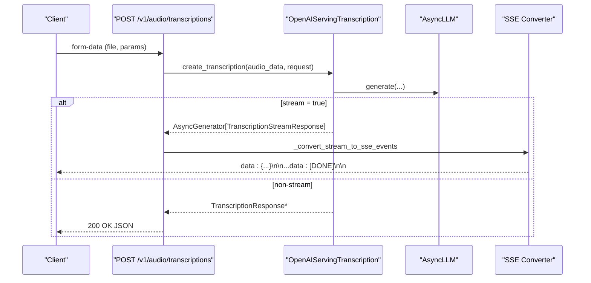
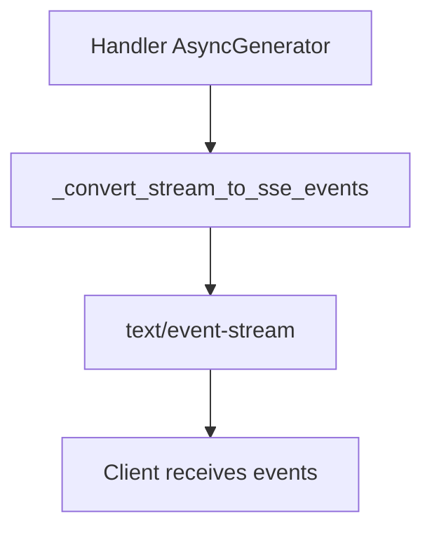
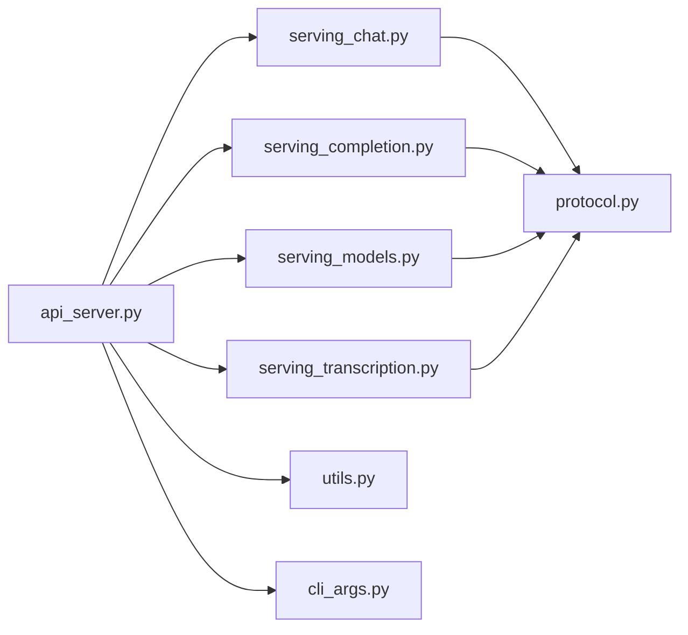

# OpenAI-Compatible API

<cite>
**Referenced Files in This Document**
- [api_server.py](file://vllm/entrypoints/openai/api_server.py)
- [serving_chat.py](file://vllm/entrypoints/openai/serving_chat.py)
- [serving_completion.py](file://vllm/entrypoints/openai/serving_completion.py)
- [serving_models.py](file://vllm/entrypoints/openai/serving_models.py)
- [serving_transcription.py](file://vllm/entrypoints/openai/serving_transcription.py)
- [protocol.py](file://vllm/entrypoints/openai/protocol.py)
- [cli_args.py](file://vllm/entrypoints/openai/cli_args.py)
- [utils.py](file://vllm/entrypoints/openai/utils.py)
- [openai_chat_completion_client.py](file://examples/online_serving/openai_chat_completion_client.py)
- [openai_completion_client.py](file://examples/online_serving/openai_completion_client.py)
</cite>

## Table of Contents
1. [Introduction](#introduction)
2. [Project Structure](#project-structure)
3. [Core Components](#core-components)
4. [Architecture Overview](#architecture-overview)
5. [Detailed Component Analysis](#detailed-component-analysis)
6. [Dependency Analysis](#dependency-analysis)
7. [Performance Considerations](#performance-considerations)
8. [Troubleshooting Guide](#troubleshooting-guide)
9. [Conclusion](#conclusion)
10. [Appendices](#appendices)

## Introduction
This document describes the OpenAI-compatible API server provided by vLLM. It covers the HTTP endpoints for chat completions, completions, model listing, and audio transcription/translation, including request/response schemas, streaming via Server-Sent Events (SSE), authentication, CORS, rate limiting, and practical client integration examples.

## Project Structure
The OpenAI-compatible API server is implemented as a FastAPI application with dedicated handlers for each endpoint. Supporting modules provide request/response schemas, streaming helpers, authentication middleware, and model metadata.

**Diagram sources**
- [api_server.py](file://vllm/entrypoints/openai/api_server.py#L233-L640)
- [serving_chat.py](file://vllm/entrypoints/openai/serving_chat.py#L1-L120)
- [serving_completion.py](file://vllm/entrypoints/openai/serving_completion.py#L1-L120)
- [serving_models.py](file://vllm/entrypoints/openai/serving_models.py#L1-L120)
- [serving_transcription.py](file://vllm/entrypoints/openai/serving_transcription.py#L1-L60)
- [protocol.py](file://vllm/entrypoints/openai/protocol.py#L525-L1599)

**Section sources**
- [api_server.py](file://vllm/entrypoints/openai/api_server.py#L233-L640)
- [protocol.py](file://vllm/entrypoints/openai/protocol.py#L525-L1599)

## Core Components
- API Router and Endpoints: Defines all OpenAI-compatible endpoints under /v1 and related audio endpoints.
- Handler Classes: Encapsulate business logic for each endpoint (chat, completion, models, audio).
- Protocol Schemas: Strongly typed request/response models validated by Pydantic.
- Middleware: Authentication, CORS, and request ID propagation.
- Streaming: SSE conversion and decoding utilities for streaming responses.

Key responsibilities:
- Endpoint routing and request validation
- Delegation to handler classes
- Streaming response conversion to SSE
- Error handling and standardized ErrorResponse format

**Section sources**
- [api_server.py](file://vllm/entrypoints/openai/api_server.py#L233-L640)
- [protocol.py](file://vllm/entrypoints/openai/protocol.py#L123-L200)
- [utils.py](file://vllm/entrypoints/openai/utils.py#L1-L50)

## Architecture Overview
The server exposes OpenAI-compatible endpoints backed by handler classes. Requests are validated against protocol schemas, processed asynchronously, and streamed as SSE when enabled.

**Diagram sources**
- [api_server.py](file://vllm/entrypoints/openai/api_server.py#L476-L561)
- [serving_chat.py](file://vllm/entrypoints/openai/serving_chat.py#L214-L437)
- [protocol.py](file://vllm/entrypoints/openai/protocol.py#L1491-L1556)

**Section sources**
- [api_server.py](file://vllm/entrypoints/openai/api_server.py#L314-L361)
- [serving_chat.py](file://vllm/entrypoints/openai/serving_chat.py#L214-L437)

## Detailed Component Analysis

### Authentication Middleware
- Purpose: Enforces Bearer token authentication for /v1 endpoints.
- Behavior:
  - Skips authentication for OPTIONS requests and non-/v1 paths.
  - Compares hashed Authorization header against configured tokens.
  - Returns 401 Unauthorized on mismatch.
- Security:
  - Uses constant-time comparison to mitigate timing attacks.
  - Tokens are SHA-256-hashed before comparison.

**Diagram sources**
- [api_server.py](file://vllm/entrypoints/openai/api_server.py#L654-L700)

**Section sources**
- [api_server.py](file://vllm/entrypoints/openai/api_server.py#L654-L700)

### CORS Configuration
- Enabled via FastAPI CORSMiddleware.
- Origins, methods, and headers are configurable via CLI arguments.
- Defaults to permissive settings when not overridden.

**Section sources**
- [api_server.py](file://vllm/entrypoints/openai/api_server.py#L233-L240)
- [cli_args.py](file://vllm/entrypoints/openai/cli_args.py#L88-L95)

### X-Request-Id Middleware
- Adds X-Request-Id header to responses.
- Generates a random UUID if not provided in the request.

**Section sources**
- [api_server.py](file://vllm/entrypoints/openai/api_server.py#L702-L731)

### /v1/models
- Method: GET
- URL: /v1/models
- Response: ModelList with ModelCard entries
- Notes:
  - Includes base models and loaded LoRA adapters.
  - Supports static LoRA initialization during startup.

**Diagram sources**
- [api_server.py](file://vllm/entrypoints/openai/api_server.py#L300-L306)
- [serving_models.py](file://vllm/entrypoints/openai/serving_models.py#L107-L131)

**Section sources**
- [api_server.py](file://vllm/entrypoints/openai/api_server.py#L300-L306)
- [serving_models.py](file://vllm/entrypoints/openai/serving_models.py#L107-L131)

### /v1/chat/completions
- Method: POST
- URL: /v1/chat/completions
- Request Schema: ChatCompletionRequest
- Response:
  - Non-streaming: ChatCompletionResponse
  - Streaming: text/event-stream (SSE) of ChatCompletionStreamResponse
- Features:
  - Tools and tool_choice support
  - Structured outputs (JSON schema/object)
  - Logprobs and token IDs
  - Echo and tokenization options
- Streaming:
  - Converts generator to SSE events
  - Emits [DONE] marker at the end

**Diagram sources**
- [api_server.py](file://vllm/entrypoints/openai/api_server.py#L476-L561)
- [serving_chat.py](file://vllm/entrypoints/openai/serving_chat.py#L214-L437)
- [protocol.py](file://vllm/entrypoints/openai/protocol.py#L525-L847)

**Section sources**
- [api_server.py](file://vllm/entrypoints/openai/api_server.py#L476-L561)
- [serving_chat.py](file://vllm/entrypoints/openai/serving_chat.py#L214-L437)
- [protocol.py](file://vllm/entrypoints/openai/protocol.py#L525-L847)

### /v1/completions
- Method: POST
- URL: /v1/completions
- Request Schema: CompletionRequest
- Response:
  - Non-streaming: CompletionResponse
  - Streaming: text/event-stream (SSE) of CompletionStreamResponse
- Features:
  - Echo, logprobs, top_logprobs
  - Prompt embeddings or token IDs
  - Structured outputs (JSON schema/object)
  - Token IDs and prompt_token_ids in streaming

**Diagram sources**
- [api_server.py](file://vllm/entrypoints/openai/api_server.py#L563-L640)
- [serving_completion.py](file://vllm/entrypoints/openai/serving_completion.py#L83-L326)
- [protocol.py](file://vllm/entrypoints/openai/protocol.py#L1010-L1274)

**Section sources**
- [api_server.py](file://vllm/entrypoints/openai/api_server.py#L563-L640)
- [serving_completion.py](file://vllm/entrypoints/openai/serving_completion.py#L83-L326)
- [protocol.py](file://vllm/entrypoints/openai/protocol.py#L1010-L1274)

### /v1/audio/transcriptions
- Method: POST
- URL: /v1/audio/transcriptions
- Request: multipart/form-data with file and parameters
- Response:
  - Non-streaming: TranscriptionResponse or TranscriptionResponseVerbose
  - Streaming: text/event-stream (SSE) of TranscriptionStreamResponse
- Audio processing handled by OpenAISpeechToText pipeline.

**Diagram sources**
- [api_server.py](file://vllm/entrypoints/openai/api_server.py#L563-L600)
- [serving_transcription.py](file://vllm/entrypoints/openai/serving_transcription.py#L54-L78)
- [protocol.py](file://vllm/entrypoints/openai/protocol.py#L1558-L1571)

**Section sources**
- [api_server.py](file://vllm/entrypoints/openai/api_server.py#L563-L600)
- [serving_transcription.py](file://vllm/entrypoints/openai/serving_transcription.py#L54-L78)
- [protocol.py](file://vllm/entrypoints/openai/protocol.py#L1558-L1571)

### /v1/audio/translations
- Method: POST
- URL: /v1/audio/translations
- Request: multipart/form-data with file and parameters
- Response:
  - Non-streaming: TranslationResponse or TranslationResponseVerbose
  - Streaming: text/event-stream (SSE) of TranslationStreamResponse

**Section sources**
- [api_server.py](file://vllm/entrypoints/openai/api_server.py#L602-L639)
- [serving_transcription.py](file://vllm/entrypoints/openai/serving_transcription.py#L124-L147)
- [protocol.py](file://vllm/entrypoints/openai/protocol.py#L1558-L1571)

### Streaming Support (SSE)
- Conversion:
  - Generator emits ChatCompletionStreamResponse or CompletionStreamResponse.
  - _convert_stream_to_sse_events wraps each event with "event: ..." and "data: ..." lines.
  - [DONE] sentinel ends the stream.
- Decoder:
  - SSEDecoder parses incoming SSE chunks, extracts "data" events, and handles [DONE].

**Diagram sources**
- [api_server.py](file://vllm/entrypoints/openai/api_server.py#L314-L361)
- [protocol.py](file://vllm/entrypoints/openai/protocol.py#L1491-L1556)

**Section sources**
- [api_server.py](file://vllm/entrypoints/openai/api_server.py#L314-L361)
- [protocol.py](file://vllm/entrypoints/openai/protocol.py#L1491-L1556)

### Request Validation and JSON Enforcement
- validate_json_request enforces application/json content type.
- Pydantic models in protocol.py validate request fields and cross-field constraints.

**Section sources**
- [utils.py](file://vllm/entrypoints/openai/utils.py#L43-L50)
- [protocol.py](file://vllm/entrypoints/openai/protocol.py#L857-L909)

### Error Handling Patterns
- Standardized ErrorResponse with ErrorInfo (message, type, code).
- Handlers return ErrorResponse for validation/runtime errors.
- FastAPI HTTPException raised for internal server errors.

**Section sources**
- [protocol.py](file://vllm/entrypoints/openai/protocol.py#L123-L133)
- [api_server.py](file://vllm/entrypoints/openai/api_server.py#L486-L515)

### Rate Limiting
- No built-in rate limiting in the OpenAI-compatible server.
- Recommendation: Deploy behind a reverse proxy or gateway that enforces quotas.

[No sources needed since this section provides general guidance]

## Dependency Analysis
The server composes multiple modules with clear boundaries:
- api_server.py orchestrates endpoints, middleware, and SSE conversion.
- serving_* modules encapsulate endpoint logic and delegate to the AsyncLLM engine.
- protocol.py defines schemas consumed by handlers and validated by Pydantic.
- cli_args.py configures runtime behavior (CORS, SSL, middleware, etc.).

**Diagram sources**
- [api_server.py](file://vllm/entrypoints/openai/api_server.py#L233-L640)
- [serving_chat.py](file://vllm/entrypoints/openai/serving_chat.py#L1-L120)
- [serving_completion.py](file://vllm/entrypoints/openai/serving_completion.py#L1-L120)
- [serving_models.py](file://vllm/entrypoints/openai/serving_models.py#L1-L120)
- [serving_transcription.py](file://vllm/entrypoints/openai/serving_transcription.py#L1-L60)
- [protocol.py](file://vllm/entrypoints/openai/protocol.py#L525-L1599)
- [utils.py](file://vllm/entrypoints/openai/utils.py#L1-L50)
- [cli_args.py](file://vllm/entrypoints/openai/cli_args.py#L71-L190)

**Section sources**
- [api_server.py](file://vllm/entrypoints/openai/api_server.py#L233-L640)
- [protocol.py](file://vllm/entrypoints/openai/protocol.py#L525-L1599)

## Performance Considerations
- Streaming reduces latency-to-first-token and enables progressive rendering.
- Use stream_options to include usage stats in streaming responses.
- Configure CORS and middleware judiciously to avoid unnecessary overhead.
- Tune engine-side parameters (temperature, top_p, max_tokens) to balance quality and throughput.

[No sources needed since this section provides general guidance]

## Troubleshooting Guide
Common issues and resolutions:
- 401 Unauthorized:
  - Ensure Authorization header uses Bearer token matching configured keys.
  - Verify tokens are SHA-256-hashed on the server side.
- Unsupported Media Type:
  - Only application/json is accepted for JSON endpoints.
- Streaming not received:
  - Confirm stream=true and client consumes text/event-stream.
  - Use SSEDecoder to parse events on the client.
- CORS errors:
  - Adjust allowed_origins/methods/headers via CLI arguments.
- Audio endpoints failing:
  - Ensure file upload is multipart/form-data and audio format is supported.

**Section sources**
- [api_server.py](file://vllm/entrypoints/openai/api_server.py#L654-L700)
- [utils.py](file://vllm/entrypoints/openai/utils.py#L43-L50)
- [cli_args.py](file://vllm/entrypoints/openai/cli_args.py#L88-L95)

## Conclusion
The vLLM OpenAI-compatible API server provides a robust, standards-aligned interface for chat completions, completions, model discovery, and audio transcription/translation. It leverages strong schema validation, flexible streaming, and extensible middleware to integrate seamlessly with existing OpenAI tooling.

## Appendices

### API Reference Summary

- /v1/chat/completions
  - Method: POST
  - Body: ChatCompletionRequest
  - Responses: ChatCompletionResponse or SSE stream of ChatCompletionStreamResponse
  - Authentication: Required if configured
  - Streaming: Yes

- /v1/completions
  - Method: POST
  - Body: CompletionRequest
  - Responses: CompletionResponse or SSE stream of CompletionStreamResponse
  - Authentication: Required if configured
  - Streaming: Yes

- /v1/models
  - Method: GET
  - Body: None
  - Responses: ModelList
  - Authentication: Optional

- /v1/audio/transcriptions
  - Method: POST
  - Body: multipart/form-data (file, parameters)
  - Responses: TranscriptionResponse* or SSE stream of TranscriptionStreamResponse
  - Authentication: Required if configured
  - Streaming: Yes

- /v1/audio/translations
  - Method: POST
  - Body: multipart/form-data (file, parameters)
  - Responses: TranslationResponse* or SSE stream of TranslationStreamResponse
  - Authentication: Required if configured
  - Streaming: Yes

**Section sources**
- [api_server.py](file://vllm/entrypoints/openai/api_server.py#L476-L639)
- [protocol.py](file://vllm/entrypoints/openai/protocol.py#L525-L1599)

### Client Integration Examples

- Python (OpenAI SDK)
  - Configure base_url to http://localhost:8000/v1 and api_key to "EMPTY".
  - Use client.chat.completions.create(...) or client.completions.create(...).
  - Enable stream=True for SSE consumption.

**Section sources**
- [openai_chat_completion_client.py](file://examples/online_serving/openai_chat_completion_client.py#L1-L65)
- [openai_completion_client.py](file://examples/online_serving/openai_completion_client.py#L1-L54)