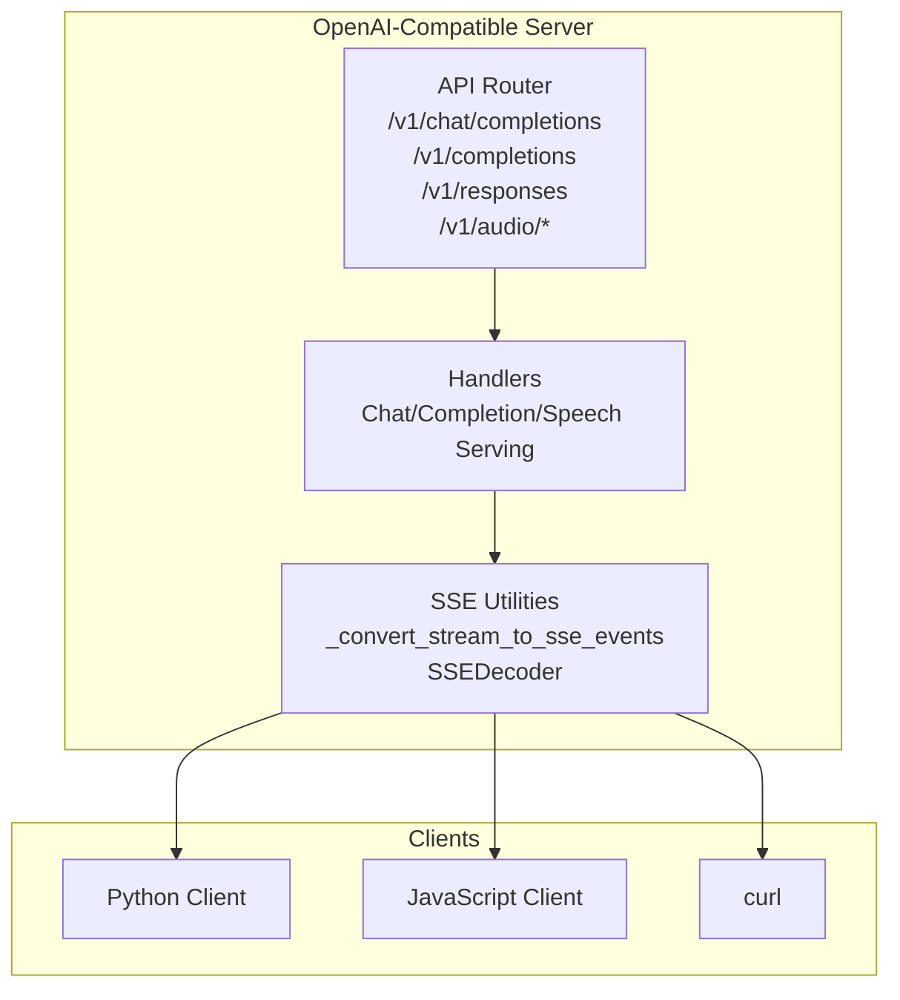
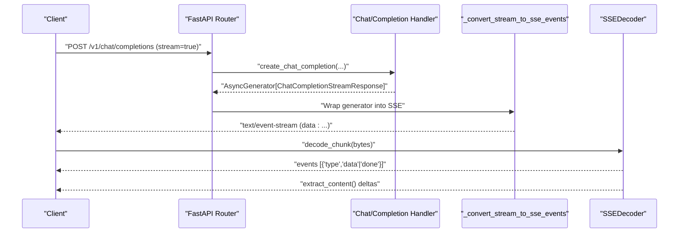
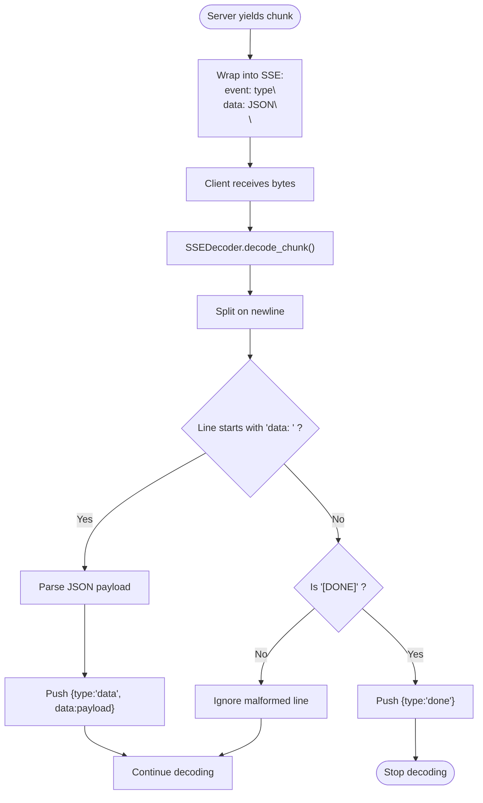
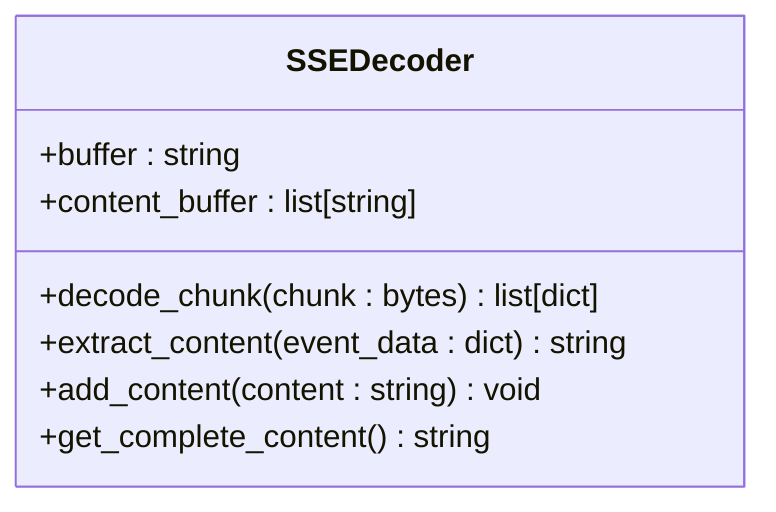
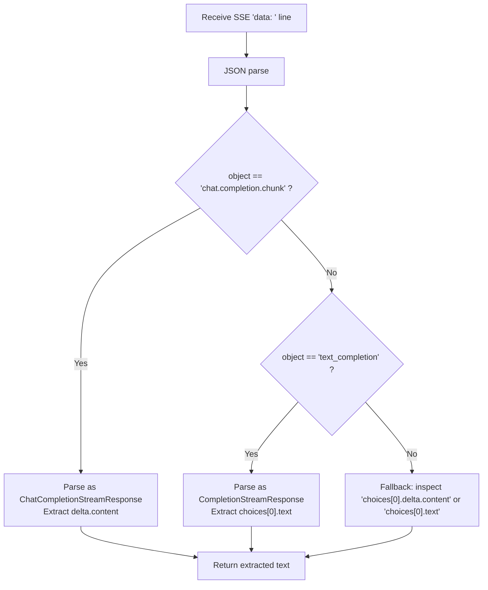
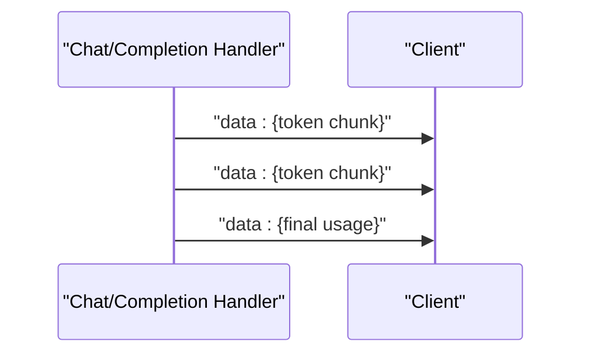
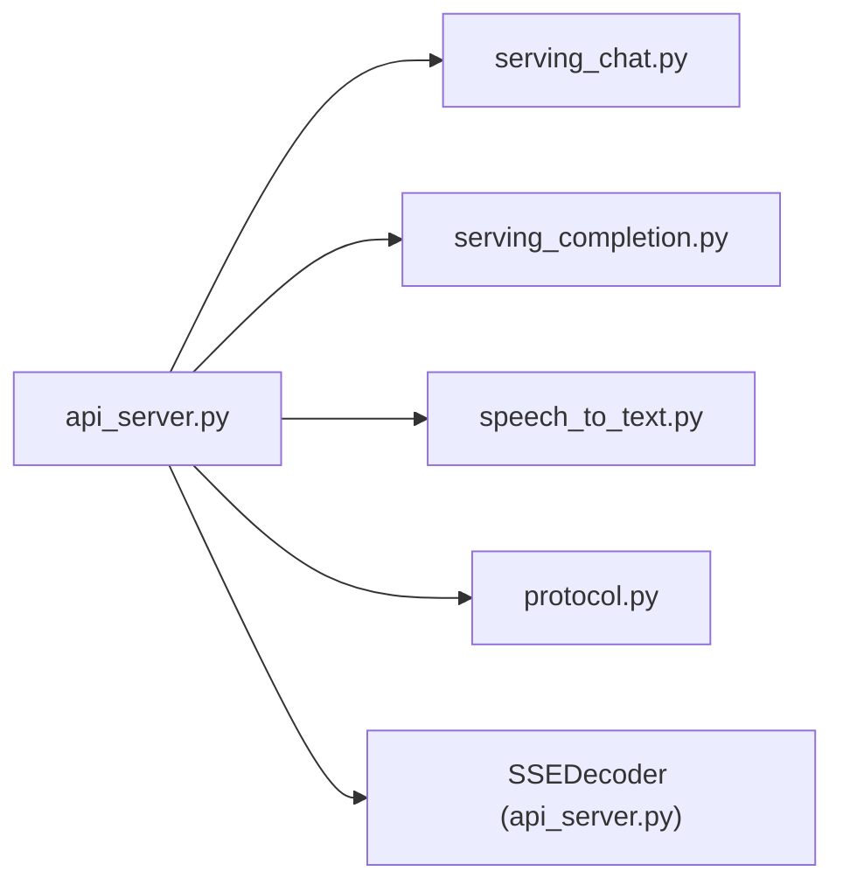

# Streaming and Server-Sent Events

<cite>
**Referenced Files in This Document**
- [api_server.py](file://vllm/entrypoints/openai/api_server.py)
- [serving_chat.py](file://vllm/entrypoints/openai/serving_chat.py)
- [serving_completion.py](file://vllm/entrypoints/openai/serving_completion.py)
- [speech_to_text.py](file://vllm/entrypoints/openai/speech_to_text.py)
- [protocol.py](file://vllm/entrypoints/openai/protocol.py)
- [async_llm_streaming.py](file://examples/offline_inference/async_llm_streaming.py)
- [openai_chat_completion_with_reasoning_streaming.py](file://examples/online_serving/openai_chat_completion_with_reasoning_streaming.py)
- [openai_chat_completion_client_with_tools_xlam_streaming.py](file://examples/online_serving/openai_chat_completion_client_with_tools_xlam_streaming.py)
- [openai_translation_client.py](file://examples/online_serving/openai_translation_client.py)
- [disagg_prefill_proxy_server.py](file://benchmarks/disagg_benchmarks/disagg_prefill_proxy_server.py)
</cite>

## Table of Contents
1. [Introduction](#introduction)
2. [Project Structure](#project-structure)
3. [Core Components](#core-components)
4. [Architecture Overview](#architecture-overview)
5. [Detailed Component Analysis](#detailed-component-analysis)
6. [Dependency Analysis](#dependency-analysis)
7. [Performance Considerations](#performance-considerations)
8. [Troubleshooting Guide](#troubleshooting-guide)
9. [Conclusion](#conclusion)
10. [Appendices](#appendices)

## Introduction
This document explains streaming responses and Server-Sent Events (SSE) in the vLLM OpenAI-compatible server. It covers the SSE event format, client-side streaming handling, decoding, buffer management, error recovery, and performance considerations. It also provides practical examples for Python, JavaScript, and curl, along with troubleshooting guidance for common streaming issues such as connection timeouts and client-side buffer overflow.

## Project Structure
The streaming implementation spans several modules:
- API server endpoints that produce SSE streams for chat, completions, audio transcription/translation, and custom responses.
- SSE event conversion and decoding utilities.
- Protocol models that define streaming response shapes.
- Example clients demonstrating streaming in Python, JavaScript, and curl.



**Diagram sources**
- [api_server.py](file://vllm/entrypoints/openai/api_server.py#L314-L360)
- [serving_chat.py](file://vllm/entrypoints/openai/serving_chat.py#L708-L731)
- [serving_completion.py](file://vllm/entrypoints/openai/serving_completion.py#L478-L480)
- [speech_to_text.py](file://vllm/entrypoints/openai/speech_to_text.py#L604-L605)

**Section sources**
- [api_server.py](file://vllm/entrypoints/openai/api_server.py#L314-L360)

## Core Components
- SSE event conversion: The server converts internal streaming generators into SSE-formatted text/event-stream responses.
- SSEDecoder: Robust client-side decoder that reconstructs events from byte chunks, extracts content deltas, and manages a content buffer.
- Streaming response models: Pydantic models define the shape of streaming chunks for chat and completion APIs.
- Handler producers: Chat and completion handlers emit “data: ” lines with JSON payloads; the server wraps them into SSE.

Key responsibilities:
- SSE conversion: Convert generator items into SSE-formatted lines.
- SSE parsing: Decode UTF-8 chunks, split on newlines, recognize “data: ” lines, parse JSON payloads, and detect “[DONE]”.
- Content extraction: Extract delta content from streaming chunks.
- Logging and buffering: Accumulate content and log completion with truncation.

**Section sources**
- [api_server.py](file://vllm/entrypoints/openai/api_server.py#L314-L360)
- [api_server.py](file://vllm/entrypoints/openai/api_server.py#L761-L856)
- [protocol.py](file://vllm/entrypoints/openai/protocol.py#L1407-L1420)
- [protocol.py](file://vllm/entrypoints/openai/protocol.py#L1546-L1560)
- [serving_chat.py](file://vllm/entrypoints/openai/serving_chat.py#L708-L731)
- [serving_completion.py](file://vllm/entrypoints/openai/serving_completion.py#L478-L480)

## Architecture Overview
The server produces SSE by yielding “data: ” lines containing JSON-encoded streaming chunks. Clients consume these lines incrementally. The SSEDecoder reconstructs events from raw bytes and aggregates content.



**Diagram sources**
- [api_server.py](file://vllm/entrypoints/openai/api_server.py#L314-L360)
- [serving_chat.py](file://vllm/entrypoints/openai/serving_chat.py#L708-L731)
- [api_server.py](file://vllm/entrypoints/openai/api_server.py#L761-L856)

## Detailed Component Analysis

### SSE Event Format and Done Signals
- Event stream format: Each server-produced chunk is a “data: ” line followed by a newline, then a blank newline separating events. The “event: ” field is derived from the streaming response object’s type.
- Done signal: The special sentinel “[DONE]” indicates the end of the stream.
- Usage reporting: Final usage chunks are emitted after the last token.



**Diagram sources**
- [api_server.py](file://vllm/entrypoints/openai/api_server.py#L314-L360)
- [api_server.py](file://vllm/entrypoints/openai/api_server.py#L768-L798)
- [serving_chat.py](file://vllm/entrypoints/openai/serving_chat.py#L1298-L1326)
- [serving_completion.py](file://vllm/entrypoints/openai/serving_completion.py#L494-L508)

**Section sources**
- [api_server.py](file://vllm/entrypoints/openai/api_server.py#L314-L360)
- [api_server.py](file://vllm/entrypoints/openai/api_server.py#L768-L798)
- [serving_chat.py](file://vllm/entrypoints/openai/serving_chat.py#L1298-L1326)
- [serving_completion.py](file://vllm/entrypoints/openai/serving_completion.py#L494-L508)

### _convert_stream_to_sse_events
- Purpose: Convert an async generator of streaming responses into an SSE stream of text/event-stream.
- Behavior: Iterates over the generator, reads the event type from the response object, serializes to JSON without indentation, and yields formatted SSE lines.

```mermaid
flowchart TD
A["_convert_stream_to_sse_events(generator)"] --> B["for event in generator"]
B --> C["event_type = getattr(event,'type','unknown')"]
C --> D["data_json = event.model_dump_json(indent=None)"]
D --> E["yield f\"event: {event_type}\\ndata: {data_json}\\n\\n\""]
```

**Diagram sources**
- [api_server.py](file://vllm/entrypoints/openai/api_server.py#L314-L324)

**Section sources**
- [api_server.py](file://vllm/entrypoints/openai/api_server.py#L314-L324)

### SSEDecoder
- Responsibilities:
  - Decode incoming bytes to UTF-8 text.
  - Maintain a buffer and split on newlines.
  - Recognize “data: ” lines and “[DONE]” sentinel.
  - Parse JSON payloads and emit events.
  - Extract content deltas via a helper and accumulate content.
- Error handling:
  - Skips malformed chunks (non-UTF-8).
  - Skips malformed JSON lines.
  - Stops at “[DONE]” and logs the accumulated content.



**Diagram sources**
- [api_server.py](file://vllm/entrypoints/openai/api_server.py#L761-L812)

**Section sources**
- [api_server.py](file://vllm/entrypoints/openai/api_server.py#L761-L856)

### Chunk Processing and Content Extraction
- Handlers emit “data: {json}” lines for each token or step.
- The server-side extractor inspects the “object” field and uses typed models to safely extract deltas.
- Fallback parsing supports legacy or partial payloads.



**Diagram sources**
- [api_server.py](file://vllm/entrypoints/openai/api_server.py#L733-L758)
- [serving_chat.py](file://vllm/entrypoints/openai/serving_chat.py#L708-L731)
- [serving_completion.py](file://vllm/entrypoints/openai/serving_completion.py#L478-L480)

**Section sources**
- [api_server.py](file://vllm/entrypoints/openai/api_server.py#L733-L758)
- [serving_chat.py](file://vllm/entrypoints/openai/serving_chat.py#L708-L731)
- [serving_completion.py](file://vllm/entrypoints/openai/serving_completion.py#L478-L480)

### Streaming Handlers and Usage Reporting
- Chat and completion handlers emit per-token chunks and optionally continuous or final usage info.
- Usage is included as a separate “data: ” line after the final token when requested.



**Diagram sources**
- [serving_chat.py](file://vllm/entrypoints/openai/serving_chat.py#L1298-L1326)
- [serving_completion.py](file://vllm/entrypoints/openai/serving_completion.py#L494-L508)

**Section sources**
- [serving_chat.py](file://vllm/entrypoints/openai/serving_chat.py#L1298-L1326)
- [serving_completion.py](file://vllm/entrypoints/openai/serving_completion.py#L494-L508)

### Offline Streaming Example (AsyncLLM)
- Demonstrates token-by-token streaming in offline inference using DELTA output kind.
- Shows how to iterate over engine.generate() and handle finished flags.

**Section sources**
- [async_llm_streaming.py](file://examples/offline_inference/async_llm_streaming.py#L22-L64)

### Online Streaming Examples
- Python client streaming with reasoning models.
- Python client streaming with tool calls for xLAM models.
- JavaScript client streaming chat completions.
- curl usage for SSE endpoints.

**Section sources**
- [openai_chat_completion_with_reasoning_streaming.py](file://examples/online_serving/openai_chat_completion_with_reasoning_streaming.py#L36-L71)
- [openai_chat_completion_client_with_tools_xlam_streaming.py](file://examples/online_serving/openai_chat_completion_client_with_tools_xlam_streaming.py#L109-L159)
- [openai_translation_client.py](file://examples/online_serving/openai_translation_client.py#L29-L60)

## Dependency Analysis
- API server depends on:
  - Serving modules for chat/completion/audio to produce streaming generators.
  - SSE utilities to convert generators into SSE.
  - Protocol models to serialize streaming chunks.
- SSEDecoder depends on:
  - JSON parsing and UTF-8 decoding.
  - Helper to extract content from chunks.



**Diagram sources**
- [api_server.py](file://vllm/entrypoints/openai/api_server.py#L314-L360)
- [serving_chat.py](file://vllm/entrypoints/openai/serving_chat.py#L708-L731)
- [serving_completion.py](file://vllm/entrypoints/openai/serving_completion.py#L478-L480)
- [speech_to_text.py](file://vllm/entrypoints/openai/speech_to_text.py#L604-L605)
- [protocol.py](file://vllm/entrypoints/openai/protocol.py#L1407-L1420)

**Section sources**
- [api_server.py](file://vllm/entrypoints/openai/api_server.py#L314-L360)
- [serving_chat.py](file://vllm/entrypoints/openai/serving_chat.py#L708-L731)
- [serving_completion.py](file://vllm/entrypoints/openai/serving_completion.py#L478-L480)
- [speech_to_text.py](file://vllm/entrypoints/openai/speech_to_text.py#L604-L605)
- [protocol.py](file://vllm/entrypoints/openai/protocol.py#L1407-L1420)

## Performance Considerations
- Minimize serialization overhead:
  - Use compact JSON (no indent) for streaming payloads.
- Reduce network fragmentation:
  - Prefer larger chunk sizes at the producer side to reduce TCP packets.
- Efficient decoding:
  - SSEDecoder maintains a small buffer and processes complete lines; avoid extremely small client read buffers.
- Backpressure and timeouts:
  - Ensure client-side loops drain the stream promptly to prevent buffer overflow.
  - Configure server and proxy timeouts appropriately to avoid premature disconnects.
- Memory management:
  - SSEDecoder accumulates content; for very long streams, consider streaming to disk or limiting retained content length.
- Usage reporting:
  - Final usage chunks are emitted after the last token; avoid requesting continuous usage unless needed.

[No sources needed since this section provides general guidance]

## Troubleshooting Guide
Common issues and remedies:
- Connection timeouts:
  - Symptom: Client disconnects mid-stream.
  - Causes: Server-side idle timeout, proxy timeout, or client-side read timeout.
  - Actions: Increase server/proxy timeouts; ensure client reads continuously; use keep-alive headers if applicable.
- Client-side buffer overflow:
  - Symptom: Memory spikes or lag while rendering incremental content.
  - Causes: Slow consumption or accumulation of large content buffers.
  - Actions: Consume chunks promptly; truncate or discard old content; use streaming UI updates.
- Malformed SSE lines:
  - Symptom: Decoder skips lines or fails to parse.
  - Causes: Non-UTF-8 bytes, malformed JSON, or missing separators.
  - Actions: Validate UTF-8; ensure server emits proper “data: ” lines and blank separators; handle exceptions gracefully.
- Missing content deltas:
  - Symptom: Empty content in chunks.
  - Causes: Model returned empty deltas or client accessed absent fields.
  - Actions: Check model capabilities; guard access to delta.content; handle optional fields.
- Proxy or gateway interference:
  - Symptom: Intermediaries drop or modify SSE.
  - Actions: Use direct server connection; configure proxies for text/event-stream; avoid compression for SSE.

**Section sources**
- [api_server.py](file://vllm/entrypoints/openai/api_server.py#L768-L798)
- [openai_translation_client.py](file://examples/online_serving/openai_translation_client.py#L29-L60)
- [disagg_prefill_proxy_server.py](file://benchmarks/disagg_benchmarks/disagg_prefill_proxy_server.py#L190-L199)

## Conclusion
vLLM’s streaming architecture cleanly separates concerns: handlers produce structured streaming chunks, the server converts them to SSE, and clients decode and render deltas. The SSEDecoder provides robust parsing and content accumulation. By following the examples and best practices outlined here, developers can implement reliable streaming across Python, JavaScript, and curl clients while managing performance and resilience effectively.

[No sources needed since this section summarizes without analyzing specific files]

## Appendices

### SSE Event Types and Payload Shapes
- Event types:
  - “data”: Contains a JSON payload representing a streaming chunk.
  - “done”: Indicates the end of the stream.
- Payload shapes:
  - Chat completion streaming chunks include delta content and optional usage.
  - Completion streaming chunks include text deltas and optional usage.

**Section sources**
- [api_server.py](file://vllm/entrypoints/openai/api_server.py#L314-L324)
- [protocol.py](file://vllm/entrypoints/openai/protocol.py#L1546-L1560)
- [protocol.py](file://vllm/entrypoints/openai/protocol.py#L1407-L1420)

### Client-Side Streaming Patterns
- Python:
  - Iterate over the OpenAI client stream and extract delta.content or tool_calls progressively.
- JavaScript:
  - Use fetch with a readable stream and parse “data: ” lines.
- Curl:
  - Use curl with line-by-line processing to parse SSE.

**Section sources**
- [openai_chat_completion_with_reasoning_streaming.py](file://examples/online_serving/openai_chat_completion_with_reasoning_streaming.py#L36-L71)
- [openai_chat_completion_client_with_tools_xlam_streaming.py](file://examples/online_serving/openai_chat_completion_client_with_tools_xlam_streaming.py#L109-L159)
- [openai_translation_client.py](file://examples/online_serving/openai_translation_client.py#L29-L60)