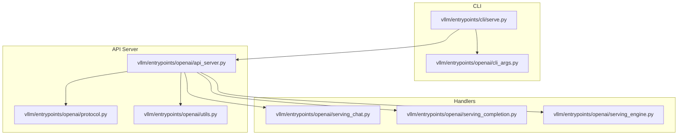
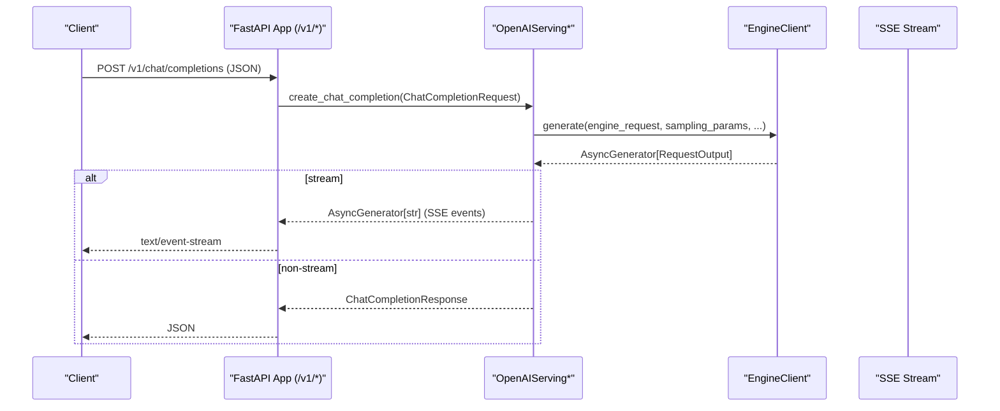
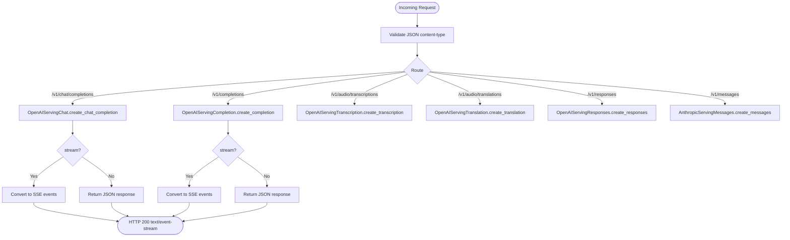
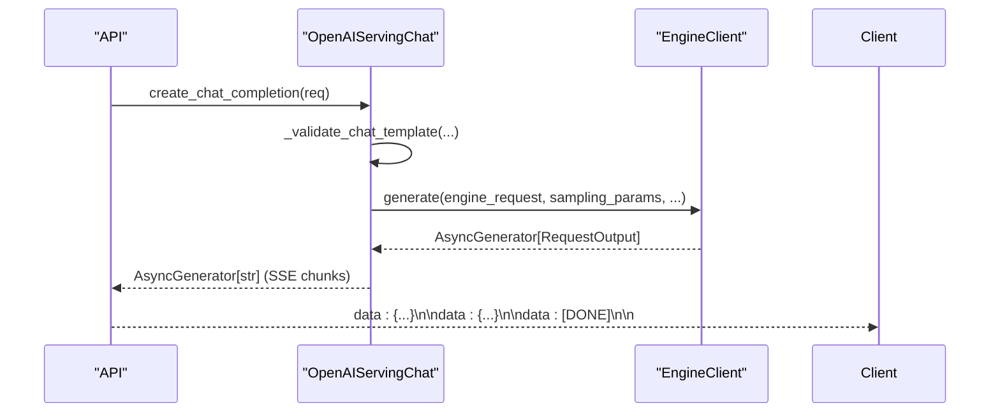
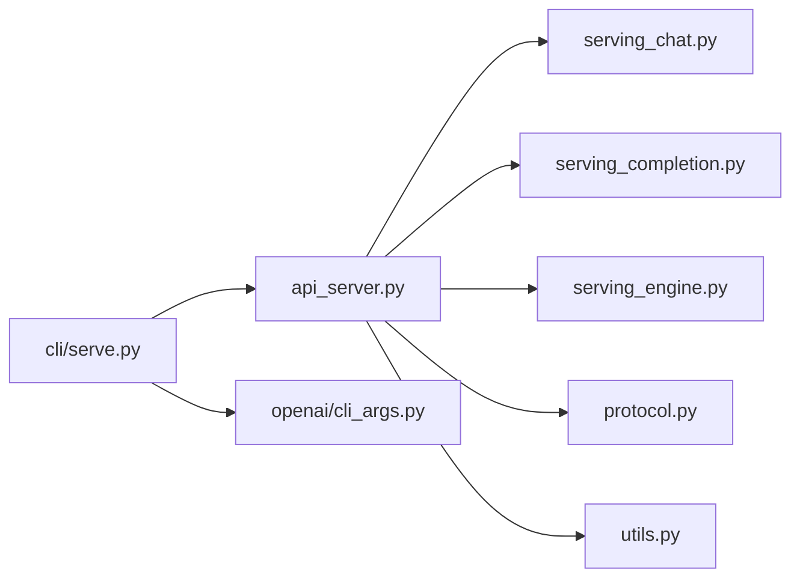

# Serving and APIs

<cite>
**Referenced Files in This Document**
- [api_server.py](file://vllm/entrypoints/openai/api_server.py)
- [cli_args.py](file://vllm/entrypoints/openai/cli_args.py)
- [serve.py](file://vllm/entrypoints/cli/serve.py)
- [serving_chat.py](file://vllm/entrypoints/openai/serving_chat.py)
- [serving_completion.py](file://vllm/entrypoints/openai/serving_completion.py)
- [serving_engine.py](file://vllm/entrypoints/openai/serving_engine.py)
- [protocol.py](file://vllm/entrypoints/openai/protocol.py)
- [utils.py](file://vllm/entrypoints/openai/utils.py)
- [openai_compatible_server.md](file://docs/serving/openai_compatible_server.md)
- [serve_args.md](file://docs/configuration/serve_args.md)
- [nginx.md](file://docs/deployment/nginx.md)
- [k8s.md](file://docs/deployment/k8s.md)
- [openai_chat_completion_client.py](file://examples/online_serving/openai_chat_completion_client.py)
- [openai_chat_completion_with_reasoning_streaming.py](file://examples/online_serving/openai_chat_completion_with_reasoning_streaming.py)
- [openai_embedding_client.py](file://examples/pooling/embed/openai_embedding_client.py)
</cite>

## Table of Contents
1. [Introduction](#introduction)
2. [Project Structure](#project-structure)
3. [Core Components](#core-components)
4. [Architecture Overview](#architecture-overview)
5. [Detailed Component Analysis](#detailed-component-analysis)
6. [Dependency Analysis](#dependency-analysis)
7. [Performance Considerations](#performance-considerations)
8. [Troubleshooting Guide](#troubleshooting-guide)
9. [Conclusion](#conclusion)
10. [Appendices](#appendices)

## Introduction
This document explains vLLM’s production-ready serving and APIs, focusing on the OpenAI-compatible API server implementation, request/response formats, streaming support, CLI interface, configuration management, deployment and scaling strategies, monitoring, authentication, and rate limiting. It also provides practical examples and integration patterns with popular frameworks and deployment scenarios.

## Project Structure
The serving stack centers around an OpenAI-compatible FastAPI application that routes requests to specialized handlers and an asynchronous engine client. The CLI orchestrates server startup, multi-process orchestration, and configuration.

**Diagram sources**
- [serve.py](file://vllm/entrypoints/cli/serve.py#L1-L250)
- [cli_args.py](file://vllm/entrypoints/openai/cli_args.py#L1-L303)
- [api_server.py](file://vllm/entrypoints/openai/api_server.py#L1-L200)
- [protocol.py](file://vllm/entrypoints/openai/protocol.py#L1-L200)
- [utils.py](file://vllm/entrypoints/openai/utils.py#L1-L50)
- [serving_chat.py](file://vllm/entrypoints/openai/serving_chat.py#L1-L120)
- [serving_completion.py](file://vllm/entrypoints/openai/serving_completion.py#L1-L120)
- [serving_engine.py](file://vllm/entrypoints/openai/serving_engine.py#L1-L120)

**Section sources**
- [serve.py](file://vllm/entrypoints/cli/serve.py#L1-L250)
- [cli_args.py](file://vllm/entrypoints/openai/cli_args.py#L1-L303)
- [api_server.py](file://vllm/entrypoints/openai/api_server.py#L1-L200)

## Core Components
- OpenAI-compatible API server: Exposes endpoints for chat completions, completions, embeddings, tokenization, audio transcription/translation, and model discovery. It supports streaming via Server-Sent Events (SSE).
- Handlers: Specialized modules for chat, completions, and other tasks that convert requests into engine inputs and format responses.
- Protocol models: Pydantic models defining request/response schemas aligned with OpenAI’s API.
- CLI and configuration: Argument parsers and validators for frontend and engine parameters, plus multi-process orchestration for horizontal scaling.
- Authentication and middleware: Optional bearer token authentication and request ID propagation.

**Section sources**
- [api_server.py](file://vllm/entrypoints/openai/api_server.py#L280-L760)
- [serving_chat.py](file://vllm/entrypoints/openai/serving_chat.py#L1-L220)
- [serving_completion.py](file://vllm/entrypoints/openai/serving_completion.py#L1-L120)
- [protocol.py](file://vllm/entrypoints/openai/protocol.py#L1-L200)
- [cli_args.py](file://vllm/entrypoints/openai/cli_args.py#L71-L200)
- [serve.py](file://vllm/entrypoints/cli/serve.py#L1-L120)

## Architecture Overview
The server initializes an asynchronous engine client, registers routes, and applies middleware. Requests are validated and dispatched to handlers, which interact with the engine client and stream results back to clients.

**Diagram sources**
- [api_server.py](file://vllm/entrypoints/openai/api_server.py#L476-L561)
- [serving_chat.py](file://vllm/entrypoints/openai/serving_chat.py#L214-L437)
- [serving_engine.py](file://vllm/entrypoints/openai/serving_engine.py#L599-L742)

**Section sources**
- [api_server.py](file://vllm/entrypoints/openai/api_server.py#L476-L561)
- [serving_chat.py](file://vllm/entrypoints/openai/serving_chat.py#L214-L437)
- [serving_engine.py](file://vllm/entrypoints/openai/serving_engine.py#L599-L742)

## Detailed Component Analysis

### OpenAI-Compatible API Server
- Routes and endpoints:
  - Models: GET /v1/models
  - Version: GET /version
  - Load metrics: GET /load
  - Chat Completions: POST /v1/chat/completions (supports streaming)
  - Completions: POST /v1/completions (supports streaming)
  - Audio: POST /v1/audio/transcriptions, POST /v1/audio/translations
  - Tokenization: POST /v1/tokenize
  - Embeddings: POST /v1/embeddings (via pooling)
  - Tokenization: GET /v1/tokenize
  - Responses API: POST /v1/responses, GET /v1/responses/{id}, POST /v1/responses/{id}/cancel
  - Messages API: POST /v1/messages (Anthropic-compatible)
- Streaming: SSE conversion for streaming responses; SSE decoder utility for clients.
- Middleware:
  - CORS and custom middlewares (e.g., request ID propagation).
  - Authentication: Bearer token verification for /v1 paths.
- Metrics: Optional endpoint load metrics and usage aggregation headers.

**Diagram sources**
- [api_server.py](file://vllm/entrypoints/openai/api_server.py#L280-L760)
- [serving_chat.py](file://vllm/entrypoints/openai/serving_chat.py#L214-L437)
- [serving_completion.py](file://vllm/entrypoints/openai/serving_completion.py#L83-L180)

**Section sources**
- [api_server.py](file://vllm/entrypoints/openai/api_server.py#L280-L760)
- [utils.py](file://vllm/entrypoints/openai/utils.py#L43-L50)

### Chat Completions Handler
- Validates model and request, prepares prompts via renderers and chat templates, constructs sampling parameters, schedules generation, and streams deltas or returns a full response.
- Supports tool calls, reasoning, structured outputs, echo, and token IDs.
- Streaming: emits role and content deltas, optional continuous usage stats, and final usage.

**Diagram sources**
- [serving_chat.py](file://vllm/entrypoints/openai/serving_chat.py#L214-L437)
- [serving_chat.py](file://vllm/entrypoints/openai/serving_chat.py#L578-L800)

**Section sources**
- [serving_chat.py](file://vllm/entrypoints/openai/serving_chat.py#L214-L437)
- [serving_chat.py](file://vllm/entrypoints/openai/serving_chat.py#L578-L800)

### Completions Handler
- Renders prompts (including embeddings variants), validates unsupported features, schedules generation, and streams or returns a full response.
- Echo and token IDs are supported; beam search disables streaming.

**Section sources**
- [serving_completion.py](file://vllm/entrypoints/openai/serving_completion.py#L83-L180)
- [serving_completion.py](file://vllm/entrypoints/openai/serving_completion.py#L261-L326)

### Protocol Models and Request/Response Formats
- Defines request/response models for chat, completions, embeddings, tokenization, audio, and responses.
- Includes structured output formats, stream options, tool definitions, and usage information.

**Section sources**
- [protocol.py](file://vllm/entrypoints/openai/protocol.py#L1-L200)
- [protocol.py](file://vllm/entrypoints/openai/protocol.py#L525-L800)

### CLI Interface and Configuration Management
- Subcommand: serve
  - Options include host/port, Unix domain socket, CORS, API key, LoRA modules, SSL, middleware, request ID headers, tool parsing, and more.
  - Supports headless mode and multi-API server processes.
- Argument parsing:
  - Combines frontend and engine arguments.
  - Validates chat template and tool-related flags.
- Multi-process orchestration:
  - Launches API server workers and engine cores, coordinates stats publishing, and supports external/hybrid data-parallel load balancing.

**Section sources**
- [serve.py](file://vllm/entrypoints/cli/serve.py#L1-L250)
- [cli_args.py](file://vllm/entrypoints/openai/cli_args.py#L71-L200)
- [cli_args.py](file://vllm/entrypoints/openai/cli_args.py#L244-L303)

### Authentication and Rate Limiting
- Authentication:
  - Bearer token middleware verifies Authorization header against configured tokens for /v1 paths.
- Rate limiting:
  - Not implemented in the server code; consider deploying an ingress controller or gateway (e.g., NGINX, Envoy) with rate limiting policies.

**Section sources**
- [api_server.py](file://vllm/entrypoints/openai/api_server.py#L654-L700)

### Monitoring and Metrics
- Load metrics endpoint: GET /load returns server load metrics aggregated across selected routes.
- Usage reporting:
  - Streaming supports continuous usage stats and final usage aggregation.
  - Optional usage headers for endpoint load metrics.
- Logging:
  - Configurable logging via JSON config file and uvicorn log level.

**Section sources**
- [api_server.py](file://vllm/entrypoints/openai/api_server.py#L281-L298)
- [serving_completion.py](file://vllm/entrypoints/openai/serving_completion.py#L327-L518)
- [cli_args.py](file://vllm/entrypoints/openai/cli_args.py#L165-L171)

## Dependency Analysis
The server composes several modules with clear responsibilities and low coupling.

**Diagram sources**
- [api_server.py](file://vllm/entrypoints/openai/api_server.py#L1-L120)
- [serving_chat.py](file://vllm/entrypoints/openai/serving_chat.py#L1-L120)
- [serving_completion.py](file://vllm/entrypoints/openai/serving_completion.py#L1-L120)
- [serving_engine.py](file://vllm/entrypoints/openai/serving_engine.py#L1-L120)
- [protocol.py](file://vllm/entrypoints/openai/protocol.py#L1-L120)
- [utils.py](file://vllm/entrypoints/openai/utils.py#L1-L50)
- [serve.py](file://vllm/entrypoints/cli/serve.py#L1-L120)
- [cli_args.py](file://vllm/entrypoints/openai/cli_args.py#L1-L120)

**Section sources**
- [api_server.py](file://vllm/entrypoints/openai/api_server.py#L1-L120)
- [serve.py](file://vllm/entrypoints/cli/serve.py#L1-L120)

## Performance Considerations
- Streaming reduces latency-to-first-token and enables efficient client-side rendering.
- Beam search disables streaming; use streaming-friendly sampling parameters for latency-sensitive workloads.
- Prefix caching and cache salts reduce repeated computation for repeated prompts.
- Multi-process API servers scale horizontally; ensure adequate CPU/memory per process and balanced load distribution.
- Use external load balancers and autoscaling to match traffic patterns.

[No sources needed since this section provides general guidance]

## Troubleshooting Guide
- Unsupported media type: Requests must use application/json; otherwise a validation error is raised.
- Internal server errors: Generation errors are converted to 500 responses; check logs and request IDs.
- Authentication failures: Ensure Authorization header contains a valid bearer token for /v1 endpoints.
- Streaming issues: Verify SSE decoding on the client side; ensure network supports long-lived connections.

**Section sources**
- [utils.py](file://vllm/entrypoints/openai/utils.py#L43-L50)
- [serving_engine.py](file://vllm/entrypoints/openai/serving_engine.py#L772-L800)
- [api_server.py](file://vllm/entrypoints/openai/api_server.py#L654-L700)

## Conclusion
vLLM’s OpenAI-compatible API server provides a robust, production-grade foundation for serving LLMs. It supports streaming, structured outputs, tool use, and flexible configuration. Combine it with proper deployment, monitoring, and ingress controls to achieve scalable, secure, and observable inference services.

[No sources needed since this section summarizes without analyzing specific files]

## Appendices

### Practical Setup and Client Integration Examples
- Basic chat completion client:
  - [openai_chat_completion_client.py](file://examples/online_serving/openai_chat_completion_client.py)
- Streaming with reasoning:
  - [openai_chat_completion_with_reasoning_streaming.py](file://examples/online_serving/openai_chat_completion_with_reasoning_streaming.py)
- Embeddings:
  - [openai_embedding_client.py](file://examples/pooling/embed/openai_embedding_client.py)

**Section sources**
- [openai_chat_completion_client.py](file://examples/online_serving/openai_chat_completion_client.py)
- [openai_chat_completion_with_reasoning_streaming.py](file://examples/online_serving/openai_chat_completion_with_reasoning_streaming.py)
- [openai_embedding_client.py](file://examples/pooling/embed/openai_embedding_client.py)

### Deployment and Scaling References
- OpenAI-compatible server documentation:
  - [openai_compatible_server.md](file://docs/serving/openai_compatible_server.md)
- Server arguments reference:
  - [serve_args.md](file://docs/configuration/serve_args.md)
- NGINX deployment:
  - [nginx.md](file://docs/deployment/nginx.md)
- Kubernetes deployment:
  - [k8s.md](file://docs/deployment/k8s.md)

**Section sources**
- [openai_compatible_server.md](file://docs/serving/openai_compatible_server.md)
- [serve_args.md](file://docs/configuration/serve_args.md)
- [nginx.md](file://docs/deployment/nginx.md)
- [k8s.md](file://docs/deployment/k8s.md)