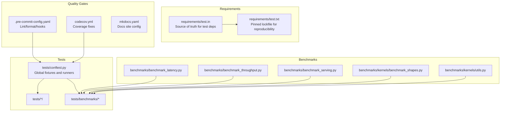
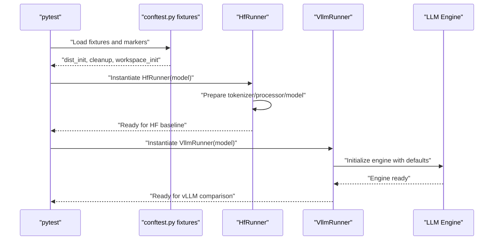
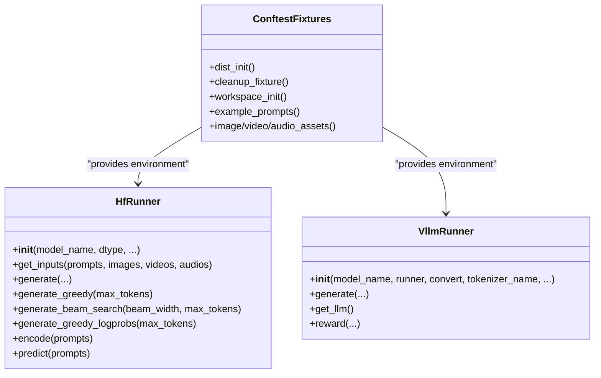
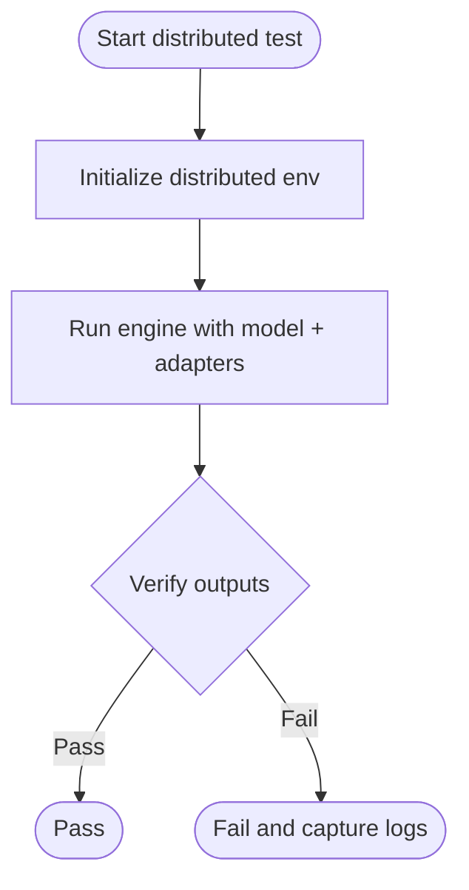
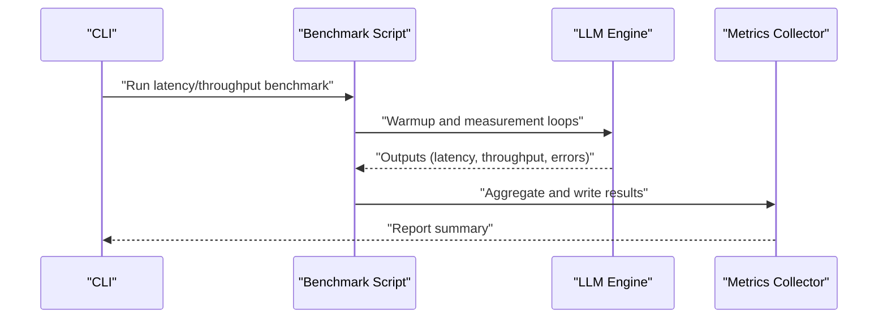
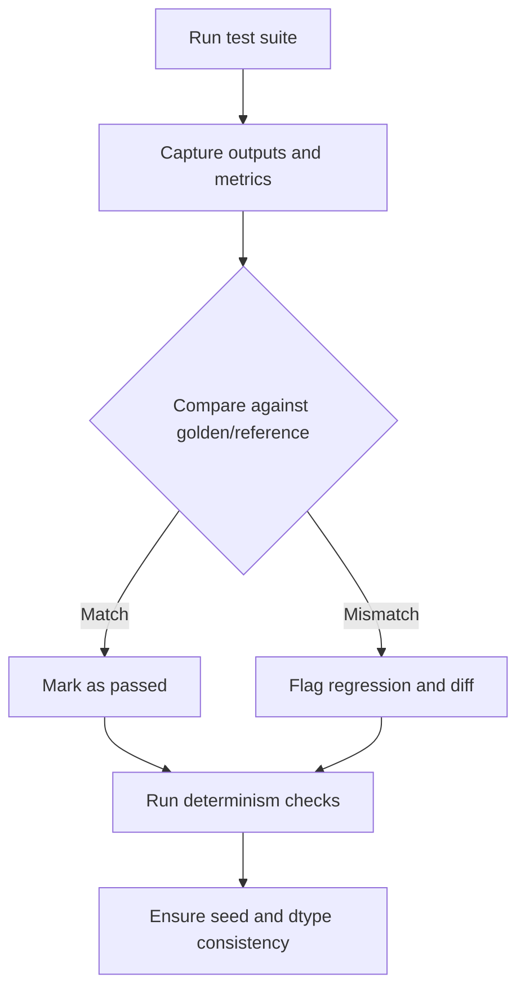
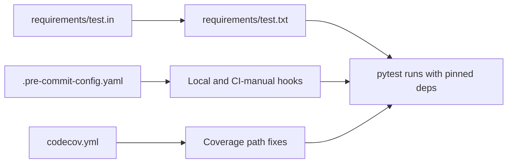
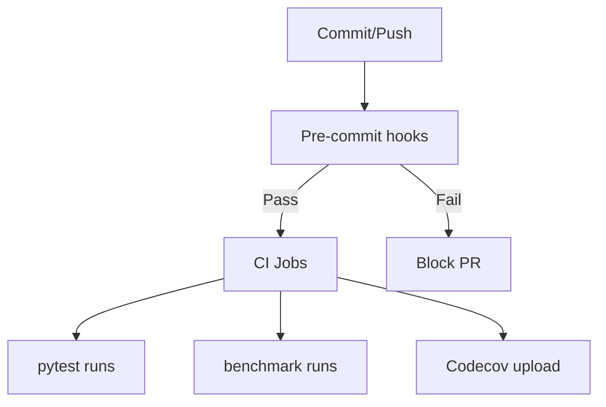
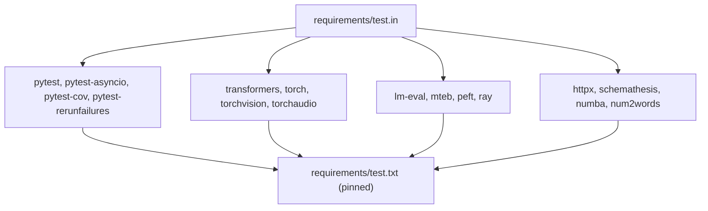

# Testing and Quality Assurance

<cite>
**Referenced Files in This Document**
- [tests/conftest.py](file://tests/conftest.py)
- [.pre-commit-config.yaml](file://.pre-commit-config.yaml)
- [requirements/test.in](file://requirements/test.in)
- [requirements/test.txt](file://requirements/test.txt)
- [codecov.yml](file://codecov.yml)
- [mkdocs.yaml](file://mkdocs.yaml)
- [tests/benchmarks/test_latency_cli.py](file://tests/benchmarks/test_latency_cli.py)
- [tests/benchmarks/test_throughput_cli.py](file://tests/benchmarks/test_throughput_cli.py)
- [benchmarks/benchmark_latency.py](file://benchmarks/benchmark_latency.py)
- [benchmarks/benchmark_throughput.py](file://benchmarks/benchmark_throughput.py)
- [benchmarks/benchmark_serving.py](file://benchmarks/benchmark_serving.py)
- [benchmarks/kernels/benchmark_shapes.py](file://benchmarks/kernels/benchmark_shapes.py)
- [benchmarks/kernels/utils.py](file://benchmarks/kernels/utils.py)
- [tests/v1/engine/test_outputs.py](file://tests/v1/engine/test_outputs.py)
- [tests/v1/distributed/test_distributed_oot.py](file://tests/v1/distributed/test_distributed_oot.py)
- [tests/lora/test_add_lora.py](file://tests/lora/test_add_lora.py)
- [tests/models/test_registry.py](file://tests/models/test_registry.py)
- [tests/tokenizers_/test_basic.py](file://tests/tokenizers_/test_basic.py)
- [tests/utils_/test_argparse_utils.py](file://tests/utils_/test_argparse_utils.py)
- [tests/standalone_tests/lazy_imports.py](file://tests/standalone_tests/lazy_imports.py)
- [tests/standalone_tests/python_only_compile.sh](file://tests/standalone_tests/python_only_compile.sh)
- [tests/standalone_tests/pytorch_nightly_dependency.sh](file://tests/standalone_tests/pytorch_nightly_dependency.sh)
- [tests/test_regression.py](file://tests/test_regression.py)
- [tests/test_config.py](file://tests/test_config.py)
- [tests/test_inputs.py](file://tests/test_inputs.py)
- [tests/test_outputs.py](file://tests/test_outputs.py)
- [tests/test_seed_behavior.py](file://tests/test_seed_behavior.py)
- [tests/test_version.py](file://tests/test_version.py)
- [tests/test_scalartype.py](file://tests/test_scalartype.py)
- [tests/test_triton_utils.py](file://tests/test_triton_utils.py)
- [tests/test_vllm_port.py](file://tests/test_vllm_port.py)
- [tests/test_envs.py](file://tests/test_envs.py)
- [tests/test_embedded_commit.py](file://tests/test_embedded_commit.py)
- [tests/test_logger.py](file://tests/test_logger.py)
- [tests/test_logprobs.py](file://tests/test_logprobs.py)
- [tests/test_pooling_params.py](file://tests/test_pooling_params.py)
- [tests/test_routing_simulator.py](file://tests/test_routing_simulator.py)
- [tests/test_sequence.py](file://tests/test_sequence.py)
- [tests/test_scalartype.py](file://tests/test_scalartype.py)
- [tests/test_triton_utils.py](file://tests/test_triton_utils.py)
- [tests/test_vllm_port.py](file://tests/test_vllm_port.py)
- [tests/test_envs.py](file://tests/test_envs.py)
- [tests/test_embedded_commit.py](file://tests/test_embedded_commit.py)
- [tests/test_logger.py](file://tests/test_logger.py)
- [tests/test_logprobs.py](file://tests/test_logprobs.py)
- [tests/test_pooling_params.py](file://tests/test_pooling_params.py)
- [tests/test_routing_simulator.py](file://tests/test_routing_simulator.py)
- [tests/test_sequence.py](file://tests/test_sequence.py)
- [tests/test_version.py](file://tests/test_version.py)
- [tests/test_seed_behavior.py](file://tests/test_seed_behavior.py)
- [tests/test_scalartype.py](file://tests/test_scalartype.py)
- [tests/test_triton_utils.py](file://tests/test_triton_utils.py)
- [tests/test_vllm_port.py](file://tests/test_vllm_port.py)
- [tests/test_envs.py](file://tests/test_envs.py)
- [tests/test_embedded_commit.py](file://tests/test_embedded_commit.py)
- [tests/test_logger.py](file://tests/test_logger.py)
- [tests/test_logprobs.py](file://tests/test_logprobs.py)
- [tests/test_pooling_params.py](file://tests/test_pooling_params.py)
- [tests/test_routing_simulator.py](file://tests/test_routing_simulator.py)
- [tests/test_sequence.py](file://tests/test_sequence.py)
- [tests/test_version.py](file://tests/test_version.py)
- [tests/test_seed_behavior.py](file://tests/test_seed_behavior.py)
- [tests/test_scalartype.py](file://tests/test_scalartype.py)
- [tests/test_triton_utils.py](file://tests/test_triton_utils.py)
- [tests/test_vllm_port.py](file://tests/test_vllm_port.py)
- [tests/test_envs.py](file://tests/test_envs.py)
- [tests/test_embedded_commit.py](file://tests/test_embedded_commit.py)
- [tests/test_logger.py](file://tests/test_logger.py)
- [tests/test_logprobs.py](file://tests/test_logprobs.py)
- [tests/test_pooling_params.py](file://tests/test_pooling_params.py)
- [tests/test_routing_simulator.py](file://tests/test_routing_simulator.py)
- [tests/test_sequence.py](file://tests/test_sequence.py)
- [tests/test_version.py](file://tests/test_version.py)
- [tests/test_seed_behavior.py](file://tests/test_seed_behavior.py)
- [tests/test_scalartype.py](file://tests/test_scalartype.py)
- [tests/test_triton_utils.py](file://tests/test_triton_utils.py)
- [tests/test_vllm_port.py](file://tests/test_vllm_port.py)
- [tests/test_envs.py](file://tests/test_envs.py)
- [tests/test_embedded_commit.py](file://tests/test_embedded_commit.py)
- [tests/test_logger.py](file://tests/test_logger.py)
- [tests/test_logprobs.py](file://tests/test_logprobs.py)
- [tests/test_pooling_params.py](file://tests/test_pooling_params.py)
- [tests/test_routing_simulator.py](file://tests/test_routing_simulator.py)
- [tests/test_sequence.py](file://tests/test_sequence.py)
- [tests/test_version.py](file://tests/test_version.py)
- [tests/test_seed_behavior.py](file://tests/test_seed_behavior.py)
- [tests/test_scalartype.py](file://tests/test_scalartype.py)
- [tests/test_triton_utils.py](file://tests/test_triton_utils.py)
- [tests/test_vllm_port.py](file://tests/test_vllm_port.py)
- [tests/test_envs.py](file://tests/test_envs.py)
- [tests/test_embedded_commit.py](file://tests/test_embedded_commit.py)
- [tests/test_logger.py](file://tests/test_logger.py)
- [tests/test_logprobs.py](file://tests/test_logprobs.py)
- [tests/test_pooling_params.py](file://tests/test_pooling_params.py)
- [tests/test_routing_simulator.py](file://tests/test_routing_simulator.py)
- [tests/test_sequence.py](file://tests/test_sequence.py)
- [tests/test_version.py](file://tests/test_version.py)
- [tests/test_seed_behavior.py](file://tests/test_seed_behavior.py)
- [tests/test_scalartype.py](file://tests/test_scalartype.py)
- [tests/test_triton_utils.py](file://tests/test_triton_utils.py)
- [tests/test_vllm_port.py](file://tests/test_vllm_port.py)
- [tests/test_envs.py](file://tests/test_envs.py)
- [tests/test_embedded_commit.py](file://tests/test_embedded_commit.py)
- [tests/test_logger.py](file://tests/test_logger.py)
- [tests/test_logprobs.py](file://tests/test_logprobs.py)
- [tests/test_pooling_params.py](file://tests/test_pooling_params.py)
- [tests/test_routing_simulator.py](file://tests/test_routing_simulator.py)
- [tests/test_sequence.py](file://tests/test_sequence.py)
- [tests/test_version.py](file://tests/test_version.py)
- [tests/test_seed_behavior.py](file://tests/test_seed_behavior.py)
- [tests/test_scalartype.py](file://tests/test_scalartype.py)
- [tests/test_triton_utils.py](file://tests/test_triton_utils.py)
- [tests/test_vllm_port.py](file://tests/test_vllm_port.py)
- [tests/test_envs.py](file://tests/test_envs.py)
- [tests/test_embedded_commit.py](file://tests/test_embedded_commit.py)
- [tests/test_logger.py](file://tests/test_logger.py)
- [tests/test_logprobs.py](file://tests/test_logprobs.py)
- [tests/test_pooling_params.py](file://tests/test_pooling_params.py)
- [tests/test_routing_simulator.py](file://tests/test_routing_simulator.py)
- [tests/test_sequence.py](file://tests/test_sequence.py)
- [tests/test_version.py](file://tests/test_version.py)
- [tests/test_seed_behavior.py](file://tests......)
</cite>

## Table of Contents
1. [Introduction](#introduction)
2. [Project Structure](#project-structure)
3. [Core Components](#core-components)
4. [Architecture Overview](#architecture-overview)
5. [Detailed Component Analysis](#detailed-component-analysis)
6. [Dependency Analysis](#dependency-analysis)
7. [Performance Considerations](#performance-considerations)
8. [Troubleshooting Guide](#troubleshooting-guide)
9. [Conclusion](#conclusion)
10. [Appendices](#appendices)

## Introduction
This document describes vLLM’s comprehensive testing and quality assurance framework. It covers the test suite organization, testing strategies, and quality processes across unit, integration, and performance domains. It also documents configuration, test data management, regression testing, continuous integration, automated quality checks, and best practices for contributions. Practical examples illustrate test execution, custom test development, and quality workflows.

## Project Structure
The testing ecosystem is organized around pytest fixtures and fixtures, with targeted suites under tests/ for unit/integration and benchmarks/ for performance. Key configuration and quality gates live in requirements/, .pre-commit-config.yaml, codecov.yml, and mkdocs.yaml.

**Diagram sources**
- [tests/conftest.py](file://tests/conftest.py#L1-L200)
- [requirements/test.in](file://requirements/test.in#L1-L60)
- [requirements/test.txt](file://requirements/test.txt#L1-L120)
- [.pre-commit-config.yaml](file://.pre-commit-config.yaml#L1-L158)
- [codecov.yml](file://codecov.yml#L1-L13)
- [mkdocs.yaml](file://mkdocs.yaml#L1-L146)
- [benchmarks/benchmark_latency.py](file://benchmarks/benchmark_latency.py#L1-L200)
- [benchmarks/benchmark_throughput.py](file://benchmarks/benchmark_throughput.py#L1-L200)
- [benchmarks/benchmark_serving.py](file://benchmarks/benchmark_serving.py#L1-L200)
- [benchmarks/kernels/benchmark_shapes.py](file://benchmarks/kernels/benchmark_shapes.py#L1-L200)
- [benchmarks/kernels/utils.py](file://benchmarks/kernels/utils.py#L1-L200)

**Section sources**
- [tests/conftest.py](file://tests/conftest.py#L1-L200)
- [requirements/test.in](file://requirements/test.in#L1-L60)
- [requirements/test.txt](file://requirements/test.txt#L1-L120)
- [.pre-commit-config.yaml](file://.pre-commit-config.yaml#L1-L158)
- [codecov.yml](file://codecov.yml#L1-L13)
- [mkdocs.yaml](file://mkdocs.yaml#L1-L146)

## Core Components
- Global fixtures and runners:
  - Distributed initialization and cleanup for multi-process tests.
  - Workspace manager initialization for CUDA-capable tests.
  - Pickling support for propagating exceptions across subprocess boundaries.
  - Example prompt and asset fixtures for multimodal tests.
- Test runners:
  - HfRunner: Reference runner backed by Hugging Face models for correctness baselines.
  - VllmRunner: Test harness for vLLM engine with deterministic defaults and compilation configuration tailored for tests.

These components enable consistent, reproducible, and portable testing across CPU, GPU, and distributed environments.

**Section sources**
- [tests/conftest.py](file://tests/conftest.py#L160-L360)
- [tests/conftest.py](file://tests/conftest.py#L740-L900)

## Architecture Overview
The testing architecture integrates pytest fixtures, distributed orchestration, and performance benchmarking. Fixtures manage environment setup and teardown, while runners encapsulate model and engine instantiation for deterministic comparisons.

**Diagram sources**
- [tests/conftest.py](file://tests/conftest.py#L160-L360)
- [tests/conftest.py](file://tests/conftest.py#L740-L900)

## Detailed Component Analysis

### Unit Testing Infrastructure
- Fixture-driven setup:
  - Automatic distributed environment initialization and cleanup.
  - Optional global cleanup marker to skip expensive GPU/CUDA initialization for CPU-only tests.
  - Workspace manager initialization for CUDA-capable tests.
- Test runners:
  - HfRunner: Loads models via Transformers, supports multimodal inputs, and generates outputs for correctness comparisons.
  - VllmRunner: Initializes the vLLM engine with deterministic defaults (seed, dtype, block size, chunked prefill disabled) and compilation configuration tuned for test stability.

**Diagram sources**
- [tests/conftest.py](file://tests/conftest.py#L250-L360)
- [tests/conftest.py](file://tests/conftest.py#L740-L900)

**Section sources**
- [tests/conftest.py](file://tests/conftest.py#L160-L360)
- [tests/conftest.py](file://tests/conftest.py#L740-L900)

### Integration Testing
- Distributed tests:
  - Multi-process and multi-node scenarios validated via fixtures and markers.
  - Tests cover context parallel, expert parallel, pipeline parallel, and communication operations.
- Model and LoRA integration:
  - LoRA adapter loading and inference correctness verified across model families.
  - Model registry and loader tests ensure compatibility and proper initialization.

**Diagram sources**
- [tests/conftest.py](file://tests/conftest.py#L160-L220)
- [tests/v1/distributed/test_distributed_oot.py](file://tests/v1/distributed/test_distributed_oot.py#L1-L200)
- [tests/lora/test_add_lora.py](file://tests/lora/test_add_lora.py#L1-L200)
- [tests/models/test_registry.py](file://tests/models/test_registry.py#L1-L200)

**Section sources**
- [tests/conftest.py](file://tests/conftest.py#L160-L220)
- [tests/v1/distributed/test_distributed_oot.py](file://tests/v1/distributed/test_distributed_oot.py#L1-L200)
- [tests/lora/test_add_lora.py](file://tests/lora/test_add_lora.py#L1-L200)
- [tests/models/test_registry.py](file://tests/models/test_registry.py#L1-L200)

### Performance Benchmarking
- CLI-based benchmarks:
  - Latency and throughput CLI tests validate end-to-end serving performance.
- Kernel and serving benchmarks:
  - Dedicated scripts for latency, throughput, and serving performance.
  - Kernel benchmarks include shape sweeps and utility helpers for kernel performance.

**Diagram sources**
- [tests/benchmarks/test_latency_cli.py](file://tests/benchmarks/test_latency_cli.py#L1-L200)
- [tests/benchmarks/test_throughput_cli.py](file://tests/benchmarks/test_throughput_cli.py#L1-L200)
- [benchmarks/benchmark_latency.py](file://benchmarks/benchmark_latency.py#L1-L200)
- [benchmarks/benchmark_throughput.py](file://benchmarks/benchmark_throughput.py#L1-L200)
- [benchmarks/benchmark_serving.py](file://benchmarks/benchmark_serving.py#L1-L200)
- [benchmarks/kernels/benchmark_shapes.py](file://benchmarks/kernels/benchmark_shapes.py#L1-L200)
- [benchmarks/kernels/utils.py](file://benchmarks/kernels/utils.py#L1-L200)

**Section sources**
- [tests/benchmarks/test_latency_cli.py](file://tests/benchmarks/test_latency_cli.py#L1-L200)
- [tests/benchmarks/test_throughput_cli.py](file://tests/benchmarks/test_throughput_cli.py#L1-L200)
- [benchmarks/benchmark_latency.py](file://benchmarks/benchmark_latency.py#L1-L200)
- [benchmarks/benchmark_throughput.py](file://benchmarks/benchmark_throughput.py#L1-L200)
- [benchmarks/benchmark_serving.py](file://benchmarks/benchmark_serving.py#L1-L200)
- [benchmarks/kernels/benchmark_shapes.py](file://benchmarks/kernels/benchmark_shapes.py#L1-L200)
- [benchmarks/kernels/utils.py](file://benchmarks/kernels/utils.py#L1-L200)

### Regression Testing and Determinism
- Deterministic seeds and engine defaults ensure repeatable outcomes across runs.
- Regression tests validate correctness over time and catch behavioral drifts.
- Tests cover outputs, sequences, scalartypes, Triton utilities, and port availability.

**Diagram sources**
- [tests/test_seed_behavior.py](file://tests/test_seed_behavior.py#L1-L200)
- [tests/test_outputs.py](file://tests/test_outputs.py#L1-L200)
- [tests/test_sequence.py](file://tests/test_sequence.py#L1-L200)
- [tests/test_scalartype.py](file://tests/test_scalartype.py#L1-L200)
- [tests/test_triton_utils.py](file://tests/test_triton_utils.py#L1-L200)
- [tests/test_vllm_port.py](file://tests/test_vllm_port.py#L1-L200)
- [tests/test_regression.py](file://tests/test_regression.py#L1-L200)

**Section sources**
- [tests/test_seed_behavior.py](file://tests/test_seed_behavior.py#L1-L200)
- [tests/test_outputs.py](file://tests/test_outputs.py#L1-L200)
- [tests/test_sequence.py](file://tests/test_sequence.py#L1-L200)
- [tests/test_scalartype.py](file://tests/test_scalartype.py#L1-L200)
- [tests/test_triton_utils.py](file://tests/test_triton_utils.py#L1-L200)
- [tests/test_vllm_port.py](file://tests/test_vllm_port.py#L1-L200)
- [tests/test_regression.py](file://tests/test_regression.py#L1-L200)

### Test Configuration and Data Management
- Test dependencies:
  - requirements/test.in defines the canonical set of test dependencies.
  - requirements/test.txt is a pinned lockfile generated from test.in for reproducibility.
- Pre-commit hooks:
  - Formatting, linting, type checking, and policy enforcement run locally and in CI-manual stages.
- Coverage mapping:
  - codecov.yml normalizes coverage paths to align with repository layout.

**Diagram sources**
- [requirements/test.in](file://requirements/test.in#L1-L60)
- [requirements/test.txt](file://requirements/test.txt#L1-L120)
- [.pre-commit-config.yaml](file://.pre-commit-config.yaml#L1-L158)
- [codecov.yml](file://codecov.yml#L1-L13)

**Section sources**
- [requirements/test.in](file://requirements/test.in#L1-L60)
- [requirements/test.txt](file://requirements/test.txt#L1-L120)
- [.pre-commit-config.yaml](file://.pre-commit-config.yaml#L1-L158)
- [codecov.yml](file://codecov.yml#L1-L13)

### Continuous Integration and Automated Quality Checks
- Pre-commit:
  - Ruff formatting and checks, typos, clang-format for C++/CUDA, shellcheck, and custom validators.
- Docs site:
  - mkdocs.yaml configures the documentation site with API autonav and theme settings.

**Diagram sources**
- [.pre-commit-config.yaml](file://.pre-commit-config.yaml#L1-L158)
- [mkdocs.yaml](file://mkdocs.yaml#L1-L146)

**Section sources**
- [.pre-commit-config.yaml](file://.pre-commit-config.yaml#L1-L158)
- [mkdocs.yaml](file://mkdocs.yaml#L1-L146)

### Practical Examples

#### Executing the Test Suite
- Run unit/integration tests:
  - Use pytest with shard and rerunfailures plugins configured in test requirements.
  - Example invocation pattern: pytest tests/<suite> -v --tb=short --maxfail=5.
- Run performance benchmarks:
  - Use CLI tests under tests/benchmarks to validate latency and throughput configurations.

**Section sources**
- [requirements/test.in](file://requirements/test.in#L1-L20)
- [tests/benchmarks/test_latency_cli.py](file://tests/benchmarks/test_latency_cli.py#L1-L200)
- [tests/benchmarks/test_throughput_cli.py](file://tests/benchmarks/test_throughput_cli.py#L1-L200)

#### Developing Custom Tests
- Use conftest.py fixtures for distributed setup and cleanup.
- For multimodal tests, leverage example prompts and asset fixtures.
- For engine-specific tests, instantiate VllmRunner with deterministic parameters.

**Section sources**
- [tests/conftest.py](file://tests/conftest.py#L160-L360)
- [tests/conftest.py](file://tests/conftest.py#L740-L900)

#### Quality Workflows
- Ensure pre-commit passes locally before opening PRs.
- Keep requirements/test.in updated; regenerate requirements/test.txt accordingly.
- Validate coverage mapping via codecov.yml.

**Section sources**
- [.pre-commit-config.yaml](file://.pre-commit-config.yaml#L1-L158)
- [requirements/test.in](file://requirements/test.in#L1-L60)
- [requirements/test.txt](file://requirements/test.txt#L1-L120)
- [codecov.yml](file://codecov.yml#L1-L13)

## Dependency Analysis
The test suite depends on a curated set of packages defined in requirements/test.in and locked in requirements/test.txt. Pre-commit enforces code quality policies across Python, C++, and documentation.

**Diagram sources**
- [requirements/test.in](file://requirements/test.in#L1-L60)
- [requirements/test.txt](file://requirements/test.txt#L1-L120)

**Section sources**
- [requirements/test.in](file://requirements/test.in#L1-L60)
- [requirements/test.txt](file://requirements/test.txt#L1-L120)

## Performance Considerations
- Prefer deterministic engine defaults in VllmRunner to minimize variance across runs.
- Use warmup loops and aggregated metrics in benchmark scripts to smooth outliers.
- Limit concurrent tests in GPU environments to avoid memory pressure.

## Troubleshooting Guide
- Distributed initialization failures:
  - Verify dist_init fixture and cleanup_fixture behavior; ensure local filesystem-based init method is available.
- Memory issues:
  - Reduce max_model_len and enable chunked prefill selectively in tests.
- Coverage mismatches:
  - Confirm codecov.yml path fixes align with runtime paths.
- Pre-commit failures:
  - Address ruff formatting, typos, and shellcheck issues before committing.

**Section sources**
- [tests/conftest.py](file://tests/conftest.py#L160-L220)
- [codecov.yml](file://codecov.yml#L1-L13)
- [.pre-commit-config.yaml](file://.pre-commit-config.yaml#L1-L158)

## Conclusion
vLLM’s testing and QA framework combines robust pytest fixtures, deterministic runners, comprehensive unit/integration coverage, and dedicated performance benchmarking. Pre-commit and coverage configurations ensure consistent quality across contributions. By following the provided workflows and best practices, contributors can maintain reliability and performance as the project evolves.

## Appendices

### Appendix A: Quick Reference for Contributors
- Install test dependencies from requirements/test.in and keep requirements/test.txt updated.
- Run pre-commit hooks locally; fix issues flagged by ruff, typos, and shellcheck.
- Execute targeted test suites using pytest with shard and rerunfailures.
- For performance-sensitive changes, validate with latency/throughput benchmarks.

**Section sources**
- [requirements/test.in](file://requirements/test.in#L1-L60)
- [requirements/test.txt](file://requirements/test.txt#L1-L120)
- [.pre-commit-config.yaml](file://.pre-commit-config.yaml#L1-L158)